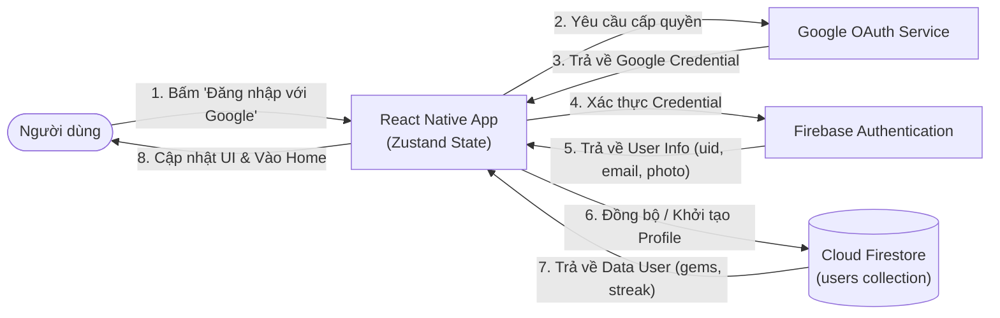
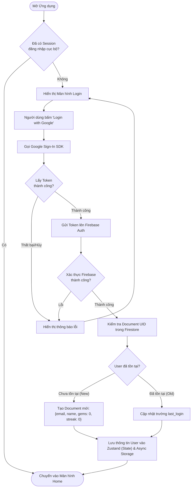
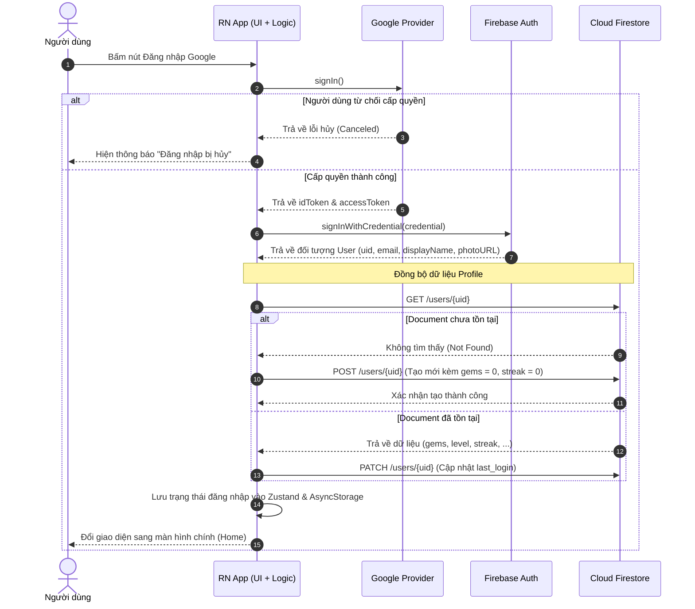
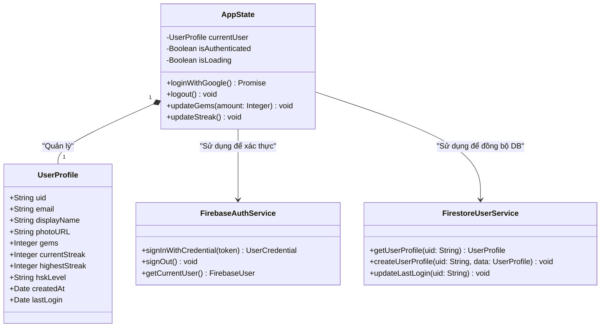

# Thiết kế Kỹ thuật: Module Tài khoản (Account & Authentication)

Tài liệu này mô tả chi tiết luồng hoạt động, cấu trúc dữ liệu và các sơ đồ thiết kế cho tính năng Quản lý Tài khoản trong ứng dụng. Hệ thống sử dụng **Google Sign-In** thông qua **Firebase Authentication** làm phương thức xác thực duy nhất để đảm bảo tính tiện lợi và bảo mật.

---

## 1. Sơ đồ Luồng Dữ liệu (Data Flow Diagram - DFD)

Sơ đồ mô tả đường đi của dữ liệu từ khi người dùng bấm nút đăng nhập cho đến khi thông tin tài khoản được lưu vào cơ sở dữ liệu.

---

## 2. Sơ đồ Hoạt động (Activity Diagram)

Mô tả rẽ nhánh logic khi xử lý đăng nhập, đặc biệt là việc phân biệt giữa người dùng mới (lần đầu đăng nhập) và người dùng cũ.

---

## 3. Sơ đồ Tuần tự (Sequence Diagram)

Mô tả chi tiết quá trình giao tiếp giữa các thành phần phần mềm theo thời gian thực.

---

## 4. Sơ đồ Lớp (UML Class Diagram)

Sơ đồ mô tả cấu trúc của một đối tượng User khi được lưu trữ trên Firestore và các Service quản lý trạng thái tài khoản trong ứng dụng.

