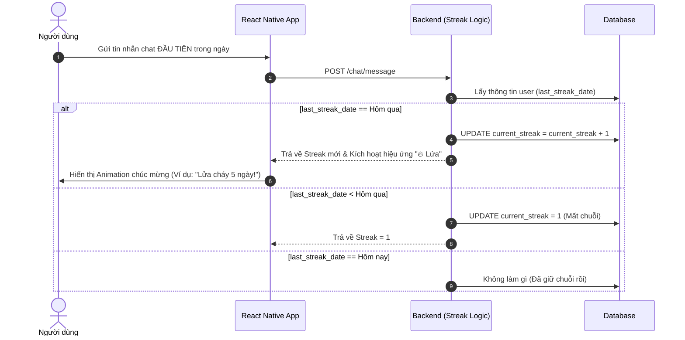
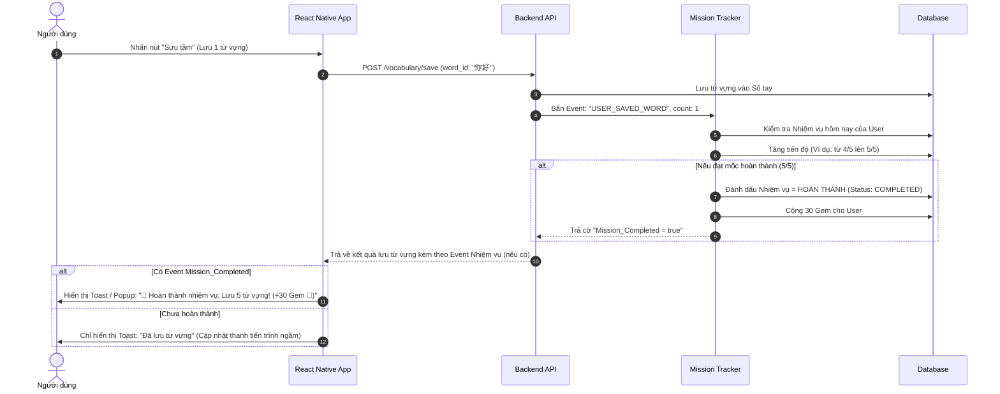

# Thiết kế tính năng: Nhiệm vụ (Missions) và Chuỗi ngày học (Streak)

Tính năng Nhiệm vụ hàng ngày và Chuỗi ngày học (Streak) là cốt lõi để giữ chân người dùng (Retention), tạo động lực và hình thành thói quen học tiếng Trung mỗi ngày thông qua cơ chế Gamification.

---

## 1. Logic của Chuỗi ngày học (Streak)

**Định nghĩa:** Streak là số ngày liên tiếp người dùng hoàn thành ít nhất một "Hành động có ý nghĩa" (Meaningful Action).
- Hành động có ý nghĩa có thể là: Gửi ít nhất 1 tin nhắn Roleplay, hoặc Lưu/Học 5 từ vựng.
- Nếu người dùng chỉ mở app rồi đóng lại (Login suông), hệ thống có thể không tính là giữ Streak (tuỳ thuộc vào độ khó mong muốn).

**Cách hoạt động (Backend):**
- Database lưu trữ `last_streak_date` và `current_streak`.
- Khi user thực hiện hành động, Backend kiểm tra `last_streak_date`:
  - Nếu là **Hôm nay**: Bỏ qua (đã cộng rồi).
  - Nếu là **Hôm qua**: `current_streak += 1`, cập nhật `last_streak_date = Hôm nay`.
  - Nếu là **Trước hôm qua**: `current_streak = 1` (Mất chuỗi, làm lại từ đầu), cập nhật `last_streak_date = Hôm nay`.

### Sơ đồ UML: Cập nhật Streak

---

## 2. Logic của Nhiệm vụ hàng ngày (Daily Missions)

**Định nghĩa:** Hệ thống sẽ luôn luôn thiết lập (reset) lại tiến độ của 3 nhiệm vụ cố định này mỗi ngày vào lúc 00:00.
**Danh sách 3 nhiệm vụ cố định hàng ngày:**
1. *Giao tiếp:* "Gửi 10 tin nhắn nhập vai vào một cốt truyện bất kỳ" (Tiến độ: 0/10) - Thưởng: 10 Gem 💎
2. *Từ vựng:* "Sưu tầm 5 từ vựng mới vào sổ tay" (Tiến độ: 0/5) - Thưởng: 10 Gem 💎
3. *Ôn tập:* "Hoàn thành ôn tập tất cả từ vựng đến hạn" (Tiến độ: 0/1) - Thưởng: 10 Gem 💎

### Sơ đồ UML: Hoàn thành Nhiệm vụ và Nhận thưởng

Luồng này sử dụng kiến trúc Event-Driven. Thay vì mỗi lần nhắn tin phải chèn logic kiểm tra nhiệm vụ, Backend có thể có một Service riêng chuyên hứng Event.

---

## 3. Cửa hàng vật phẩm (Shop) & Tiêu dùng Gem

Phần thưởng Gem 💎 thu thập được từ việc làm Nhiệm vụ hàng ngày sẽ đóng vai trò là đơn vị tiền tệ chính trong hệ sinh thái của ứng dụng. (Chi tiết về Shop sẽ được bàn thiết kế riêng sau, nhưng dưới đây là các ý tưởng để tiêu thụ Gem):