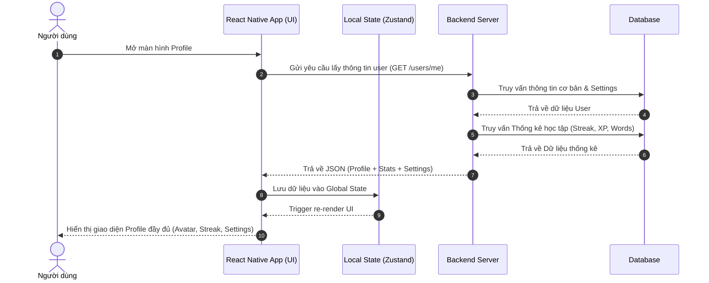
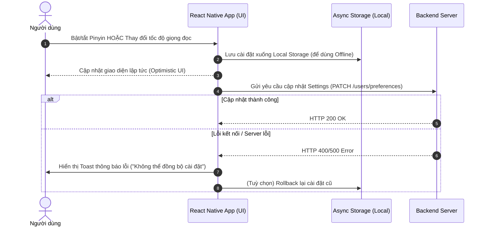
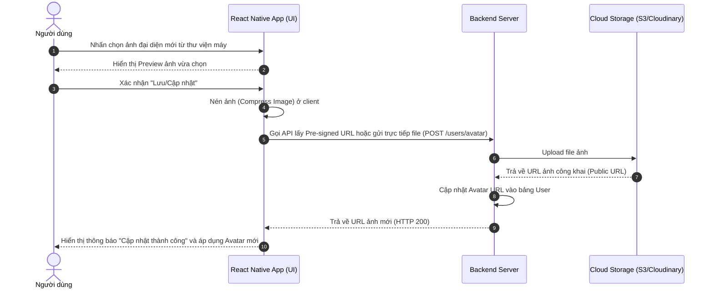

# Thiết kế tính năng: Màn hình Cá nhân (Profile & Settings)

Tài liệu này mô tả sơ đồ luồng hoạt động (UML Sequence Diagram) cho các thao tác chính trong màn hình Hồ sơ cá nhân (Profile). Bao gồm: Tải thông tin, Cập nhật cài đặt học tập và Đổi ảnh đại diện.

---

## 1. Sơ đồ UML Tuần tự: Tải thông tin và Thống kê học tập

Khi người dùng mở màn hình Profile, ứng dụng sẽ lấy thông tin cá nhân, thống kê tiến độ học (XP, Streak) và các cài đặt từ server.

---

## 2. Sơ đồ UML Tuần tự: Thay đổi Cài đặt Học tập (Settings)

Quá trình người dùng thay đổi các cấu hình như: Bật/tắt hiển thị Pinyin, đổi tốc độ giọng đọc AI (TTS Speed).

---

## 3. Cài đặt Ngôn ngữ Dẫn truyện (Narrator Language)

Trong phần Cài đặt của Profile, người dùng có thể thiết lập ngôn ngữ hiển thị cho **Người dẫn chuyện (Narrator)**. Giá trị này sẽ được lưu và truyền vào biến `[NGÔN NGỮ NARRATOR]` trong System Prompt.

Ứng dụng sẽ có logic tự động **gợi ý ngôn ngữ Narrator** dựa trên cấp độ HSK hiện tại của người dùng nhằm tối ưu hóa trải nghiệm học tập:

- **Tân binh (HSK 1 - HSK 2):** Khuyến nghị chọn **Tiếng Việt**. (Giúp người mới học không bị ngợp khi đọc các đoạn mô tả bối cảnh dài).
- **Trung cấp (HSK 3 - HSK 4):** Khuyến nghị chọn **Tiếng Anh** hoặc **Tiếng Trung (kèm Pinyin)**. (Khuyến khích quen dần với văn cảnh ngoại ngữ, tạo môi trường song ngữ).
- **Cao cấp (HSK 5 - HSK 6):** Khuyến nghị chọn **Tiếng Trung (Tắt Pinyin)**. (Môi trường nhúng 100% tiếng Trung để rèn tư duy ngôn ngữ trực tiếp).

*Lưu ý: Mặc dù có gợi ý, người dùng vẫn có quyền tuỳ chỉnh và tự do chọn ngôn ngữ Narrator mà mình muốn.*

---

## 4. Sơ đồ UML Tuần tự: Cập nhật Ảnh đại diện (Upload Avatar)

Luồng tải ảnh mới lên hệ thống, có thể kết hợp với các dịch vụ Cloud như AWS S3 hoặc Cloudinary.

