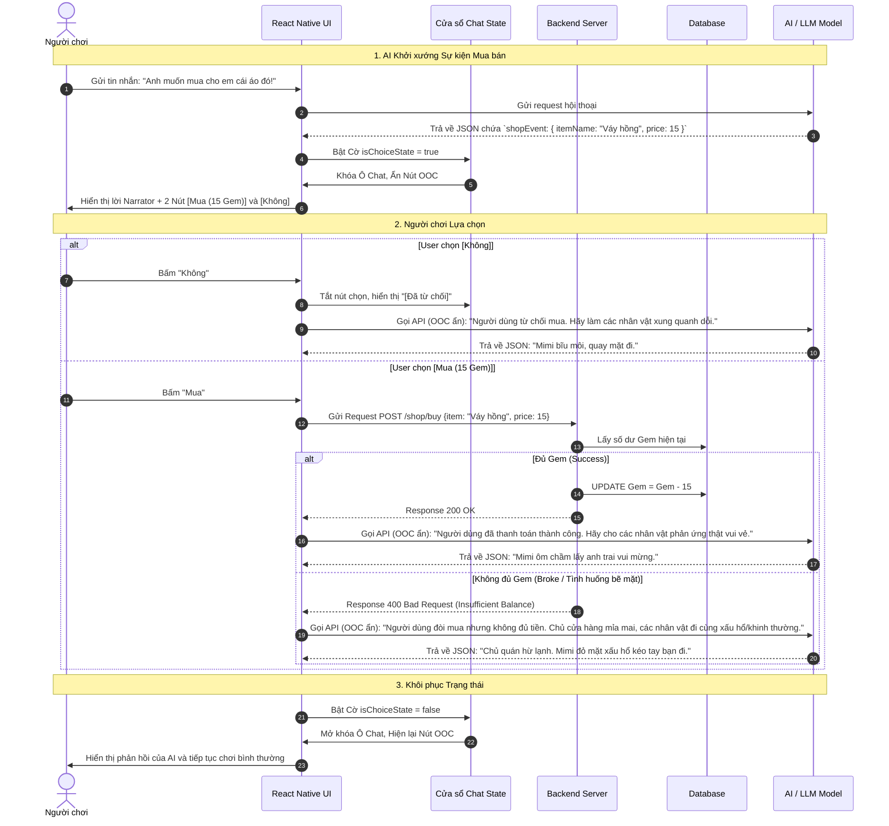

# Thiết kế Tính năng: Cửa hàng Sự kiện Kịch bản (Contextual Shop Event)

Tài liệu này mô tả chi tiết logic hoạt động, UI State và Sơ đồ tuần tự cho tính năng Shop ngẫu nhiên bên trong cốt truyện Roleplay. Đây là một cơ chế cực kỳ sáng tạo, giúp Gamification quá trình nhập vai bằng cách dùng tiền tệ (Gem).

---

## 1. Cơ chế Hoạt động

Khi ngữ cảnh cho phép (ví dụ người dùng muốn tặng quà hoặc đưa nhân vật đi mua sắm), **AI Narrator** sẽ tự động sinh ra một vật phẩm, định giá ngẫu nhiên (từ 10 - 20 Gem) và trả về JSON đính kèm field `shopEvent`.

**Quy tắc Giao diện (Choice State):**
1. **Vô hiệu hóa UI:** Khi Client nhận diện được `shopEvent` trong tin nhắn của Narrator, toàn bộ thanh Chat Input sẽ bị khóa (disable). Các chức năng can thiệp OOC cũng bị ẩn. Người dùng KHÔNG THỂ chat bình thường.
2. **Ép buộc Lựa chọn:** Ngay bên dưới dòng text của Narrator, UI sẽ render 2 nút bấm:
   - **[Mua (XX Gem)]**
   - **[Không]**
3. **Các kịch bản sau Lựa chọn (OOC Ẩn):** 
   - **Kịch bản A (Từ chối):** User nhấn "Không". Hệ thống tự sinh tin nhắn hệ thống bí mật gửi lên LLM: *"Người dùng đã từ chối mua món đồ này. Hãy tiếp tục câu chuyện theo hướng các nhân vật xung quanh cảm thấy hụt hẫng, dỗi hoặc buồn."*
   - **Kịch bản B (Mua thành công):** User nhấn "Mua", tài khoản có đủ Gem. Hệ thống trừ tiền và gửi OOC ẩn: *"Người dùng đã mua thành công món đồ. Hãy tiếp tục câu chuyện theo hướng các nhân vật vui vẻ, cảm kích."*
   - **Kịch bản C (Nghèo nhưng cố chấp):** User nhấn "Mua" nhưng KHÔNG đủ Gem. Hệ thống không hiện popup nạp thẻ, mà cố tình gửi OOC ẩn lên LLM: *"Người dùng cố gắng mua món đồ nhưng phát hiện ra trong ví không đủ tiền. Hãy tiếp tục câu chuyện theo hướng chủ cửa hàng lớn tiếng chê bai và các nhân vật đi cùng cảm thấy xấu hổ hoặc khinh thường."*

*(Sau khi một trong các kịch bản trên chạy và AI phản hồi kết quả lượt tiếp theo, UI sẽ được mở khóa lại trạng thái bình thường).*

---

## 2. Sơ đồ Tuần tự UML (Sequence Diagram)

---

## 3. Quản lý Lịch sử (Chat Log & Memory)

Để đảm bảo ChromaDB và file `.txt` không lưu lại những tin nhắn hệ thống (OOC ẩn) cứng nhắc làm loãng bối cảnh về sau:

- **Tin nhắn OOC ẩn (ví dụ: "Người dùng không đủ tiền...")** chỉ được gán vào `ephemeralOOC` trong đúng lượt đó để mồi LLM. Nó sẽ **KHÔNG** được ghi đè vào file `.txt` như một câu thoại của người chơi.
- Trong file `.txt`, sự kiện mua hụt này sẽ được ghi nhận một cách tự nhiên thông qua kết quả của lời dẫn truyện tiếp theo do LLM sinh ra (VD: `[Narrator]: Cậu móc ví ra nhưng phát hiện không đủ tiền...`).
- Vật phẩm đã mua thành công có thể được lưu trữ vào DB (bảng `User_Inventory` nếu cần) để hiển thị trong mục "Bộ sưu tập quà tặng" của Profile sau này.

---

## 4. Cửa hàng Hệ thống (System Shop)

Bên cạnh Cửa hàng Sự kiện ngẫu nhiên trong cốt truyện (Contextual Shop), ứng dụng vẫn tồn tại một **Cửa hàng Hệ thống** (nằm ở một giao diện tĩnh độc lập ngoài màn hình Chat). Cửa hàng này phục vụ các tính năng gamification cốt lõi của ứng dụng.

Vật phẩm quan trọng nhất được bán tại đây là:
- **Bảo hiểm Streak (Streak Freeze):** 
  - **Giá trị:** 240 Gem 💎
  - **Công dụng:** Mua một "Khiên bảo vệ". Hệ thống sẽ tự động tiêu hao khiên này vào những ngày người dùng quên hoặc bận không vào học, giúp chuỗi ngày học liên tiếp (Streak) không bị đứt gãy.
  - **Ghi chú:** Đây là nguồn tiêu thụ Gem lớn, tạo động lực để người dùng cày cuốc nhiệm vụ hàng ngày (mỗi ngày kiếm được ~30 Gem thì cần 8 ngày mới mua được 1 khiên bảo hiểm).
