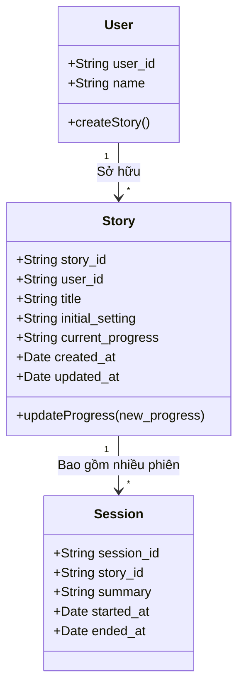
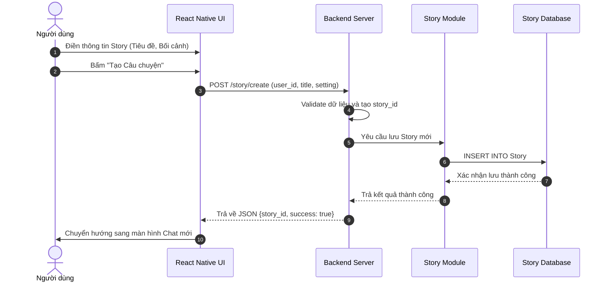
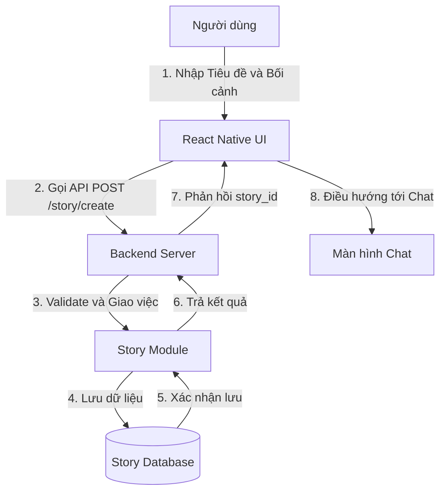
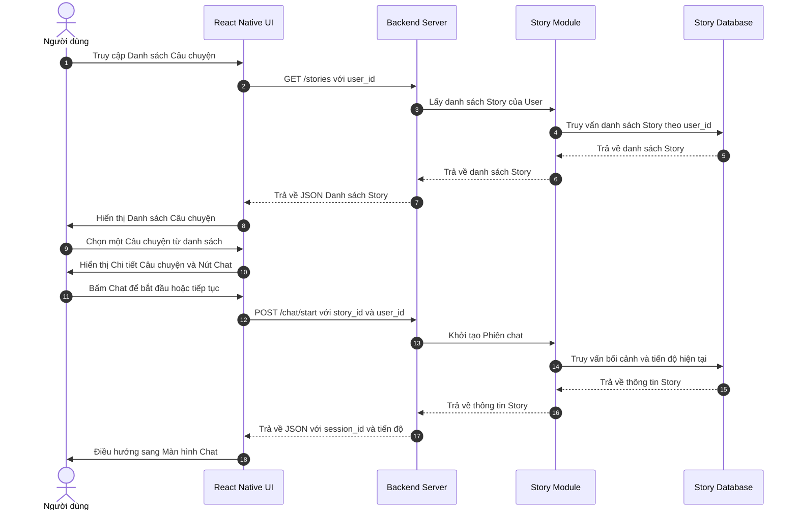
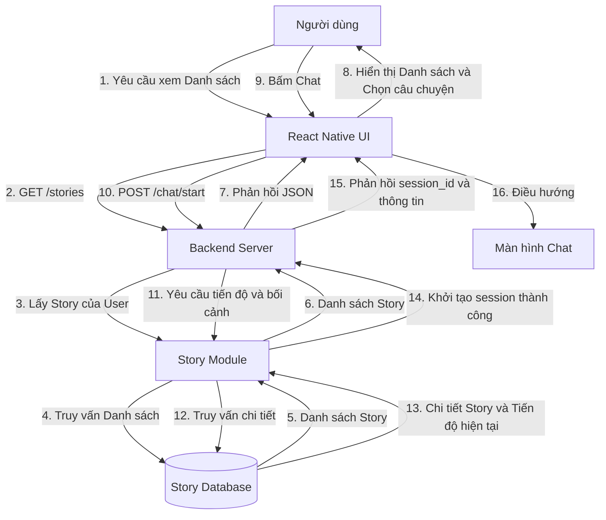
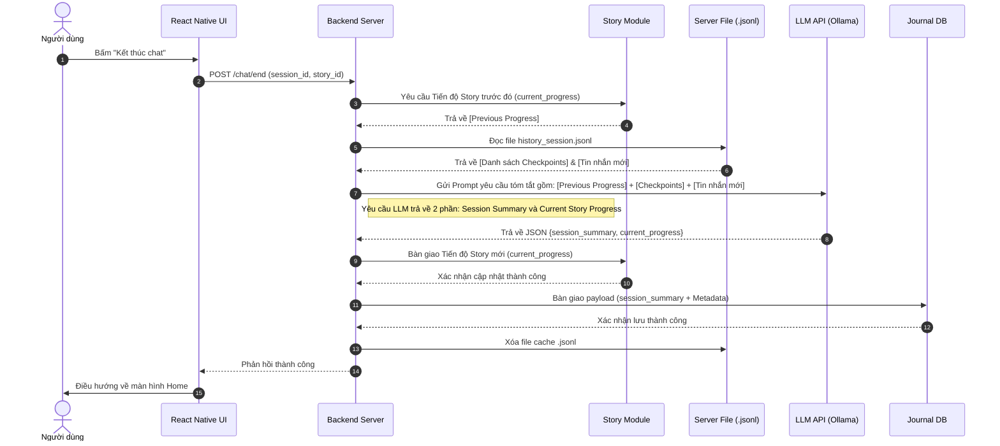
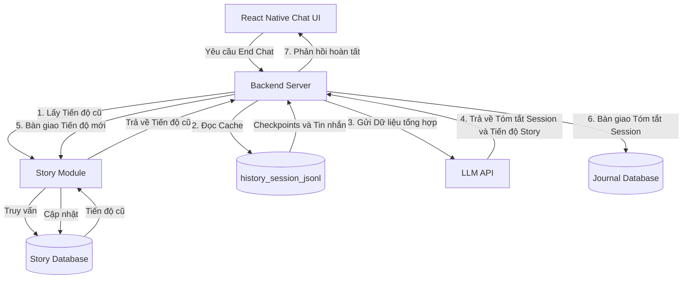
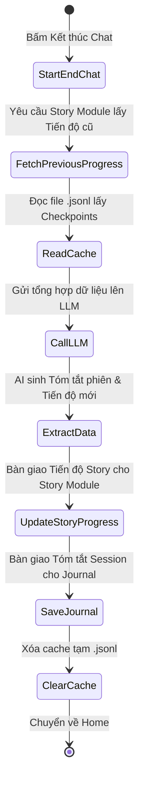

# Tổng quan Tính năng: Cốt truyện (Story)

Tính năng **Story** cho phép mỗi người dùng sở hữu và quản lý nhiều câu chuyện nhập vai khác nhau. Bối cảnh và cốt truyện do người dùng hoàn toàn tự do định nghĩa và sáng tạo mà không bị giới hạn.

---

## 1. Phân tích Yêu cầu
- **Quản lý Story**: Mỗi User có thể sở hữu nhiều Story. Mỗi Story có một ID riêng, chứa định nghĩa bối cảnh ban đầu do người dùng thiết lập.
- **Tổng hợp Tiến độ (Story Progress)**: Tính năng End Chat (`end_chat.md`) sẽ đảm nhận việc tổng hợp và **cập nhật tiến độ Story hiện tại (Current Story Progress)** mỗi khi người dùng kết thúc một phiên chat.
- **Thuật toán tổng hợp**: Tiến độ mới = LLM Tổng hợp ( `Tiến độ Story trước đó` + `Các dòng Checkpoint trong history_store.md` + `Các tin nhắn mới sau Checkpoint cuối` ).

---

## 2. Các Sơ đồ Thiết kế (UML & Flow)

### 2.1. Sơ đồ Lớp (Class / Entity Diagram)
Mô tả cấu trúc dữ liệu cơ bản của hệ thống Story.

### 2.2. Luồng Tạo Câu chuyện (Create Story)
Mô tả luồng tương tác khi người dùng khởi tạo một câu chuyện mới.

#### 2.2.1. Sơ đồ Tuần tự

#### 2.2.2. Sơ đồ Luồng dữ liệu

### 2.3. Luồng Chọn và Bắt đầu Chat từ Danh sách (Select & Start Chat)
Mô tả luồng tương tác khi người dùng truy cập danh sách câu chuyện, chọn một câu chuyện mong muốn và bắt đầu phiên chat mới hoặc tiếp tục phiên chat cũ.

#### 2.3.1. Sơ đồ Tuần tự

#### 2.3.2. Sơ đồ Luồng dữ liệu (Data Flow Diagram)

### 2.4. Luồng Cập nhật Tiến độ (End Chat Flow)

#### 2.4.1. Sơ đồ Tuần tự
Mô tả luồng tương tác khi người dùng kết thúc phiên chat để cập nhật tiến độ Story.

#### 2.4.2. Sơ đồ Luồng dữ liệu (Data Flow Diagram)
Mô tả sự dịch chuyển và tổng hợp dữ liệu.

#### 2.4.3. Sơ đồ Hoạt động (Activity Diagram)

