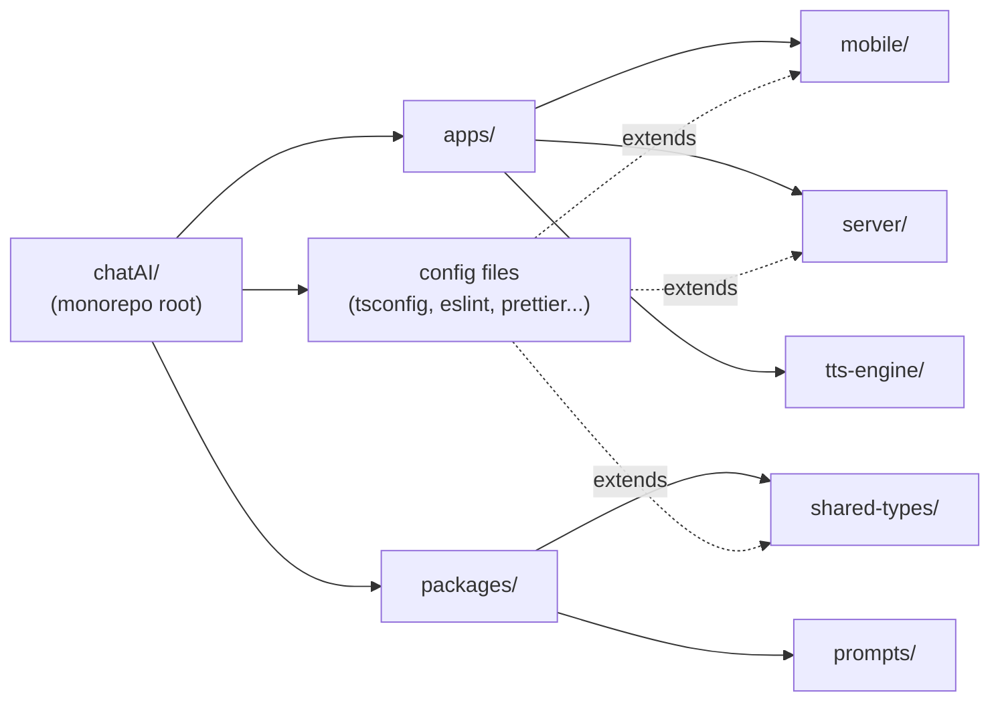
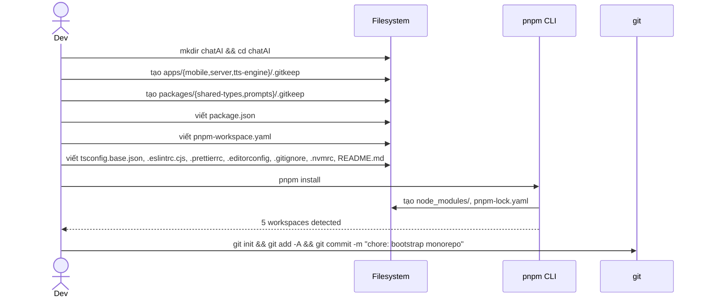

# P00.T1 — Monorepo Setup

## 1. METADATA

| Field | Value |
|-------|-------|
| Task ID | P00.T1 |
| Tên task | Khởi tạo Monorepo + Package Manager |
| Phase | 0 — Bootstrap & Foundation |
| Depends on | — (task đầu tiên) |
| Complexity | Low |
| Risk | Low |

---

## 2. MỤC TIÊU & SCOPE

**In-scope**:
- Khởi tạo cấu trúc thư mục root `chatAI/` theo monorepo (pnpm workspaces).
- Cấu hình TypeScript base + ESLint + Prettier shared.
- Tạo 5 workspace placeholders (`apps/mobile`, `apps/server`, `apps/tts-engine`, `packages/shared-types`, `packages/prompts`).

**Out-of-scope**:
- Không cài framework cho từng app (NestJS / Expo sẽ ở T2, T3).
- Không setup Docker, DB, CI (các task khác).

---

## 3. FILES CẦN TẠO

| # | Path | Loại | Mục đích |
|---|------|------|----------|
| 1 | `package.json` | config | Root manifest, workspaces declaration, scripts global |
| 2 | `pnpm-workspace.yaml` | config | Khai báo packages glob |
| 3 | `tsconfig.base.json` | config | Shared TS config (strict mode, path aliases) |
| 4 | `.eslintrc.cjs` | config | Root ESLint (extend cho từng app) |
| 5 | `.prettierrc` | config | Format rules thống nhất |
| 6 | `.editorconfig` | config | Editor-agnostic indent/encoding |
| 7 | `.gitignore` | config | Loại trừ node_modules, dist, .env, .expo, build artifacts |
| 8 | `.nvmrc` | config | Pin Node 20 LTS |
| 9 | `apps/mobile/.gitkeep` | placeholder | Folder marker |
| 10 | `apps/server/.gitkeep` | placeholder | Folder marker |
| 11 | `apps/tts-engine/.gitkeep` | placeholder | Folder marker |
| 12 | `packages/shared-types/.gitkeep` | placeholder | Folder marker |
| 13 | `packages/prompts/.gitkeep` | placeholder | Folder marker |
| 14 | `README.md` | doc | High-level intro + setup quick start |

---

## 4. CLASS DIAGRAM

Task này **không có class** — thuần config files. Bỏ qua section class.



---

## 5. CHI TIẾT FILE CONTENT SPEC

### 5.1. `package.json` (root)

**Properties**:
| Key | Value | Mô tả |
|-----|-------|-------|
| `name` | `chatai` | Root name |
| `private` | `true` | Không publish |
| `packageManager` | `pnpm@9.x.x` | Pin version |
| `engines.node` | `>=20.0.0 <21` | Node 20 LTS |
| `workspaces` | (managed by pnpm-workspace.yaml) | |
| `scripts.dev` | `pnpm -r --parallel dev` | Chạy dev mọi workspace |
| `scripts.build` | `pnpm -r build` | Build sequential |
| `scripts.lint` | `pnpm -r lint` | Lint mọi workspace |
| `scripts.test` | `pnpm -r test` | Test mọi workspace |
| `scripts.format` | `prettier --write "**/*.{ts,tsx,json,md}"` | Format toàn bộ |
| `scripts.clean` | `pnpm -r exec rm -rf node_modules dist .turbo` | Clean |
| `devDependencies` | `typescript@5.x`, `prettier@3.x`, `eslint@9.x`, `@typescript-eslint/*` | |

### 5.2. `pnpm-workspace.yaml`

```
packages:
  - 'apps/*'
  - 'packages/*'
```

### 5.3. `tsconfig.base.json`

**compilerOptions** key:
- `target`: ES2022
- `module`: ESNext (mobile dùng), CommonJS (server override)
- `strict`: true
- `noImplicitAny`: true
- `strictNullChecks`: true
- `noUncheckedIndexedAccess`: true
- `esModuleInterop`: true
- `skipLibCheck`: true
- `resolveJsonModule`: true
- `paths`:
  - `@chatai/shared-types`: `["./packages/shared-types/src"]`
  - `@chatai/prompts`: `["./packages/prompts/src"]`

### 5.4. `.eslintrc.cjs`

Sections:
- `root`: true
- `parser`: `@typescript-eslint/parser`
- `extends`: `eslint:recommended`, `plugin:@typescript-eslint/recommended`, `prettier`
- `rules`:
  - `@typescript-eslint/no-unused-vars`: error (allow `_` prefix)
  - `@typescript-eslint/no-explicit-any`: warn
  - `no-console`: warn (allow in dev)

### 5.5. `.prettierrc`

```
semi: true
singleQuote: true
trailingComma: 'all'
printWidth: 100
tabWidth: 2
arrowParens: 'always'
```

### 5.6. `.gitignore`

Sections:
- Node: `node_modules/`, `*.log`, `npm-debug.log*`, `pnpm-debug.log*`
- Build: `dist/`, `build/`, `*.tsbuildinfo`, `.turbo/`
- Env: `.env`, `.env.local`, `.env.*.local`, `!.env.example`
- Expo/RN: `.expo/`, `android/`, `ios/`, `*.jks`, `*.keystore`
- Editor: `.vscode/`, `.idea/`, `*.swp`, `.DS_Store`
- Secret: `firebase-sa.json`, `*-credentials.json`
- Data: `data/chat-cache/`, `data/tts-cache/`
- Misc: `coverage/`, `*.tgz`

### 5.7. `README.md` (root)

Sections:
1. **Project name** + 1-line pitch
2. **Tech stack** summary table (link tài liệu `00_overview_architecture.md`)
3. **Quick start**:
   - `pnpm install`
   - `pnpm dev`
4. **Structure** tree (copy từ tài liệu architecture)
5. **Documentation links** → `Document/technical documentation/*`

---

## 6. EXECUTION SEQUENCE (Mermaid)



---

## 7. ACCEPTANCE & TEST PLAN

### Acceptance Criteria
- [ ] `pnpm install` hoàn tất không lỗi.
- [ ] `pnpm -r list --depth -1` liệt kê đúng 5 workspaces.
- [ ] `pnpm lint` chạy được (kể cả no-op khi packages chưa có code).
- [ ] `cat .gitignore` chứa các pattern bắt buộc.
- [ ] `node -v` match `.nvmrc` (Node 20.x).

### Manual Test Steps
1. Clone vào folder mới, chạy `pnpm install` → success.
2. `git status` → workspaces folders không bị track (chỉ `.gitkeep`).
3. Sửa code trong `packages/shared-types/.gitkeep` thành file `.ts` → `pnpm lint` detect.

### Không có Unit/Integration tests (task config-only).
