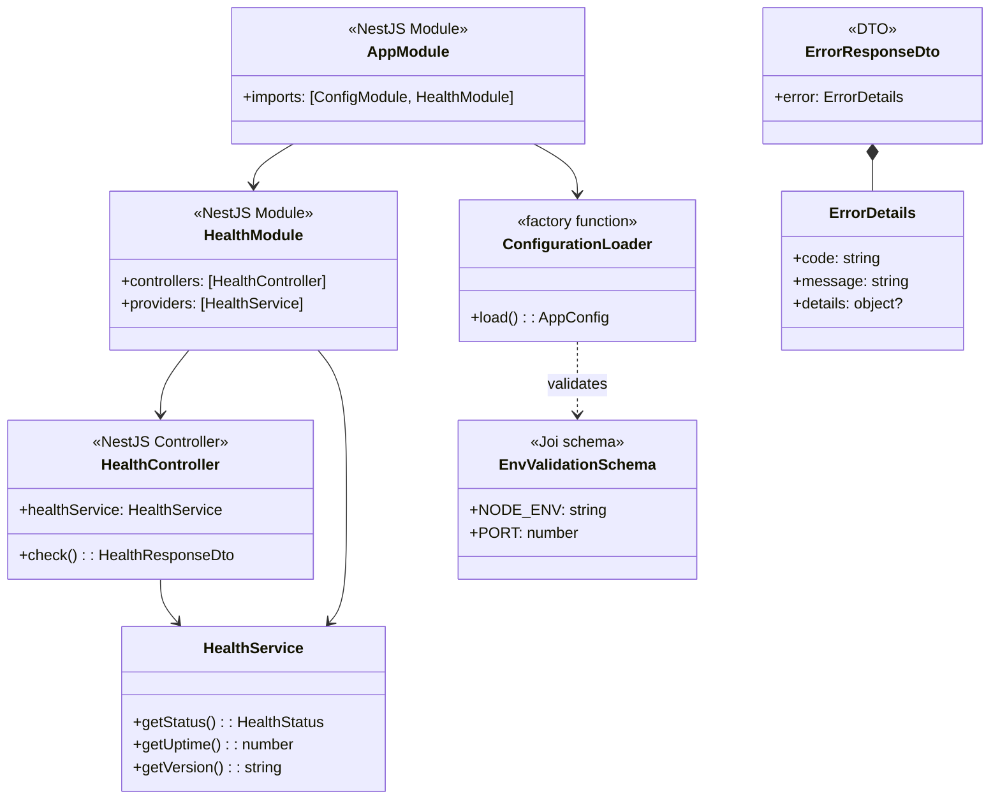
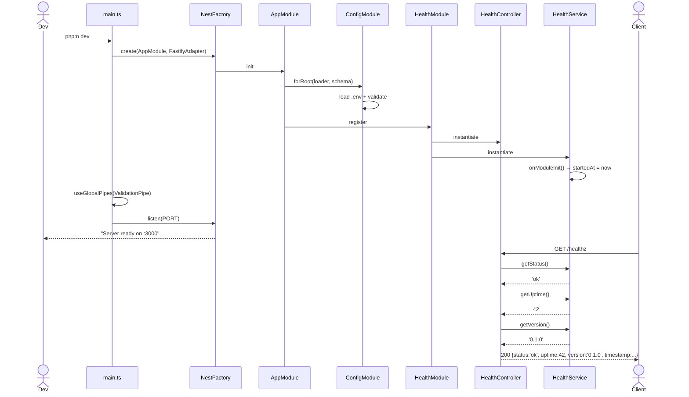

# P00.T2 — NestJS Server Skeleton

## 1. METADATA

| Field | Value |
|-------|-------|
| Task ID | P00.T2 |
| Tên task | Setup NestJS Server Skeleton (Fastify adapter) |
| Phase | 0 — Bootstrap & Foundation |
| Depends on | P00.T1 |
| Complexity | Medium |
| Risk | Low |

---

## 2. MỤC TIÊU & SCOPE

**In-scope**:
- Khởi tạo NestJS app trong `apps/server/` với Fastify adapter.
- Cấu hình `ConfigModule` load `.env`.
- Setup global pipes (`ValidationPipe`), global filter placeholder, global interceptor placeholder.
- Tạo `HealthModule` với endpoint `GET /healthz`.
- Setup `Jest` cho unit test.

**Out-of-scope**:
- Logger (T7), Prisma (T5), Redis (T6), Auth (P1.T2).
- Bất kỳ business module nào (Stories/Chat...).

---

## 3. FILES CẦN TẠO

| # | Path | Loại | Mục đích |
|---|------|------|----------|
| 1 | `apps/server/package.json` | config | Dependencies + scripts |
| 2 | `apps/server/tsconfig.json` | config | Extends `../../tsconfig.base.json`, target Node, CommonJS |
| 3 | `apps/server/tsconfig.build.json` | config | Build-time exclude tests |
| 4 | `apps/server/nest-cli.json` | config | NestJS CLI config |
| 5 | `apps/server/.eslintrc.cjs` | config | Extends root eslint |
| 6 | `apps/server/jest.config.ts` | config | Unit test config |
| 7 | `apps/server/.env.example` | config | Template biến môi trường |
| 8 | `apps/server/src/main.ts` | bootstrap | Entry point |
| 9 | `apps/server/src/app.module.ts` | module | Root module |
| 10 | `apps/server/src/config/configuration.ts` | config provider | Typed env loader |
| 11 | `apps/server/src/config/validation.schema.ts` | validation | Joi schema cho env vars |
| 12 | `apps/server/src/modules/health/health.module.ts` | module | Health module |
| 13 | `apps/server/src/modules/health/health.controller.ts` | controller | GET /healthz |
| 14 | `apps/server/src/modules/health/health.service.ts` | service | Aggregate health checks |
| 15 | `apps/server/src/modules/health/health.controller.spec.ts` | test | Unit test |
| 16 | `apps/server/src/shared/dto/error-response.dto.ts` | dto | Error envelope shape |

---

## 4. CLASS DIAGRAM



**Tổng số class/module trong task**: 7 (3 NestJS modules/controllers/services + 1 factory + 1 schema + 2 DTO).

---

## 5. CHI TIẾT TỪNG CLASS

### 5.1. `AppModule`

**File**: `apps/server/src/app.module.ts`  
**Vai trò**: Root module — tổng hợp tất cả modules.

**Decorator**: `@Module({ imports, controllers, providers })`

**Properties**: không có instance properties — chỉ metadata.

**imports** array:
- `ConfigModule.forRoot({ isGlobal: true, load: [configuration], validationSchema })`
- `HealthModule`

**Methods**: không.

---

### 5.2. `HealthModule`

**File**: `apps/server/src/modules/health/health.module.ts`  
**Vai trò**: Module wrap health controller + service.

**Decorator**: `@Module({ controllers: [HealthController], providers: [HealthService] })`

---

### 5.3. `HealthController`

**File**: `apps/server/src/modules/health/health.controller.ts`  
**Vai trò**: Expose `GET /healthz` cho load balancer / monitoring.

**Decorator**: `@Controller('healthz')` (no global prefix vì healthz thường cần ngoài `/api/v1`).

**Properties**:
| Name | Type | Access | Mô tả |
|------|------|--------|-------|
| `healthService` | `HealthService` | private | Inject qua constructor |

**Methods**:

#### `check()`

```
check(): HealthResponseDto

Input: none

Output:
  HealthResponseDto {
    status: 'ok' | 'degraded',
    uptime: number (seconds),
    version: string,
    timestamp: number (epoch ms)
  }

Logic:
  1. status = healthService.getStatus()
  2. uptime = healthService.getUptime()
  3. version = healthService.getVersion()
  4. Trả response object

Side Effects: none

Throws: none (luôn 200)

Decorator: @Get()
```

---

### 5.4. `HealthService`

**File**: `apps/server/src/modules/health/health.service.ts`  
**Vai trò**: Aggregate trạng thái (T5/T6 sẽ extend để check Postgres/Redis).

**Decorator**: `@Injectable()`

**Properties**:
| Name | Type | Access | Mô tả |
|------|------|--------|-------|
| `startedAt` | `number` | private | Epoch ms khi module init |

**Methods**:

#### `getStatus()`
```
getStatus(): 'ok'

Input: none
Output: literal 'ok'
Logic: trả 'ok' (placeholder; sẽ tổng hợp khi có dependencies)
```

#### `getUptime()`
```
getUptime(): number (seconds)

Logic: (Date.now() - this.startedAt) / 1000
```

#### `getVersion()`
```
getVersion(): string

Logic: đọc từ process.env.npm_package_version hoặc package.json version
```

#### `onModuleInit()`
```
onModuleInit(): void

Logic: this.startedAt = Date.now()
```

---

### 5.5. `ConfigurationLoader` (factory function)

**File**: `apps/server/src/config/configuration.ts`  
**Vai trò**: Load env vars thành typed object.

**Export**: `default function configuration(): AppConfig`

**AppConfig interface**:
```
AppConfig {
  nodeEnv: 'development' | 'production' | 'test';
  port: number;
  databaseUrl: string;
  redisUrl: string;
  chromaUrl: string;
  firebaseProjectId: string;
  firebaseServiceAccountPath: string;
  firebaseStorageBucket: string;
  ollamaBaseUrl: string;
  ttsEngineUrl: string;
}
```

**Logic**: đọc `process.env.*`, parse number bằng `parseInt`, default cho dev.

---

### 5.6. `EnvValidationSchema`

**File**: `apps/server/src/config/validation.schema.ts`  
**Vai trò**: Joi schema validate env khi boot.

**Export**: `default Joi.object({ ... })`

**Required keys** (xem `.env.example` ở T1 đã list):
| Key | Type | Required | Default |
|-----|------|----------|---------|
| NODE_ENV | string enum | yes | development |
| PORT | number | yes | 3000 |
| DATABASE_URL | string uri | yes | — |
| REDIS_URL | string uri | yes | — |
| CHROMA_URL | string uri | no | http://localhost:8000 |
| FIREBASE_PROJECT_ID | string | no | — (validate ở P1.T1) |
| ... | | | |

---

### 5.7. `ErrorResponseDto`

**File**: `apps/server/src/shared/dto/error-response.dto.ts`  
**Vai trò**: Shape chuẩn cho mọi response error.

**Class**:
```
ErrorResponseDto {
  error: ErrorDetails
}
ErrorDetails {
  code: string         // từ Error Registry
  message: string      // human readable VN
  details?: unknown    // optional context
}
```

---

### 5.8. `main.ts` (bootstrap script — không phải class)

**File**: `apps/server/src/main.ts`  
**Vai trò**: Entry point.

**Logic step-by-step**:
1. Tạo Nest app với `NestFactory.create<NestFastifyApplication>(AppModule, new FastifyAdapter())`.
2. Set global prefix `app.setGlobalPrefix('api/v1', { exclude: ['healthz'] })`.
3. Enable CORS: `app.enableCors({ origin: true, credentials: true })`.
4. Áp dụng global `ValidationPipe({ whitelist: true, forbidNonWhitelisted: true, transform: true })`.
5. (Sau T7) Apply global filter + interceptor.
6. Lấy port từ ConfigService → `app.listen(port, '0.0.0.0')`.
7. Log startup banner.

---

## 6. SEQUENCE DIAGRAM — Bootstrap & Health Check



---

## 7. ACCEPTANCE & TEST PLAN

### Acceptance Criteria
- [ ] `pnpm --filter server dev` → server lắng nghe port 3000.
- [ ] `curl http://localhost:3000/healthz` → 200 JSON đúng shape.
- [ ] `curl http://localhost:3000/api/v1/healthz` → 404 (vì exclude).
- [ ] Boot với `.env` thiếu `DATABASE_URL` → process exit với log Joi error.
- [ ] `pnpm --filter server test` → pass.

### Unit Tests (`health.controller.spec.ts`)
| Test | Setup | Assert |
|------|-------|--------|
| `check returns ok` | Mock HealthService methods | response.status === 'ok' |
| `check includes uptime number` | | typeof response.uptime === 'number' |
| `check includes version string` | | typeof response.version === 'string' |

### Manual Test
1. Sửa `.env` PORT=4000 → restart → endpoint trên port 4000.
2. Sửa `.env` PORT='abc' → restart → fail với Joi message rõ ràng.
3. Send POST tới `/healthz` → 404 (chỉ GET).
