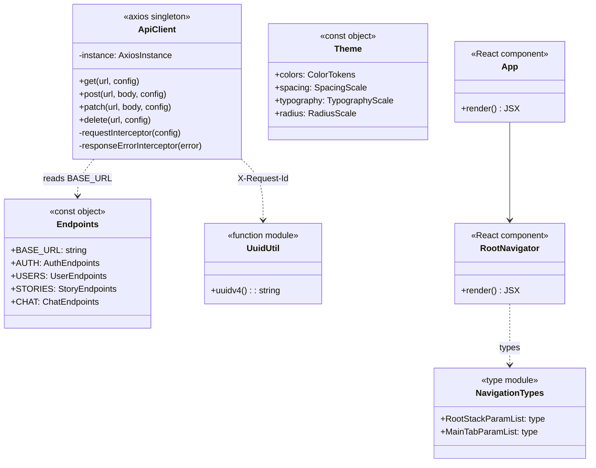
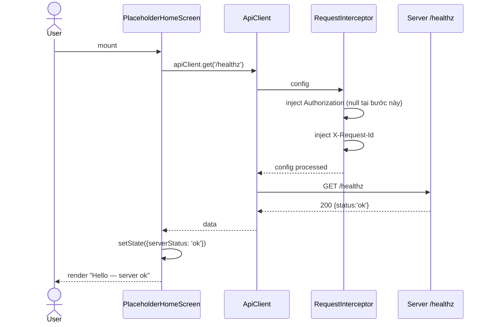

# P00.T3 — Expo React Native Skeleton

## 1. METADATA

| Field | Value |
|-------|-------|
| Task ID | P00.T3 |
| Tên task | Setup Expo + React Native + TypeScript Skeleton |
| Phase | 0 — Bootstrap & Foundation |
| Depends on | P00.T1 |
| Complexity | Medium |
| Risk | Low |

---

## 2. MỤC TIÊU & SCOPE

**In-scope**:
- Khởi tạo Expo TypeScript template.
- Cài navigation, state (Zustand), form, axios, storage.
- Tạo skeleton folders feature-sliced (`features/{auth,home,story,chat,...}`).
- Tạo `apiClient` axios instance với placeholder interceptors.
- Tạo `RootNavigator` với 1 màn hình placeholder.

**Out-of-scope**:
- Auth implementation (P1.T4).
- Bất kỳ feature UI nào (sẽ ở phase tương ứng).

---

## 3. FILES CẦN TẠO

| # | Path | Loại | Mục đích |
|---|------|------|----------|
| 1 | `apps/mobile/package.json` | config | Deps + scripts (Expo) |
| 2 | `apps/mobile/app.json` | config | Expo manifest (name, slug, icon, plugins) |
| 3 | `apps/mobile/tsconfig.json` | config | Extends base, JSX |
| 4 | `apps/mobile/babel.config.js` | config | Expo preset + module-resolver alias |
| 5 | `apps/mobile/.eslintrc.cjs` | config | Extends root |
| 6 | `apps/mobile/App.tsx` | entry | Wrap providers |
| 7 | `apps/mobile/index.ts` | entry | `registerRootComponent(App)` |
| 8 | `apps/mobile/.env.example` | config | EXPO_PUBLIC_* vars |
| 9 | `apps/mobile/src/api/client.ts` | service | Axios instance + interceptors |
| 10 | `apps/mobile/src/api/endpoints.ts` | const | Base URLs |
| 11 | `apps/mobile/src/navigation/RootNavigator.tsx` | navigator | Conditional stack |
| 12 | `apps/mobile/src/navigation/types.ts` | types | Param lists |
| 13 | `apps/mobile/src/screens/SplashScreen.tsx` | screen | Placeholder |
| 14 | `apps/mobile/src/screens/PlaceholderHomeScreen.tsx` | screen | Hello world |
| 15 | `apps/mobile/src/theme/index.ts` | theme | Colors, spacing, typography tokens |
| 16 | `apps/mobile/src/utils/uuid.ts` | util | Generate UUID v4 |
| 17 | `apps/mobile/src/features/.gitkeep` (sẽ tạo subfolders sau) | placeholder | |
| 18 | `apps/mobile/src/components/.gitkeep` | placeholder | |
| 19 | `apps/mobile/src/models/.gitkeep` | placeholder | |
| 20 | `apps/mobile/src/stores/.gitkeep` | placeholder | |

---

## 4. CLASS DIAGRAM

Mobile dùng functional components + hooks → "class" hiểu là **module/object** export, không phải class OOP.



**Tổng**: 1 App component, 1 navigator, 1 axios singleton module, 1 endpoints registry, 1 theme module, 1 util module. 6 "units".

---

## 5. CHI TIẾT TỪNG MODULE

### 5.1. `ApiClient`

**File**: `apps/mobile/src/api/client.ts`  
**Vai trò**: Singleton axios instance với auth interceptor.

**Exports**:
- `apiClient: AxiosInstance` — default export.
- (Optional) named helper: `setAuthTokenGetter(fn: () => string | null)` để tránh circular import với store.

**Properties**:
| Name | Type | Mô tả |
|------|------|-------|
| `instance` | `AxiosInstance` | axios.create với baseURL, timeout 30s |
| `_tokenGetter` | `() => string \| null` | Lazy resolve token để tránh import store ở module-load time |

**Interceptors**:

#### Request Interceptor
```
function (config: InternalAxiosRequestConfig): InternalAxiosRequestConfig

Logic:
  1. token = _tokenGetter?.()
  2. Nếu token → config.headers.Authorization = `Bearer ${token}`
  3. config.headers['X-Request-Id'] = uuidv4()
  4. config.headers['Idempotency-Key'] = uuidv4() (chỉ với POST/PUT/PATCH/DELETE)
  5. return config
```

#### Response Error Interceptor
```
function (error: AxiosError): Promise<never>

Logic:
  1. Nếu error.response?.status === 401:
     - Gọi global event 'AUTH_EXPIRED' (EventEmitter) để store logout
  2. Nếu error.response?.status === 503 với code TTS/LLM → log warning
  3. Normalize error: throw new Error với { code, message, details } từ response.data.error
```

**Public Methods** (delegate axios):
- `get<T>(url, config?): Promise<T>`
- `post<T>(url, body?, config?): Promise<T>`
- `patch<T>(url, body?, config?): Promise<T>`
- `delete<T>(url, config?): Promise<T>`

(Trả về `response.data` đã unwrap.)

---

### 5.2. `Endpoints`

**File**: `apps/mobile/src/api/endpoints.ts`  
**Vai trò**: Tập trung URL constants.

```
BASE_URL = process.env.EXPO_PUBLIC_API_BASE_URL ?? 'http://localhost:3000/api/v1'

AUTH = {
  GOOGLE_SIGNIN: '/auth/google-signin',
  LOGOUT: '/auth/logout',
}

USERS = {
  ME: '/users/me',
  PREFERENCES: '/users/preferences',
  AVATAR: '/users/avatar',
}

(Các nhóm khác sẽ thêm khi tới phase tương ứng)
```

---

### 5.3. `RootNavigator`

**File**: `apps/mobile/src/navigation/RootNavigator.tsx`  
**Vai trò**: Top-level conditional navigator.

**Component signature**: `function RootNavigator(): JSX.Element`

**Logic** (placeholder vì chưa có Auth):
1. Trả về `NavigationContainer` chứa `Stack.Navigator` với 1 route `PlaceholderHome` → `PlaceholderHomeScreen`.
2. (Sẽ refactor ở P1.T6 thêm conditional auth.)

---

### 5.4. `NavigationTypes`

**File**: `apps/mobile/src/navigation/types.ts`

```
RootStackParamList = {
  Splash: undefined;
  PlaceholderHome: undefined;
  // Sẽ extend ở phase sau
}
```

---

### 5.5. `Theme`

**File**: `apps/mobile/src/theme/index.ts`

**Exports**:
- `colors`: object — `{ primary, secondary, background, surface, text, textMuted, error, warning, success, info, border }` (light theme).
- `spacing`: object — `{ xs:4, sm:8, md:12, lg:16, xl:24, xxl:32 }`.
- `typography`: object — `{ h1:{fontSize:32,fontWeight:'700'}, h2:..., body:..., caption:... }`.
- `radius`: object — `{ sm:4, md:8, lg:16, full:9999 }`.

---

### 5.6. `UuidUtil`

**File**: `apps/mobile/src/utils/uuid.ts`

```
uuidv4(): string

Logic:
  - Dùng expo-crypto.randomUUID() (no install lib mới)
  - Fallback: implement bằng Math.random nếu env không support
```

---

### 5.7. `App.tsx`

**File**: `apps/mobile/App.tsx`

**Logic step-by-step**:
1. Wrap `<SafeAreaProvider>`.
2. Wrap `<StatusBar style="auto" />`.
3. Render `<RootNavigator />`.
4. (Sẽ thêm AuthProvider/ThemeProvider sau khi cần.)

---

## 6. SEQUENCE DIAGRAM — First API Call (placeholder)



---

## 7. ACCEPTANCE & TEST PLAN

### Acceptance Criteria
- [ ] `pnpm --filter mobile start` → Metro bundler ready.
- [ ] Mở Expo Go scan QR → app khởi động, hiển thị "Hello".
- [ ] TypeScript strict mode pass (no errors).
- [ ] ESLint pass.
- [ ] `apiClient` import được từ `src/features/.../**`.

### Manual Test
1. Start server (T2) + mobile → mở app → screen gọi `/healthz` → log "ok".
2. Tắt server → app log error 503/network.
3. Reload app → state reset.

### Không có unit test ở phase này (sẽ thêm khi có features).
