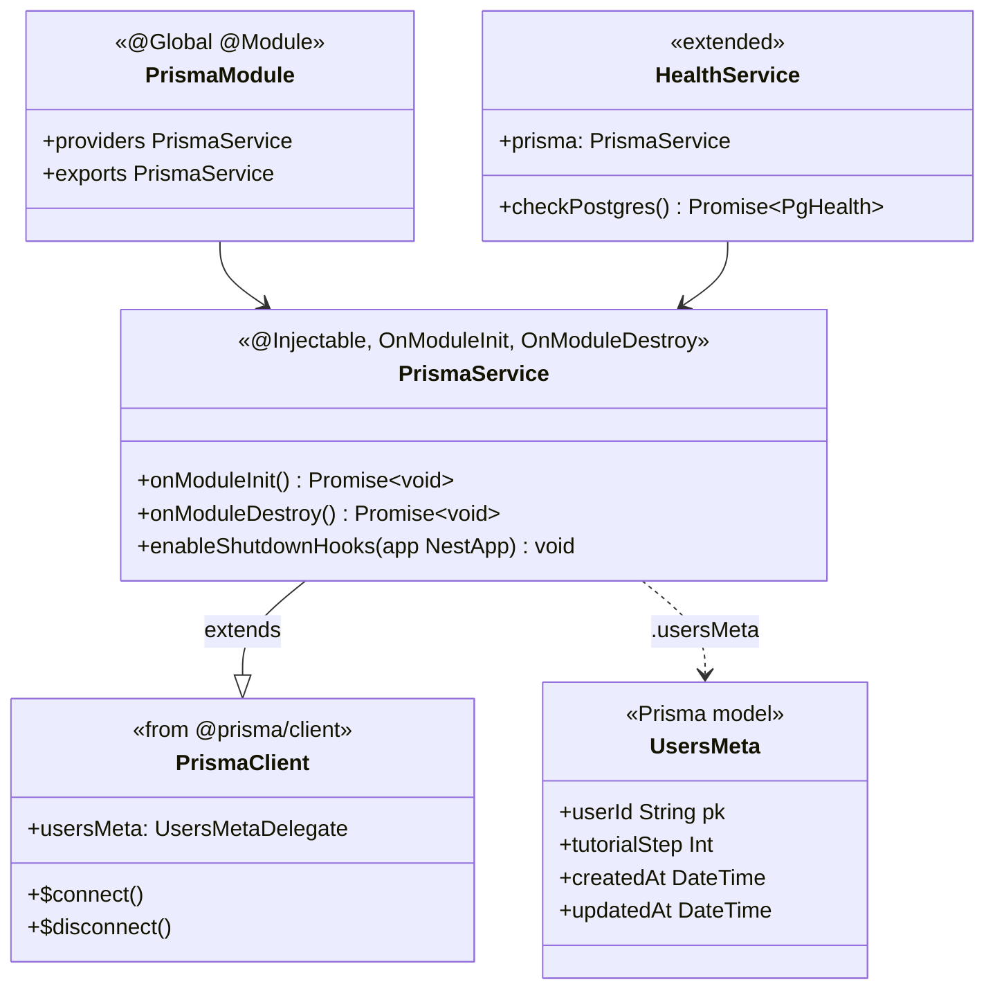
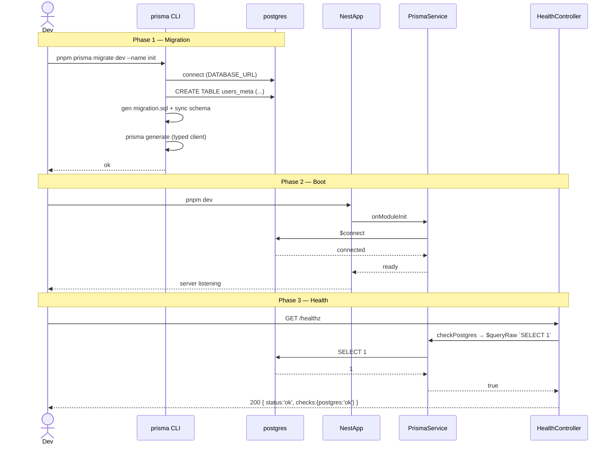

# P00.T5 — Prisma ORM Setup + UsersMeta Model

## 1. METADATA

| Field | Value |
|-------|-------|
| Task ID | P00.T5 |
| Tên task | Prisma init + UsersMeta model + migration đầu tiên |
| Phase | 0 |
| Depends on | P00.T2, P00.T4 |
| Complexity | Medium |
| Risk | Medium (DB schema lock-in) |

---

## 2. MỤC TIÊU & SCOPE

**In-scope**:
- Cài Prisma + `@prisma/client` ở `apps/server`.
- Tạo `schema.prisma` với datasource Postgres.
- Định nghĩa **bảng `users_meta`** đầu tiên (mapping từ DB doc).
- Tạo `PrismaService` global + `PrismaModule`.
- Migration `init` + seed placeholder.
- Update `HealthService` để check Postgres.

**Out-of-scope**:
- Các bảng khác (Stories/Sessions/...) — sẽ ở phase tương ứng.
- Firestore sync (P1.T3).

---

## 3. FILES CẦN TẠO / SỬA

| # | Path | Loại | Mục đích |
|---|------|------|----------|
| 1 | `apps/server/prisma/schema.prisma` | schema | Datasource + generator + UsersMeta model |
| 2 | `apps/server/prisma/migrations/<ts>_init/migration.sql` | migration | Auto-generated bởi `prisma migrate dev --name init` |
| 3 | `apps/server/prisma/seed.ts` | script | Placeholder seed (no-op hoặc tạo admin user) |
| 4 | `apps/server/src/shared/prisma/prisma.service.ts` | service | Extends PrismaClient, hook lifecycle |
| 5 | `apps/server/src/shared/prisma/prisma.module.ts` | module | Global module export PrismaService |
| 6 | `apps/server/src/shared/prisma/prisma.service.spec.ts` | test | Connect / disconnect |
| 7 | `apps/server/src/app.module.ts` | sửa | Import PrismaModule |
| 8 | `apps/server/src/modules/health/health.service.ts` | sửa | Check Postgres |
| 9 | `apps/server/package.json` | sửa | scripts `prisma:generate`, `prisma:migrate`, `prisma:studio`, `db:seed` |
| 10 | `.env` + `.env.example` | sửa | DATABASE_URL |

---

## 4. CLASS DIAGRAM



**Tổng**: 2 class mới (`PrismaService`, `PrismaModule`) + extend `HealthService` + 1 Prisma model.

---

## 5. CHI TIẾT TỪNG CLASS

### 5.1. `PrismaService`

**File**: `apps/server/src/shared/prisma/prisma.service.ts`  
**Vai trò**: Wrap `PrismaClient` với NestJS lifecycle.

**Class signature**: `class PrismaService extends PrismaClient implements OnModuleInit, OnModuleDestroy`  
**Decorator**: `@Injectable()`

**Constructor**:
```
constructor(config: ConfigService)

Logic:
  - super({
      datasources: { db: { url: config.get('databaseUrl') } },
      log: ['warn', 'error'] (dev: + 'query')
    })
```

**Methods**:

#### `onModuleInit()`
```
onModuleInit(): Promise<void>

Logic: await this.$connect()

Throws: rethrow connect error → app fail-fast nếu DB không up.
```

#### `onModuleDestroy()`
```
onModuleDestroy(): Promise<void>

Logic: await this.$disconnect()
```

#### `enableShutdownHooks(app: INestApplication)`
```
enableShutdownHooks(app: INestApplication): void

Input: NestJS app instance
Output: void

Logic:
  - this.$on('beforeExit', async () => { await app.close() })
  
Side effect: ensure graceful shutdown trigger SIGTERM → app.close
```

---

### 5.2. `PrismaModule`

**File**: `apps/server/src/shared/prisma/prisma.module.ts`  
**Vai trò**: Global module cung cấp PrismaService toàn app.

**Decorator**: `@Global() @Module({ providers: [PrismaService], exports: [PrismaService] })`

**Methods**: không.

---

### 5.3. `UsersMeta` (Prisma model)

**File**: `apps/server/prisma/schema.prisma`

```
model UsersMeta {
  userId        String   @id @map("user_id")  // Firebase UID
  tutorialStep  Int      @default(0) @map("tutorial_step")
  createdAt     DateTime @default(now()) @map("created_at")
  updatedAt     DateTime @updatedAt @map("updated_at")

  @@map("users_meta")
}
```

**Comments**:
- `userId` = Firebase UID (string ≤ 128), không tự sinh.
- `tutorialStep` 0..7 (P12).
- Future: thêm relations khi tạo bảng khác (P02 stories.user_id…). Hiện chưa.

---

### 5.4. `HealthService` (extended)

**Updated method**:

#### `getStatus()` (overridden)
```
getStatus(): Promise<{ status: 'ok'|'degraded', checks: Record<string, 'ok'|'fail'> }>

Logic:
  1. pgHealthy = await this.checkPostgres()
  2. checks = { postgres: pgHealthy ? 'ok' : 'fail' }
  3. status = Object.values(checks).every(v => v==='ok') ? 'ok' : 'degraded'
  4. return { status, checks }
```

#### `checkPostgres()` (new)
```
checkPostgres(): Promise<boolean>

Logic:
  - try: await this.prisma.$queryRaw`SELECT 1`
  - return true on success, false on throw

Side effect: short timeout (3s) bằng race với Promise.race
```

(HealthController.check trả thêm field `checks`.)

---

### 5.5. `seed.ts`

**File**: `apps/server/prisma/seed.ts`  
**Vai trò**: Placeholder seed script chạy bằng `prisma db seed`.

**Logic**:
1. Khởi tạo `new PrismaClient()`.
2. (Phase 0) chỉ log "no seed data yet".
3. (Phase 11) sẽ thêm seed missions.
4. `$disconnect()`.

**Setup**: `package.json` thêm:
```
"prisma": { "seed": "ts-node prisma/seed.ts" }
```

---

## 6. SEQUENCE DIAGRAM — Migration + Boot



---

## 7. ACCEPTANCE & TEST PLAN

### Acceptance Criteria
- [ ] `pnpm --filter server prisma:generate` → sinh `node_modules/.prisma/client`.
- [ ] `pnpm --filter server prisma:migrate -- --name init` → tạo migration + apply.
- [ ] Bảng `users_meta` tồn tại trong Postgres với 4 cột đúng.
- [ ] `pnpm --filter server dev` → boot ok, log "Prisma connected".
- [ ] `GET /healthz` trả `checks.postgres === 'ok'`.
- [ ] Stop Postgres → `GET /healthz` trả `status: degraded`, `checks.postgres: 'fail'`, HTTP 200 (vẫn cần response cho monitor).
- [ ] `pnpm --filter server db:seed` chạy không lỗi.

### Unit Tests
| Test | File | Assert |
|------|------|--------|
| `PrismaService connects on init` | `prisma.service.spec.ts` | mock PrismaClient, expect `$connect` called |
| `PrismaService disconnects on destroy` | `prisma.service.spec.ts` | expect `$disconnect` called |
| `HealthService.checkPostgres returns true when queryRaw resolves` | `health.service.spec.ts` | mock prisma |
| `HealthService.checkPostgres returns false when queryRaw rejects` | `health.service.spec.ts` | mock throw |

### Integration Test
- `health.e2e-spec.ts`: bootstrap full app với test DB → call `/healthz` → assert shape.

### Manual Test
1. `pnpm prisma studio` → mở browser, thấy bảng `users_meta` rỗng.
2. INSERT manual 1 row → reload studio → row hiển thị.
3. Sửa schema thêm column dummy → `prisma migrate dev --name add_dummy` → migration mới tạo.
