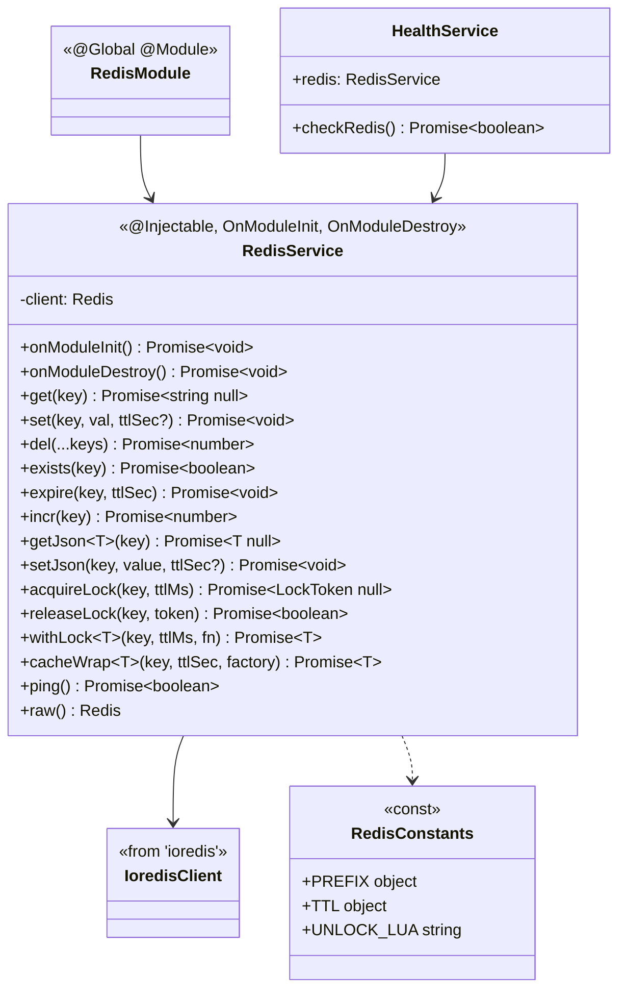
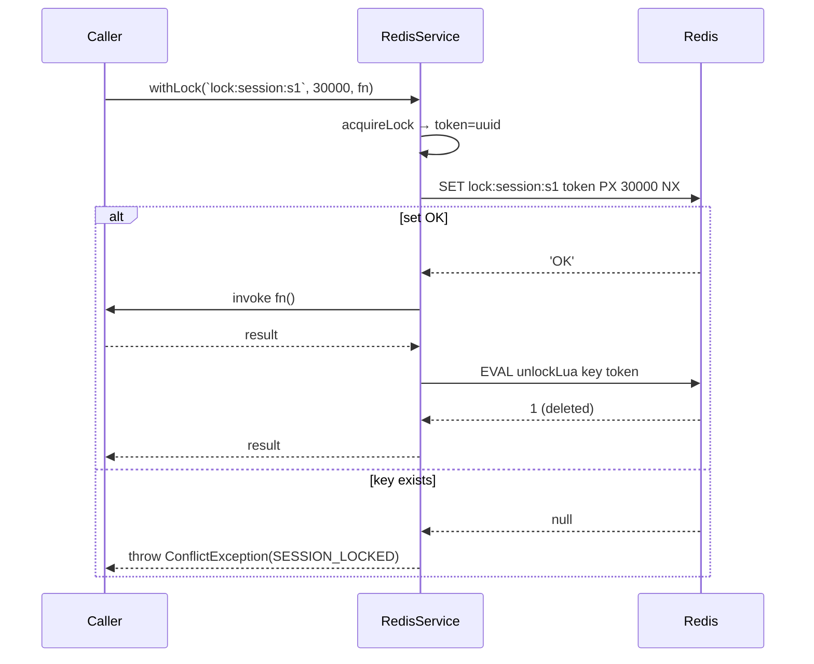

# P00.T6 — Redis Module

## 1. METADATA

| Field | Value |
|-------|-------|
| Task ID | P00.T6 |
| Tên task | Redis Module + RedisService (ioredis) |
| Phase | 0 |
| Depends on | P00.T2, P00.T4 |
| Complexity | Medium |
| Risk | Medium |

---

## 2. MỤC TIÊU & SCOPE

**In-scope**:
- Setup `ioredis` client.
- `RedisService` global cung cấp:
  - Generic get/set/del/expire.
  - Distributed lock helpers (acquire/release dùng SET NX + Lua script release).
  - JSON helpers (`getJson`, `setJson`).
  - Cache wrap helper.
- Update `HealthService` để check Redis.

**Out-of-scope**:
- BullMQ queue (P08.T3).
- Pub/Sub cho SSE (P11.T5).

---

## 3. FILES CẦN TẠO / SỬA

| # | Path | Loại | Mục đích |
|---|------|------|----------|
| 1 | `apps/server/src/shared/redis/redis.module.ts` | module | Global module |
| 2 | `apps/server/src/shared/redis/redis.service.ts` | service | Wrapper ioredis |
| 3 | `apps/server/src/shared/redis/redis.constants.ts` | const | Key prefixes, TTL defaults |
| 4 | `apps/server/src/shared/redis/redis.service.spec.ts` | test | Unit |
| 5 | `apps/server/src/app.module.ts` | sửa | Import RedisModule |
| 6 | `apps/server/src/modules/health/health.service.ts` | sửa | Thêm checkRedis |

---

## 4. CLASS DIAGRAM



**Tổng**: 2 class (`RedisService`, `RedisModule`) + 1 const module + extend `HealthService`.

---

## 5. CHI TIẾT CLASS

### 5.1. `RedisConstants`

**File**: `apps/server/src/shared/redis/redis.constants.ts`

```
PREFIX = {
  SESSION_LOCK:       'lock:session:',          // lock:session:<sid>
  AUTO_LOCK:          'lock:auto:',
  OOC_PERSISTENT:     'ooc:persistent:',        // ooc:persistent:<sid>
  OOC_EPHEMERAL:      'ooc:ephemeral:',
  OOC_ACTIVE_CHARS:   'ooc:active_chars:',
  OOC_TEMP_CHARS:     'ooc:temp_chars:',
  STORY_CACHE:        'cache:story:',
  CHAR_CACHE:         'cache:char:',
  USER_CACHE:         'cache:user:',
  EMBED_CACHE:        'cache:embed:',           // cache:embed:<sha256>
  MISSION_TRACK_LOCK: 'lock:mission:',          // lock:mission:<uid>:<mid>:<date>
  IDEMPOTENCY:        'idem:',                  // idem:<key>
  RATE_LIMIT:         'rl:',
}

TTL = {
  STORY_CACHE_SEC:    300,
  CHAR_CACHE_SEC:     300,
  USER_CACHE_SEC:     300,
  EMBED_CACHE_SEC:    86400,
  OOC_EPHEMERAL_SEC:  3600,
  IDEMPOTENCY_SEC:    900,
  LOCK_DEFAULT_MS:    30000,
}

UNLOCK_LUA = `
  if redis.call("get", KEYS[1]) == ARGV[1] then
    return redis.call("del", KEYS[1])
  else
    return 0
  end
`
```

---

### 5.2. `RedisService`

**File**: `apps/server/src/shared/redis/redis.service.ts`  
**Vai trò**: Wrapper ioredis + tiện ích cao cấp.

**Decorator**: `@Injectable()`

**Properties**:
| Name | Type | Access | Mô tả |
|------|------|--------|-------|
| `client` | `Redis` (ioredis) | private | Connection |
| `logger` | `Logger` | private | Pino |

**Constructor**: `constructor(config: ConfigService)`  
Logic: `this.client = new Redis(config.get('redisUrl'), { maxRetriesPerRequest: 3, enableReadyCheck: true, lazyConnect: true })`.

**Methods**:

#### `onModuleInit()`
```
onModuleInit(): Promise<void>

Logic:
  - await this.client.connect()
  - this.client.on('error', e => logger.error(e))
  - this.client.on('ready', () => logger.info('Redis ready'))
```

#### `onModuleDestroy()`
```
onModuleDestroy(): Promise<void>

Logic: await this.client.quit()
```

#### `get(key)`
```
get(key: string): Promise<string | null>

Logic: return this.client.get(key)
```

#### `set(key, val, ttlSec?)`
```
set(key: string, val: string, ttlSec?: number): Promise<void>

Logic:
  - if ttlSec: this.client.set(key, val, 'EX', ttlSec)
  - else: this.client.set(key, val)
```

#### `del(...keys)`
```
del(...keys: string[]): Promise<number>

Logic: return this.client.del(...keys)  // số keys bị xoá
```

#### `exists(key)` / `expire(key, ttl)` / `incr(key)`
Trivial wrappers.

#### `getJson<T>(key)`
```
getJson<T>(key: string): Promise<T | null>

Logic:
  - raw = await get(key)
  - if raw == null → null
  - return JSON.parse(raw) as T

Throws: bỏ qua parse error → log warn + return null (cache miss).
```

#### `setJson(key, value, ttlSec?)`
```
setJson(key: string, value: unknown, ttlSec?: number): Promise<void>

Logic: set(key, JSON.stringify(value), ttlSec)
```

#### `acquireLock(key, ttlMs)`
```
acquireLock(key: string, ttlMs: number = LOCK_DEFAULT_MS): Promise<LockToken | null>

Type: LockToken = { key: string; token: string }

Logic:
  1. token = uuidv4()
  2. result = await client.set(key, token, 'PX', ttlMs, 'NX')
  3. if result === 'OK' → return { key, token }
  4. else → return null

Use case: ensure idempotent per session — caller phải null-check.
```

#### `releaseLock(key, token)`
```
releaseLock(key: string, token: string): Promise<boolean>

Logic:
  - result = await client.eval(UNLOCK_LUA, 1, key, token)
  - return result === 1

(Lua script đảm bảo chỉ owner mới del — tránh race condition khi lock đã expire.)
```

#### `withLock<T>(key, ttlMs, fn)`
```
withLock<T>(key: string, ttlMs: number, fn: () => Promise<T>): Promise<T>

Logic:
  1. lock = await acquireLock(key, ttlMs)
  2. if !lock → throw new ConflictException(SESSION_LOCKED)
  3. try { return await fn() }
     finally { await releaseLock(key, lock.token) }
```

#### `cacheWrap<T>(key, ttlSec, factory)`
```
cacheWrap<T>(key: string, ttlSec: number, factory: () => Promise<T>): Promise<T>

Logic:
  1. cached = await getJson<T>(key)
  2. if cached !== null → return cached
  3. fresh = await factory()
  4. await setJson(key, fresh, ttlSec)
  5. return fresh
```

#### `ping()`
```
ping(): Promise<boolean>

Logic:
  - try: result = await client.ping()
  - return result === 'PONG'
  - catch: return false
```

#### `raw()`
```
raw(): Redis

Output: trả raw ioredis client cho advanced usage (BullMQ, Pub/Sub sau này).
```

---

### 5.3. `RedisModule`

**File**: `apps/server/src/shared/redis/redis.module.ts`  
**Decorator**: `@Global() @Module({ providers: [RedisService], exports: [RedisService] })`.

---

### 5.4. `HealthService` (extended)

#### `checkRedis()`
```
checkRedis(): Promise<boolean>

Logic: return this.redis.ping()
```

Update `getStatus` để thêm `checks.redis`.

---

## 6. SEQUENCE DIAGRAM — withLock pattern



---

## 7. ACCEPTANCE & TEST PLAN

### Acceptance Criteria
- [ ] Boot app → log "Redis ready".
- [ ] `GET /healthz` → `checks.redis === 'ok'`.
- [ ] Stop Redis → `checks.redis === 'fail'`.
- [ ] `acquireLock` 2 lần liên tiếp với cùng key → lần 2 trả null.
- [ ] Lock auto-release sau TTL.
- [ ] `releaseLock` với token sai → trả false, key vẫn còn.
- [ ] `cacheWrap` lần 1 gọi factory, lần 2 trả cache mà không gọi.

### Unit Tests
| Test | Assert |
|------|--------|
| `set then get returns value` | string match |
| `setJson then getJson returns typed object` | deep equal |
| `acquireLock returns token` | { key, token } shape |
| `acquireLock returns null when key exists` | mock SET → null |
| `releaseLock with correct token deletes` | EVAL returns 1 |
| `releaseLock with wrong token returns false` | EVAL returns 0 |
| `withLock invokes fn and releases` | fn called once, release called |
| `withLock throws when lock taken` | ConflictException |
| `cacheWrap caches on miss` | factory called once |

### Integration Test
- Spin Redis docker → `redis.service.e2e-spec.ts` chạy real commands.

### Manual Test
1. Mở 2 terminal cùng acquireLock → 1 success, 1 null.
2. `redis-cli MONITOR` quan sát commands khi cacheWrap.
