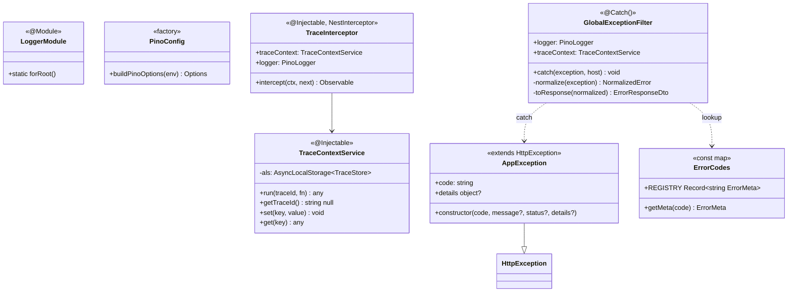
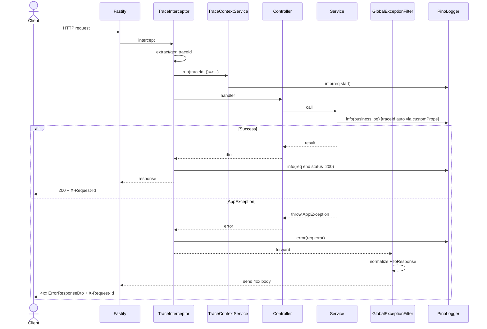

# P00.T7 — Logger, Error Filter, Request Tracing

## 1. METADATA

| Field | Value |
|-------|-------|
| Task ID | P00.T7 |
| Tên task | Pino Logger + Global Exception Filter + Trace Interceptor |
| Phase | 0 |
| Depends on | P00.T2 |
| Complexity | Medium |
| Risk | Low |

---

## 2. MỤC TIÊU & SCOPE

**In-scope**:
- Pino logger thay NestJS Logger mặc định.
- AsyncLocalStorage cho `traceId` per request.
- `GlobalExceptionFilter` chuyển mọi exception → `ErrorResponseDto` chuẩn.
- `TraceInterceptor` gán `X-Request-Id` header, log request lifecycle.
- Pretty print dev / JSON prod.

**Out-of-scope**:
- Sentry / Datadog integration (P13).

---

## 3. FILES CẦN TẠO / SỬA

| # | Path | Loại | Mục đích |
|---|------|------|----------|
| 1 | `apps/server/src/shared/logger/logger.module.ts` | module | Wrap nestjs-pino LoggerModule.forRoot |
| 2 | `apps/server/src/shared/logger/pino-config.ts` | config | Pino options factory |
| 3 | `apps/server/src/shared/tracing/trace-context.service.ts` | service | AsyncLocalStorage wrapper |
| 4 | `apps/server/src/shared/tracing/trace.interceptor.ts` | interceptor | Inject traceId, log start/end |
| 5 | `apps/server/src/shared/filters/global-exception.filter.ts` | filter | Catch all → ErrorResponseDto |
| 6 | `apps/server/src/shared/errors/app-exception.ts` | class | Base custom exception với code |
| 7 | `apps/server/src/shared/errors/error-codes.ts` | const | Map code → HTTP status + message |
| 8 | `apps/server/src/main.ts` | sửa | Apply useGlobalFilters + useLogger |
| 9 | `apps/server/src/app.module.ts` | sửa | Import LoggerModule, provide TraceInterceptor APP_INTERCEPTOR |
| 10 | `apps/server/src/shared/logger/*.spec.ts` | test | Unit |

---

## 4. CLASS DIAGRAM



**Tổng**: 6 class mới.

---

## 5. CHI TIẾT CLASS

### 5.1. `PinoConfig`

**File**: `apps/server/src/shared/logger/pino-config.ts`

**Export**:
```
buildPinoOptions(env: 'development'|'production'|'test'): Params
  (Params là của nestjs-pino)

Logic:
  - base options:
    - level: env=prod ? 'info' : 'debug'
    - timestamp: pino.stdTimeFunctions.isoTime
    - formatters: { level(label) => ({ level: label }) }
    - redact: ['req.headers.authorization', 'req.headers.cookie', '*.password', '*.token']
  - dev: transport: { target: 'pino-pretty', options: { colorize: true, singleLine: false } }
  - prod: no transport (JSON to stdout)
  - serializers: { req: customReqSerializer (loại bỏ secrets), err: pino.stdSerializers.err }
  - customProps(req, res): trả { traceId: req.headers['x-request-id'] }
```

---

### 5.2. `LoggerModule`

**File**: `apps/server/src/shared/logger/logger.module.ts`

**Logic**: re-export `LoggerModule.forRootAsync({ inject: [ConfigService], useFactory: (cfg) => buildPinoOptions(cfg.get('nodeEnv')) })` từ `nestjs-pino`.

---

### 5.3. `TraceContextService`

**File**: `apps/server/src/shared/tracing/trace-context.service.ts`

**Vai trò**: Async context để bất kỳ nơi nào trong handler đều lấy được `traceId` mà không phải param drilling.

**Type**:
```
TraceStore = Map<string, unknown>
```

**Properties**:
| Name | Type | Access |
|------|------|--------|
| `als` | `AsyncLocalStorage<TraceStore>` | private (init in ctor) |

**Methods**:

#### `run<T>(traceId, fn)`
```
run<T>(traceId: string, fn: () => T): T

Logic:
  - store = new Map([['traceId', traceId]])
  - return this.als.run(store, fn)
```

#### `getTraceId(): string | null`
```
Logic:
  - store = this.als.getStore()
  - return store?.get('traceId') ?? null
```

#### `set(key, value): void` / `get(key): unknown`
Tiện set/get bất kỳ context (userId, sessionId...).

---

### 5.4. `TraceInterceptor`

**File**: `apps/server/src/shared/tracing/trace.interceptor.ts`

**Decorator**: `@Injectable()`

**Method**:

#### `intercept(ctx, next)`
```
intercept(ctx: ExecutionContext, next: CallHandler): Observable<unknown>

Logic:
  1. req = ctx.switchToHttp().getRequest()
  2. res = ctx.switchToHttp().getResponse()
  3. traceId = req.headers['x-request-id'] ?? uuidv4()
  4. res.header('X-Request-Id', traceId)
  5. startTime = Date.now()
  6. return new Observable(subscriber => {
       this.traceContext.run(traceId, () => {
         this.logger.info({ method: req.method, url: req.url }, 'req start')
         next.handle().subscribe({
           next: v => { subscriber.next(v) },
           error: e => {
             this.logger.error({ err:e, durMs: Date.now()-startTime }, 'req error')
             subscriber.error(e)
           },
           complete: () => {
             this.logger.info({ status: res.statusCode, durMs: Date.now()-startTime }, 'req end')
             subscriber.complete()
           }
         })
       })
     })
```

(Note: cài qua APP_INTERCEPTOR token trong AppModule providers.)

---

### 5.5. `AppException`

**File**: `apps/server/src/shared/errors/app-exception.ts`

```
class AppException extends HttpException
  +code: string
  +details?: object

constructor(code: string, message?: string, status?: HttpStatus, details?: object)

Logic:
  - meta = ErrorCodes.getMeta(code)  // throw if unknown
  - super({ code, message: message ?? meta.defaultMessage, details }, status ?? meta.status)
  - this.code = code
  - this.details = details
```

**Usage**: `throw new AppException(ERR.SESSION_LOCKED)`.

---

### 5.6. `ErrorCodes`

**File**: `apps/server/src/shared/errors/error-codes.ts`

```
type ErrorMeta = { status: HttpStatus; defaultMessage: string }

const REGISTRY: Record<string, ErrorMeta> = {
  INVALID_TOKEN:           { status: 401, defaultMessage: 'Token không hợp lệ' },
  USER_DISABLED:           { status: 403, defaultMessage: 'Tài khoản đã bị vô hiệu hoá' },
  NOT_FOUND:               { status: 404, defaultMessage: 'Không tìm thấy' },
  FORBIDDEN:               { status: 403, defaultMessage: 'Không có quyền truy cập' },
  INVALID_PAYLOAD:         { status: 400, defaultMessage: 'Dữ liệu không hợp lệ' },
  SESSION_NOT_FOUND:       { status: 404, defaultMessage: 'Phiên hội thoại không tồn tại' },
  SESSION_LOCKED:          { status: 409, defaultMessage: 'Phiên đang được xử lý' },
  SESSION_ALREADY_ENDED:   { status: 409, defaultMessage: 'Phiên đã kết thúc' },
  STORY_HAS_ACTIVE_SESSION:{ status: 409, defaultMessage: 'Story đang có phiên active' },
  RATE_LIMIT:              { status: 429, defaultMessage: 'Quá nhiều request' },
  LLM_UNAVAILABLE:         { status: 503, defaultMessage: 'LLM tạm không khả dụng' },
  TTS_ENGINE_DOWN:         { status: 503, defaultMessage: 'TTS engine tạm không khả dụng' },
  REFERENCE_NOT_FOUND:     { status: 404, defaultMessage: 'Voice reference không tồn tại' },
  NOT_ENOUGH_GEMS:         { status: 402, defaultMessage: 'Số dư gem không đủ' },
  ITEM_NOT_FOUND:          { status: 404, defaultMessage: 'Vật phẩm không tồn tại' },
  ITEM_INACTIVE:           { status: 410, defaultMessage: 'Vật phẩm đã ngừng bán' },
  MISSION_NOT_CLAIMABLE:   { status: 409, defaultMessage: 'Nhiệm vụ chưa thể claim' },
  NO_WORDS_DUE:            { status: 400, defaultMessage: 'Chưa có từ nào đến hạn ôn' },
  IDEMPOTENCY_CONFLICT:    { status: 409, defaultMessage: 'Idempotency-Key trùng với request khác' },
  LLM_PARSE_FAIL:          { status: 502, defaultMessage: 'LLM trả về dữ liệu không parse được' },
}

export const ERR = Object.fromEntries(Object.keys(REGISTRY).map(k => [k, k])) as Record<keyof typeof REGISTRY, string>
export function getMeta(code: string): ErrorMeta { ... throw if not found ... }
```

---

### 5.7. `GlobalExceptionFilter`

**File**: `apps/server/src/shared/filters/global-exception.filter.ts`

**Decorator**: `@Catch()` (catch all)

**Properties**:
| Name | Type |
|------|------|
| `logger` | injected via `@Inject(Logger)` (nestjs-pino) |
| `traceContext` | TraceContextService |

**Methods**:

#### `catch(exception, host)`
```
catch(exception: unknown, host: ArgumentsHost): void

Logic:
  1. ctx = host.switchToHttp(); res = ctx.getResponse(); req = ctx.getRequest()
  2. normalized = this.normalize(exception)
  3. body = this.toResponse(normalized)
  4. if normalized.status >= 500: logger.error({ err: exception, traceId: ... }, 'unhandled')
     else: logger.warn({ code: normalized.code, status: normalized.status }, 'expected error')
  5. res.status(normalized.status).send(body)
```

#### `normalize(exception)`
```
normalize(e: unknown): { status: number, code: string, message: string, details?: unknown }

Logic:
  - if e instanceof AppException: { status: e.getStatus(), code: e.code, message: e.message, details: e.details }
  - else if e instanceof HttpException:
      response = e.getResponse()
      if typeof response === 'object' && response.code: use it
      else: { status: e.getStatus(), code: 'HTTP_'+status, message: response.message ?? e.message }
  - else if e instanceof Error:
      { status: 500, code: 'INTERNAL_ERROR', message: 'Lỗi máy chủ' }
  - else:
      { status: 500, code: 'INTERNAL_ERROR', message: 'Lỗi không xác định' }
```

#### `toResponse(n)`
```
toResponse(n): ErrorResponseDto
  return { error: { code: n.code, message: n.message, details: n.details } }
```

---

## 6. SEQUENCE DIAGRAM — Request lifecycle



---

## 7. ACCEPTANCE & TEST PLAN

### Acceptance Criteria
- [ ] Dev log có màu, prod log JSON.
- [ ] Mọi response có header `X-Request-Id`.
- [ ] `throw new AppException(ERR.NOT_FOUND)` → 404 với body chuẩn.
- [ ] `throw new Error('boom')` → 500 với code `INTERNAL_ERROR`, log error.
- [ ] Header `Authorization` không xuất hiện trong log (redacted).
- [ ] Log có trường `traceId` khớp với header response.

### Unit Tests
| Test | Assert |
|------|--------|
| `AppException stores code and details` | properties |
| `normalize AppException` | { code, status } correct |
| `normalize HttpException` | maps to HTTP_xxx code |
| `normalize generic Error` | INTERNAL_ERROR / 500 |
| `TraceContextService.run sets traceId getable` | getTraceId returns id inside fn |

### Integration Test
- E2E: POST endpoint nhân tạo throw AppException → response body match shape.

### Manual Test
1. curl `-i` → thấy header `X-Request-Id`.
2. Tạo endpoint `/test-throw` → curl → response chuẩn + log có stack.
3. Header Authorization có giá trị → log thấy `[REDACTED]`.
