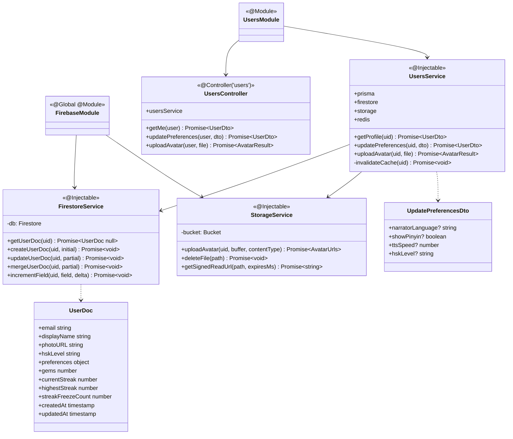
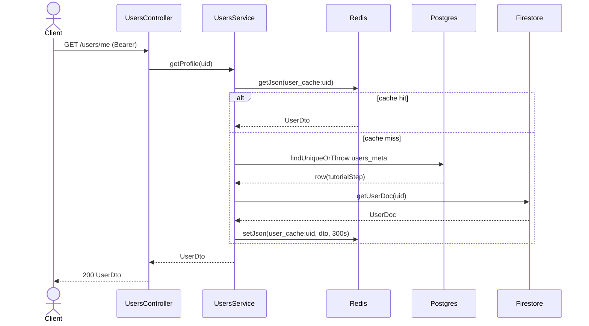
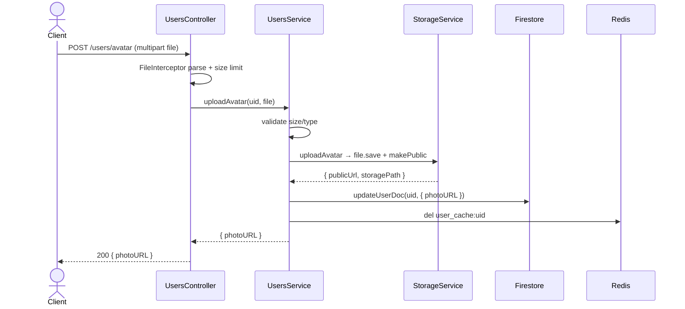

# P01.T3 — Server UsersModule (Profile + Firestore Sync + Avatar)

## 1. METADATA

| Field | Value |
|-------|-------|
| Task ID | P01.T3 |
| Tên task | UsersModule: GET /users/me, PATCH preferences, POST avatar, Firestore + Storage rules |
| Phase | 1 |
| Depends on | P01.T2 |
| Complexity | High |
| Risk | Medium |

---

## 2. MỤC TIÊU & SCOPE

**In-scope**:
- `UsersService`: read merge Postgres + Firestore, update preferences (whitelist field), upload avatar.
- `UsersController` 3 endpoints.
- `FirestoreService` wrapper (inject firebase-admin firestore).
- `StorageService` wrapper (upload, signed URL).
- Firestore security rules + Storage rules files.
- Update `AuthService.upsertUser` để cũng init Firestore `users/{uid}` doc nếu chưa có.

**Out-of-scope**:
- Real-time client subscribe (P01.T5).
- Gems/streak server-side update (P11).

---

## 3. FILES CẦN TẠO / SỬA

| # | Path | Loại |
|---|------|------|
| 1 | `apps/server/src/modules/users/users.module.ts` | module |
| 2 | `apps/server/src/modules/users/users.controller.ts` | controller |
| 3 | `apps/server/src/modules/users/users.service.ts` | service |
| 4 | `apps/server/src/modules/users/dto/update-preferences.dto.ts` | dto |
| 5 | `apps/server/src/modules/users/dto/user-profile.dto.ts` | dto (full UserDto from shared-types) |
| 6 | `apps/server/src/shared/firebase/firestore.service.ts` | service |
| 7 | `apps/server/src/shared/firebase/storage.service.ts` | service |
| 8 | `apps/server/src/shared/firebase/firebase.module.ts` | global module export Firestore + Storage |
| 9 | `apps/server/src/modules/auth/auth.service.ts` | sửa: upsertUser tạo Firestore doc + đọc real preferences |
| 10 | `firestore.rules` | infra |
| 11 | `storage.rules` | infra |
| 12 | `firebase.json` | infra (deploy rules) |
| 13 | `apps/server/src/modules/users/*.spec.ts` | tests |

---

## 4. CLASS DIAGRAM



**Tổng**: 6 class mới + 2 DTO/type + 2 rules file + 1 sửa AuthService.

---

## 5. CHI TIẾT CLASS

### 5.1. `FirestoreService`

**File**: `shared/firebase/firestore.service.ts`

**Constructor inject**: `@Inject(FIREBASE_ADMIN) admin: admin.app.App`  
→ `this.db = admin.firestore()`

**Methods**:

#### `getUserDoc(uid)`
```
getUserDoc(uid: string): Promise<UserDoc | null>
Logic:
  - snap = await db.doc(`users/${uid}`).get()
  - return snap.exists ? (snap.data() as UserDoc) : null
```

#### `createUserDoc(uid, initial)`
```
createUserDoc(uid: string, initial: Partial<UserDoc>): Promise<void>
Logic:
  - await db.doc(`users/${uid}`).set({
      ...defaults, ...initial,
      createdAt: FieldValue.serverTimestamp(),
      updatedAt: FieldValue.serverTimestamp()
    })
Throws: nếu doc đã tồn tại → rethrow
```

#### `updateUserDoc(uid, partial)`
```
updateUserDoc(uid: string, partial: Partial<UserDoc>): Promise<void>
Logic: db.doc(...).update({ ...partial, updatedAt: FieldValue.serverTimestamp() })
Throws: 404 nếu doc không có
```

#### `mergeUserDoc(uid, partial)`
```
mergeUserDoc(uid: string, partial: Partial<UserDoc>): Promise<void>
Logic: db.doc(...).set({ ...partial, updatedAt: ... }, { merge: true })
```

#### `incrementField(uid, field, delta)`
```
incrementField(uid: string, field: string, delta: number): Promise<void>
Logic: db.doc(...).update({ [field]: FieldValue.increment(delta), updatedAt: ... })
Use case: P11 cộng gems.
```

---

### 5.2. `StorageService`

**Constructor inject**: `@Inject(FIREBASE_ADMIN) admin`  
→ `this.bucket = admin.storage().bucket()`

**Type AvatarUrls** = `{ publicUrl: string; storagePath: string }`

**Methods**:

#### `uploadAvatar(uid, buffer, contentType)`
```
uploadAvatar(uid: string, buffer: Buffer, contentType: string): Promise<AvatarUrls>

Input:
  - uid (Firebase UID)
  - buffer (resized image bytes ≤ 2MB)
  - contentType ('image/jpeg' | 'image/png' | 'image/webp')

Output: AvatarUrls

Logic:
  1. ext = contentType.split('/')[1] (mặc định 'jpg')
  2. path = `avatars/${uid}/${Date.now()}.${ext}`
  3. file = bucket.file(path)
  4. await file.save(buffer, { contentType, resumable: false, metadata: { cacheControl: 'public, max-age=86400' } })
  5. await file.makePublic()  // hoặc dùng signed URL
  6. publicUrl = `https://storage.googleapis.com/${bucket.name}/${path}`
  7. return { publicUrl, storagePath: path }

Side effects: write to Firebase Storage

Throws: rethrow storage errors → mapped to 500 INTERNAL_ERROR ở filter
```

#### `deleteFile(path)`
```
deleteFile(path: string): Promise<void>
Logic: await bucket.file(path).delete({ ignoreNotFound: true })
```

---

### 5.3. `UsersService`

**Constructor inject**: prisma, firestore: FirestoreService, storage: StorageService, redis: RedisService.

**Methods**:

#### `getProfile(uid)`
```
getProfile(uid: string): Promise<UserDto>

Logic:
  1. cacheKey = PREFIX.USER_CACHE + uid
  2. return redis.cacheWrap(cacheKey, TTL.USER_CACHE_SEC, async () => {
       row = await prisma.usersMeta.findUniqueOrThrow({ where: { userId: uid } })
       doc = await firestore.getUserDoc(uid)
       if (!doc) throw new AppException(ERR.NOT_FOUND, 'User doc missing')
       return {
         uid,
         email: doc.email,
         displayName: doc.displayName,
         photoURL: doc.photoURL,
         hskLevel: doc.hskLevel,
         preferences: doc.preferences,
         gems: doc.gems,
         currentStreak: doc.currentStreak,
         highestStreak: doc.highestStreak,
         streakFreezeCount: doc.streakFreezeCount,
         tutorialStep: row.tutorialStep,
       }
     })

Throws: NOT_FOUND
```

#### `updatePreferences(uid, dto)`
```
updatePreferences(uid: string, dto: UpdatePreferencesDto): Promise<UserDto>

Logic:
  1. validate whitelist field — DTO đã có @IsOptional + @IsIn cho enum.
     Reject nếu dto chứa key 'gems'|'currentStreak'|... (DTO whitelist ensure).
  2. partial = build object chỉ field user-mutable:
     {
       'preferences.narratorLanguage': dto.narratorLanguage,
       'preferences.showPinyin': dto.showPinyin,
       'preferences.ttsSpeed': dto.ttsSpeed,
       'hskLevel': dto.hskLevel,
     } (loại bỏ undefined)
  3. await firestore.updateUserDoc(uid, partial)  // dot-notation update
  4. await invalidateCache(uid)
  5. return getProfile(uid)  // fresh

Side effects:
  - Firestore update
  - Redis del cache

Throws: INVALID_PAYLOAD (validation), NOT_FOUND (doc missing)
```

#### `uploadAvatar(uid, file)`
```
uploadAvatar(uid: string, file: { buffer: Buffer; mimeType: string; size: number }): Promise<{ photoURL: string }>

Logic:
  1. if file.size > 2*1024*1024 → throw AppException(ERR.INVALID_PAYLOAD, 'Avatar too large')
  2. if !['image/jpeg','image/png','image/webp'].includes(file.mimeType) → throw INVALID_PAYLOAD
  3. (Optional resize bằng sharp → max 512x512, quality 80) — server-side fallback dù client đã resize
  4. urls = await storage.uploadAvatar(uid, file.buffer, file.mimeType)
  5. await firestore.updateUserDoc(uid, { photoURL: urls.publicUrl })
  6. await invalidateCache(uid)
  7. return { photoURL: urls.publicUrl }

Side effects: Storage write + Firestore update + Redis invalidate

Throws: INVALID_PAYLOAD
```

#### `invalidateCache(uid)` (private)
```
invalidateCache(uid: string): Promise<void>
Logic: await redis.del(PREFIX.USER_CACHE + uid)
```

---

### 5.4. `UsersController`

**Decorator**: `@Controller('users')` (mặc định protected)

**Methods**:

#### `getMe(user)`
```
@Get('me')
getMe(@CurrentUser() user: AuthUser): Promise<UserDto>
Logic: return usersService.getProfile(user.uid)
```

#### `updatePreferences(user, dto)`
```
@Patch('preferences')
updatePreferences(@CurrentUser() user, @Body() dto: UpdatePreferencesDto): Promise<UserDto>
Logic: return usersService.updatePreferences(user.uid, dto)
```

#### `uploadAvatar(user, file)`
```
@Post('avatar') @UseInterceptors(FileInterceptor('file', { limits: { fileSize: 2*1024*1024 } }))
uploadAvatar(@CurrentUser() user, @UploadedFile() file: Express.Multer.File): Promise<{ photoURL: string }>

Logic:
  - if !file → throw INVALID_PAYLOAD
  - return usersService.uploadAvatar(user.uid, { buffer: file.buffer, mimeType: file.mimetype, size: file.size })
```

---

### 5.5. `UpdatePreferencesDto`

```
class UpdatePreferencesDto {
  @IsOptional() @IsIn(['vi','en','zh']) narratorLanguage?: string
  @IsOptional() @IsBoolean() showPinyin?: boolean
  @IsOptional() @IsNumber() @Min(0.75) @Max(1.25) ttsSpeed?: number
  @IsOptional() @IsIn(['HSK1','HSK2','HSK3','HSK4','HSK5','HSK6']) hskLevel?: string
}
```

ValidationPipe (`whitelist: true, forbidNonWhitelisted: true`) đảm bảo các field khác bị reject (gems, streak…).

---

### 5.6. Update `AuthService.upsertUser` (sửa file)

Sau bước upsert Postgres:
```
existingDoc = await firestore.getUserDoc(uid)
if (!existingDoc) {
  await firestore.createUserDoc(uid, {
    email: decoded.email,
    displayName: decoded.name,
    photoURL: decoded.picture,
    hskLevel: 'HSK1',
    preferences: { narratorLanguage:'vi', showPinyin:true, ttsSpeed:1.0 },
    gems: 0, currentStreak: 0, highestStreak: 0, streakFreezeCount: 0,
  })
  existingDoc = await firestore.getUserDoc(uid)
}
return buildUserDto(row, existingDoc!)
```

---

### 5.7. `firestore.rules`

```
rules_version = '2';
service cloud.firestore {
  match /databases/{database}/documents {
    match /users/{uid} {
      allow read: if request.auth != null && request.auth.uid == uid;
      allow create: if false;  // chỉ server tạo
      allow update: if request.auth != null && request.auth.uid == uid
        && !request.resource.data.diff(resource.data).affectedKeys()
            .hasAny(['gems','currentStreak','highestStreak','streakFreezeCount','tutorialStep']);
      allow delete: if false;
    }
  }
}
```

### 5.8. `storage.rules`

```
rules_version = '2';
service firebase.storage {
  match /b/{bucket}/o {
    match /avatars/{uid}/{file=**} {
      allow read: if request.auth != null;
      allow write: if request.auth != null && request.auth.uid == uid
        && request.resource.size < 2 * 1024 * 1024
        && request.resource.contentType.matches('image/.*');
    }
    match /tts_audio/{uid}/{file=**} {
      allow read: if request.auth != null && request.auth.uid == uid;
      allow write: if false;  // chỉ server
    }
  }
}
```

### 5.9. `firebase.json` (deploy config)

```
{
  "firestore": { "rules": "firestore.rules" },
  "storage":   { "rules": "storage.rules" }
}
```

Deploy: `firebase deploy --only firestore:rules,storage`.

---

## 6. SEQUENCE DIAGRAMS

### 6.1. `GET /users/me` (cached path)



### 6.2. Avatar upload



---

## 7. ACCEPTANCE & TEST PLAN

### Acceptance
- [ ] First sign-in tạo Firestore doc `users/{uid}` với defaults.
- [ ] `GET /users/me` trả full UserDto.
- [ ] 2nd call `/users/me` trong 5min → cache hit (Redis MONITOR confirms).
- [ ] `PATCH /users/preferences { showPinyin: false }` → Firestore reflect, cache invalidated, next GET trả false.
- [ ] `PATCH /users/preferences { gems: 9999 }` → 400 (forbidNonWhitelisted).
- [ ] `POST /users/avatar` với file 1.5MB JPEG → 200 + photoURL hoạt động khi GET ảnh.
- [ ] `POST /users/avatar` với file 3MB → 413/400.
- [ ] `POST /users/avatar` với file `.pdf` → 400.
- [ ] Firestore rules: client đăng nhập uid=A không update được doc uid=B (manual test bằng Firestore emulator).

### Unit Tests
| Test | File | Assert |
|------|------|--------|
| getProfile hits cache when set | users.service.spec | redis.getJson called once, db not |
| getProfile builds DTO from row+doc | mock DB+FS | match shape |
| updatePreferences rejects non-whitelisted | via ValidationPipe e2e | 400 |
| updatePreferences updates dot-notation | spy firestore.updateUserDoc | called with correct keys |
| uploadAvatar rejects oversize | throws INVALID_PAYLOAD | |
| uploadAvatar rejects bad mime | throws | |
| uploadAvatar invalidates cache | spy redis.del | |
| FirestoreService createUserDoc sets timestamps | mock admin.firestore | doc.set called |

### Integration
- E2E `/users` với firebase-admin mocked (sub provider).
- Firestore emulator pour rules test.

### Manual
1. Login → `GET /users/me` thấy default preferences.
2. PATCH preferences → 2nd GET reflect new values < 1s.
3. Upload ảnh trong client → ảnh hiện trên UI ngay.
