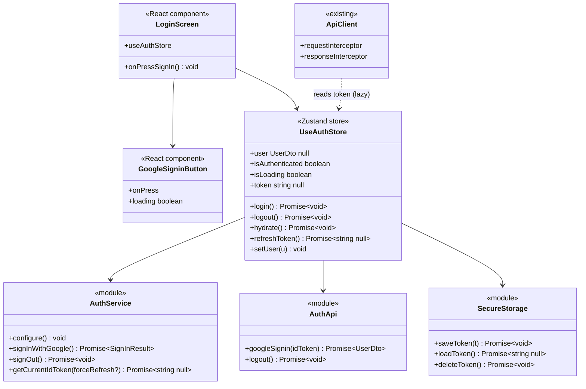
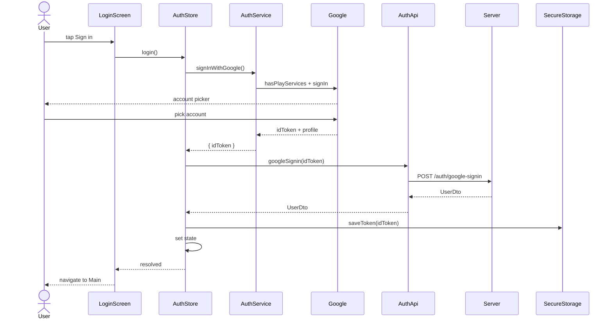
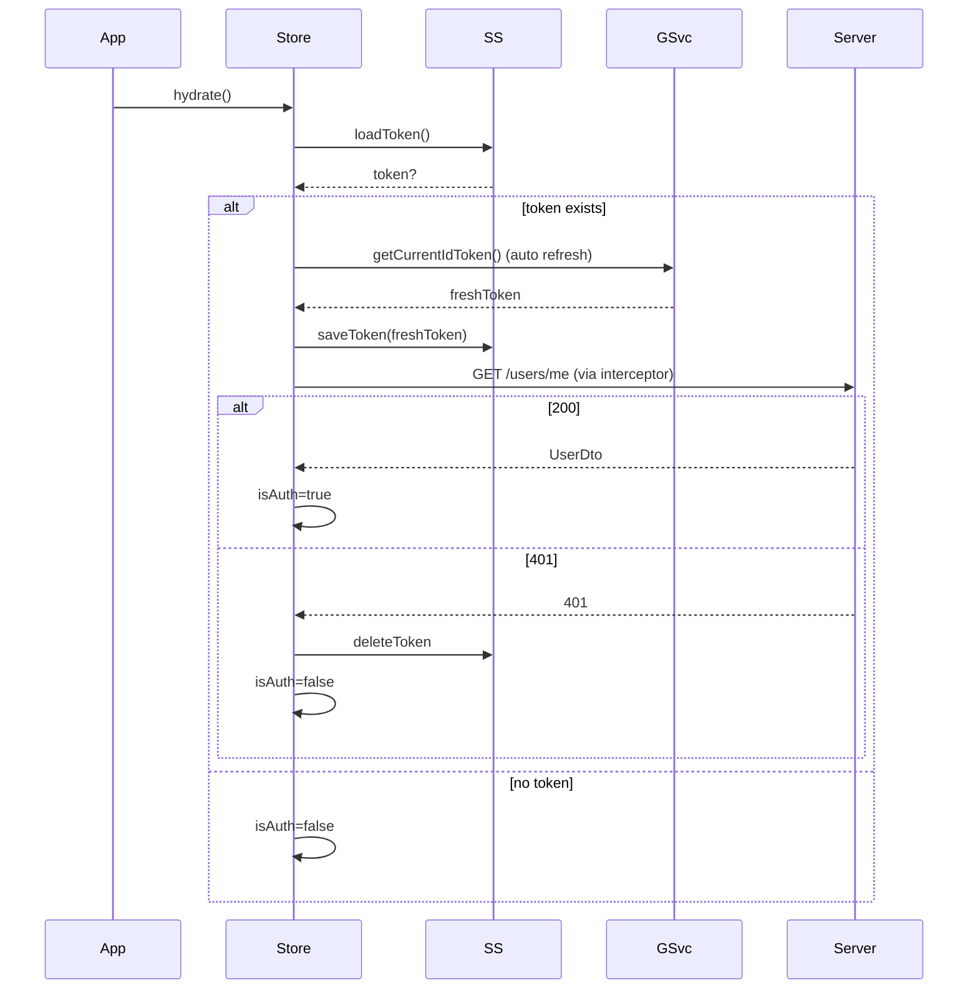
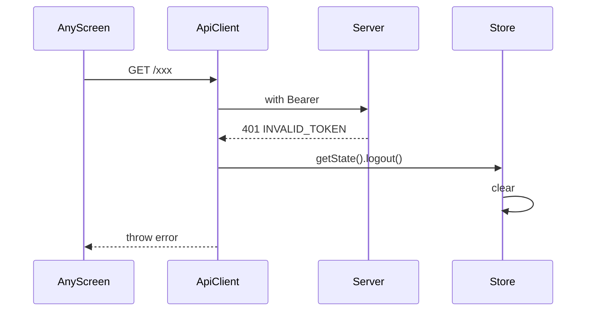

# P01.T4 — Client: Google Sign-In + AuthStore

## 1. METADATA

| Field | Value |
|-------|-------|
| Task ID | P01.T4 |
| Tên task | Mobile Google Sign-In flow + AuthStore (Zustand + persist) + interceptor wire |
| Phase | 1 |
| Depends on | P00.T3, P01.T2 |
| Complexity | High |
| Risk | Medium (native module config) |

---

## 2. MỤC TIÊU & SCOPE

**In-scope**:
- Cài & cấu hình Google Sign-In native (Expo dev client hoặc bare).
- `authService.signInWithGoogle()`, `signOut()`, `getCurrentIdToken()` (refresh-aware).
- `useAuthStore` (Zustand): state `{ user, isAuthenticated, isLoading, token }` + actions `login/logout/hydrate/refreshToken`.
- SecureStore persist token.
- Wire request interceptor: lấy token, inject Authorization.
- Wire response interceptor: 401 → logout.
- LoginScreen UI.

**Out-of-scope**:
- Profile screen (T5).
- Navigation conditional (T6).

---

## 3. FILES CẦN TẠO / SỬA

| # | Path | Loại |
|---|------|------|
| 1 | `apps/mobile/src/features/auth/services/auth.service.ts` | service |
| 2 | `apps/mobile/src/features/auth/services/auth.api.ts` | service (axios calls) |
| 3 | `apps/mobile/src/stores/auth.store.ts` | store |
| 4 | `apps/mobile/src/utils/secure-storage.ts` | util (wrap expo-secure-store) |
| 5 | `apps/mobile/src/features/auth/screens/LoginScreen.tsx` | screen |
| 6 | `apps/mobile/src/features/auth/components/GoogleSigninButton.tsx` | component |
| 7 | `apps/mobile/src/api/client.ts` | sửa (interceptor read store) |
| 8 | `apps/mobile/app.json` | sửa (plugin google-signin) |
| 9 | `apps/mobile/.env` | sửa (EXPO_PUBLIC_GOOGLE_WEB_CLIENT_ID) |

---

## 4. CLASS DIAGRAM



---

## 5. CHI TIẾT MODULE

### 5.1. `AuthService`

**File**: `features/auth/services/auth.service.ts`  
**Tech**: `@react-native-google-signin/google-signin` (works with Expo dev client) **OR** `expo-auth-session` (managed flow). **Chọn**: `@react-native-google-signin/google-signin` (idToken trực tiếp).

**Type SignInResult** = `{ idToken: string; profile: { email; name; photo } }`

**Methods**:

#### `configure()`
```
configure(): void

Logic (gọi 1 lần khi app boot):
  GoogleSignin.configure({
    webClientId: process.env.EXPO_PUBLIC_GOOGLE_WEB_CLIENT_ID,  // từ Firebase console
    offlineAccess: false,
    scopes: ['profile','email'],
  })
```

#### `signInWithGoogle()`
```
signInWithGoogle(): Promise<SignInResult>

Logic:
  1. await GoogleSignin.hasPlayServices()
  2. await GoogleSignin.signIn() → user info
  3. { idToken } = await GoogleSignin.getTokens()
  4. if (!idToken) throw new Error('NO_ID_TOKEN')
  5. return { idToken, profile: { email, name, photo } }

Throws:
  - SIGN_IN_CANCELLED, PLAY_SERVICES_NOT_AVAILABLE, IN_PROGRESS → bubble up,
    UI hiển thị message phù hợp.
```

#### `signOut()`
```
signOut(): Promise<void>

Logic:
  - try { await GoogleSignin.signOut() } catch { /* ignore */ }
  - try { await GoogleSignin.revokeAccess() } catch { /* ignore */ }
```

#### `getCurrentIdToken(forceRefresh = false)`
```
getCurrentIdToken(forceRefresh?: boolean): Promise<string | null>

Logic:
  - if !GoogleSignin.hasPreviousSignIn() → return null
  - { idToken } = await GoogleSignin.getTokens()  // tự refresh nếu hết hạn
  - return idToken
```

---

### 5.2. `AuthApi`

**File**: `features/auth/services/auth.api.ts`

```
googleSignin(idToken: string): Promise<UserDto>
  → apiClient.post('/auth/google-signin', { idToken })

logout(): Promise<void>
  → apiClient.post('/auth/logout')
```

---

### 5.3. `SecureStorage`

**File**: `utils/secure-storage.ts` (wrap `expo-secure-store`)

```
const KEY_TOKEN = 'chatai_id_token'

saveToken(t: string): Promise<void>     → SecureStore.setItemAsync(KEY_TOKEN, t)
loadToken(): Promise<string | null>     → SecureStore.getItemAsync(KEY_TOKEN)
deleteToken(): Promise<void>            → SecureStore.deleteItemAsync(KEY_TOKEN)
```

---

### 5.4. `useAuthStore`

**File**: `stores/auth.store.ts`

**State shape**:
```
{
  user: UserDto | null,
  isAuthenticated: boolean,
  isLoading: boolean,
  token: string | null,
}
```

**Actions**:

#### `login()`
```
login(): Promise<void>

Logic:
  1. set { isLoading: true }
  2. try:
     a. result = await authService.signInWithGoogle()
     b. user = await authApi.googleSignin(result.idToken)  // server verify + upsert
     c. await secureStorage.saveToken(result.idToken)
     d. set { user, isAuthenticated: true, token: result.idToken, isLoading: false }
  3. catch (e):
     - set { isLoading: false }
     - rethrow → UI show toast

Side effects:
  - SecureStore write
  - HTTP POST /auth/google-signin
```

#### `logout()`
```
logout(): Promise<void>

Logic:
  1. set { isLoading: true }
  2. try { await authApi.logout() } catch { /* ignore */ }
  3. try { await authService.signOut() } catch { /* ignore */ }
  4. await secureStorage.deleteToken()
  5. set { user: null, isAuthenticated: false, token: null, isLoading: false }
```

#### `hydrate()`
```
hydrate(): Promise<void>

Logic (gọi 1 lần khi App mount):
  1. set { isLoading: true }
  2. token = await secureStorage.loadToken()
  3. if !token → set { isAuthenticated: false, isLoading: false }; return
  4. try:
     - refreshed = await authService.getCurrentIdToken()  // ensures not expired
     - if !refreshed → throw
     - await secureStorage.saveToken(refreshed)
     - user = await apiClient.get('/users/me') (with refreshed token via interceptor)
     - set { user, isAuthenticated: true, token: refreshed, isLoading: false }
  5. catch:
     - await secureStorage.deleteToken()
     - set { user: null, isAuthenticated: false, token: null, isLoading: false }
```

#### `refreshToken()`
```
refreshToken(): Promise<string | null>

Logic:
  - token = await authService.getCurrentIdToken(true)
  - if token: await secureStorage.saveToken(token); set state.token = token
  - return token
```

#### `setUser(user)`
```
setUser(user: UserDto): void
Logic: set { user }
Use case: P01.T5 cập nhật user sau khi PATCH preferences.
```

---

### 5.5. `LoginScreen`

**File**: `features/auth/screens/LoginScreen.tsx`

**Props**: none

**Component skeleton**:
- `useAuthStore(s => s.isLoading)`.
- Local state: `error: string | null`.
- Hiển thị:
  - Logo + tagline.
  - `<GoogleSigninButton loading={isLoading} onPress={handlePress} />`
  - Error message (nếu có).
- `handlePress`:
  ```
  try { await login() }
  catch (e) {
    if (e.code === 'SIGN_IN_CANCELLED') return  // im lặng
    setError(e.message ?? 'Đăng nhập thất bại')
  }
  ```

### 5.6. `GoogleSigninButton`

**File**: `features/auth/components/GoogleSigninButton.tsx`

**Props**:
```
{ onPress: () => void; loading?: boolean; disabled?: boolean }
```

UI: `Pressable` + logo Google + text "Đăng nhập với Google" + `ActivityIndicator` khi loading.

---

### 5.7. Sửa `ApiClient` interceptors

**File**: `api/client.ts`

**Trước**: tokenGetter chưa wire.  
**Sau**:
- Khi app bootstrap, gọi `setAuthTokenGetter(() => useAuthStore.getState().token)`.
- Response interceptor:
  - Nếu 401 và URL không phải `/auth/*` → `useAuthStore.getState().logout()`.

**Avoid circular import**: store import apiClient (qua authApi) → interceptor không được import store top-level → dùng lazy getter pattern.

---

### 5.8. `app.json` updates

```
"plugins": [
  ["@react-native-google-signin/google-signin"]
]
"ios": { "bundleIdentifier": "com.chatai.app", "googleServicesFile": "./GoogleService-Info.plist" },
"android": { "package": "com.chatai.app", "googleServicesFile": "./google-services.json" }
```

---

## 6. SEQUENCE DIAGRAMS

### 6.1. First login



### 6.2. Hydrate on app start



### 6.3. 401 auto logout



---

## 7. ACCEPTANCE & TEST PLAN

### Acceptance
- [ ] Build dev client → tap Sign in → Google picker → về app → user info hiển thị.
- [ ] Kill app + reopen → splash → tự động vào Main (hydrate ok).
- [ ] Sửa token trong SecureStore thành rác → reopen → vào LoginScreen.
- [ ] Server tắt → tap sign in → toast error.
- [ ] Press logout → về LoginScreen, SecureStore empty.
- [ ] Mọi request đến server đều có header `Authorization: Bearer ...`.

### Unit Tests (Jest with mocks)
| Test | File | Assert |
|------|------|--------|
| login success sets state | auth.store.test.ts | user/isAuth/token set |
| login failure sets isLoading false | rethrow | |
| hydrate with valid token sets user | mock secure+google+api | |
| hydrate with invalid token clears | mock api 401 | |
| logout clears all | | |
| signInWithGoogle returns idToken | mock GoogleSignin | |

### Manual
1. Cancel account picker → app không crash, không error toast.
2. Switch user → đăng xuất → đăng nhập tài khoản khác → user mới.
3. Cho server stop giữa flow login (sau Google done) → state.isLoading false + error toast.
