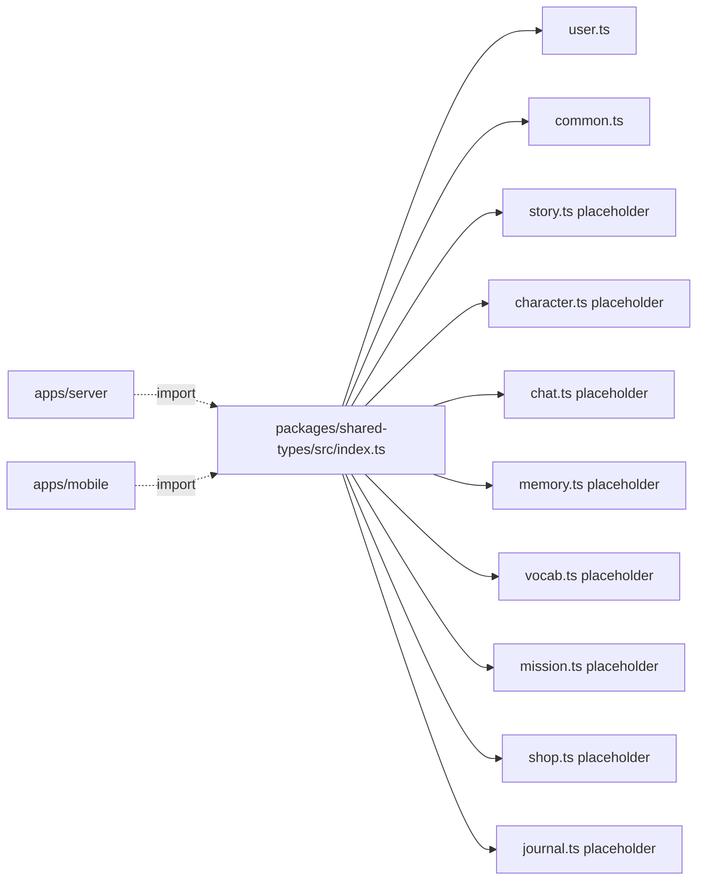
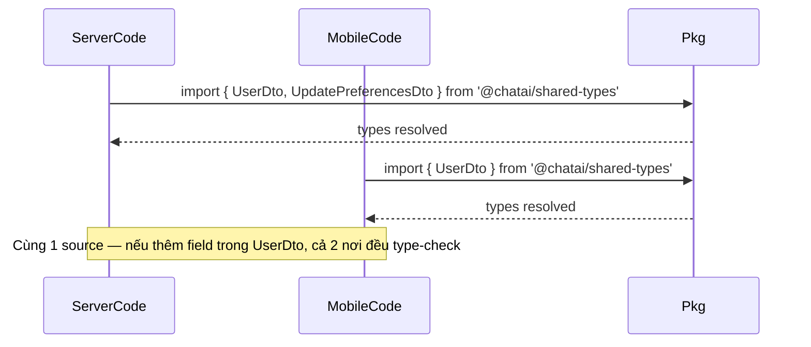

# P01.T7 — Shared Types Package (@chatai/shared-types)

## 1. METADATA

| Field | Value |
|-------|-------|
| Task ID | P01.T7 |
| Tên task | Tạo package `@chatai/shared-types` cho DTOs đồng bộ client-server |
| Phase | 1 |
| Depends on | P01.T3 |
| Complexity | Low |
| Risk | Low |

---

## 2. MỤC TIÊU & SCOPE

**In-scope**:
- Package `packages/shared-types/` exposing types qua `workspace:*`.
- Types ban đầu (cho Phase 1): User, Preferences, ErrorResponse, PaginatedResponse, Result.
- Placeholder cho Story, Character, Chat, Memory, Vocab, Mission, Shop, Journal (chỉ stub).
- Server và mobile import được không lỗi.

**Out-of-scope**:
- Runtime validation (Zod schemas) — có thể thêm trong package `prompts` sau.

---

## 3. FILES CẦN TẠO

| # | Path | Loại |
|---|------|------|
| 1 | `packages/shared-types/package.json` | config |
| 2 | `packages/shared-types/tsconfig.json` | config |
| 3 | `packages/shared-types/src/index.ts` | barrel |
| 4 | `packages/shared-types/src/user.ts` | types |
| 5 | `packages/shared-types/src/story.ts` | placeholder |
| 6 | `packages/shared-types/src/character.ts` | placeholder |
| 7 | `packages/shared-types/src/chat.ts` | placeholder |
| 8 | `packages/shared-types/src/memory.ts` | placeholder |
| 9 | `packages/shared-types/src/vocab.ts` | placeholder |
| 10 | `packages/shared-types/src/mission.ts` | placeholder |
| 11 | `packages/shared-types/src/shop.ts` | placeholder |
| 12 | `packages/shared-types/src/journal.ts` | placeholder |
| 13 | `packages/shared-types/src/common.ts` | types |
| 14 | `apps/server/package.json` | sửa: deps |
| 15 | `apps/mobile/package.json` | sửa: deps |

---

## 4. STRUCTURE DIAGRAM



Không có class. Pure type definitions.

---

## 5. CHI TIẾT TYPE SPEC

### 5.1. `common.ts`

```
type ErrorResponse = {
  error: {
    code: string
    message: string
    details?: unknown
  }
}

type PaginatedResponse<T> = {
  items: T[]
  nextCursor?: string
}

type Result<T, E = ErrorResponse> =
  | { ok: true; value: T }
  | { ok: false; error: E }

type Timestamp = number  // epoch ms
type ISODate = string
```

### 5.2. `user.ts`

```
type HskLevel = 'HSK1'|'HSK2'|'HSK3'|'HSK4'|'HSK5'|'HSK6'
type NarratorLanguage = 'vi'|'en'|'zh'

type Preferences = {
  narratorLanguage: NarratorLanguage
  showPinyin: boolean
  ttsSpeed: number  // 0.75..1.25
}

type UserDto = {
  uid: string
  email: string
  displayName: string
  photoURL: string
  hskLevel: HskLevel
  preferences: Preferences
  gems: number
  currentStreak: number
  highestStreak: number
  streakFreezeCount: number
  tutorialStep: number
}

type UpdatePreferencesDto = Partial<{
  narratorLanguage: NarratorLanguage
  showPinyin: boolean
  ttsSpeed: number
  hskLevel: HskLevel
}>
```

### 5.3. Placeholder files

Mỗi file (`story.ts`, `character.ts`, `chat.ts`...) tạm:
```
// Phase X — types will be defined when feature lands
export {}
```

### 5.4. `index.ts` (barrel)

```
export * from './common'
export * from './user'
export * from './story'
export * from './character'
export * from './chat'
export * from './memory'
export * from './vocab'
export * from './mission'
export * from './shop'
export * from './journal'
```

### 5.5. `package.json`

```
{
  "name": "@chatai/shared-types",
  "version": "0.0.0",
  "private": true,
  "main": "./src/index.ts",
  "types": "./src/index.ts",
  "exports": {
    ".": "./src/index.ts"
  }
}
```

(Không build; tsx/ts-node và Metro đều resolve trực tiếp.)

### 5.6. `tsconfig.json`

```
{
  "extends": "../../tsconfig.base.json",
  "compilerOptions": {
    "outDir": "dist",
    "rootDir": "src",
    "composite": true,
    "declaration": true
  },
  "include": ["src/**/*"]
}
```

### 5.7. Server `package.json` add

```
"dependencies": {
  "@chatai/shared-types": "workspace:*"
}
```

### 5.8. Mobile `package.json` add

Same.

(Metro requires `watchFolders` config include `packages/`; default Expo monorepo template handle via `expo-monorepo` or manual `metro.config.js` `watchFolders` + `resolver.nodeModulesPaths`.)

---

## 6. INTERACTION DIAGRAM



---

## 7. ACCEPTANCE & TEST PLAN

### Acceptance
- [ ] `pnpm install` thêm `@chatai/shared-types` vào server + mobile.
- [ ] Server file import `UserDto` không lỗi (`tsc --noEmit` pass).
- [ ] Mobile file import `UserDto` không lỗi (Metro bundler + `tsc --noEmit`).
- [ ] Sửa field trong `user.ts` (e.g. thêm `lastActiveAt: Timestamp`) → server + mobile cùng báo lỗi nơi đang dùng (chứng minh shared).
- [ ] No circular deps.

### Manual
1. Add field, restart Metro → mobile compile lại; restart `nest start --watch` → server compile lại; cả hai compile error nếu chưa cập nhật code dùng.
2. `pnpm --filter @chatai/shared-types build` (nếu cần) → success.
