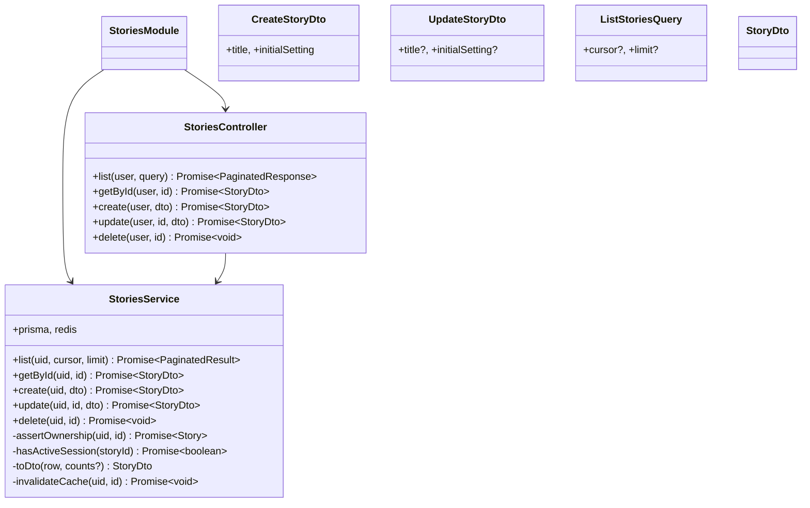
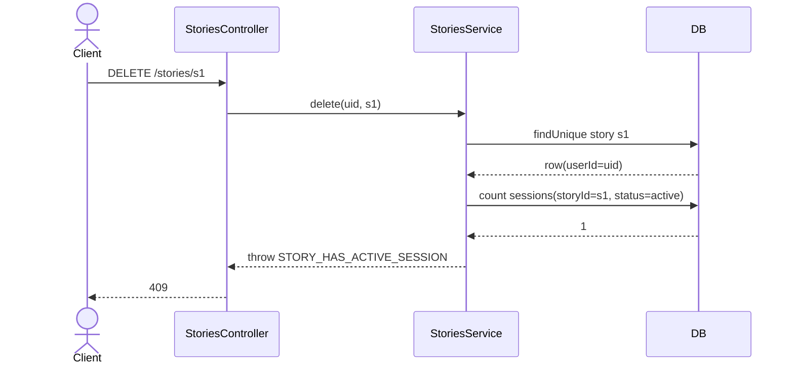
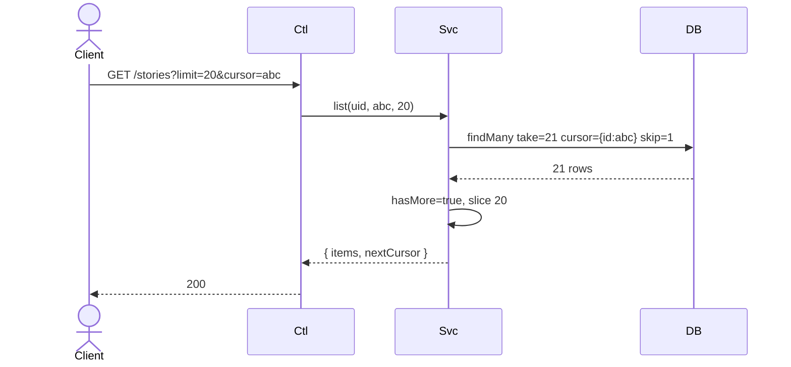

# P02.T2 — Server StoriesModule (CRUD)

## 1. METADATA

| Field | Value |
|-------|-------|
| Task ID | P02.T2 |
| Phase | 2 |
| Depends on | P02.T1 |
| Complexity | Medium |
| Risk | Medium (ownership enforcement) |

---

## 2. MỤC TIÊU & SCOPE

**In-scope**:
- `StoriesModule` với 5 endpoints:
  - `GET /stories` (cursor-paginated, current user only).
  - `GET /stories/:id`.
  - `POST /stories`.
  - `PATCH /stories/:id`.
  - `DELETE /stories/:id` (chặn nếu có session active).
- `StoriesService` với ownership check + cache invalidate.
- DTOs.

**Out-of-scope**:
- Characters (T3).
- Session check chỉ skeleton — chưa có bảng Session (sẽ ở P4); tạm dùng raw query hoặc try/catch nếu Prisma type chưa có. Khuyến nghị: viết check qua method `hasActiveSession` mock return false ở phase này, refactor real ở P04.T7.

---

## 3. FILES CẦN TẠO

| # | Path | Loại |
|---|------|------|
| 1 | `apps/server/src/modules/stories/stories.module.ts` | module |
| 2 | `apps/server/src/modules/stories/stories.controller.ts` | controller |
| 3 | `apps/server/src/modules/stories/stories.service.ts` | service |
| 4 | `apps/server/src/modules/stories/dto/create-story.dto.ts` | dto |
| 5 | `apps/server/src/modules/stories/dto/update-story.dto.ts` | dto |
| 6 | `apps/server/src/modules/stories/dto/story-response.dto.ts` | dto |
| 7 | `apps/server/src/modules/stories/dto/list-stories.query.ts` | query dto |
| 8 | `apps/server/src/modules/stories/*.spec.ts` | tests |

---

## 4. CLASS DIAGRAM



---

## 5. CHI TIẾT CLASS

### 5.1. DTOs

#### `CreateStoryDto`
```
class CreateStoryDto {
  @IsString() @IsNotEmpty() @MaxLength(100) title: string
  @IsString() @IsNotEmpty() @MaxLength(5000) initialSetting: string
}
```

#### `UpdateStoryDto`
```
class UpdateStoryDto {
  @IsOptional() @IsString() @MaxLength(100) title?: string
  @IsOptional() @IsString() @MaxLength(5000) initialSetting?: string
}
```

#### `ListStoriesQuery`
```
class ListStoriesQuery {
  @IsOptional() @IsString() cursor?: string  // story.id
  @IsOptional() @Type(()=>Number) @IsInt() @Min(1) @Max(50) limit?: number = 20
}
```

#### `StoryDto` (response)
```
{
  id, title, initialSetting, currentProgress,
  characterCount: number, sessionCount: number,
  createdAt: ISO string, updatedAt: ISO string
}
```

---

### 5.2. `StoriesService`

#### `list(uid, cursor?, limit)`
```
list(uid: string, cursor: string | undefined, limit: number): Promise<{ items: StoryDto[]; nextCursor?: string }>

Logic:
  1. rows = prisma.story.findMany({
       where: { userId: uid },
       take: limit + 1,
       cursor: cursor ? { id: cursor } : undefined,
       skip: cursor ? 1 : 0,
       orderBy: { updatedAt: 'desc' },
       include: { _count: { select: { characters: true, sessions: true } } }
     })
  2. hasMore = rows.length > limit
  3. items = (hasMore ? rows.slice(0,limit) : rows).map(toDto)
  4. nextCursor = hasMore ? items[items.length-1].id : undefined
  5. return { items, nextCursor }
```

#### `getById(uid, id)`
```
getById(uid, id): Promise<StoryDto>

Logic:
  - row = await assertOwnership(uid, id) [include _count]
  - return toDto(row)
```

#### `create(uid, dto)`
```
create(uid: string, dto: CreateStoryDto): Promise<StoryDto>

Logic:
  - row = prisma.story.create({ data: { userId: uid, title: dto.title, initialSetting: dto.initialSetting } })
  - await invalidateCache(uid, null)
  - return toDto(row, { characters: 0, sessions: 0 })

Side: DB insert, Redis del list cache.
```

#### `update(uid, id, dto)`
```
update(uid, id, dto): Promise<StoryDto>

Logic:
  1. await assertOwnership(uid, id)
  2. updated = prisma.story.update({ where: { id }, data: dto, include: { _count: ... } })
  3. await invalidateCache(uid, id)
  4. return toDto(updated)
```

#### `delete(uid, id)`
```
delete(uid, id): Promise<void>

Logic:
  1. await assertOwnership(uid, id)
  2. if await hasActiveSession(id) → throw AppException(ERR.STORY_HAS_ACTIVE_SESSION)
  3. await prisma.story.delete({ where: { id } })  // cascade characters + sessions
  4. await invalidateCache(uid, id)
```

#### `assertOwnership(uid, id)`
```
assertOwnership(uid, id): Promise<Story>

Logic:
  - row = await prisma.story.findUnique({ where: { id }, include: { _count: { characters, sessions } } })
  - if !row → throw NOT_FOUND
  - if row.userId !== uid → throw FORBIDDEN
  - return row
```

#### `hasActiveSession(storyId)`
```
hasActiveSession(storyId: string): Promise<boolean>

Logic (P02 placeholder):
  - try {
      count = await prisma.session.count({ where: { storyId, status: 'active' } })
      return count > 0
    } catch (e) {
      // Session table chưa tồn tại ở phase 2 → return false
      return false
    }
(P04.T7 sẽ remove try/catch khi Session table đã có.)
```

#### `toDto(row, counts?)`
Trivial mapping: include createdAt/updatedAt.toISOString().

#### `invalidateCache(uid, id?)`
```
- await redis.del(`cache:story:list:${uid}`)
- if id: await redis.del(`cache:story:${id}`)
```

---

### 5.3. `StoriesController`

```
@Controller('stories')
class StoriesController {
  @Get()
  list(@CurrentUser() u, @Query() q): Promise<PaginatedResponse<StoryDto>>

  @Get(':id')
  getById(@CurrentUser() u, @Param('id') id): Promise<StoryDto>

  @Post()
  create(@CurrentUser() u, @Body() dto: CreateStoryDto): Promise<StoryDto>

  @Patch(':id')
  update(@CurrentUser() u, @Param('id') id, @Body() dto: UpdateStoryDto): Promise<StoryDto>

  @Delete(':id') @HttpCode(204)
  delete(@CurrentUser() u, @Param('id') id): Promise<void>
}
```

---

## 6. SEQUENCE DIAGRAMS

### 6.1. DELETE story with active session



### 6.2. List with cursor



---

## 7. ACCEPTANCE & TEST PLAN

### Acceptance
- [ ] POST /stories tạo row + return DTO.
- [ ] GET /stories trả pagination shape.
- [ ] PATCH update title persist.
- [ ] DELETE story không có session → cascade characters.
- [ ] DELETE story User A từ token User B → 403.
- [ ] GET /stories/:id của user khác → 403.
- [ ] Invalid title >100 chars → 400.

### Unit Tests
| Test | Assert |
|------|--------|
| list pagination correct nextCursor | mock findMany |
| create writes DB + invalidates cache | spy |
| assertOwnership throws NOT_FOUND when missing | |
| assertOwnership throws FORBIDDEN when different user | |
| delete throws STORY_HAS_ACTIVE_SESSION when count>0 | mock count |
| hasActiveSession returns false when Session table missing | catch |

### E2E
- Full CRUD with seeded user.
