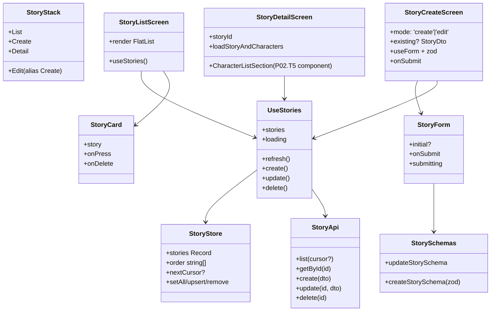
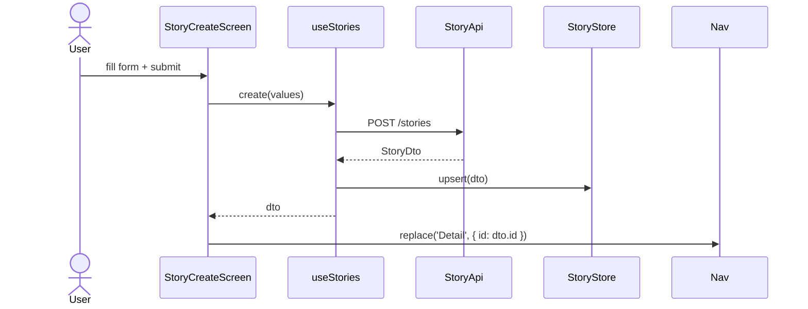

# P02.T4 — Client: StoryListScreen + StoryCreateScreen + StoryDetailScreen

## 1. METADATA

| Field | Value |
|-------|-------|
| Task ID | P02.T4 |
| Phase | 2 |
| Depends on | P02.T2 |
| Complexity | Medium |
| Risk | Low |

---

## 2. MỤC TIÊU & SCOPE

**In-scope**:
- 3 screens: list, create, detail.
- `useStoryStore` (Zustand) cache stories.
- Pull-to-refresh, FAB tạo mới, swipe-to-delete với confirm.
- Form react-hook-form + zod.

**Out-of-scope**:
- Character list trong DetailScreen được render từ `CharactersScreen` (P02.T5 component nesting); ở đây chỉ stub.

---

## 3. FILES CẦN TẠO

| # | Path | Loại |
|---|------|------|
| 1 | `apps/mobile/src/features/story/screens/StoryListScreen.tsx` | screen (replace placeholder) |
| 2 | `apps/mobile/src/features/story/screens/StoryCreateScreen.tsx` | screen |
| 3 | `apps/mobile/src/features/story/screens/StoryDetailScreen.tsx` | screen |
| 4 | `apps/mobile/src/features/story/hooks/useStories.ts` | hook |
| 5 | `apps/mobile/src/features/story/store/story.store.ts` | store |
| 6 | `apps/mobile/src/features/story/services/story.api.ts` | service |
| 7 | `apps/mobile/src/features/story/services/story.schemas.ts` | zod |
| 8 | `apps/mobile/src/features/story/components/StoryCard.tsx` | component |
| 9 | `apps/mobile/src/features/story/components/StoryForm.tsx` | component |
| 10 | `apps/mobile/src/navigation/MainTabNavigator.tsx` | sửa: Stories tab dùng StoryStack |
| 11 | `apps/mobile/src/navigation/StoryStack.tsx` | navigator |
| 12 | `apps/mobile/src/navigation/types.ts` | sửa |

---

## 4. CLASS DIAGRAM



---

## 5. CHI TIẾT MODULE

### 5.1. `StoryApi`
```
list(cursor?: string, limit = 20): Promise<PaginatedResponse<StoryDto>>
  → apiClient.get('/stories', { params: { cursor, limit } })
getById(id): Promise<StoryDto>
  → apiClient.get(`/stories/${id}`)
create(dto): Promise<StoryDto>
  → apiClient.post('/stories', dto)
update(id, dto): Promise<StoryDto>
  → apiClient.patch(`/stories/${id}`, dto)
delete(id): Promise<void>
  → apiClient.delete(`/stories/${id}`)
```

### 5.2. `StorySchemas` (zod)
```
createStorySchema = z.object({
  title: z.string().min(1, 'Bắt buộc').max(100),
  initialSetting: z.string().min(1).max(5000),
})
updateStorySchema = createStorySchema.partial()
```

### 5.3. `StoryStore` (Zustand)

```
State:
  storiesById: Record<string, StoryDto>
  order: string[]            // sorted updatedAt desc
  nextCursor?: string
  loading: boolean

Actions:
  setPage(items, nextCursor, replace: boolean)  
    - replace=true → order = items.map(i=>i.id), storiesById = byId(items)
    - replace=false (loadMore) → append
  upsert(s: StoryDto)        // create/update
  remove(id)
```

### 5.4. `useStories` hook

```
useStories()

Returns: {
  stories: StoryDto[],  // computed from store
  loading,
  refresh(),
  loadMore(),
  create(input),
  update(id, patch),
  delete(id),
}

Logic:
  - stories = useStoryStore(s => s.order.map(id => s.storiesById[id]))
  - refresh: setLoading(true), data = await api.list(undefined, 20), store.setPage(items, nextCursor, true)
  - loadMore: if nextCursor → api.list(nextCursor), setPage(items, ..., false)
  - create: result = await api.create(input); store.upsert(result); return result
  - update: result = await api.update(id, patch); store.upsert(result)
  - delete: await api.delete(id); store.remove(id)
```

### 5.5. `StoryCard`
- Props: `{ story: StoryDto, onPress, onDelete }`
- Layout: title + initialSetting preview 2 lines + counts (👥 {characterCount} / 💬 {sessionCount}) + updatedAt relative.

### 5.6. `StoryForm`
- Props: `{ initial?: { title, initialSetting }, onSubmit, submitting }`
- react-hook-form + zodResolver(createStorySchema).
- Inputs: TextInput title; TextArea initialSetting (multiline 6 dòng).
- Submit button disabled khi !isValid || submitting.

### 5.7. `StoryListScreen`
- Header right: FAB hoặc button "Tạo".
- FlatList:
  - data = stories
  - renderItem: StoryCard
  - refreshControl: pull-to-refresh
  - onEndReached: loadMore
  - swipeable: render right action → confirm Alert → delete.
- Empty: text + button "Tạo Story đầu tiên".

### 5.8. `StoryCreateScreen`
- mode by route param.
- Render StoryForm.
- onSubmit:
  - create: await create(values) → navigation.replace('Detail', { id })
  - edit: await update(id, values) → navigation.goBack()

### 5.9. `StoryDetailScreen`
- params: `{ id }`
- useEffect load detail (api.getById hoặc fallback store).
- Sections:
  - Header: title + edit pencil → navigate Create with mode='edit'.
  - `initialSetting` block.
  - `currentProgress` block (nếu có).
  - "Nhân vật" section → import `CharacterListSection` (sẽ build ở T5).
  - Footer: button "Bắt đầu Chat" (disabled nếu characterCount === 0; sẽ wire P04).

### 5.10. `StoryStack`
```
<Stack.Navigator>
  <Stack.Screen name="List" component={StoryListScreen} />
  <Stack.Screen name="Create" component={StoryCreateScreen} />
  <Stack.Screen name="Detail" component={StoryDetailScreen} />
</Stack.Navigator>
```

`MainTabNavigator.tsx` thay screen Stories: `<Tab.Screen name="Stories" component={StoryStack} />`.

---

## 6. SEQUENCE — Create story



---

## 7. ACCEPTANCE & TEST PLAN

### Acceptance
- [ ] Tab Stories → List trống → "Tạo Story đầu tiên".
- [ ] Tạo story → đi tới Detail.
- [ ] Pull refresh → fetch lại từ server.
- [ ] Swipe delete → confirm → mất khỏi list.
- [ ] Edit story → form prefill, save → Detail update.
- [ ] Detail "Bắt đầu Chat" disabled khi chưa có char.
- [ ] Submit form invalid (title rỗng) → error inline.

### Tests
| Test | Assert |
|------|--------|
| zod createStorySchema rejects empty title | parse fails |
| useStories.create updates store | store.upsert called |
| StoryCard renders counts | snapshot |

### Manual
1. Đóng app, mở lại → list refresh từ server (không phụ thuộc cache cũ — cache chỉ optimistic).
2. Mạng chậm → loading indicator.
