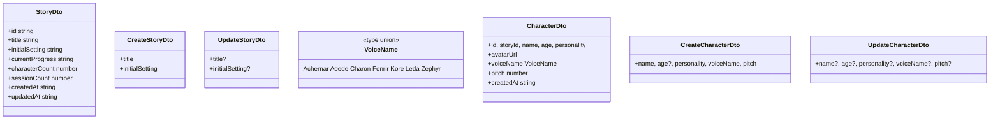
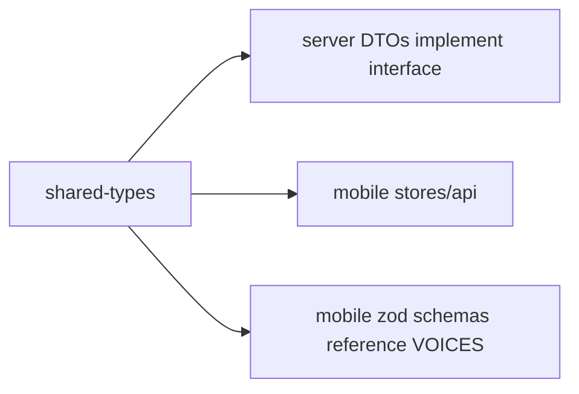

# P02.T6 — Shared Types Update: Story + Character

## 1. METADATA

| Field | Value |
|-------|-------|
| Task ID | P02.T6 |
| Phase | 2 |
| Depends on | P02.T3 |
| Complexity | Low |
| Risk | Low |

---

## 2. MỤC TIÊU & SCOPE

**In-scope**:
- Điền nội dung cho `story.ts` và `character.ts` trong `@chatai/shared-types`.
- Đảm bảo server DTO và mobile types đồng bộ.

---

## 3. FILES CẦN SỬA

| # | Path |
|---|------|
| 1 | `packages/shared-types/src/story.ts` |
| 2 | `packages/shared-types/src/character.ts` |
| 3 | `packages/shared-types/src/index.ts` (no change nếu barrel đã wildcard) |

---

## 4. TYPE STRUCTURE



---

## 5. SPEC CHI TIẾT

### 5.1. `story.ts`

```
type StoryDto = {
  id: string
  title: string
  initialSetting: string
  currentProgress: string
  characterCount: number
  sessionCount: number
  createdAt: string
  updatedAt: string
}

type CreateStoryDto = {
  title: string
  initialSetting: string
}

type UpdateStoryDto = Partial<CreateStoryDto>
```

### 5.2. `character.ts`

```
const VOICES = ['Achernar','Aoede','Charon','Fenrir','Kore','Leda','Zephyr'] as const
type VoiceName = (typeof VOICES)[number]

type CharacterDto = {
  id: string
  storyId: string
  name: string
  age: number | null
  personality: string
  avatarUrl: string | null
  voiceName: VoiceName
  pitch: number
  createdAt: string
}

type CreateCharacterDto = {
  name: string
  age?: number
  personality: string
  voiceName: VoiceName
  pitch: number
}

type UpdateCharacterDto = Partial<CreateCharacterDto>
```

### 5.3. Refactor server DTOs to extend shared

Server `create-story.dto.ts`: import `CreateStoryDto as ICreateStoryDto` từ shared. Class vẫn dùng decorators validation, nhưng class implements interface để đảm bảo shape đồng bộ:

```
class CreateStoryDto implements ICreateStoryDto {
  @IsString() @MaxLength(100) title: string
  @IsString() @MaxLength(5000) initialSetting: string
}
```

Cùng pattern với `CreateCharacterDto` (import VoiceName + VOICES).

### 5.4. Mobile imports

`character.api.ts`, `story.api.ts`, stores → import từ `@chatai/shared-types` thay vì define local.

---

## 6. INTERACTION DIAGRAM



---

## 7. ACCEPTANCE & TEST PLAN

### Acceptance
- [ ] Mobile + Server compile không lỗi.
- [ ] Đổi field `title` thành `title2` ở shared → cả 2 nơi đỏ lỗi.
- [ ] VOICES export const từ shared, mobile zod enum dùng cùng nguồn.
- [ ] Server `CreateCharacterDto implements ICreateCharacterDto` — nếu mismatch shape → TS error.

### Tests
- TypeCheck (CI step) là test chính.
