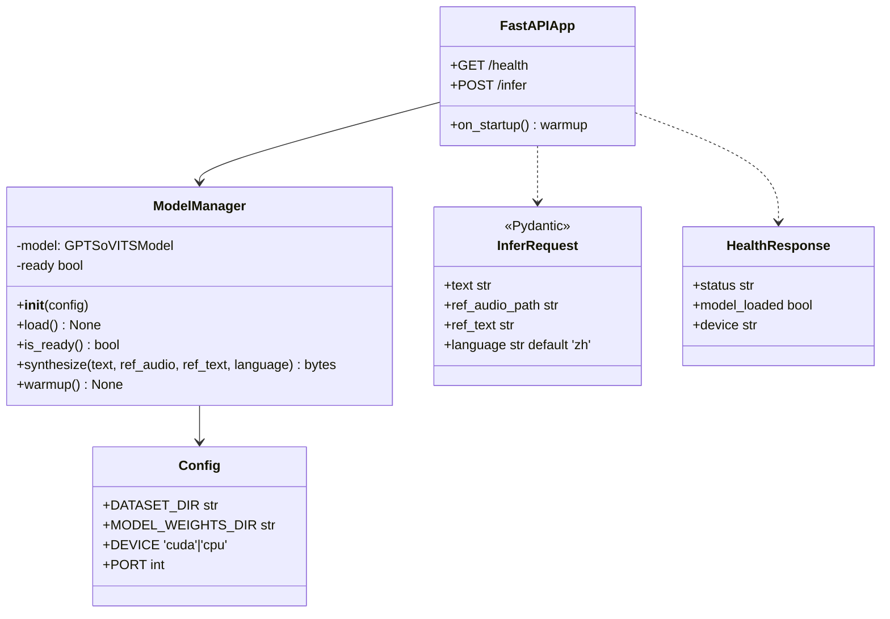
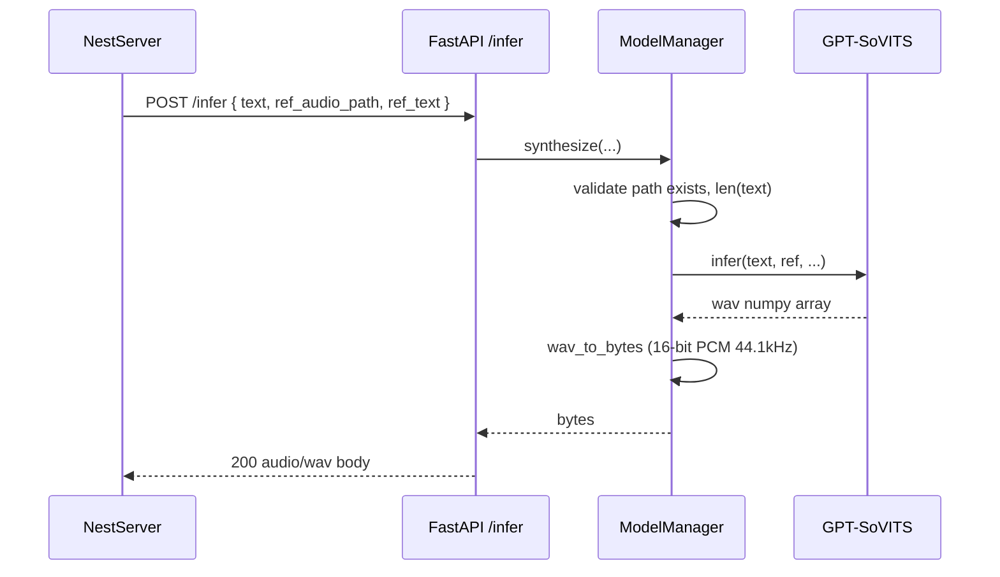

# P03.T1 — GPT-SoVITS Python Wrapper (tts-engine)

## 1. METADATA

| Field | Value |
|-------|-------|
| Task ID | P03.T1 |
| Phase | 3 — TTS |
| Depends on | P02 hoàn thành |
| Complexity | High |
| Risk | High (model weights, GPU) |

---

## 2. MỤC TIÊU & SCOPE

**In-scope**:
- FastAPI wrapper quanh GPT-SoVITS với 2 endpoints: `/health`, `/infer`.
- `ModelManager` quản lý warmup + synthesize.
- Dataset reference audios mount tại `apps/tts-engine/dataset/<VoiceName>/*.wav`.
- Dockerfile (CUDA base).

**Out-of-scope**:
- Pitch adjust (server FFmpeg ở T2).
- Cache (T2).

---

## 3. FILES CẦN TẠO

| # | Path | Loại |
|---|------|------|
| 1 | `apps/tts-engine/app.py` | FastAPI app |
| 2 | `apps/tts-engine/model_manager.py` | model class |
| 3 | `apps/tts-engine/schemas.py` | Pydantic models |
| 4 | `apps/tts-engine/config.py` | env loader |
| 5 | `apps/tts-engine/requirements.txt` | deps |
| 6 | `apps/tts-engine/Dockerfile` | container |
| 7 | `apps/tts-engine/.env.example` | config template |
| 8 | `apps/tts-engine/README.md` | run instructions |
| 9 | `apps/tts-engine/dataset/<VoiceName>/...` | reference audios (mount or copy) |

---

## 4. CLASS DIAGRAM



**Tổng**: 1 app + 1 model class + 2 schemas + 1 config = 5 đơn vị.

---

## 5. CHI TIẾT MODULE

### 5.1. `Config`

```
DATASET_DIR = os.getenv('TTS_DATASET_DIR', '/app/dataset')
MODEL_WEIGHTS_DIR = os.getenv('TTS_MODEL_DIR', '/app/models')
DEVICE = os.getenv('TTS_DEVICE', 'cuda' if torch.cuda.is_available() else 'cpu')
PORT = int(os.getenv('TTS_PORT', 5000))
LOG_LEVEL = os.getenv('LOG_LEVEL', 'INFO')
```

### 5.2. `ModelManager`

```
class ModelManager:
  __init__(self, config: Config):
    self.config = config
    self.model = None
    self.ready = False
    self.logger = logging.getLogger(__name__)

  load(self) -> None:
    Logic:
      1. Import GPT-SoVITS pipeline lib
      2. Load model weights từ self.config.MODEL_WEIGHTS_DIR
      3. Move to device
      4. self.warmup()
      5. self.ready = True

  is_ready(self) -> bool:
    return self.ready

  synthesize(self, text: str, ref_audio_path: str, ref_text: str, language: str = 'zh') -> bytes:
    Input validation:
      - if not os.path.exists(ref_audio_path) → raise HTTPException 404 REFERENCE_NOT_FOUND
      - if len(text) > 500 → raise HTTPException 400
      - if not self.ready → raise HTTPException 503
    Logic:
      1. result_wav = self.model.infer(text=text, ref_audio=ref_audio_path, ref_text=ref_text, language=language)
      2. buffer = wav_to_bytes(result_wav, sample_rate=44100)
      3. return buffer

  warmup(self) -> None:
    sample_ref = pick_first_wav(self.config.DATASET_DIR + '/Achernar')
    sample_text = "你好"
    _ = self.model.infer(text=sample_text, ref_audio=sample_ref, ref_text="测试", language='zh')
```

### 5.3. `schemas.py`

```
class InferRequest(BaseModel):
  text: str = Field(..., max_length=500)
  ref_audio_path: str
  ref_text: str
  language: str = Field('zh', regex='^(zh|en|ja)$')

class HealthResponse(BaseModel):
  status: str
  model_loaded: bool
  device: str
```

### 5.4. `app.py`

```
app = FastAPI(title='chatai-tts-engine', version='0.1.0')
config = Config()
manager = ModelManager(config)

@app.on_event('startup')
async def startup():
  manager.load()

@app.get('/health', response_model=HealthResponse)
async def health():
  return HealthResponse(status='ok', model_loaded=manager.is_ready(), device=config.DEVICE)

@app.post('/infer')
async def infer(req: InferRequest):
  audio_bytes = manager.synthesize(req.text, req.ref_audio_path, req.ref_text, req.language)
  return Response(content=audio_bytes, media_type='audio/wav')

if __name__ == '__main__':
  uvicorn.run(app, host='0.0.0.0', port=config.PORT)
```

### 5.5. `Dockerfile`

```
FROM pytorch/pytorch:2.1.0-cuda11.8-cudnn8-runtime
WORKDIR /app
RUN apt-get update && apt-get install -y ffmpeg libsndfile1 && rm -rf /var/lib/apt/lists/*
COPY requirements.txt .
RUN pip install --no-cache-dir -r requirements.txt
COPY . .
ENV PYTHONUNBUFFERED=1
EXPOSE 5000
CMD ["uvicorn", "app:app", "--host", "0.0.0.0", "--port", "5000"]
```

### 5.6. `requirements.txt`

```
fastapi==0.111.0
uvicorn[standard]==0.30.0
pydantic==2.7.0
python-multipart
numpy
torch>=2.1.0
torchaudio
# GPT-SoVITS specific (theo repo gốc): librosa, scipy, soundfile, transformers, ...
```

---

## 6. SEQUENCE — Inference



---

## 7. ACCEPTANCE & TEST PLAN

### Acceptance
- [ ] `docker build` success.
- [ ] Container start → `/health` 200 với `model_loaded: true` (sau warmup).
- [ ] `POST /infer` với ref path tồn tại → trả WAV bytes phát được.
- [ ] `POST /infer` với ref path không tồn tại → 404.
- [ ] `POST /infer` text > 500 chars → 400.
- [ ] Concurrent 4 requests → tất cả thành công (model handle queue nội bộ).

### Tests
- pytest cho schemas validation (`test_schemas.py`).
- Manual integration: real GPU run.

### Manual
1. `curl -X POST localhost:5000/infer -H 'Content-Type: application/json' -d '{"text":"你好","ref_audio_path":"/app/dataset/Achernar/sample.wav","ref_text":"测试"}' --output out.wav` → play.
2. Resource: GPU memory usage < limit (monitor `nvidia-smi`).
