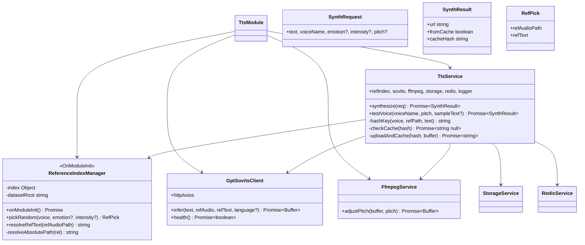
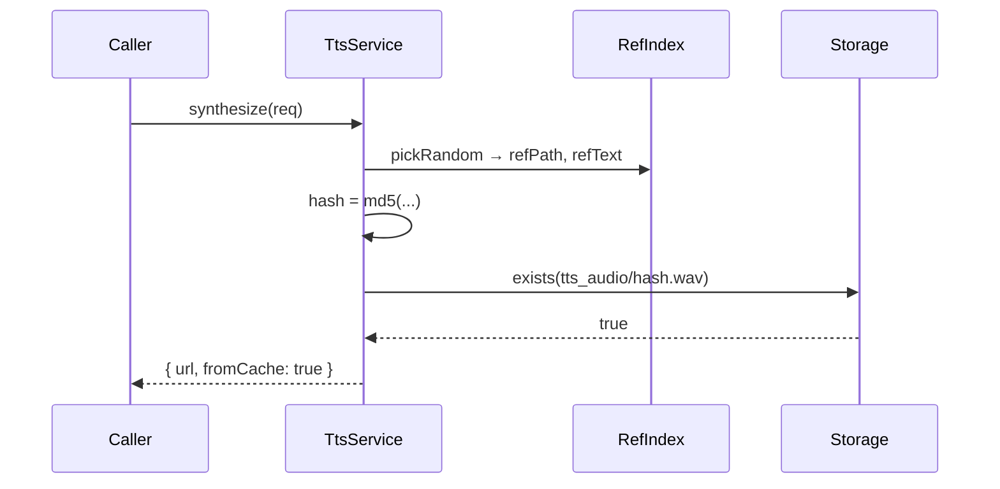
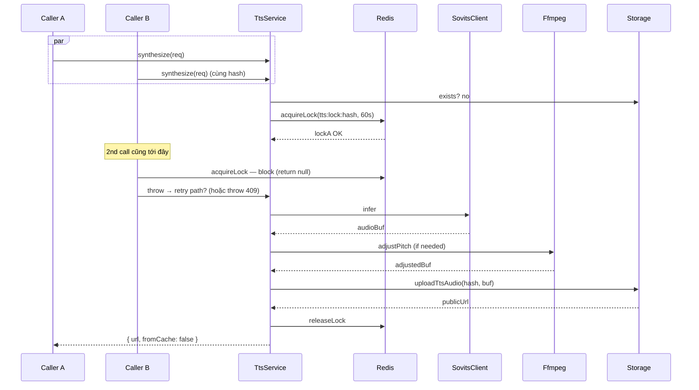

# P03.T2 — Server TtsModule (ReferenceIndex + Cache + FFmpeg)

## 1. METADATA

| Field | Value |
|-------|-------|
| Task ID | P03.T2 |
| Phase | 3 |
| Depends on | P03.T1, P02.T3 |
| Complexity | High |
| Risk | High |

---

## 2. MỤC TIÊU & SCOPE

**In-scope**:
- `ReferenceIndexManager`: load `reference_index.json`, lookup theo (voice, emotion, intensity) with fallback.
- `GptSovitsClient`: HTTP client gọi tts-engine.
- `FfmpegService`: adjust pitch buffer in-memory.
- `TtsService`: orchestrator với cache hash MD5(voice+ref+text) → Firebase Storage `tts_audio/{hash}.wav`, Redis lock chống duplicate.
- `TtsModule` wire up.

**Out-of-scope**:
- Controller (T3).

---

## 3. FILES CẦN TẠO

| # | Path | Loại |
|---|------|------|
| 1 | `apps/server/src/modules/tts/tts.module.ts` | module |
| 2 | `apps/server/src/modules/tts/tts.service.ts` | service |
| 3 | `apps/server/src/modules/tts/reference-index.manager.ts` | provider |
| 4 | `apps/server/src/modules/tts/gptsovits.client.ts` | service |
| 5 | `apps/server/src/modules/tts/ffmpeg.service.ts` | service |
| 6 | `apps/server/src/modules/tts/tts.constants.ts` | const (emotion enum, etc.) |
| 7 | `apps/server/src/shared/firebase/storage.service.ts` | sửa: thêm `uploadTtsAudio`, `exists`, `getSignedUrl` |
| 8 | `apps/server/src/modules/tts/*.spec.ts` | tests |

---

## 4. CLASS DIAGRAM



---

## 5. CHI TIẾT CLASS

### 5.1. `ReferenceIndexManager`

**Decorator**: `@Injectable()` + implements `OnModuleInit`.

**State**:
- `index: ReferenceIndex` (typed từ `@chatai/prompts`).
- `datasetRoot: string` (env `TTS_DATASET_ABS_PATH`).

#### `onModuleInit()`
```
- import { referenceIndex } from '@chatai/prompts'
- this.index = referenceIndex
- this.datasetRoot = config.get('ttsDatasetAbsPath')
- log voices loaded count
```

#### `pickRandom(voice, emotion?, intensity?)`
```
pickRandom(voice: VoiceName, emotion: Emotion = 'Neutral', intensity: Intensity = 'medium'): RefPick

Logic:
  1. voiceBlock = this.index[voice]
     if (!voiceBlock) throw new AppException(ERR.REFERENCE_NOT_FOUND, voice)
  2. emoBlock = voiceBlock[emotion] ?? voiceBlock['Neutral']
  3. intensityList = emoBlock[intensity] ?? emoBlock['medium'] ?? Object.values(emoBlock)[0]
     if (!intensityList || intensityList.length === 0) throw REFERENCE_NOT_FOUND
  4. fileRel = intensityList[Math.floor(Math.random() * intensityList.length)]
  5. refAudioPath = path.join(this.datasetRoot, voice, fileRel)
  6. refText = this.resolveRefText(refAudioPath)
  7. return { refAudioPath, refText }
```

#### `resolveRefText(refAudioPath)`
```
Logic:
  - companion = refAudioPath.replace(/\.wav$/, '.txt')
  - if fs.existsSync(companion) → return fs.readFileSync(companion, 'utf8').trim()
  - else: derive from filename: path.basename(refAudioPath, '.wav').replace(/_/g, ' ')
```

---

### 5.2. `GptSovitsClient`

#### Constructor
- `axios.create({ baseURL: config.get('ttsEngineUrl'), timeout: 30000, responseType: 'arraybuffer' })`

#### `infer(text, refAudio, refText, language='zh')`
```
infer(text: string, refAudioPath: string, refText: string, language = 'zh'): Promise<Buffer>

Logic:
  1. try {
       res = await axios.post('/infer', { text, ref_audio_path: refAudioPath, ref_text: refText, language })
     } catch (e) {
       if e.code === 'ECONNREFUSED' || timeout → throw AppException(ERR.TTS_ENGINE_DOWN)
       if e.response?.status === 404 → throw AppException(ERR.REFERENCE_NOT_FOUND)
       throw AppException(ERR.TTS_ENGINE_DOWN, e.message)
     }
  2. return Buffer.from(res.data)

Retry: 1 lần với delay 1s nếu lỗi network (không retry nếu 4xx).
```

#### `health()`
```
Logic: try { res = await axios.get('/health'); return res.data.model_loaded === true } catch { return false }
```

---

### 5.3. `FfmpegService`

**Tech**: `fluent-ffmpeg` (cài `@types/fluent-ffmpeg`) hoặc `child_process.spawn('ffmpeg', ...)` — chọn spawn để control buffer.

#### `adjustPitch(buffer, pitch)`
```
adjustPitch(buffer: Buffer, pitch: number): Promise<Buffer>

Logic:
  1. if pitch === 1.0 → return buffer (no-op)
  2. spawn ffmpeg với args:
     ['-i', 'pipe:0', '-af', `asetrate=44100*${pitch},aresample=44100`, '-f', 'wav', 'pipe:1']
  3. ghi buffer vào stdin, đóng
  4. collect stdout chunks → Buffer.concat
  5. on exit code 0 → resolve; else reject
  6. timeout 10s → kill + reject

Throws: throw AppException(ERR.TTS_ENGINE_DOWN, 'ffmpeg failed') on error
```

---

### 5.4. `StorageService` extension

Thêm methods:

#### `uploadTtsAudio(cacheHash, buffer)`
```
Logic:
  - path = `tts_audio/${cacheHash}.wav`
  - file = bucket.file(path)
  - await file.save(buffer, { contentType: 'audio/wav', resumable: false, metadata: { cacheControl: 'public, max-age=2592000' } })
  - return { publicUrl: `https://storage.googleapis.com/${bucket.name}/${path}`, storagePath: path }
Note: tts_audio không cần signed URL nếu rules cho phép read auth — public via Firebase Storage CDN.
```

#### `exists(path)`
```
Logic: [exists] = await bucket.file(path).exists(); return exists
```

#### `getSignedUrl(path, expiresMs)`
```
Logic: [url] = await bucket.file(path).getSignedUrl({ action:'read', expires: Date.now() + expiresMs }); return url
```

---

### 5.5. `TtsService`

**Constructor inject**: refIndex, sovits, ffmpeg, storage, redis, logger.

#### `synthesize(req)`
```
synthesize(req: { text, voiceName, emotion?, intensity?, pitch? }): Promise<SynthResult>

Logic:
  1. emotion = req.emotion ?? 'Neutral'
  2. intensity = req.intensity ?? 'medium'
  3. pitch = req.pitch ?? 1.0
  4. pick = refIndex.pickRandom(req.voiceName, emotion, intensity)
  5. hash = hashKey(req.voiceName, pick.refAudioPath, req.text, pitch)
     (include pitch in hash để cache theo pitch riêng)
  6. cachedUrl = await checkCache(hash)
  7. if cachedUrl → return { url: cachedUrl, fromCache: true, cacheHash: hash }
  8. // Cache miss — acquire lock to avoid duplicate infer
     return await redis.withLock(`tts:lock:${hash}`, 60_000, async () => {
       // Double-check after lock (another req may have populated)
       cached2 = await checkCache(hash)
       if (cached2) return { url: cached2, fromCache: true, cacheHash: hash }
       audioBuf = await sovits.infer(req.text, pick.refAudioPath, pick.refText, 'zh')
       if (pitch !== 1.0) audioBuf = await ffmpeg.adjustPitch(audioBuf, pitch)
       url = await uploadAndCache(hash, audioBuf)
       return { url, fromCache: false, cacheHash: hash }
     })
```

#### `hashKey(voice, refPath, text, pitch)`
```
return crypto.createHash('md5').update(`${voice}|${refPath}|${text}|${pitch}`).digest('hex')
```

#### `checkCache(hash)`
```
Logic:
  - path = `tts_audio/${hash}.wav`
  - if !(await storage.exists(path)) → return null
  - return `https://storage.googleapis.com/${bucket}/${path}` (public read via rules)
```

#### `uploadAndCache(hash, buffer)`
```
Logic:
  - { publicUrl } = await storage.uploadTtsAudio(hash, buffer)
  - return publicUrl
```

#### `testVoice(voiceName, pitch, sampleText?)`
```
Logic:
  - text = sampleText ?? '你好，很高兴认识你'
  - return await synthesize({ text, voiceName, emotion: 'Neutral', intensity: 'medium', pitch })
```

---

### 5.6. `tts.constants.ts`

```
EMOTIONS = ['Angry','Shouting','Disgusted','Sad','Scared','Surprised','Shy','Affectionate','Happy','Excited','Serious','Neutral'] as const
INTENSITIES = ['low','medium','high'] as const

type Emotion = (typeof EMOTIONS)[number]
type Intensity = (typeof INTENSITIES)[number]
```

---

## 6. SEQUENCE DIAGRAMS

### 6.1. Cache hit



### 6.2. Cache miss with lock



**Note**: Vì 2 caller cùng hash → caller B nên RETRY check cache sau 1s thay vì throw. TtsService có thể implement `awaitLock` pattern: nếu acquireLock null → sleep + check cache again, lặp max 3 lần. Để đơn giản, ban đầu throw 409 và để client retry.

---

## 7. ACCEPTANCE & TEST PLAN

### Acceptance
- [ ] 2 synthesize cùng params → call 1 lần GPT-SoVITS, lần 2 trả cached.
- [ ] Pitch 1.0 vs 1.2 → 2 cache entries riêng.
- [ ] tts-engine down → AppException TTS_ENGINE_DOWN.
- [ ] Voice 'XYZ' → REFERENCE_NOT_FOUND.
- [ ] Emotion 'Happy' không có entries → fallback Neutral.

### Unit Tests
| Test | Assert |
|------|--------|
| pickRandom fallback to Neutral when emotion missing | |
| pickRandom throws when voice missing | REFERENCE_NOT_FOUND |
| hashKey deterministic | same input → same hash |
| FfmpegService.adjustPitch returns different bytes when pitch≠1 | |
| GptSovitsClient.infer maps timeout to TTS_ENGINE_DOWN | |
| TtsService cache hit skips infer | spy infer not called |
| TtsService double-check after lock | covers race |

### Integration
- Real Redis + Storage emulator + mock infer → end-to-end synthesize.
