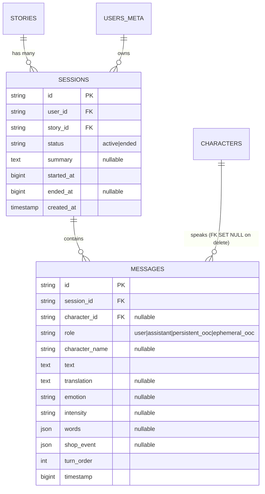
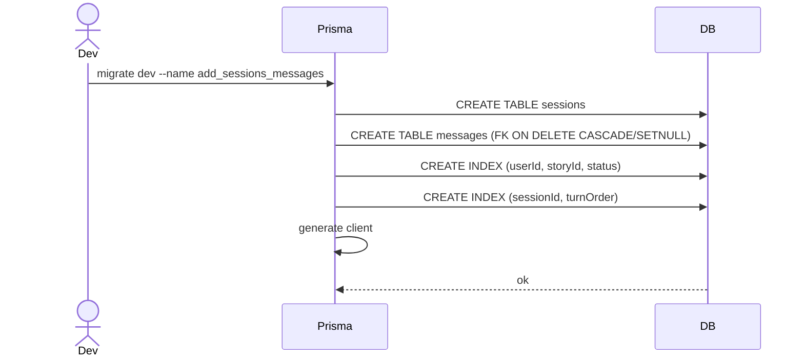

# P04.T1 — DB: Sessions + Messages

## 1. METADATA

| Field | Value |
|-------|-------|
| Task ID | P04.T1 |
| Phase | 4 — Chat MVP |
| Depends on | P03 hoàn thành (P02.T1 cho relations) |
| Complexity | Medium |
| Risk | Medium |

---

## 2. MỤC TIÊU & SCOPE

**In-scope**:
- Thêm `Session` + `Message` Prisma models.
- Update `UsersMeta` (`sessions Session[]`), `Story` (`sessions Session[]`), `Character` (`messages Message[]`) relations.
- Migration `add_sessions_messages`.

**Out-of-scope**:
- Service / controller (T2..T7).

---

## 3. FILES CẦN SỬA / TẠO

| # | Path |
|---|------|
| 1 | `apps/server/prisma/schema.prisma` |
| 2 | `apps/server/prisma/migrations/<ts>_add_sessions_messages/migration.sql` |

---

## 4. ERD

---

## 5. SCHEMA SPEC

### 5.1. `Session` model

| Field | Type | Constraint |
|-------|------|------------|
| `id` | `String @id @default(uuid())` | PK |
| `userId` | `String @map("user_id")` | FK users_meta.user_id |
| `storyId` | `String @map("story_id")` | FK stories.id, **Cascade** |
| `status` | `String @default("active")` | enum: 'active' \| 'ended' (validated DTO) |
| `summary` | `String? @db.Text` | EndChat output |
| `startedAt` | `BigInt @map("started_at")` | epoch ms |
| `endedAt` | `BigInt? @map("ended_at")` | |
| `createdAt` | `DateTime @default(now())` | |

**Relations**: `user`, `story`, `messages Message[]`.  
**Indexes**: `@@index([userId, storyId, status])` để query "active session cho story này"; `@@index([storyId, status])`.  
**Map**: `@@map("sessions")`.

### 5.2. `Message` model

| Field | Type | Constraint |
|-------|------|------------|
| `id` | `String @id @default(uuid())` | PK |
| `sessionId` | `String @map("session_id")` | FK sessions.id, **Cascade** |
| `characterId` | `String? @map("character_id")` | FK characters.id, **SetNull** |
| `role` | `String` | enum: 'user' \| 'assistant' \| 'persistent_ooc' \| 'ephemeral_ooc' |
| `characterName` | `String? @map("character_name")` | giữ khi character bị xoá |
| `text` | `String @db.Text` | nội dung |
| `translation` | `String? @db.Text` | dịch vi/en (nếu narrator) |
| `emotion` | `String?` | |
| `intensity` | `String?` | |
| `words` | `Json?` | `[{hz,py,vn}]` |
| `shopEvent` | `Json? @map("shop_event")` | |
| `turnOrder` | `Int @map("turn_order")` | order trong session (1-based) |
| `timestamp` | `BigInt` | epoch ms |

**Relations**: `session`, `character`.  
**Indexes**: `@@index([sessionId, turnOrder])` cho query order; `@@index([characterId])`.  
**Map**: `@@map("messages")`.

### 5.3. Updates các models cũ

- `UsersMeta`: thêm `sessions Session[]`.
- `Story`: thêm `sessions Session[]`.
- `Character`: thêm `messages Message[]`.

---

## 6. MIGRATION SEQUENCE

---

## 7. ACCEPTANCE & TEST PLAN

### Acceptance
- [ ] Migration apply success.
- [ ] Cascade: delete session → messages mất; delete character → messages.character_id = NULL nhưng characterName giữ.
- [ ] BigInt fields được serialize correctly (cần custom JSON for Prisma).
- [ ] `prisma studio`: tạo session manual, tạo message → index works.

### Tests
- E2E migration on fresh DB.
- Integration: insert + delete cascade test.
