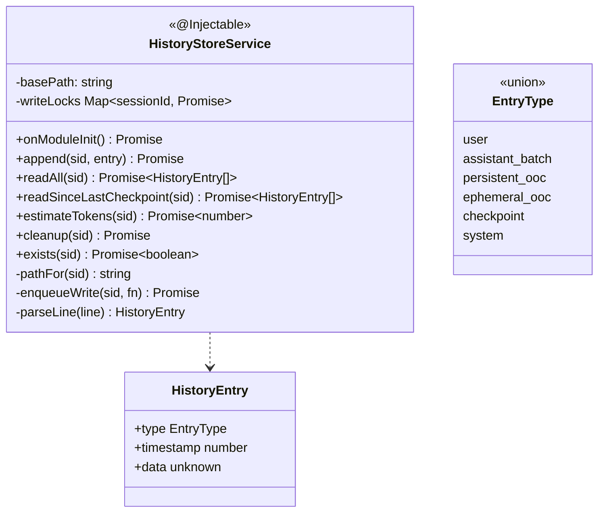
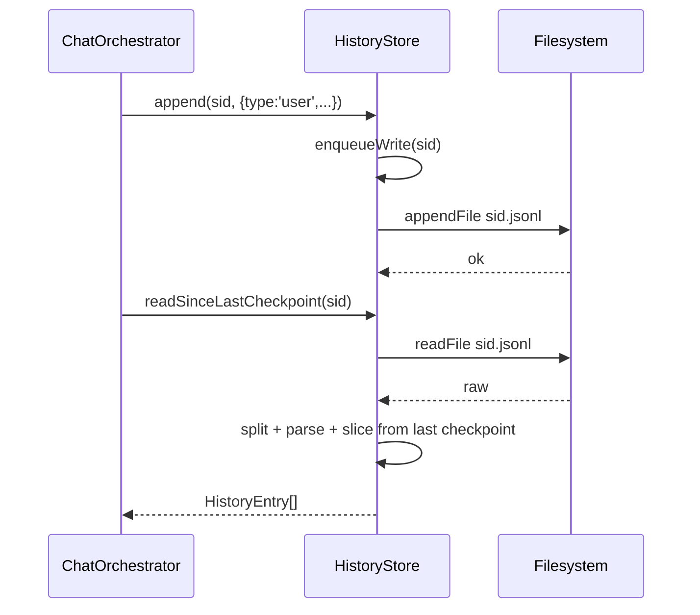

# P04.T2 — HistoryStoreService (.jsonl Adapter)

## 1. METADATA

| Field | Value |
|-------|-------|
| Task ID | P04.T2 |
| Phase | 4 |
| Depends on | P04.T1 |
| Complexity | Medium |
| Risk | Medium (file I/O race) |

---

## 2. MỤC TIÊU & SCOPE

**In-scope**:
- `HistoryStoreService` đọc/ghi `.jsonl` per session.
- Append-only stream; read full / read since last checkpoint.
- Token estimation (đơn giản char/2 cho zh).
- Cleanup khi end chat.
- File path: `<basePath>/<sessionId>.jsonl`.
- Concurrency: dùng async fs + sequential ghi qua queue per session (mutex).

**Out-of-scope**:
- Checkpoint write (P06).
- Memory triggers (P08).

---

## 3. FILES CẦN TẠO

| # | Path | Loại |
|---|------|------|
| 1 | `apps/server/src/modules/chat/services/history-store.service.ts` | service |
| 2 | `apps/server/src/modules/chat/types/history-entry.ts` | type |
| 3 | `apps/server/src/modules/chat/services/history-store.service.spec.ts` | test |

---

## 4. CLASS DIAGRAM



---

## 5. CHI TIẾT CLASS

### 5.1. Types

```
type EntryType = 'user'|'assistant_batch'|'persistent_ooc'|'ephemeral_ooc'|'checkpoint'|'system'

type HistoryEntry =
  | { type: 'user'; timestamp: number; data: { text: string; ephemeralOOC?: string } }
  | { type: 'assistant_batch'; timestamp: number; data: { messages: AssistantMessage[]; triggerMemory?: boolean } }
  | { type: 'persistent_ooc'; timestamp: number; data: { text: string } }
  | { type: 'ephemeral_ooc'; timestamp: number; data: { text: string } }
  | { type: 'checkpoint'; timestamp: number; data: { summary: string; tokensBefore: number; entriesCovered: number } }
  | { type: 'system'; timestamp: number; data: { storyId: string; activeCharacters: string[]; note?: string } }

type AssistantMessage = {
  characterName: string
  text: string
  emotion?: string
  intensity?: string
  translation?: string | null
  words?: Array<{ hz: string; py: string; vn: string }> | null
  shopEvent?: { itemName: string; price: number } | null
}
```

### 5.2. `HistoryStoreService`

**Constructor**: inject `ConfigService`.  
**State**:
- `basePath: string` (e.g. `./data/chat-cache`).
- `writeLocks: Map<sessionId, Promise<void>>` mutex per session.

#### `onModuleInit()`
```
- this.basePath = config.get('historyStoreBasePath')
- await fs.mkdir(this.basePath, { recursive: true })
```

#### `pathFor(sid)`
```
return path.join(this.basePath, `${sid}.jsonl`)
Throws if sid không phải UUID format (safety check).
```

#### `append(sid, entry)`
```
append(sid: string, entry: HistoryEntry): Promise<void>

Logic:
  - await enqueueWrite(sid, async () => {
      line = JSON.stringify(entry) + '\n'
      await fs.appendFile(pathFor(sid), line, 'utf8')
    })

Side effects: file write.
Throws: rethrow fs errors.
```

#### `enqueueWrite(sid, fn)` (private)
```
Logic:
  prev = writeLocks.get(sid) ?? Promise.resolve()
  next = prev.then(fn, fn).catch(e => { logger.error(e); throw e })
  writeLocks.set(sid, next.then(() => { if (writeLocks.get(sid) === next) writeLocks.delete(sid) }))
  return next
```

#### `readAll(sid)`
```
readAll(sid: string): Promise<HistoryEntry[]>

Logic:
  - p = pathFor(sid)
  - if !await exists(sid) → return []
  - raw = await fs.readFile(p, 'utf8')
  - lines = raw.split('\n').filter(l => l.trim())
  - return lines.map(parseLine)
```

#### `readSinceLastCheckpoint(sid)`
```
readSinceLastCheckpoint(sid: string): Promise<HistoryEntry[]>

Logic:
  - all = await readAll(sid)
  - lastIdx = -1
  - for i from all.length-1 downto 0:
      if all[i].type === 'checkpoint' → lastIdx = i; break
  - if lastIdx === -1 → return all (chưa có checkpoint)
  - return all.slice(lastIdx) // include checkpoint entry itself for context
```

#### `parseLine(line)` (private)
```
Logic:
  try { return JSON.parse(line) as HistoryEntry }
  catch (e) { logger.warn({ line }, 'corrupt jsonl line'); throw new AppException(ERR.INTERNAL_ERROR, 'Corrupt history') }
```

#### `estimateTokens(sid)`
```
estimateTokens(sid: string): Promise<number>

Logic:
  - entries = await readSinceLastCheckpoint(sid)
  - total = 0
  - for each e:
      switch e.type:
        case 'user': total += zhEstimate(e.data.text) + (e.data.ephemeralOOC ? zhEstimate(e.data.ephemeralOOC) : 0)
        case 'assistant_batch': total += sum(m.text.length / 2 for m in e.data.messages) + ...
        case 'persistent_ooc' / 'ephemeral_ooc': zhEstimate(e.data.text)
        case 'checkpoint': total += e.data.tokensBefore? hoặc skip
        case 'system': skip
  - return Math.ceil(total)

helper zhEstimate(s): s.length / 2  // tiếng Trung 1 token ≈ 2 char (rough)
```

(Phase 6 sẽ refactor dùng tokenizer real.)

#### `cleanup(sid)`
```
cleanup(sid: string): Promise<void>

Logic:
  - await enqueueWrite(sid, async () => {
      try { await fs.unlink(pathFor(sid)) } catch (e) { if e.code !== 'ENOENT' throw }
    })
  - writeLocks.delete(sid)
```

#### `exists(sid)`
```
exists(sid: string): Promise<boolean>

Logic: try { await fs.access(pathFor(sid)); return true } catch { return false }
```

---

## 6. SEQUENCE — Append + Read



---

## 7. ACCEPTANCE & TEST PLAN

### Acceptance
- [ ] Append 5 entries → readAll trả 5 đúng order.
- [ ] Append 3 → checkpoint → append 2 → readSinceLastCheckpoint trả [checkpoint, e1, e2] (3 entries).
- [ ] Concurrent appends 10 song song → file có đúng 10 lines (mutex hoạt động).
- [ ] cleanup → file biến mất.
- [ ] Corrupt line → throw INTERNAL_ERROR.
- [ ] exists returns false trước khi append đầu tiên.

### Unit Tests
| Test | Assert |
|------|--------|
| append + readAll roundtrip | data equal |
| readSinceLastCheckpoint without checkpoint returns all | |
| readSinceLastCheckpoint with checkpoint returns slice | |
| cleanup removes file | exists false |
| append serialized via mutex | manually test |
| pathFor rejects malformed sid | throw |

### Integration
- Bootstrap service với basePath tmp → real fs ops.
