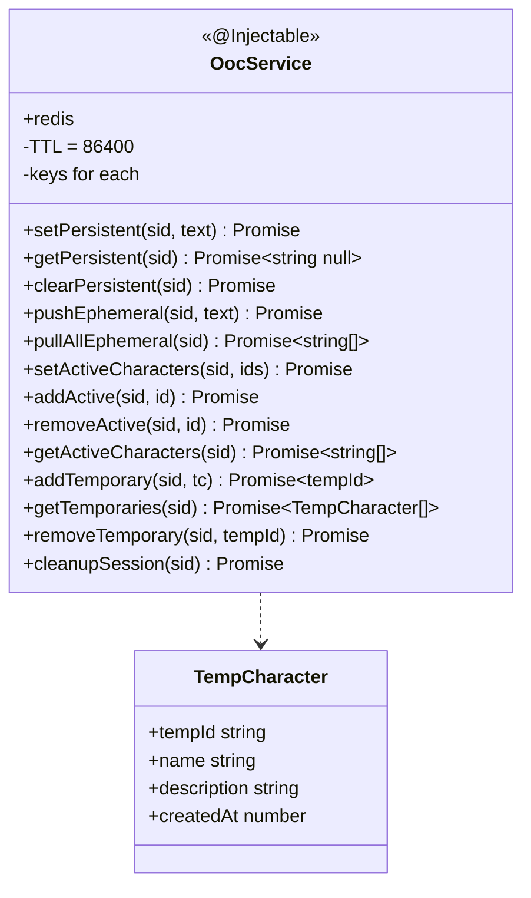
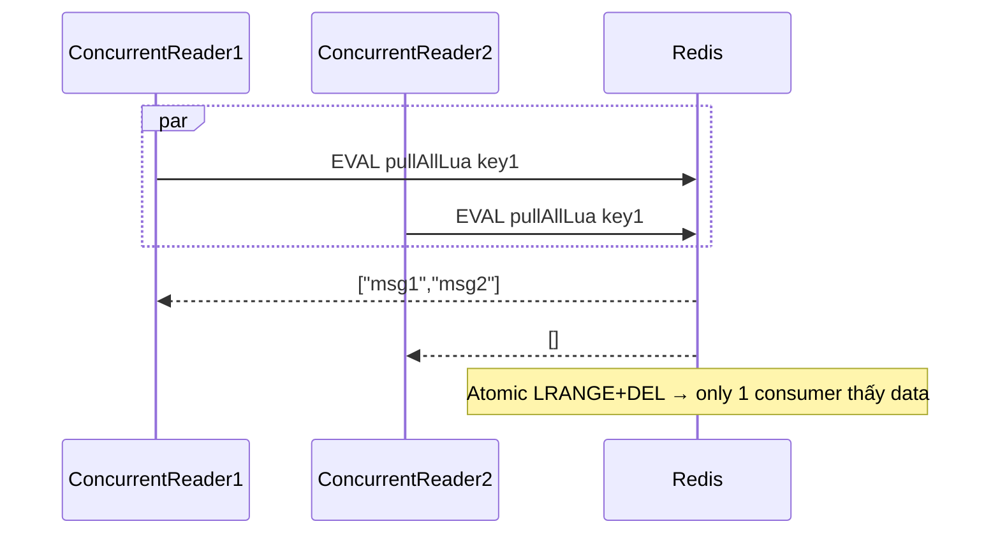

# P04.T3 — OocService (Redis-backed)

## 1. METADATA

| Field | Value |
|-------|-------|
| Task ID | P04.T3 |
| Phase | 4 |
| Depends on | P04.T1, P00.T6 |
| Complexity | Medium |
| Risk | Low |

---

## 2. MỤC TIÊU & SCOPE

**In-scope**:
- `OocService` quản lý 4 loại state per session trong Redis:
  - Persistent OOC (string)
  - Ephemeral OOC queue (list, RPUSH/atomic pull-all)
  - Active characters (set)
  - Temporary characters (hash: tempId → JSON)
- TTL 24h cho tất cả keys.
- `cleanupSession` xoá toàn bộ.

---

## 3. FILES CẦN TẠO

| # | Path |
|---|------|
| 1 | `apps/server/src/modules/chat/services/ooc.service.ts` |
| 2 | `apps/server/src/modules/chat/types/temp-character.ts` |
| 3 | `apps/server/src/modules/chat/services/ooc.service.spec.ts` |

---

## 4. CLASS DIAGRAM



---

## 5. CHI TIẾT

### 5.1. Key conventions (từ P00.T6)

```
persistent : PREFIX.OOC_PERSISTENT + sid
ephemeral  : PREFIX.OOC_EPHEMERAL + sid
activeChars: PREFIX.OOC_ACTIVE_CHARS + sid
tempChars  : PREFIX.OOC_TEMP_CHARS + sid
```

### 5.2. Methods

#### `setPersistent(sid, text)`
```
- key = persistent(sid)
- if text.length > 5000 → throw INVALID_PAYLOAD
- await redis.set(key, text, 86400)
```

#### `getPersistent(sid)`
```
- return await redis.get(persistent(sid))
```

#### `clearPersistent(sid)`
```
- await redis.del(persistent(sid))
```

#### `pushEphemeral(sid, text)`
```
- key = ephemeral(sid)
- await redis.raw().rpush(key, text)
- await redis.expire(key, 86400)
```

#### `pullAllEphemeral(sid)`  ← atomic
```
- key = ephemeral(sid)
- Lua script:
    local items = redis.call('LRANGE', KEYS[1], 0, -1)
    redis.call('DEL', KEYS[1])
    return items
- Result: string[] (có thể rỗng)
```

#### `setActiveCharacters(sid, ids[])`
```
- key = activeChars(sid)
- pipeline:
    DEL key
    if ids.length > 0: SADD key ...ids
    EXPIRE key 86400
```

#### `addActive(sid, id)` / `removeActive(sid, id)`
```
- SADD / SREM + EXPIRE refresh
```

#### `getActiveCharacters(sid)`
```
- SMEMBERS → string[]
```

#### `addTemporary(sid, tc)`
```
- tempId = `tmp_${uuidv4()}`
- field = tempId
- value = JSON.stringify({ tempId, name: tc.name, description: tc.description, createdAt: Date.now() })
- HSET tempChars(sid) field value
- EXPIRE 86400
- return tempId
```

#### `getTemporaries(sid)`
```
- raw = HVALS tempChars(sid)
- return raw.map(JSON.parse)
```

#### `removeTemporary(sid, tempId)`
```
- HDEL tempChars(sid) tempId
```

#### `cleanupSession(sid)`
```
- DEL persistent(sid), ephemeral(sid), activeChars(sid), tempChars(sid)
```

---

## 6. SEQUENCE — Ephemeral pull (atomic)



---

## 7. ACCEPTANCE & TEST PLAN

### Acceptance
- [ ] set/get/clear persistent works.
- [ ] Push 3 ephemeral → pullAll returns 3 → pullAll again returns [].
- [ ] Active chars: setActiveCharacters([a,b]) → getActiveCharacters returns [a,b] (set order).
- [ ] addTemporary → getTemporaries returns the temp with tempId starting `tmp_`.
- [ ] cleanupSession → tất cả gets trả null/empty.
- [ ] TTL 24h verify with TTL command.

### Unit Tests
| Test | Assert |
|------|--------|
| setPersistent rejects oversize | INVALID_PAYLOAD |
| pullAllEphemeral atomic | concurrent test |
| addTemporary returns valid tempId format | regex |
| cleanupSession deletes all 4 keys | DEL counts |
