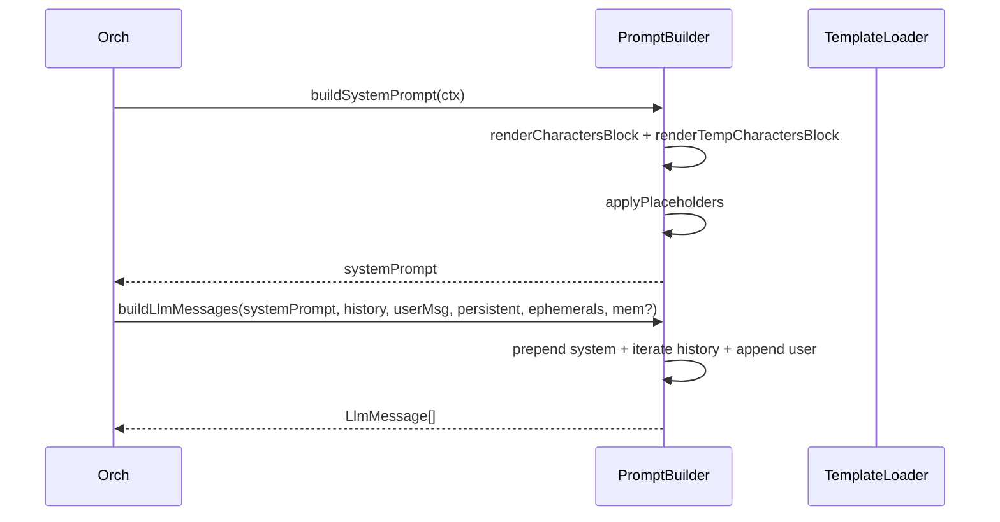

# P04.T4 — PromptBuilderService

## 1. METADATA

| Field | Value |
|-------|-------|
| Task ID | P04.T4 |
| Phase | 4 |
| Depends on | P04.T3 |
| Complexity | High |
| Risk | High (chất lượng prompt = chất lượng AI) |

---

## 2. MỤC TIÊU & SCOPE

**In-scope**:
- `PromptBuilderService` với:
  - `buildSystemPrompt(ctx)` — render template từ `@chatai/prompts/v1/system_chat.md`.
  - `buildLlmMessages(systemPrompt, history, userMessage, persistentOOC, ephemeralOOCs, memoryContext?)` — produce array `LlmMessage[]` cho LlmService.
- Template loader (read file once on init).
- Helper format characters block, temp chars block.

**Out-of-scope**:
- Memory injection real content (Phase 8 sẽ wire memoryContext).
- Streaming prompt.

---

## 3. FILES CẦN TẠO

| # | Path |
|---|------|
| 1 | `apps/server/src/modules/chat/services/prompt-builder.service.ts` |
| 2 | `apps/server/src/modules/chat/types/prompt-context.ts` |
| 3 | `packages/prompts/v1/system_chat.md` (copy từ 09_prompt_engineering_guide) |
| 4 | `packages/prompts/v1/summary_plot.md`, `summary_session.md`, `summary_character.md` (cho Phase 6, 7 dùng sau) |
| 5 | `packages/prompts/src/template-loader.ts` |
| 6 | `apps/server/src/modules/chat/services/prompt-builder.service.spec.ts` |

---

## 4. CLASS DIAGRAM

```mermaid
classDiagram
    class PromptBuilderService {
        <<@Injectable, OnModuleInit>>
        -systemTemplate string
        +onModuleInit()
        +buildSystemPrompt(ctx) string
        +buildLlmMessages(systemPrompt, history, userMessage, persistentOOC, ephemeralOOCs, memoryContext?) LlmMessage[]
        -renderCharactersBlock(characters) string
        -renderTempCharactersBlock(temps) string
        -applyPlaceholders(template, vars) string
    }
    class PromptContext {
        +story {title, initialSetting, currentProgress}
        +activeCharacters CharacterDto[]
        +temporaryCharacters TempCharacter[]
        +hskLevel string
        +narratorLanguage string
    }
    class LlmMessage {
        +role 'system'|'user'|'assistant'
        +content string
    }
    class TemplateLoader {
        <<package @chatai/prompts>>
        +loadTemplate(name) string
    }

    PromptBuilderService ..> PromptContext
    PromptBuilderService ..> LlmMessage
    PromptBuilderService --> TemplateLoader
```

---

## 5. CHI TIẾT

### 5.1. `TemplateLoader` (`@chatai/prompts`)

```
loadTemplate(name: 'system_chat'|'summary_plot'|'summary_session'|'summary_character'): string

Logic:
  - path = join(__dirname, '..', 'v1', `${name}.md`)
  - return fs.readFileSync(path, 'utf8')
Cached in module-level Map sau lần đầu.
```

### 5.2. `PromptContext`

```
type PromptContext = {
  story: { title: string; initialSetting: string; currentProgress: string }
  activeCharacters: CharacterDto[]
  temporaryCharacters: TempCharacter[]
  hskLevel: HskLevel
  narratorLanguage: NarratorLanguage
}
```

### 5.3. System template (`system_chat.md`) placeholders

(Lấy chi tiết từ `09_prompt_engineering_guide.md`.)

```
{{STORY_TITLE}}
{{STORY_INITIAL_SETTING}}
{{STORY_CURRENT_PROGRESS}}
{{CHARACTERS_BLOCK}}
{{TEMP_CHARACTERS_BLOCK}}
{{HSK_LEVEL}}
{{NARRATOR_LANGUAGE}}
{{EMOTIONS_LIST}}
{{INTENSITIES_LIST}}
{{JSON_SCHEMA_EXAMPLE}}
```

### 5.4. `buildSystemPrompt(ctx)`

```
buildSystemPrompt(ctx: PromptContext): string

Logic:
  vars = {
    STORY_TITLE: ctx.story.title,
    STORY_INITIAL_SETTING: ctx.story.initialSetting,
    STORY_CURRENT_PROGRESS: ctx.story.currentProgress || '(Chưa có)',
    CHARACTERS_BLOCK: renderCharactersBlock(ctx.activeCharacters),
    TEMP_CHARACTERS_BLOCK: renderTempCharactersBlock(ctx.temporaryCharacters),
    HSK_LEVEL: ctx.hskLevel,
    NARRATOR_LANGUAGE: ctx.narratorLanguage,
    EMOTIONS_LIST: EMOTIONS.join(', '),
    INTENSITIES_LIST: INTENSITIES.join(', '),
    JSON_SCHEMA_EXAMPLE: STATIC_JSON_EXAMPLE,
  }
  return applyPlaceholders(this.systemTemplate, vars)
```

### 5.5. `renderCharactersBlock(characters)`

```
Format mỗi character:
"- Tên: {name}, Tuổi: {age ?? 'không rõ'}\n  Tính cách: {personality}"

Join with '\n'
Nếu 0 → return "Chưa có nhân vật active. Chỉ Narrator nói chuyện."
```

### 5.6. `renderTempCharactersBlock(temps)`

```
Format mỗi temp:
"- Tạm thời: {name} — {description}"

Nếu 0 → return "" (block bị skip trong template via {{#if}} hoặc rendered empty)
```

### 5.7. `applyPlaceholders(tpl, vars)`

```
return Object.entries(vars).reduce(
  (acc, [k, v]) => acc.replaceAll(`{{${k}}}`, String(v)),
  tpl
)
```

### 5.8. `buildLlmMessages(...)`

```
buildLlmMessages(
  systemPrompt: string,
  history: HistoryEntry[],
  userMessage: string,
  persistentOOC: string | null,
  ephemeralOOCs: string[],
  memoryContext?: string | null
): LlmMessage[]

Logic:
  1. messages: LlmMessage[] = []
  2. // System block
     fullSystem = systemPrompt
     if persistentOOC: fullSystem += `\n\n## BỐI CẢNH CỐ ĐỊNH\n${persistentOOC}`
     if memoryContext: fullSystem += `\n\n## KÝ ỨC LIÊN QUAN\n${memoryContext}`
     messages.push({ role: 'system', content: fullSystem })

  3. // Process history (skip system + checkpoint entries → treat checkpoint as system note)
     for entry in history:
       switch entry.type:
         case 'user':
           let txt = entry.data.text
           if entry.data.ephemeralOOC:
             txt = `[OOC: ${entry.data.ephemeralOOC}]\n${txt}`
           messages.push({ role: 'user', content: txt })
         case 'assistant_batch':
           messages.push({ role: 'assistant', content: JSON.stringify({ content: entry.data.messages, triggerMemory: entry.data.triggerMemory ?? false }) })
         case 'persistent_ooc':
           // đã được injects ở system block update, skip in conv
           continue
         case 'ephemeral_ooc':
           // gắn vào user gần nhất - skip ở đây nếu đã handled
           continue
         case 'checkpoint':
           // checkpoint summary inject as system note
           messages.push({ role: 'system', content: `## TÓM TẮT TRƯỚC ĐÓ\n${entry.data.summary}` })
         case 'system':
           continue

  4. // Append current user turn
     curr = userMessage
     allEphemeral = [...ephemeralOOCs]
     if allEphemeral.length: curr = `[OOC: ${allEphemeral.join('; ')}]\n${curr}`
     messages.push({ role: 'user', content: curr })

  5. return messages
```

---

## 6. SEQUENCE — Build prompt for 1 turn



---

## 7. ACCEPTANCE & TEST PLAN

### Acceptance
- [ ] systemPrompt chứa tên + tính cách của mỗi active character.
- [ ] TempCharacters block render khi có temp.
- [ ] persistentOOC inject vào system message.
- [ ] memoryContext (truyền tay) inject vào system message.
- [ ] ephemeralOOCs prepend `[OOC: ...]` vào user message hiện tại.
- [ ] history `assistant_batch` → serialize JSON đúng.
- [ ] history `checkpoint` → inject as system note.

### Unit Tests
| Test | Assert |
|------|--------|
| buildSystemPrompt contains story title | substring |
| buildSystemPrompt renders 0 char block | "Chưa có nhân vật" |
| buildLlmMessages persistentOOC in system | substring "BỐI CẢNH CỐ ĐỊNH" |
| buildLlmMessages ephemeral prepended | "[OOC: ...]" in last user content |
| applyPlaceholders all `{{X}}` replaced | no `{{` left |
| Long history (100 entries) processed | length matches expected |
