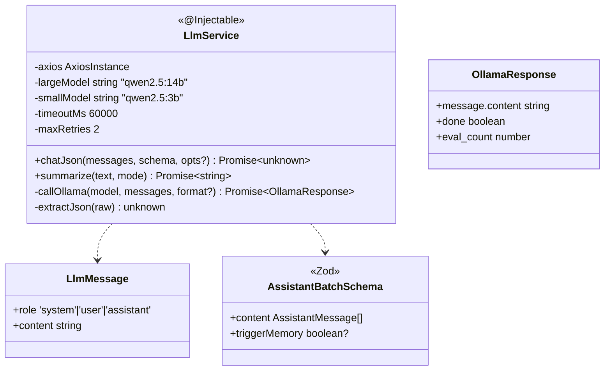
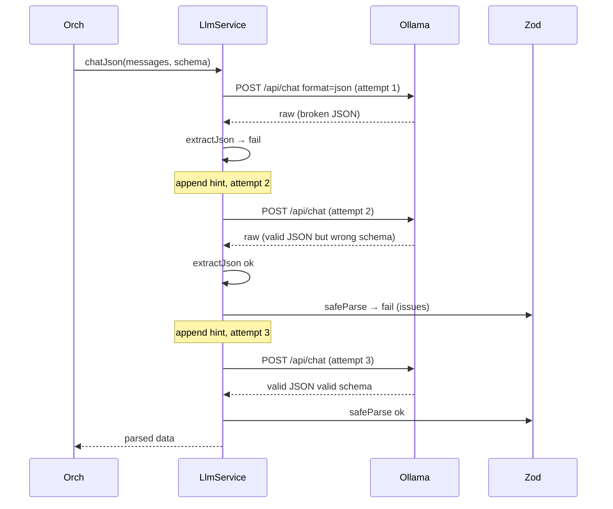

# P04.T5 — LlmService (Ollama JSON Mode + Retry)

## 1. METADATA

| Field | Value |
|-------|-------|
| Task ID | P04.T5 |
| Phase | 4 |
| Depends on | P04.T4 |
| Complexity | High |
| Risk | High (JSON parse failures, model variance) |

---

## 2. MỤC TIÊU & SCOPE

**In-scope**:
- `LlmService.chatJson(messages, schema)`: gọi Ollama `/api/chat` với `format:'json'`, parse JSON, validate Zod, retry max 2 lần với hint sửa lỗi.
- `LlmService.summarize(text, mode)`: Small AI (qwen2.5:3b) → plain text.
- Timeout, error mapping → AppException codes.
- Structured logging.

**Out-of-scope**:
- Streaming (Phase 5 dùng full response).
- Multi-Query embedding (Phase 8).

---

## 3. FILES CẦN TẠO

| # | Path |
|---|------|
| 1 | `apps/server/src/modules/chat/services/llm.service.ts` |
| 2 | `apps/server/src/modules/chat/types/llm-message.ts` |
| 3 | `apps/server/src/modules/chat/schemas/assistant-batch.schema.ts` (Zod) |
| 4 | `apps/server/src/modules/chat/services/llm.service.spec.ts` |

---

## 4. CLASS DIAGRAM



---

## 5. CHI TIẾT

### 5.1. Constants & Constructor

```
Constants từ ConfigService:
  OLLAMA_URL = config.get('ollamaUrl')  // http://ollama:11434
  LARGE_MODEL = config.get('llmLargeModel')  // qwen2.5:14b
  SMALL_MODEL = config.get('llmSmallModel')  // qwen2.5:3b
  TIMEOUT = 60_000

axios = axios.create({ baseURL: OLLAMA_URL, timeout: TIMEOUT })
```

### 5.2. Zod schema `AssistantBatchSchema`

```
AssistantMessageSchema = z.object({
  characterName: z.string().min(1),
  text: z.string().min(1),
  emotion: z.enum(EMOTIONS).optional(),
  intensity: z.enum(INTENSITIES).optional(),
  translation: z.string().nullable().optional(),
  words: z.array(z.object({ hz: z.string(), py: z.string(), vn: z.string() })).nullable().optional(),
  shopEvent: z.object({ itemName: z.string(), price: z.number().int().positive() }).nullable().optional(),
})

AssistantBatchSchema = z.object({
  content: z.array(AssistantMessageSchema).min(1).max(8),
  triggerMemory: z.boolean().optional(),
})
```

### 5.3. `chatJson(messages, schema, opts?)`

```
chatJson<T>(messages: LlmMessage[], schema: ZodSchema<T>, opts?: { model?: string }): Promise<T>

Logic:
  attempt = 0
  workingMessages = [...messages]
  lastError: string | null = null
  while attempt <= this.maxRetries:
    attempt++
    if lastError && attempt > 1:
      workingMessages.push({
        role: 'system',
        content: `Lần trước response KHÔNG hợp lệ JSON schema. Lỗi: ${lastError}. CHỈ trả về JSON đúng schema, không markdown, không text thừa.`
      })
    try:
      ollamaResp = await callOllama(opts?.model ?? LARGE_MODEL, workingMessages, 'json')
    catch (e):
      // network/timeout → no retry on this
      throw mapToAppException(e)
    
    raw = ollamaResp.message.content
    try:
      parsed = extractJson(raw)
    catch (e):
      lastError = `JSON parse: ${e.message}`
      logger.warn({ attempt, raw, lastError }, 'LLM JSON parse fail')
      continue
    
    validation = schema.safeParse(parsed)
    if validation.success:
      logger.debug({ attempt, evalCount: ollamaResp.eval_count }, 'LLM ok')
      return validation.data
    else:
      lastError = JSON.stringify(validation.error.issues.slice(0,3))
      logger.warn({ attempt, lastError }, 'LLM schema fail')
      continue
  
  // Exhausted retries
  throw new AppException(ERR.LLM_PARSE_FAIL, lastError ?? 'unknown')

Throws:
  - LLM_UNAVAILABLE (network)
  - LLM_TIMEOUT
  - LLM_PARSE_FAIL (sau max retries)
```

### 5.4. `callOllama(model, messages, format?)`

```
callOllama(model, messages, format?): Promise<OllamaResponse>

Logic:
  body = {
    model,
    messages: messages.map(m => ({ role: m.role, content: m.content })),
    stream: false,
    ...(format === 'json' ? { format: 'json' } : {}),
    options: { temperature: 0.7, num_predict: 2048 }
  }
  try:
    res = await this.axios.post('/api/chat', body)
    return res.data
  catch (e):
    if e.code === 'ECONNABORTED' or e.code === 'ETIMEDOUT' → throw AppException(ERR.LLM_TIMEOUT)
    if e.code === 'ECONNREFUSED' or no response → throw AppException(ERR.LLM_UNAVAILABLE)
    throw AppException(ERR.LLM_UNAVAILABLE, e.message)
```

### 5.5. `extractJson(raw)`

```
extractJson(raw: string): unknown

Logic:
  - trimmed = raw.trim()
  - // Try direct parse
  - try { return JSON.parse(trimmed) } catch {}
  - // Try extract from ```json ... ``` fenced
  - m = trimmed.match(/```(?:json)?\s*([\s\S]*?)```/)
  - if m → return JSON.parse(m[1])
  - // Try find first { ... last } substring
  - first = trimmed.indexOf('{'); last = trimmed.lastIndexOf('}')
  - if first >= 0 && last > first → return JSON.parse(trimmed.slice(first, last+1))
  - throw new Error('No JSON found in response')
```

### 5.6. `summarize(text, mode)`

```
summarize(text: string, mode: 'plot' | 'session' | 'character'): Promise<string>

Logic:
  systemTemplate = templateLoader.loadTemplate(`summary_${mode}`)  // từ @chatai/prompts
  messages = [
    { role: 'system', content: systemTemplate },
    { role: 'user', content: text }
  ]
  ollamaResp = await callOllama(SMALL_MODEL, messages, undefined)
  return ollamaResp.message.content.trim()

Throws: LLM_UNAVAILABLE / LLM_TIMEOUT
```

---

## 6. SEQUENCE — chatJson with retry



---

## 7. ACCEPTANCE & TEST PLAN

### Acceptance
- [ ] Valid response on attempt 1 → return data, attempts = 1.
- [ ] Broken JSON twice → 3rd ok → return data; logs show 3 attempts.
- [ ] 3 failures → throw LLM_PARSE_FAIL.
- [ ] Ollama down → LLM_UNAVAILABLE.
- [ ] Timeout > 60s → LLM_TIMEOUT.
- [ ] summarize returns plain text, no JSON wrapping.

### Unit Tests (mock axios)
| Test | Setup | Assert |
|------|-------|--------|
| First valid | mock returns valid | called once |
| Retry on parse fail | mock 2× broken + 1× valid | called 3× |
| Retry exhausted | mock 3× broken | throws LLM_PARSE_FAIL |
| Network timeout | axios reject ETIMEDOUT | LLM_TIMEOUT |
| extractJson handles fenced block | input ```json{}``` | parsed |
| extractJson handles surrounding text | "blah {x:1} blah" | parsed |

### Integration (real Ollama)
- Send simple `{ role: 'user', content: 'Trả JSON {"hello":"world"}' }` với schema → expect parse.
