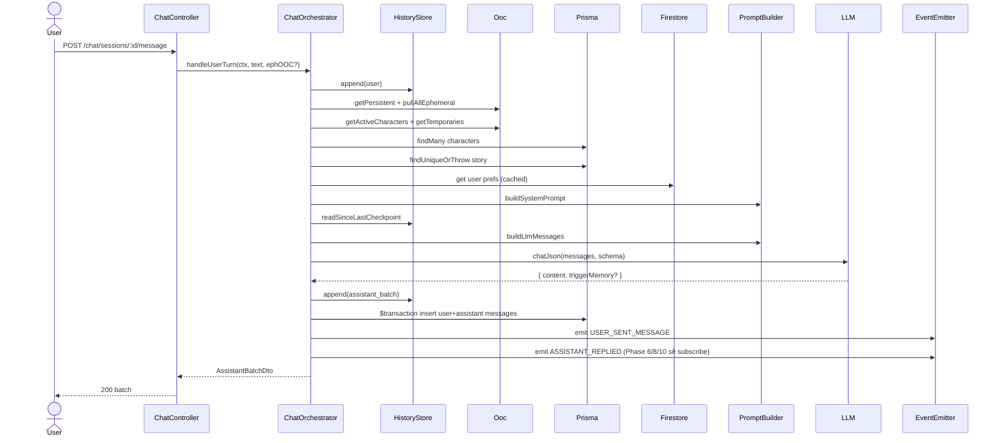

# P04.T6 — ChatOrchestratorService (handleUserTurn)

## 1. METADATA

| Field | Value |
|-------|-------|
| Task ID | P04.T6 |
| Phase | 4 |
| Depends on | P04.T2, T3, T4, T5 |
| Complexity | High |
| Risk | High (orchestration logic, downstream failures) |

---

## 2. MỤC TIÊU & SCOPE

**In-scope**:
- `ChatOrchestratorService.handleUserTurn(ctx, userMessage, ephemeralOOC?)`:
  1. Append user vào jsonl.
  2. Pull OOC contexts.
  3. Fetch active characters detail (DB).
  4. Fetch story + user preferences.
  5. Build system + LLM messages array.
  6. Call LLM JSON mode.
  7. Append assistant_batch vào jsonl.
  8. Persist messages vào DB (sessions + messages).
  9. Emit `USER_SENT_MESSAGE` event placeholder.
  10. Transform → AssistantBatchDto cho client.

**Out-of-scope**:
- Memory query (Phase 8 wire `memoryContext`).
- Checkpoint trigger (Phase 6).
- Vocab extraction store (Phase 10).

---

## 3. FILES CẦN TẠO

| # | Path |
|---|------|
| 1 | `apps/server/src/modules/chat/services/chat-orchestrator.service.ts` |
| 2 | `apps/server/src/modules/chat/types/chat-context.ts` |
| 3 | `apps/server/src/modules/chat/dto/assistant-batch.dto.ts` (shared via `@chatai/shared-types` ưu tiên) |
| 4 | `apps/server/src/shared/events/event-names.ts` (thêm `USER_SENT_MESSAGE`, `ASSISTANT_REPLIED`) |
| 5 | `apps/server/src/modules/chat/services/chat-orchestrator.service.spec.ts` |

---

## 4. CLASS DIAGRAM

```mermaid
classDiagram
    class ChatOrchestratorService {
        <<@Injectable>>
        +historyStore HistoryStoreService
        +ooc OocService
        +promptBuilder PromptBuilderService
        +llm LlmService
        +prisma PrismaService
        +firestore FirestoreService
        +eventEmitter EventEmitter2
        +logger PinoLogger
        +handleUserTurn(ctx, userMessage, ephemeralOOC?) Promise~AssistantBatchDto~
        -fetchUserPreferences(uid) Promise~{hskLevel, narratorLanguage}~
        -persistMessages(sessionId, userText, ephemeralOOC, assistantMessages, characterIds, startTurnOrder) Promise
        -getNextTurnOrder(sessionId) Promise~number~
        -transformToDto(assistantMessages, characters) AssistantBatchDto
    }
    class ChatContext {
        +sessionId, userId, storyId
    }
    class AssistantBatchDto {
        +messages AssistantMessageDto[]
        +triggerMemory boolean
    }
    class AssistantMessageDto {
        +id (db message id)
        +characterId nullable
        +characterName
        +text, translation, emotion, intensity, words, shopEvent
    }

    ChatOrchestratorService --> HistoryStoreService
    ChatOrchestratorService --> OocService
    ChatOrchestratorService --> PromptBuilderService
    ChatOrchestratorService --> LlmService
    ChatOrchestratorService --> PrismaService
```

---

## 5. CHI TIẾT

### 5.1. `ChatContext`

```
type ChatContext = { sessionId: string; userId: string; storyId: string }
```

### 5.2. `handleUserTurn(ctx, userMessage, ephemeralOOC?)`

```
handleUserTurn(ctx: ChatContext, userMessage: string, ephemeralOOC?: string): Promise<AssistantBatchDto>

Preconditions: session đã tồn tại + active. (Controller verify trước.)
Input validation:
  - userMessage.length: 1..2000 → else INVALID_PAYLOAD
  - ephemeralOOC?.length: <= 500 → else INVALID_PAYLOAD

Logic:
  ts = Date.now()
  // 1. Append user entry vào jsonl
  await historyStore.append(ctx.sessionId, {
    type: 'user', timestamp: ts,
    data: { text: userMessage, ephemeralOOC }
  })

  // 2. OOC pulls
  persistentOOC = await ooc.getPersistent(ctx.sessionId)
  ephemeralsFromQueue = await ooc.pullAllEphemeral(ctx.sessionId)
  allEphemerals = ephemeralOOC ? [ephemeralOOC, ...ephemeralsFromQueue] : ephemeralsFromQueue

  // 3. Active characters + temp
  activeCharIds = await ooc.getActiveCharacters(ctx.sessionId)
  characters = activeCharIds.length > 0
    ? await prisma.character.findMany({ where: { id: { in: activeCharIds } } })
    : []
  tempChars = await ooc.getTemporaries(ctx.sessionId)

  // 4. Story
  story = await prisma.story.findUniqueOrThrow({ where: { id: ctx.storyId } })

  // 5. User preferences
  { hskLevel, narratorLanguage } = await fetchUserPreferences(ctx.userId)

  // 6. Build prompts
  systemPrompt = promptBuilder.buildSystemPrompt({
    story: { title: story.title, initialSetting: story.initialSetting, currentProgress: story.currentProgress ?? '' },
    activeCharacters: characters,
    temporaryCharacters: tempChars,
    hskLevel,
    narratorLanguage,
  })
  
  history = await historyStore.readSinceLastCheckpoint(ctx.sessionId)
  // Exclude the just-appended user entry from history (will be appended as final user message in messages array)
  historyForLLM = history.slice(0, -1)  // drop last user entry
  
  llmMessages = promptBuilder.buildLlmMessages(
    systemPrompt,
    historyForLLM,
    userMessage,
    persistentOOC,
    allEphemerals,
    null  // memoryContext: Phase 8 wire
  )

  // 7. Call LLM
  llmResp = await llm.chatJson(llmMessages, AssistantBatchSchema)  // { content, triggerMemory? }

  // 8. Append assistant batch vào jsonl
  await historyStore.append(ctx.sessionId, {
    type: 'assistant_batch', timestamp: Date.now(),
    data: { messages: llmResp.content, triggerMemory: llmResp.triggerMemory ?? false }
  })

  // 9. Persist to DB
  startOrder = await getNextTurnOrder(ctx.sessionId)
  insertedAssistantMessages = await persistMessages(ctx.sessionId, userMessage, ephemeralOOC, llmResp.content, characters, startOrder)

  // 10. Emit events
  eventEmitter.emit(EVENTS.USER_SENT_MESSAGE, { sessionId: ctx.sessionId, userId: ctx.userId, text: userMessage })
  eventEmitter.emit(EVENTS.ASSISTANT_REPLIED, { sessionId: ctx.sessionId, userId: ctx.userId, batch: llmResp, triggerMemory: llmResp.triggerMemory ?? false })

  // 11. Transform DTO
  return transformToDto(insertedAssistantMessages, characters)

Throws (propagated):
  - LLM_UNAVAILABLE / LLM_TIMEOUT / LLM_PARSE_FAIL
  - INVALID_PAYLOAD
  - NOT_FOUND (story missing)
```

### 5.3. `fetchUserPreferences(uid)`

```
Logic:
  - prefs = await firestore.collection('user_profiles').doc(uid).get()
  - if !prefs.exists → return defaults { hskLevel: 'HSK3', narratorLanguage: 'vi' }
  - data = prefs.data()
  - return { hskLevel: data.hskLevel ?? 'HSK3', narratorLanguage: data.narratorLanguage ?? 'vi' }
Cached in RedisService.cacheWrap với key `user:prefs:{uid}` TTL 60s.
```

### 5.4. `getNextTurnOrder(sessionId)`

```
Logic:
  - max = await prisma.message.aggregate({ where: { sessionId }, _max: { turnOrder: true } })
  - return (max._max.turnOrder ?? 0) + 1
```

### 5.5. `persistMessages(sessionId, userText, ephOOC, assistantMsgs, characters, startOrder)`

```
Logic (transaction):
  await prisma.$transaction([
    // user message
    prisma.message.create({ data: {
      sessionId, role: 'user', text: userText,
      characterId: null, characterName: null,
      translation: null, emotion: null, intensity: null, words: null, shopEvent: null,
      turnOrder: startOrder, timestamp: BigInt(Date.now())
    }}),
    // ephemeralOOC if any → as ephemeral_ooc role
    ...(ephOOC ? [prisma.message.create({ data: { sessionId, role: 'ephemeral_ooc', text: ephOOC, turnOrder: startOrder, timestamp: BigInt(Date.now()) } })] : []),
    // assistant messages
    ...assistantMsgs.map((m, i) => {
      const charIdMatched = characters.find(c => c.name === m.characterName)?.id ?? null
      return prisma.message.create({ data: {
        sessionId, role: 'assistant',
        characterId: charIdMatched, characterName: m.characterName,
        text: m.text, translation: m.translation ?? null,
        emotion: m.emotion ?? null, intensity: m.intensity ?? null,
        words: m.words ?? null, shopEvent: m.shopEvent ?? null,
        turnOrder: startOrder + 1 + i,
        timestamp: BigInt(Date.now())
      } })
    })
  ])

  // Return inserted assistant message records (re-query with skip)
  return prisma.message.findMany({ where: { sessionId, role: 'assistant', turnOrder: { gte: startOrder + 1 } }, orderBy: { turnOrder: 'asc' }, take: assistantMsgs.length })
```

### 5.6. `transformToDto(records, characters)`

```
Logic:
  return {
    messages: records.map(r => ({
      id: r.id,
      characterId: r.characterId,
      characterName: r.characterName,
      text: r.text,
      translation: r.translation,
      emotion: r.emotion,
      intensity: r.intensity,
      words: r.words,
      shopEvent: r.shopEvent,
      timestamp: Number(r.timestamp)
    })),
    triggerMemory: false  // (already emitted via event; client doesn't need)
  }
```

---

## 6. SEQUENCE — handleUserTurn



---

## 7. ACCEPTANCE & TEST PLAN

### Acceptance
- [ ] Happy path: 1 turn → jsonl chứa user + assistant_batch; DB chứa user + N assistant rows; trả batch.
- [ ] LLM down → throw LLM_UNAVAILABLE; jsonl chỉ có user entry (assistant rollback đảm bảo orchestrator KHÔNG persist DB).
- [ ] Ephemeral OOC inject vào prompt + persist DB.
- [ ] characterName trong response không match → characterId = null nhưng name giữ.
- [ ] Active 0 character + temp 0 → LLM vẫn được prompt (Narrator-only), không throw.
- [ ] Event `ASSISTANT_REPLIED` emit có triggerMemory flag.

### Unit Tests (mock deps)
| Test | Assert |
|------|--------|
| Happy path emits 2 events | spy |
| LLM throw bubbles | re-thrown |
| persist transaction called once | spy |
| transformToDto includes BigInt timestamp as Number | type assert |
| ephemeralOOC null path | only queue ephemerals used |

### Integration (Ollama + DB)
- Real session → send → verify jsonl + DB rows + emit listeners.
