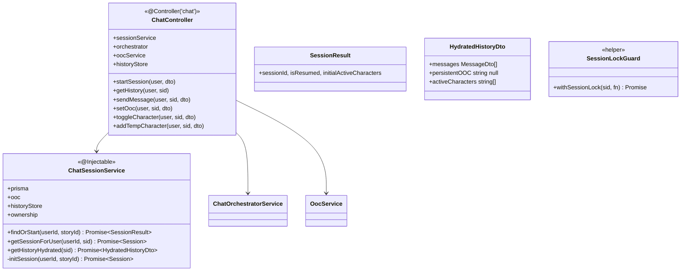
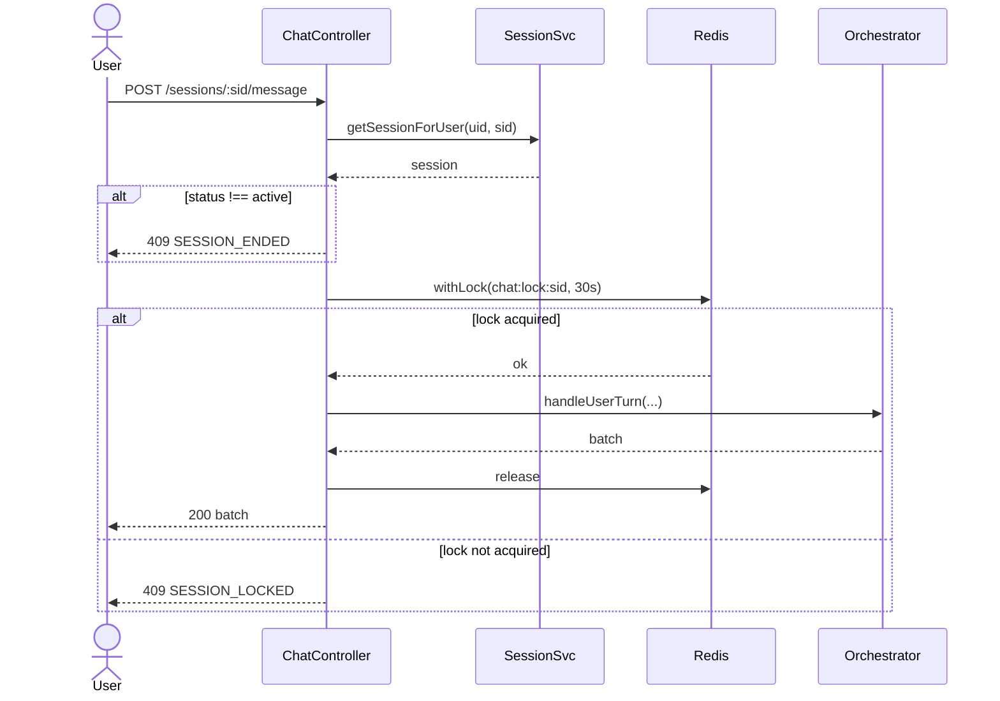

# P04.T7 — ChatController (Endpoints + Session Lock)

## 1. METADATA

| Field | Value |
|-------|-------|
| Task ID | P04.T7 |
| Phase | 4 |
| Depends on | P04.T6 |
| Complexity | High |
| Risk | Medium |

---

## 2. MỤC TIÊU & SCOPE

**In-scope**:
- `ChatController`: startSession, getHistory, sendMessage, setOoc, toggleCharacter, addTempCharacter.
- `ChatSessionService` cho startSession + ownership + history hydration.
- Session lock (Redis) chống concurrent sendMessage trên cùng session.
- DTOs.
- Refactor `StoriesService.hasActiveSession` (đã từng try/catch placeholder ở P02.T2) → query thật trên bảng `sessions`.

**Out-of-scope**:
- End chat (P07).
- Checkpoint trigger (P06).

---

## 3. FILES CẦN TẠO / SỬA

| # | Path | Loại |
|---|------|------|
| 1 | `apps/server/src/modules/chat/chat.controller.ts` | new |
| 2 | `apps/server/src/modules/chat/services/chat-session.service.ts` | new |
| 3 | `apps/server/src/modules/chat/chat.module.ts` | new |
| 4 | `apps/server/src/modules/chat/dto/*.dto.ts` (5 files) | new |
| 5 | `apps/server/src/modules/stories/stories.service.ts` | sửa: hasActiveSession real |
| 6 | `apps/server/src/app.module.ts` | sửa: import ChatModule |
| 7 | `apps/server/src/modules/chat/chat.controller.spec.ts` + e2e | new |

---

## 4. CLASS DIAGRAM



---

## 5. CHI TIẾT

### 5.1. DTOs

```
StartSessionDto: { @IsUUID storyId: string }
SendMessageDto: { @IsString @MinLength(1) @MaxLength(2000) userMessage: string; @IsOptional @MaxLength(500) ephemeralOOC?: string }
OocDto: { @IsIn(['persistent','ephemeral']) type; @IsString @MaxLength(5000) text }
ToggleCharacterDto: { @IsUUID characterId; @IsBoolean on }
TempCharacterDto: { @IsString @MaxLength(50) name; @IsString @MaxLength(500) description }
```

### 5.2. `ChatSessionService.findOrStart(userId, storyId)`

```
Logic:
  1. ownership.assertStoryOwner(userId, storyId)
  2. activeSession = await prisma.session.findFirst({ where: { userId, storyId, status: 'active' } })
  3. if activeSession:
       activeCharIds = await ooc.getActiveCharacters(activeSession.id)
       if activeCharIds.length === 0:
         // Redis may have expired (24h TTL) → rehydrate from story characters
         allChars = await prisma.character.findMany({ where: { storyId }, select: { id: true } })
         await ooc.setActiveCharacters(activeSession.id, allChars.map(c=>c.id))
         activeCharIds = allChars.map(c=>c.id)
       return { sessionId: activeSession.id, isResumed: true, initialActiveCharacters: activeCharIds }
  4. else:
       newSession = await initSession(userId, storyId)
       allChars = await prisma.character.findMany({ where: { storyId }, select: { id: true } })
       await ooc.setActiveCharacters(newSession.id, allChars.map(c=>c.id))
       await historyStore.append(newSession.id, { type: 'system', timestamp: Date.now(), data: { storyId, activeCharacters: allChars.map(c=>c.id), note: 'session start' } })
       return { sessionId: newSession.id, isResumed: false, initialActiveCharacters: allChars.map(c=>c.id) }
```

### 5.3. `initSession(userId, storyId)`

```
return await prisma.session.create({ data: {
  userId, storyId, status: 'active',
  startedAt: BigInt(Date.now())
} })
```

### 5.4. `getSessionForUser(userId, sid)`

```
Logic:
  s = await prisma.session.findUnique({ where: { id: sid } })
  if !s → throw AppException(ERR.NOT_FOUND)
  if s.userId !== userId → throw AppException(ERR.FORBIDDEN)
  return s
```

### 5.5. `getHistoryHydrated(sid)`

```
Logic:
  entries = await historyStore.readAll(sid)
  messages: MessageDto[] = []
  for entry in entries:
    switch entry.type:
      case 'user':
        messages.push({ role: 'user', text: entry.data.text, timestamp: entry.timestamp })
      case 'assistant_batch':
        for m in entry.data.messages:
          messages.push({ role: 'assistant', characterName: m.characterName, text: m.text, translation: m.translation, emotion: m.emotion, intensity: m.intensity, words: m.words, shopEvent: m.shopEvent, timestamp: entry.timestamp })
      case 'persistent_ooc' / 'ephemeral_ooc':
        messages.push({ role: entry.type, text: entry.data.text, timestamp: entry.timestamp })
      case 'checkpoint':
        messages.push({ role: 'system', text: `[Tóm tắt: ${entry.data.summary}]`, timestamp: entry.timestamp })
      case 'system':
        continue
  persistentOOC = await ooc.getPersistent(sid)
  activeCharacters = await ooc.getActiveCharacters(sid)
  return { messages, persistentOOC, activeCharacters }
```

### 5.6. `ChatController` methods

```
@Controller('chat')
@UseGuards(RedisThrottlerGuard)  // global per-endpoint throttle
class ChatController {

  @Post('sessions')
  @Throttle(20, 60)
  startSession(@CurrentUser() u, @Body() dto: StartSessionDto):
    return sessionService.findOrStart(u.uid, dto.storyId)

  @Get('sessions/:sid/history')
  @Throttle(60, 60)
  async getHistory(@CurrentUser() u, @Param('sid', ParseUUIDPipe) sid):
    await sessionService.getSessionForUser(u.uid, sid)
    return sessionService.getHistoryHydrated(sid)

  @Post('sessions/:sid/message')
  @Throttle(30, 60)
  async sendMessage(@CurrentUser() u, @Param('sid', ParseUUIDPipe) sid, @Body() dto: SendMessageDto):
    session = await sessionService.getSessionForUser(u.uid, sid)
    if session.status !== 'active' → throw AppException(ERR.SESSION_ENDED)
    // Session lock
    return await redis.withLock(`chat:lock:${sid}`, 30_000, async () => {
      return await orchestrator.handleUserTurn({ sessionId: sid, userId: u.uid, storyId: session.storyId }, dto.userMessage, dto.ephemeralOOC)
    })
    // If withLock returns null → throw SESSION_LOCKED

  @Post('sessions/:sid/ooc')
  @Throttle(30, 60)
  async setOoc(@CurrentUser() u, @Param('sid', ParseUUIDPipe) sid, @Body() dto: OocDto):
    await sessionService.getSessionForUser(u.uid, sid)
    if dto.type === 'persistent':
      await ooc.setPersistent(sid, dto.text)
      await historyStore.append(sid, { type: 'persistent_ooc', timestamp: Date.now(), data: { text: dto.text } })
    else:
      await ooc.pushEphemeral(sid, dto.text)
      await historyStore.append(sid, { type: 'ephemeral_ooc', timestamp: Date.now(), data: { text: dto.text } })
    return { status: 'ok' }

  @Post('sessions/:sid/character-toggle')
  @Throttle(30, 60)
  async toggleCharacter(@CurrentUser() u, @Param('sid', ParseUUIDPipe) sid, @Body() dto: ToggleCharacterDto):
    await sessionService.getSessionForUser(u.uid, sid)
    char = await prisma.character.findUnique({ where: { id: dto.characterId } })
    if !char → throw NOT_FOUND
    if char.storyId !== session.storyId → throw FORBIDDEN
    if dto.on:
      await ooc.addActive(sid, dto.characterId)
      await ooc.pushEphemeral(sid, `${char.name} vừa xuất hiện trong cảnh.`)
    else:
      await ooc.removeActive(sid, dto.characterId)
      await ooc.pushEphemeral(sid, `${char.name} vừa rời khỏi cảnh.`)
    await historyStore.append(sid, { type: 'persistent_ooc', timestamp: Date.now(), data: { text: `[Toggle] ${char.name} ${dto.on ? 'on' : 'off'}` } })
    return { status: 'ok' }

  @Post('sessions/:sid/temp-character')
  @Throttle(10, 60)
  async addTempCharacter(@CurrentUser() u, @Param('sid', ParseUUIDPipe) sid, @Body() dto: TempCharacterDto):
    await sessionService.getSessionForUser(u.uid, sid)
    tempId = await ooc.addTemporary(sid, { name: dto.name, description: dto.description })
    await ooc.pushEphemeral(sid, `Một nhân vật tạm thời tên ${dto.name} xuất hiện: ${dto.description}`)
    return { tempId }
}
```

### 5.7. `StoriesService.hasActiveSession` refactor

```
(Trước: try/catch return false placeholder)
hasActiveSession(storyId, userId): Promise<boolean>:
  count = await prisma.session.count({ where: { storyId, userId, status: 'active' } })
  return count > 0
```

(Loại bỏ try/catch placeholder.)

---

## 6. SEQUENCE — sendMessage with lock



---

## 7. ACCEPTANCE & TEST PLAN

### Acceptance
- [ ] Same story 2 lần startSession → lần 2 isResumed=true, sessionId giống nhau.
- [ ] getHistory cho session mới → messages = [] (chỉ system entry).
- [ ] sendMessage trả batch + persists.
- [ ] Concurrent 2 sendMessage cùng sid → 1 ok, 1 nhận 409 SESSION_LOCKED.
- [ ] toggleCharacter off → next sendMessage character không speak.
- [ ] setOoc persistent → message tiếp theo có "BỐI CẢNH CỐ ĐỊNH" trong prompt (verify via log).
- [ ] addTempCharacter → temp xuất hiện trong prompt.
- [ ] Wrong userId access session khác → 403.
- [ ] hasActiveSession real: tạo session active → true; end → false.

### E2E
- Full flow startSession → 5 messages → toggle → 5 more → getHistory → all there.

### Unit Tests
- Controller delegates to services (spy).
- Lock release on exception.
