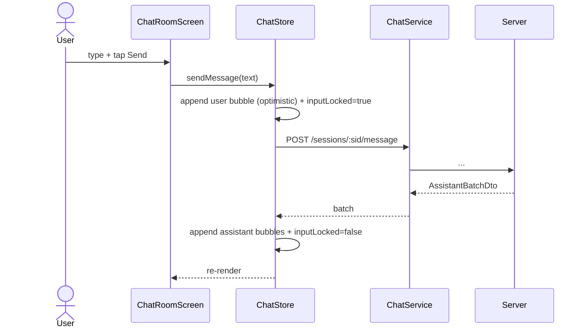

# P04.T8 — Client: ChatStore + ChatRoomScreen (Minimal)

## 1. METADATA

| Field | Value |
|-------|-------|
| Task ID | P04.T8 |
| Phase | 4 |
| Depends on | P04.T7 |
| Complexity | High |
| Risk | Medium |

---

## 2. MỤC TIÊU & SCOPE

**In-scope**:
- `chat.store.ts` Zustand state.
- `chat.service.ts` API client.
- `useChat` hook (selectors, actions wrapping).
- Screens: `ChatRoomScreen.tsx`.
- Components: `MessageBubble`, `InputBar`, `OocPanel`, `CharacterToggleSheet` (basic).
- Wire navigation từ `StoryDetailScreen` → `ChatRoomScreen`.

**Out-of-scope**:
- Audio playback queue (P05).
- Translation slide-down animation polish (P05).
- Word-tap bottom sheet (P10).

---

## 3. FILES CẦN TẠO / SỬA

| # | Path | Loại |
|---|------|------|
| 1 | `apps/mobile/src/features/chat/store/chat.store.ts` | store |
| 2 | `apps/mobile/src/features/chat/services/chat.service.ts` | service |
| 3 | `apps/mobile/src/features/chat/hooks/useChat.ts` | hook |
| 4 | `apps/mobile/src/features/chat/screens/ChatRoomScreen.tsx` | screen |
| 5 | `apps/mobile/src/features/chat/components/MessageBubble.tsx` | comp |
| 6 | `apps/mobile/src/features/chat/components/InputBar.tsx` | comp |
| 7 | `apps/mobile/src/features/chat/components/OocPanel.tsx` | comp (Modal) |
| 8 | `apps/mobile/src/features/chat/components/CharacterToggleSheet.tsx` | comp |
| 9 | `apps/mobile/src/features/chat/types/message.ts` | types |
| 10 | `apps/mobile/src/features/story/screens/StoryDetailScreen.tsx` | sửa: nút Bắt đầu Chat → navigate |
| 11 | `apps/mobile/src/navigation/MainTabNavigator.tsx` | sửa: register ChatRoomScreen trong StoryStack |

---

## 4. CLASS / MODULE DIAGRAM

```mermaid
classDiagram
    class ChatStore {
        <<Zustand>>
        +sessionId string null
        +storyId string null
        +messages ChatMessage[]
        +activeCharacters string[]
        +persistentOOC string
        +inputLocked boolean
        +loading boolean
        +error AppError null
        +startSession(storyId)
        +loadHistory()
        +sendMessage(text, ephemeralOOC?)
        +setPersistentOOC(text)
        +toggleCharacter(charId, on)
        +addTempCharacter(name, desc)
        +reset()
    }
    class ChatService {
        <<module>>
        +startSession(storyId) Promise~SessionResult~
        +getHistory(sid) Promise~HydratedHistoryDto~
        +sendMessage(sid, text, ephOOC?) Promise~AssistantBatchDto~
        +setOoc(sid, type, text) Promise
        +toggleCharacter(sid, charId, on) Promise
        +addTempCharacter(sid, name, desc) Promise~tempId~
    }
    class useChat {
        <<hook>>
        +returns { messages, sendMessage, ... }
    }
    class ChatRoomScreen {
        +useChat
        +renders FlatList + InputBar + Header
        +onMount: startSession → loadHistory
    }
    class MessageBubble
    class InputBar {
        +onSend(text)
    }
    class OocPanel {
        +Modal: persistent OOC text + char toggles + temp chars
    }

    ChatStore --> ChatService
    useChat --> ChatStore
    ChatRoomScreen --> useChat
    ChatRoomScreen --> MessageBubble
    ChatRoomScreen --> InputBar
    ChatRoomScreen --> OocPanel
```

---

## 5. CHI TIẾT

### 5.1. `ChatMessage` types

```
type ChatMessage =
  | { kind: 'user'; id: string; text: string; timestamp: number }
  | { kind: 'assistant'; id: string; characterId: string|null; characterName: string; text: string; translation?: string|null; emotion?: string|null; intensity?: string|null; words?: Word[]|null; shopEvent?: ShopEvent|null; timestamp: number }
  | { kind: 'persistent_ooc' | 'ephemeral_ooc'; id: string; text: string; timestamp: number }
  | { kind: 'system'; id: string; text: string; timestamp: number }
```

### 5.2. `chat.service.ts`

```
startSession(storyId) → POST /chat/sessions { storyId }
getHistory(sid) → GET /chat/sessions/:sid/history
sendMessage(sid, userMessage, ephemeralOOC?) → POST /chat/sessions/:sid/message
setOoc(sid, type, text) → POST /chat/sessions/:sid/ooc
toggleCharacter(sid, charId, on) → POST /chat/sessions/:sid/character-toggle
addTempCharacter(sid, name, description) → POST /chat/sessions/:sid/temp-character
```

All via `apiClient` (auth header attached). Errors propagated.

### 5.3. `ChatStore` (Zustand)

```
create<ChatState>((set, get) => ({
  sessionId: null, storyId: null, messages: [], activeCharacters: [],
  persistentOOC: '', inputLocked: false, loading: false, error: null,

  startSession: async (storyId) => {
    set({ loading: true, error: null, storyId })
    try {
      const r = await ChatService.startSession(storyId)
      set({ sessionId: r.sessionId, activeCharacters: r.initialActiveCharacters })
    } catch (e) { set({ error: e }) }
    finally { set({ loading: false }) }
  },

  loadHistory: async () => {
    const sid = get().sessionId
    if (!sid) return
    const h = await ChatService.getHistory(sid)
    set({
      messages: h.messages.map(toChatMessage),  // helper map server DTO → ChatMessage
      persistentOOC: h.persistentOOC ?? '',
      activeCharacters: h.activeCharacters
    })
  },

  sendMessage: async (text, ephOOC?) => {
    const sid = get().sessionId
    if (!sid) return
    // Optimistic user bubble
    const tempId = `tmp_${Date.now()}`
    set(s => ({
      messages: [...s.messages, { kind: 'user', id: tempId, text, timestamp: Date.now() }],
      inputLocked: true
    }))
    try {
      const batch = await ChatService.sendMessage(sid, text, ephOOC)
      // Append assistant messages
      set(s => ({
        messages: [...s.messages, ...batch.messages.map(m => ({
          kind: 'assistant' as const, id: m.id, characterId: m.characterId, characterName: m.characterName,
          text: m.text, translation: m.translation, emotion: m.emotion, intensity: m.intensity, words: m.words, shopEvent: m.shopEvent,
          timestamp: m.timestamp
        }))]
      }))
    } catch (e: any) {
      if (e.code === 'SESSION_LOCKED') toast('Đang xử lý tin trước, đợi chút nhé')
      else if (e.code === 'LLM_UNAVAILABLE' || 'LLM_TIMEOUT') toast('AI tạm bận, thử lại sau')
      else toast('Lỗi gửi tin')
      // Rollback optimistic? Giữ để user thấy đã gõ; mark failed flag (optional).
      set({ error: e })
    } finally {
      set({ inputLocked: false })
    }
  },

  setPersistentOOC: async (text) => {
    const sid = get().sessionId; if (!sid) return
    await ChatService.setOoc(sid, 'persistent', text)
    set({ persistentOOC: text })
  },

  toggleCharacter: async (charId, on) => {
    const sid = get().sessionId; if (!sid) return
    await ChatService.toggleCharacter(sid, charId, on)
    set(s => ({
      activeCharacters: on
        ? Array.from(new Set([...s.activeCharacters, charId]))
        : s.activeCharacters.filter(id => id !== charId)
    }))
  },

  addTempCharacter: async (name, desc) => {
    const sid = get().sessionId; if (!sid) return
    await ChatService.addTempCharacter(sid, name, desc)
    toast(`${name} đã xuất hiện`)
  },

  reset: () => set({ sessionId: null, storyId: null, messages: [], activeCharacters: [], persistentOOC: '', error: null })
}))
```

### 5.4. `useChat`

Selectors (avoid full-state re-render):
- `useMessages = () => useChatStore(s => s.messages)`
- `useInputLocked = () => useChatStore(s => s.inputLocked)`
- `useActions = () => useChatStore(s => ({ sendMessage: s.sendMessage, toggleCharacter: s.toggleCharacter, ... }), shallow)`

### 5.5. `ChatRoomScreen`

```
Props (route): { storyId: string }
useEffect on mount:
  await startSession(storyId)
  await loadHistory()
Cleanup: reset() khi unmount.

Layout:
  Header (story title + button "OOC" mở panel + button "Toggle" mở sheet + nút End Chat placeholder)
  FlatList inverted
    data = messages (reverse)
    renderItem = <MessageBubble msg={item} />
    keyExtractor = m.id
  InputBar
    onSend(text, ephOOC?) → sendMessage(text, ephOOC)
    disabled = inputLocked
  Modal OocPanel
  Modal CharacterToggleSheet

LoadingOverlay khi loading.
ErrorBanner khi error.
```

### 5.6. `MessageBubble` (basic)

```
Props: { msg: ChatMessage }
Render switch msg.kind:
  user → right-aligned bubble blue
  assistant → left-aligned, header characterName + text + (translation collapsed by default, tap để show — basic visibility toggle local state)
  persistent_ooc → italic gray "📌 Bối cảnh: {text}"
  ephemeral_ooc → italic light "💭 {text}"
  system → centered small "[{text}]"
```

### 5.7. `InputBar`

```
State: text, ephemeralOOC (optional expand UI)
Render:
  TextInput (multiline up to 3 lines)
  ToggleButton "+OOC" → expand TextInput cho ephemeral
  SendButton (disabled = !text.trim() || disabled prop)
onSend: call props.onSend(text, ephemeralOOC || undefined), clear inputs.
```

### 5.8. `OocPanel` (Modal)

```
Props: visible, onClose
Inputs:
  TextArea persistentOOC (200 chars limit)
  Button Save → setPersistentOOC(text) → toast → close
  List active characters with switch → toggleCharacter
  Section "Thêm nhân vật tạm thời":
    name + description inputs
    Button Add → addTempCharacter
```

### 5.9. `CharacterToggleSheet`

Bottom sheet showing all story characters with on/off switch (load via existing characters API or pre-fetched in StoryStore). For phase 4 minimal: dùng `activeCharacters` từ store + fetch full list mỗi mount.

### 5.10. Navigation

`StoryStackParamList` thêm `ChatRoom: { storyId: string }`.
`StoryDetailScreen` button "Bắt đầu Chat" → `navigation.navigate('ChatRoom', { storyId })`.

---

## 6. SEQUENCE — Send message UX



---

## 7. ACCEPTANCE & TEST PLAN

### Acceptance
- [ ] StoryDetail → tap "Bắt đầu Chat" → ChatRoom mở, history load (0 messages nếu mới).
- [ ] Type "你好" → Send → user bubble + sau 2-5s assistant bubble(s) hiện.
- [ ] Khi inputLocked: button Send disabled, gõ thêm vẫn nhập được nhưng không gửi.
- [ ] Tap message assistant → translation hiện.
- [ ] Open OocPanel → save persistent OOC → tin tiếp có ngữ cảnh.
- [ ] Toggle character off → tin tiếp character đó không speak.
- [ ] Add temp character → ngay tin kế tiếp temp char có thể xuất hiện.
- [ ] Quay lại Story rồi vào lại → history load đầy đủ.
- [ ] Server down → error toast, không crash.

### Manual Tests
1. Send 10 messages → cuộn smooth.
2. Kill app khi đang chờ response → quay lại → state empty (acceptable).
3. Concurrent: send tin → ngay lập tức send tin nữa → 2nd nhận SESSION_LOCKED toast.

### Unit Tests
- Reducer-style: store actions update state correctly with mocked service.
- Selectors return correct slices.
