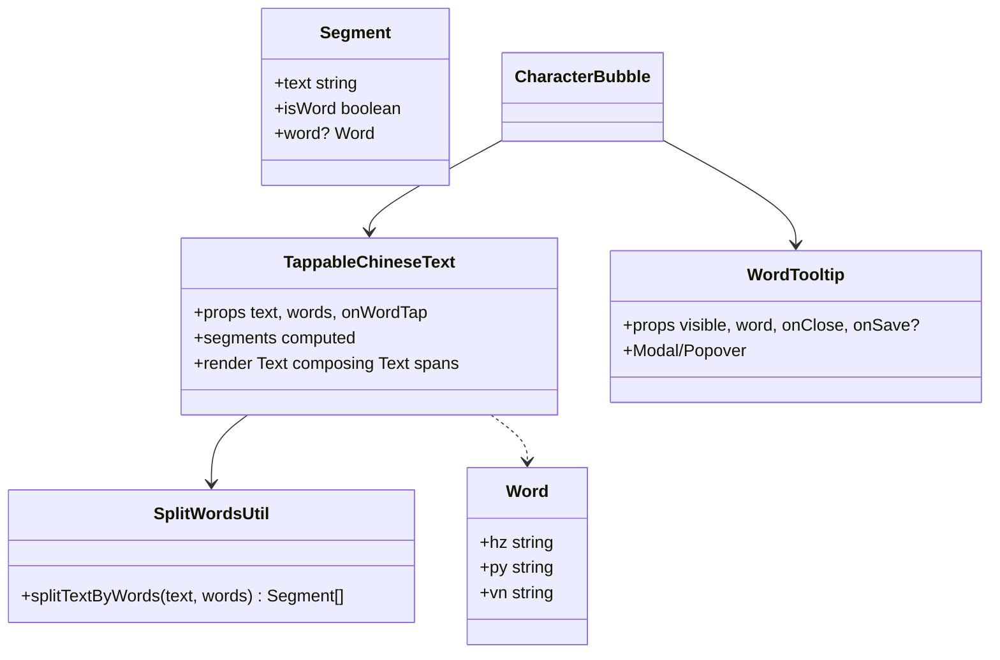
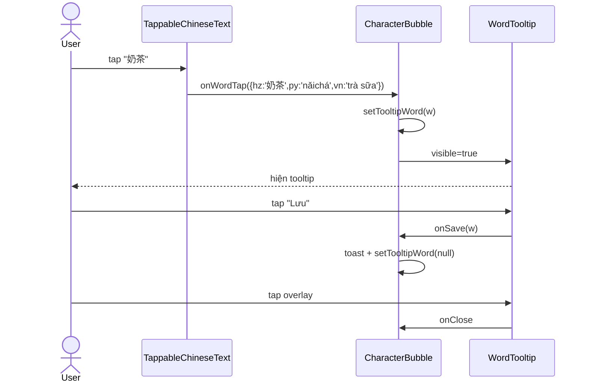

# P05.T3 — Client: Tap-to-Show Word Tooltip

## 1. METADATA

| Field | Value |
|-------|-------|
| Task ID | P05.T3 |
| Phase | 5 |
| Depends on | P05.T2 |
| Complexity | Medium |
| Risk | Medium (text layout + tap accuracy) |

---

## 2. MỤC TIÊU & SCOPE

**In-scope**:
- Tap chữ Hán trong text → tooltip {hz, py, vn}.
- Mỗi từ trong `message.words[]` → tappable segment.
- `WordTooltip` component (Modal centered hoặc bottom sheet).
- "Lưu vào sổ từ" button → callback placeholder (Toast); thật wire ở Phase 10.

**Out-of-scope**:
- Save API (Phase 10).
- Word search/lookup external (chỉ dùng words[] đã được LLM extract).

---

## 3. FILES CẦN TẠO / SỬA

| # | Path |
|---|------|
| 1 | `apps/mobile/src/features/chat/components/TappableChineseText.tsx` |
| 2 | `apps/mobile/src/features/chat/components/WordTooltip.tsx` |
| 3 | `apps/mobile/src/features/chat/utils/split-words.ts` |
| 4 | `apps/mobile/src/features/chat/components/CharacterBubble.tsx` — sửa: thay <Text>{msg.text}</Text> bằng `<TappableChineseText text words onWordTap />` |
| 5 | `apps/mobile/src/features/chat/components/NarratorBubble.tsx` — sửa tương tự nếu narrator zh |

---

## 4. COMPONENT DIAGRAM



---

## 5. CHI TIẾT

### 5.1. `splitTextByWords(text, words)`

```
splitTextByWords(text: string, words: Word[] | null | undefined): Segment[]

Logic:
  if !words || words.length === 0:
    return [{ text, isWord: false }]
  
  // Greedy longest-match scan: 
  // Sort words by hz.length desc (ưu tiên match từ dài trước).
  sortedWords = [...words].sort((a,b) => b.hz.length - a.hz.length)
  
  segments: Segment[] = []
  i = 0
  while i < text.length:
    matched = null
    for w of sortedWords:
      if text.slice(i, i + w.hz.length) === w.hz:
        matched = w; break
    if matched:
      // flush any pending non-word buffer first... handled below
      segments.push({ text: matched.hz, isWord: true, word: matched })
      i += matched.hz.length
    else:
      // accumulate single char into non-word
      last = segments[segments.length - 1]
      if last && !last.isWord:
        last.text += text[i]
      else:
        segments.push({ text: text[i], isWord: false })
      i++
  return segments
```

Edge cases:
- Word `hz` không xuất hiện trong text (LLM hallucinate) → skip silent.
- Overlap → greedy longest wins.

### 5.2. `TappableChineseText`

```
Props: { text: string; words?: Word[] | null; onWordTap: (w: Word) => void; baseStyle?: TextStyle }
Render:
  segments = useMemo(() => splitTextByWords(text, words), [text, words])
  <Text style={baseStyle}>
    {segments.map((s, i) =>
      s.isWord
        ? <Text key={i} style={styles.tappable} onPress={() => onWordTap(s.word!)}>{s.text}</Text>
        : <Text key={i}>{s.text}</Text>
    )}
  </Text>
styles.tappable: { textDecorationLine: 'underline', textDecorationStyle: 'dotted', color: theme.primary }
```

### 5.3. `WordTooltip`

```
Props: { visible: boolean; word: Word | null; onClose(); onSave(word) }
Render Modal transparent:
  <Pressable onPress={onClose} style={overlay}>
    <Pressable onPress={() => {}} style={card}>  // stop propagation
      <Text style={hzLarge}>{word.hz}</Text>
      <Text style={py}>{word.py}</Text>
      <Text style={vn}>{word.vn}</Text>
      <Button title="💾 Lưu vào sổ từ" onPress={() => { onSave(word); onClose() }} />
    </Pressable>
  </Pressable>
```

### 5.4. `CharacterBubble` integration

```
[tooltipWord, setTooltipWord] = useState<Word|null>(null)

<TappableChineseText
  text={msg.text}
  words={msg.words}
  onWordTap={(w) => setTooltipWord(w)}
  baseStyle={styles.zh}
/>

<WordTooltip
  visible={tooltipWord !== null}
  word={tooltipWord}
  onClose={() => setTooltipWord(null)}
  onSave={(w) => { /* Phase 10 wire vocabService.save */; toast(`Đã lưu ${w.hz}`) }}
/>
```

Pinyin row vẫn show toàn câu (không split per word — đơn giản). T phase 10 có thể nâng.

⚠ Conflict: `CharacterBubble` ngoài cùng đã `Pressable onPress={toggleTranslation}` (T2). Khi tap chữ Hán trong inner Text → Text onPress trigger trước → Pressable không trigger (React Native default: nested Text onPress takes precedence). Cần test kỹ và có thể chuyển translation toggle sang nút riêng "▼".

→ **Decision**: bỏ Pressable wrap text trong T2. Thêm nút nhỏ "▼ Dịch" dưới text để toggle. Update T2 retrospectively (note ở section 5.6 T2).

---

## 6. SEQUENCE — Tap word



---

## 7. ACCEPTANCE & TEST PLAN

### Acceptance
- [ ] Words trong message tap được → tooltip hiện.
- [ ] Chữ ngoài words array tap không trigger.
- [ ] Tap "Lưu" → toast "Đã lưu {hz}".
- [ ] Tap overlay outside card → tooltip đóng.
- [ ] Word overlap: words = [{hz:'喝'},{hz:'奶茶'},{hz:'喝奶茶'}] → tap matched greedy longest "喝奶茶".
- [ ] Pinyin row vẫn show toàn câu.
- [ ] Tap word KHÔNG đồng thời trigger translation toggle (đã đổi sang nút riêng).

### Unit Tests
- `splitTextByWords` returns correct segments cho input phổ biến + edge cases (overlap, missing, all non-word).

### Manual
- Message 20 chars, 5 words → tap mỗi từ → tooltip đúng.
