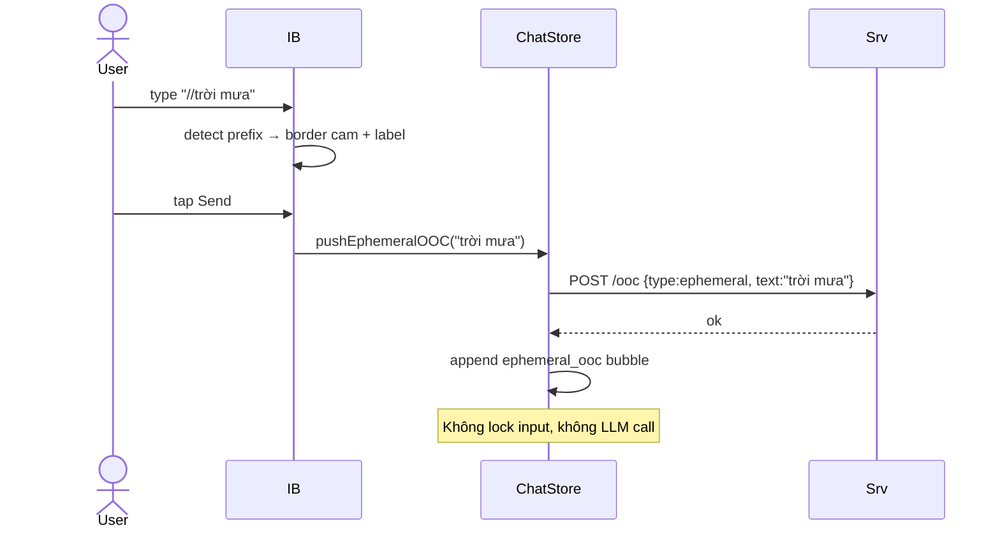

# P05.T4 — Client: InputBar Lock/Unlock + OOC Inline

## 1. METADATA

| Field | Value |
|-------|-------|
| Task ID | P05.T4 |
| Phase | 5 |
| Depends on | P05.T1 |
| Complexity | Low |
| Risk | Low |

---

## 2. MỤC TIÊU & SCOPE

**In-scope**:
- `InputBar` đọc `inputLocked` từ ChatStore (set bởi PlaybackQueueManager).
- Disable UI + hint "Đang phát..." khi locked.
- OOC inline: prefix `//` → ephemeral OOC; visual feedback border cam + label "[OOC]".
- Wire PlaybackQueue callbacks vào ChatStore: `onBubbleShow → append`, `onQueueFinished → setInputLocked(false)`.

**Out-of-scope**:
- Voice input (future).
- Persistent OOC panel (T5).

---

## 3. FILES CẦN TẠO / SỬA

| # | Path |
|---|------|
| 1 | `apps/mobile/src/features/chat/components/InputBar.tsx` — sửa |
| 2 | `apps/mobile/src/features/chat/screens/ChatRoomScreen.tsx` — sửa: instantiate PlaybackQueueManager, wire callbacks |
| 3 | `apps/mobile/src/features/chat/store/chat.store.ts` — sửa: `enqueueAssistantBatch` (thay vì append trực tiếp); `setInputLocked` |

---

## 4. INTERACTION DIAGRAM

```mermaid
sequenceDiagram
    actor User
    participant IB as InputBar
    participant S as ChatStore
    participant Mgr as QueueManager
    participant Srv as ChatService

    User->>IB: type + tap Send
    IB->>S: sendMessage(text, ephOOC?)
    S->>S: inputLocked=true; append user bubble (optimistic)
    S->>Srv: POST /sessions/:id/message
    Srv-->>S: AssistantBatchDto
    S->>Mgr: enqueueBatch(batch.messages mapped)
    Note over Mgr: Phát tuần tự
    Mgr->>S: onBubbleShow(msg) → append message
    Mgr->>S: onQueueFinished() → setInputLocked(false)
    S-->>IB: re-render unlocked
```

---

## 5. CHI TIẾT

### 5.1. ChatStore changes

```
state additions:
  // (đã có inputLocked)
  setInputLocked(v: boolean): void
  appendAssistantBubble(msg: AssistantMessage): void
  enqueueAssistantBatch(batch: AssistantMessageDto[]): void  // gọi qua manager

Refactor sendMessage:
  - Không append assistant trực tiếp sau API ok. Thay vào:
    on response:
      get().enqueueAssistantBatch(batch.messages)
  - Don't unlock here; manager will unlock via callback.

enqueueAssistantBatch(messages):
  - manager = getPlaybackManagerSingleton()
  - manager.enqueueBatch(messages)
```

PlaybackQueueManager singleton: created khi `ChatRoomScreen` mount, destroy on unmount. Truyền callbacks tham chiếu store actions.

### 5.2. `ChatRoomScreen` setup

```
useEffect mount:
  await startSession; await loadHistory
  const charMap = new Map(characters.map(c => [c.id, { voiceName: c.voiceName, pitch: c.pitch }]))
  const mgr = new PlaybackQueueManager({
    onBubbleShow: (msg) => useChatStore.getState().appendAssistantBubble(msg),
    onQueueFinished: () => useChatStore.getState().setInputLocked(false),
    onError: (e) => logger.warn(e),
    charactersVoice: charMap,
  })
  setPlaybackManager(mgr)
  return () => { mgr.stop(); useChatStore.getState().reset() }
```

`setInputLocked(true)` xảy ra ở `sendMessage` (store) ngay khi optimistic append user.

### 5.3. `InputBar` updates

```
Props: { onSend(text, ephOOC?), disabled?: boolean }
State: text, isOocMode (derived: text.startsWith('//'))
Disabled effective = disabled || inputLocked (đọc từ store)
Render:
  Row container with border:
    style border color = isOocMode ? 'orange' : default
  if isOocMode: <Label>[OOC] – ngữ cảnh tạm</Label>
  TextInput
    value, onChangeText
    placeholder = disabled? 'Đang phát...' : 'Gõ tin nhắn...'
    editable = !disabled
    multiline numberOfLines=3
  SendButton
    disabled = disabled || !text.trim()
    onPress = onSendPress

onSendPress:
  if isOocMode:
    ephOOC = text.replace(/^\/\/\s*/, '').trim()
    if !ephOOC → return
    onSend('', ephOOC)  // ⚠ but server requires userMessage min 1...
    → better: route as setOoc(type=ephemeral) call (no user turn). 
    
  → DECISION: `//` prefix sends ephemeral OOC ONLY (no LLM turn). Use setOoc instead of sendMessage:
    chatStore.pushEphemeralOOC(ephOOC) → POST /chat/sessions/:sid/ooc {type:ephemeral, text}
    UI append ephemeral_ooc bubble locally.
  else: onSend(text)
  clear text input.
```

Update `ChatStore`:
```
pushEphemeralOOC(text):
  sid = state.sessionId
  await ChatService.setOoc(sid, 'ephemeral', text)
  set(s => ({ messages: [...s.messages, { kind: 'ephemeral_ooc', id: cuid(), text, timestamp: Date.now() }] }))
```

---

## 6. SEQUENCE — OOC inline



---

## 7. ACCEPTANCE & TEST PLAN

### Acceptance
- [ ] Send message → input lock + hint "Đang phát...".
- [ ] Queue play xong → input unlock.
- [ ] Gõ `//bối cảnh` → border đổi cam + label hiện.
- [ ] Send OOC → ephemeral_ooc bubble hiện trong list, không trigger LLM.
- [ ] Tin tiếp theo của user → ephemeral OOC tự inject (server đã queue).
- [ ] Locked nhưng vẫn focus input → không gõ được (editable=false).

### Manual
- Send 3 tin liên tiếp khi queue đang phát → block đúng.
