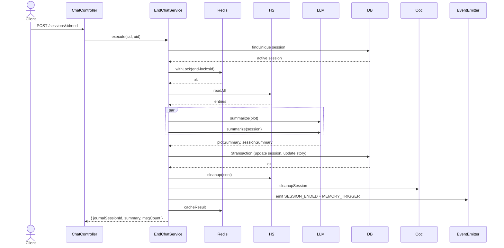

# P07.T1 — EndChatService (Orchestration)

## 1. METADATA

| Field | Value |
|-------|-------|
| Task ID | P07.T1 |
| Phase | 7 — End Chat & Journal |
| Depends on | P06.T3 hoàn thành |
| Complexity | High |
| Risk | High (data integrity: jsonl → DB commit) |

---

## 2. MỤC TIÊU & SCOPE

**In-scope**:
- `EndChatService.execute(sessionId, userId)`:
  1. Idempotency check (status='ended' → return cached).
  2. Read full `.jsonl`.
  3. Parallel summarize: plot (third-person) + session (overview).
  4. Transaction: update session status + create messages (only assistant rows từ jsonl that aren't yet in DB; user/assistant rows từ P04.T6 đã được persist live; vì vậy EndChat KHÔNG insert lại — chỉ update + append plot).
  5. Cleanup jsonl + OOC redis keys.
  6. Emit `SESSION_ENDED`, `MEMORY_TRIGGER` (type 'plot').
- Templates `summary_plot.md`, `summary_session.md`.

**Decision rephrase**:
Vì P04.T6 đã persist user + assistant messages real-time vào DB, EndChat KHÔNG cần `extractMessages` re-insert. EndChat chỉ:
- Aggregate count từ DB.
- Tạo 2 summaries.
- Append plot summary vào story.currentProgress.
- Update session row.
- Cleanup.

→ Tránh duplicate rows. (Doc gốc viết theo giả định jsonl-only persistence; ta thay đổi.)

**Out-of-scope**:
- Journal endpoints (T3).
- Memory worker (Phase 8 sẽ subscribe MEMORY_TRIGGER).

---

## 3. FILES CẦN TẠO

| # | Path |
|---|------|
| 1 | `apps/server/src/modules/chat/services/end-chat.service.ts` |
| 2 | `apps/server/src/modules/chat/types/end-chat-result.ts` |
| 3 | `packages/prompts/v1/summary_plot.md` |
| 4 | `apps/server/src/shared/events/event-names.ts` — thêm `SESSION_ENDED`, `MEMORY_TRIGGER` |
| 5 | `apps/server/src/modules/chat/services/end-chat.service.spec.ts` |

---

## 4. CLASS DIAGRAM

```mermaid
classDiagram
    class EndChatService {
        <<@Injectable>>
        +historyStore
        +llmService
        +prisma
        +oocService
        +eventEmitter
        +redis  "for idempotency cache"
        +logger
        +execute(sid, uid) Promise~EndChatResult~
        -loadAndValidateSession(sid, uid) Promise~Session~
        -summarizeBoth(entries) Promise~{plotSummary, sessionSummary}~
        -formatForPlot(entries) string
        -formatForOverview(entries) string
        -commit(sid, storyId, plotSummary, sessionSummary) Promise~{messageCount}~
        -cleanup(sid) Promise
        -emitDomainEvents(sid, uid, storyId)
        -cacheResult(sid, result) Promise
        -loadCachedResult(sid) Promise~EndChatResult null~
    }
    class EndChatResult {
        +journalSessionId
        +summary
        +messageCount
    }

    EndChatService --> HistoryStoreService
    EndChatService --> LlmService
    EndChatService --> PrismaService
    EndChatService --> OocService
    EndChatService --> EventEmitter
```

---

## 5. CHI TIẾT

### 5.1. `EndChatResult`

```
type EndChatResult = {
  journalSessionId: string
  summary: string         // sessionSummary
  messageCount: number
  alreadyEnded: boolean   // true nếu hit idempotency
}
```

### 5.2. `execute(sid, uid)`

```
Logic:
  1. session = await loadAndValidateSession(sid, uid)
  2. if session.status === 'ended':
       cached = await loadCachedResult(sid)
       if cached → return { ...cached, alreadyEnded: true }
       // No cache → reconstruct from DB
       msgCount = await prisma.message.count({ where: { sessionId: sid } })
       return { journalSessionId: sid, summary: session.summary ?? '', messageCount: msgCount, alreadyEnded: true }
  
  3. // status === 'active' → real end flow. Need lock:
  return await redis.withLock(`chat:end-lock:${sid}`, 120_000, async () => {
    // Re-check status after lock
    s2 = await prisma.session.findUnique({ where: { id: sid } })
    if s2.status === 'ended':
      // someone else finished it
      return await reconstructFromDB(s2)
    
    entries = await historyStore.readAll(sid)
    
    if entries.length === 0:
      // empty session edge case
      await prisma.session.update({ where: { id: sid }, data: { status: 'ended', summary: '(Phiên trống)', endedAt: BigInt(Date.now()) } })
      await oocService.cleanupSession(sid)
      result = { journalSessionId: sid, summary: '(Phiên trống)', messageCount: 0, alreadyEnded: false }
      return result
    
    { plotSummary, sessionSummary } = await summarizeBoth(entries)
    
    commitResult = await commit(sid, session.storyId, plotSummary, sessionSummary)
    await cleanup(sid)
    await emitDomainEvents(sid, uid, session.storyId)
    
    result = { journalSessionId: sid, summary: sessionSummary, messageCount: commitResult.messageCount, alreadyEnded: false }
    await cacheResult(sid, result)
    return result
  })
```

Lock null (couldn't acquire) → throw AppException(ERR.SESSION_LOCKED, 'End already in progress').

### 5.3. `loadAndValidateSession(sid, uid)`

```
s = await prisma.session.findUnique({ where: { id: sid } })
if !s → throw AppException(ERR.NOT_FOUND)
if s.userId !== uid → throw AppException(ERR.FORBIDDEN)
return s
```

### 5.4. `summarizeBoth(entries)`

```
Logic:
  [plotSummary, sessionSummary] = await Promise.all([
    llmService.summarize(formatForPlot(entries), 'plot'),
    llmService.summarize(formatForOverview(entries), 'session'),
  ])
  // Truncate safety
  if plotSummary.length > 2000: plotSummary = plotSummary.slice(0, 2000) + '...'
  if sessionSummary.length > 4000: sessionSummary = sessionSummary.slice(0, 4000) + '...'
  return { plotSummary, sessionSummary }
```

### 5.5. `formatForPlot(entries)` / `formatForOverview(entries)`

```
formatForPlot:
  Goal: Tóm tắt sự kiện theo ngôi thứ 3. Bỏ user OOC.
  lines = []
  for e in entries:
    case 'assistant_batch':
      for m in e.data.messages:
        lines.push(`${m.characterName}: ${m.text}`)
    case 'user': lines.push(`(Người chơi): ${e.data.text}`)
    case 'checkpoint': lines.unshift(`[TÓM TẮT TRƯỚC ĐÓ]: ${e.data.summary}`)
  return lines.join('\n')

formatForOverview:
  Same as formatHistoryForSummary từ CheckpointService.
```

### 5.6. `commit(sid, storyId, plotSummary, sessionSummary)`

```
Logic:
  result = await prisma.$transaction(async tx => {
    await tx.session.update({
      where: { id: sid },
      data: { status: 'ended', summary: sessionSummary, endedAt: BigInt(Date.now()) }
    })
    
    // Append plot summary to story.currentProgress
    story = await tx.story.findUniqueOrThrow({ where: { id: storyId }, select: { currentProgress: true } })
    newProgress = story.currentProgress
      ? `${story.currentProgress}\n\n---\n${plotSummary}`
      : plotSummary
    // Trim if too large (limit 50k chars)
    if newProgress.length > 50_000:
      newProgress = newProgress.slice(-50_000)
    await tx.story.update({ where: { id: storyId }, data: { currentProgress: newProgress } })
    
    msgCount = await tx.message.count({ where: { sessionId: sid } })
    return { messageCount: msgCount }
  })
  return result
```

### 5.7. `cleanup(sid)`

```
- await historyStore.cleanup(sid)
- await oocService.cleanupSession(sid)
```

(If either fails after DB commit: log warning, do NOT rollback DB. Cleanup is idempotent so retry possible.)

### 5.8. `emitDomainEvents(sid, uid, storyId)`

```
- eventEmitter.emit(EVENTS.SESSION_ENDED, { sessionId: sid, userId: uid, storyId, endedAt: Date.now() })
- eventEmitter.emit(EVENTS.MEMORY_TRIGGER, { sessionId: sid, userId: uid, type: 'plot' })
```

### 5.9. `cacheResult` / `loadCachedResult`

```
key = `endchat:result:${sid}`
TTL = 3600 (1h)

cacheResult: redis.set(key, JSON.stringify(result), TTL)
loadCachedResult: raw = await redis.get(key); return raw ? JSON.parse(raw) : null
```

### 5.10. `summary_plot.md`

```markdown
Bạn là người kể chuyện. Hãy viết lại các sự kiện sau dưới dạng đoạn văn tự sự (ngôi thứ 3) ngắn gọn 150-300 từ tiếng Việt.

TẬP TRUNG VÀO:
- Sự kiện chính theo trình tự
- Thay đổi quan trọng về quan hệ/bối cảnh
- Quyết định của người chơi

KHÔNG ĐỀ CẬP: lời thoại từng câu một, OOC, từ vựng.

CHỈ TRẢ ĐOẠN VĂN, KHÔNG TIÊU ĐỀ.

=== DỮ LIỆU ===
```

---

## 6. SEQUENCE — End Chat happy path



---

## 7. ACCEPTANCE & TEST PLAN

### Acceptance
- [ ] Session active → execute → status='ended', jsonl deleted, Redis OOC cleaned.
- [ ] Story.currentProgress được append plotSummary.
- [ ] Gọi lần 2 → idempotent: returns cached, không re-run LLM.
- [ ] Empty session → status ended, summary "(Phiên trống)", no LLM call.
- [ ] LLM fail giữa chừng → DB chưa commit; session vẫn active; retry possible.
- [ ] Concurrent 2 end → 1 thắng, 1 nhận SESSION_LOCKED.
- [ ] Cross-user → FORBIDDEN.
- [ ] Events SESSION_ENDED + MEMORY_TRIGGER emitted (verify listener spy).

### Tests
- Unit: mock deps, verify call order, transaction shape.
- Integration: real DB + Ollama → full end flow → assertions on DB state.
