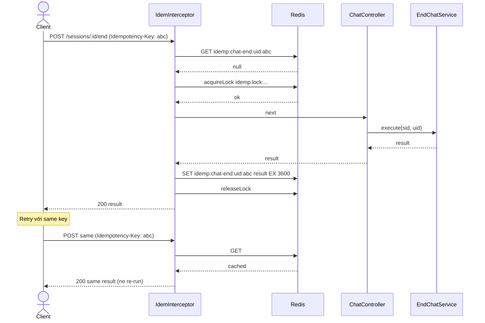

# P07.T2 — Chat Controller End Endpoint + Idempotency-Key

## 1. METADATA

| Field | Value |
|-------|-------|
| Task ID | P07.T2 |
| Phase | 7 |
| Depends on | P07.T1 |
| Complexity | Low |
| Risk | Medium (idempotency correctness) |

---

## 2. MỤC TIÊU & SCOPE

**In-scope**:
- `POST /chat/sessions/:id/end` endpoint.
- `Idempotency-Key` header support: nếu header trùng → trả cached response (key `idemp:{key}` TTL 1h).
- Wire vào `ChatController`.
- Error mapping (NOT_FOUND, FORBIDDEN, SESSION_LOCKED).

---

## 3. FILES CẦN TẠO / SỬA

| # | Path |
|---|------|
| 1 | `apps/server/src/modules/chat/chat.controller.ts` — sửa: thêm endpoint |
| 2 | `apps/server/src/shared/idempotency/idempotency.interceptor.ts` — generic interceptor |
| 3 | `apps/server/src/shared/idempotency/idempotent.decorator.ts` |
| 4 | `apps/server/src/modules/chat/chat.module.ts` — wire interceptor |
| 5 | E2E test |

---

## 4. INTERACTION DIAGRAM

```mermaid
classDiagram
    class ChatController {
        +endSession(user, sid, headers) Promise~EndChatResult~
    }
    class IdempotencyInterceptor {
        <<NestInterceptor>>
        +redis
        +reflector
        +intercept(ctx, next)
        -keyOf(req, scope) string
    }
    class Idempotent {
        <<decorator>>
        (scope: string, ttlSec: number)
    }
    ChatController ..> Idempotent
```

---

## 5. CHI TIẾT

### 5.1. `Idempotent` decorator

```
export const Idempotent = (scope: string, ttlSec = 3600) =>
  applyDecorators(SetMetadata('idempotent', { scope, ttlSec }), UseInterceptors(IdempotencyInterceptor))
```

### 5.2. `IdempotencyInterceptor`

```
intercept(ctx, next):
  meta = reflector.get<{ scope, ttlSec }>('idempotent', ctx.getHandler())
  if !meta → return next.handle()
  req = ctx.switchToHttp().getRequest()
  rawKey = req.headers['idempotency-key']
  if !rawKey → return next.handle()  // no header → not idempotent
  
  uid = req.user?.uid ?? 'anon'
  redisKey = `idemp:${meta.scope}:${uid}:${rawKey}`
  
  cached = await redis.get(redisKey)
  if cached:
    return of(JSON.parse(cached))
  
  // Acquire lock to prevent parallel duplicates with same key
  lockKey = `idemp:lock:${meta.scope}:${uid}:${rawKey}`
  acquired = await redis.acquireLock(lockKey, 30_000)
  if !acquired:
    throw new AppException(ERR.IDEMPOTENCY_CONFLICT, 'Concurrent request with same idempotency-key')
  
  try:
    result = await firstValueFrom(next.handle())
    await redis.set(redisKey, JSON.stringify(result), meta.ttlSec)
    return of(result)
  finally:
    await redis.releaseLock(lockKey)
```

### 5.3. `ChatController.endSession`

```
@Post('sessions/:sid/end')
@Throttle(10, 60)
@Idempotent('chat-end', 3600)
async endSession(
  @CurrentUser() u,
  @Param('sid', ParseUUIDPipe) sid: string
): Promise<EndChatResult> {
  return await this.endChatService.execute(sid, u.uid)
}
```

Error mapping (GlobalExceptionFilter handles):
- NOT_FOUND → 404
- FORBIDDEN → 403
- SESSION_LOCKED → 409
- IDEMPOTENCY_CONFLICT → 409

---

## 6. SEQUENCE — End with idempotency key



---

## 7. ACCEPTANCE & TEST PLAN

### Acceptance
- [ ] End active session → 200 + result.
- [ ] End với same Idempotency-Key 2× → 2nd return cached (no LLM call).
- [ ] End without Idempotency-Key → no caching, vẫn hoạt động (idempotency via session.status='ended' từ service layer).
- [ ] Concurrent 2 request same key → 1 OK, 1 nhận 409 IDEMPOTENCY_CONFLICT.
- [ ] Cross-user same key → 2 cache entries riêng (key có uid).
- [ ] Wrong owner → 403.

### E2E
- Real DB + Redis + Ollama → full flow.
