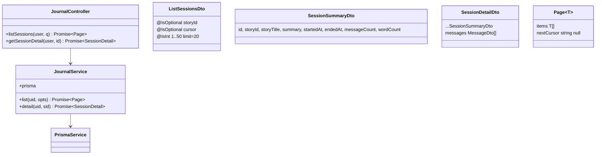
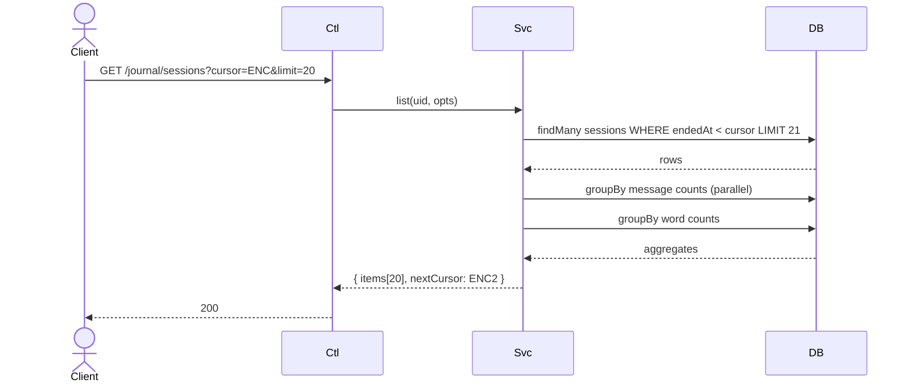

# P07.T3 — JournalModule (List + Detail)

## 1. METADATA

| Field | Value |
|-------|-------|
| Task ID | P07.T3 |
| Phase | 7 |
| Depends on | P07.T1 |
| Complexity | Medium |
| Risk | Low |

---

## 2. MỤC TIÊU & SCOPE

**In-scope**:
- `JournalController` + `JournalService`.
- 2 endpoints: GET `/journal/sessions?storyId&cursor&limit`, GET `/journal/sessions/:id`.
- Cursor pagination by `endedAt DESC`.
- SessionSummary + SessionDetail DTOs.
- Index `sessions(userId, status, endedAt)` (migration nếu chưa có).

---

## 3. FILES CẦN TẠO / SỬA

| # | Path |
|---|------|
| 1 | `apps/server/src/modules/journal/journal.module.ts` |
| 2 | `apps/server/src/modules/journal/journal.controller.ts` |
| 3 | `apps/server/src/modules/journal/journal.service.ts` |
| 4 | `apps/server/src/modules/journal/dto/list-sessions.dto.ts` |
| 5 | `apps/server/src/modules/journal/dto/session-summary.dto.ts` |
| 6 | `apps/server/src/modules/journal/dto/session-detail.dto.ts` |
| 7 | `apps/server/prisma/schema.prisma` — sửa: add index `@@index([userId, status, endedAt])` |
| 8 | `apps/server/src/app.module.ts` — sửa: import JournalModule |
| 9 | Tests |

---

## 4. CLASS DIAGRAM



---

## 5. CHI TIẾT

### 5.1. DTOs

```
ListSessionsDto:
  @IsOptional @IsUUID storyId?: string
  @IsOptional @IsString cursor?: string  // base64 of endedAt epoch
  @IsOptional @IsInt @Min(1) @Max(50) limit: number = 20

SessionSummaryDto: { id, storyId, storyTitle, summary, startedAt: number, endedAt: number, messageCount, wordCount }

SessionDetailDto extends SessionSummaryDto with messages: MessageDto[]

MessageDto: { id, role, characterId, characterName, text, translation, emotion, intensity, words, shopEvent, turnOrder, timestamp }
```

### 5.2. `JournalService.list(uid, opts)`

```
list(uid, { storyId, cursor, limit }): Promise<Page<SessionSummaryDto>>

Logic:
  whereBase = { userId: uid, status: 'ended', ...(storyId ? { storyId } : {}) }
  if cursor: whereBase.endedAt = { lt: BigInt(decodeCursor(cursor)) }
  
  sessions = await prisma.session.findMany({
    where: whereBase,
    orderBy: { endedAt: 'desc' },
    take: limit + 1,
    include: { story: { select: { title: true } } },
  })
  
  hasMore = sessions.length > limit
  page = hasMore ? sessions.slice(0, limit) : sessions
  
  // Per-session aggregates
  sessionIds = page.map(s => s.id)
  counts = await prisma.message.groupBy({
    by: ['sessionId'],
    where: { sessionId: { in: sessionIds } },
    _count: { _all: true },
  })
  // wordCount: messages có words != null
  wordCounts = await prisma.message.groupBy({
    by: ['sessionId'],
    where: { sessionId: { in: sessionIds }, NOT: { words: { equals: null } } },
    _count: { _all: true },
  })
  
  countMap = Map(counts.map(c => [c.sessionId, c._count._all]))
  wordMap = Map(wordCounts.map(c => [c.sessionId, c._count._all]))
  
  items = page.map(s => ({
    id: s.id,
    storyId: s.storyId,
    storyTitle: s.story.title,
    summary: s.summary ?? '',
    startedAt: Number(s.startedAt),
    endedAt: Number(s.endedAt),
    messageCount: countMap.get(s.id) ?? 0,
    wordCount: wordMap.get(s.id) ?? 0,
  }))
  
  nextCursor = hasMore ? encodeCursor(Number(page[page.length-1].endedAt)) : null
  return { items, nextCursor }
```

### 5.3. `JournalService.detail(uid, sid)`

```
Logic:
  s = await prisma.session.findUnique({ where: { id: sid }, include: { story: { select: { title: true } } } })
  if !s → throw NOT_FOUND
  if s.userId !== uid → throw FORBIDDEN
  if s.status !== 'ended' → throw AppException(ERR.SESSION_ENDED_REQUIRED, 'Session not yet ended')
  
  messages = await prisma.message.findMany({
    where: { sessionId: sid },
    orderBy: { turnOrder: 'asc' },
  })
  
  msgCount = messages.length
  wordCount = messages.filter(m => m.words != null).length
  
  return {
    id: s.id,
    storyId: s.storyId,
    storyTitle: s.story.title,
    summary: s.summary ?? '',
    startedAt: Number(s.startedAt),
    endedAt: Number(s.endedAt!),
    messageCount: msgCount,
    wordCount,
    messages: messages.map(m => ({
      id: m.id, role: m.role,
      characterId: m.characterId, characterName: m.characterName,
      text: m.text, translation: m.translation,
      emotion: m.emotion, intensity: m.intensity,
      words: m.words as any, shopEvent: m.shopEvent as any,
      turnOrder: m.turnOrder, timestamp: Number(m.timestamp),
    }))
  }
```

### 5.4. `JournalController`

```
@Controller('journal')
class JournalController {
  @Get('sessions')
  @Throttle(60, 60)
  list(@CurrentUser() u, @Query() q: ListSessionsDto):
    return service.list(u.uid, q)

  @Get('sessions/:sid')
  @Throttle(60, 60)
  detail(@CurrentUser() u, @Param('sid', ParseUUIDPipe) sid):
    return service.detail(u.uid, sid)
}
```

### 5.5. Cursor helpers

```
encodeCursor(ms: number) = Buffer.from(String(ms)).toString('base64url')
decodeCursor(c: string) = parseInt(Buffer.from(c, 'base64url').toString('utf8'), 10)
```

### 5.6. Index migration

```
@@index([userId, status, endedAt])
```

---

## 6. SEQUENCE — List with cursor



---

## 7. ACCEPTANCE & TEST PLAN

### Acceptance
- [ ] After EndChat → list trả session mới ở đầu.
- [ ] Cursor pagination works (page 2 trả các session cũ hơn).
- [ ] Filter storyId works.
- [ ] Detail trả messages đúng thứ tự turnOrder.
- [ ] wordCount đúng (messages có words != null).
- [ ] Active session → detail returns 409/422 with SESSION_ENDED_REQUIRED.
- [ ] Cross-user detail → 403.

### Tests
- Unit: list logic with mocked prisma.
- E2E: seed multi sessions → paginate.
