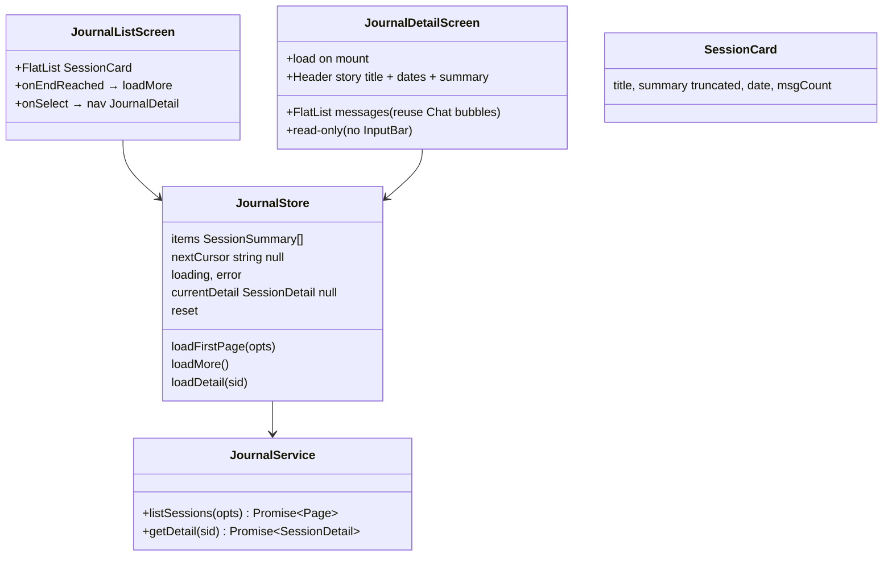

# P07.T4 — Client: End Chat Flow + Journal Screens

## 1. METADATA

| Field | Value |
|-------|-------|
| Task ID | P07.T4 |
| Phase | 7 |
| Depends on | P07.T2, P07.T3 |
| Complexity | Medium |
| Risk | Low |

---

## 2. MỤC TIÊU & SCOPE

**In-scope**:
- ChatRoom: nút "Kết thúc" → confirm → end API → navigate JournalDetail.
- `JournalListScreen` + `JournalDetailScreen` + `journal.service.ts` + `journal.store.ts`.
- Reuse MessageBubble / NarratorBubble / UserBubble cho Detail (read-only mode).
- Nav: MainTab "Sổ tay" (Journal) → JournalList; JournalList → JournalDetail.

---

## 3. FILES CẦN TẠO

| # | Path |
|---|------|
| 1 | `apps/mobile/src/features/journal/services/journal.service.ts` |
| 2 | `apps/mobile/src/features/journal/store/journal.store.ts` |
| 3 | `apps/mobile/src/features/journal/screens/JournalListScreen.tsx` |
| 4 | `apps/mobile/src/features/journal/screens/JournalDetailScreen.tsx` |
| 5 | `apps/mobile/src/features/journal/components/SessionCard.tsx` |
| 6 | `apps/mobile/src/features/journal/hooks/useJournalList.ts` |
| 7 | `apps/mobile/src/features/chat/screens/ChatRoomScreen.tsx` — sửa: end button + flow |
| 8 | `apps/mobile/src/features/chat/services/chat.service.ts` — sửa: `endSession(sid, idempotencyKey)` |
| 9 | `apps/mobile/src/navigation/JournalStackNavigator.tsx` |
| 10 | `apps/mobile/src/navigation/MainTabNavigator.tsx` — sửa: thay placeholder Journal tab |

---

## 4. CLASS DIAGRAM



---

## 5. CHI TIẾT

### 5.1. `JournalService`

```
listSessions({ storyId?, cursor?, limit?=20 }): GET /journal/sessions?... → { items, nextCursor }
getDetail(sid): GET /journal/sessions/:sid → SessionDetail
```

### 5.2. `JournalStore` (Zustand)

```
state: { items: [], nextCursor: null, loading: false, error: null, currentDetail: null, filterStoryId: null }

loadFirstPage({ storyId? }):
  set({ loading: true, error: null, filterStoryId: storyId ?? null })
  try:
    page = await JournalService.listSessions({ storyId, limit: 20 })
    set({ items: page.items, nextCursor: page.nextCursor })
  catch(e) set({ error: e })
  finally set({ loading: false })

loadMore():
  if !nextCursor || loading → return
  set({ loading: true })
  page = await JournalService.listSessions({ storyId: get().filterStoryId, cursor: get().nextCursor })
  set(s => ({ items: [...s.items, ...page.items], nextCursor: page.nextCursor, loading: false }))

loadDetail(sid):
  set({ loading: true, currentDetail: null })
  d = await JournalService.getDetail(sid)
  set({ currentDetail: d, loading: false })

reset(): set({ items: [], nextCursor: null, currentDetail: null, error: null })
```

### 5.3. `SessionCard`

```
Props: { item: SessionSummary; onPress() }
Layout:
  Pressable
    Row: storyTitle bold (left) | date short (right)
    Text summary: truncate 2 lines
    Row footer: "📝 {messageCount} tin" | "📚 {wordCount} từ"
```

### 5.4. `JournalListScreen`

```
useEffect: loadFirstPage() on mount, reset() on unmount
Render:
  FlatList
    data = items
    renderItem = <SessionCard item={item} onPress={() => nav.navigate('JournalDetail', { sessionId: item.id })} />
    onEndReached = loadMore
    ListEmptyComponent = "Chưa có phiên nào kết thúc"
    refreshControl = pull-to-refresh → loadFirstPage()
```

### 5.5. `JournalDetailScreen`

```
Props (route): { sessionId }
useEffect on mount: loadDetail(sessionId)
Render:
  if loading → spinner
  d = currentDetail
  ScrollView (or FlatList for perf):
    Header card: storyTitle, ngày, "{msgCount} tin / {wordCount} từ"
    SummarySection: d.summary (collapsible "Xem thêm")
    Divider "Hội thoại"
    Messages:
      d.messages.map(m => 
        switch m.role:
          'user' → UserBubble msg={m}
          'assistant' → if (m.characterName === 'Narrator' || !m.characterId) NarratorBubble else CharacterBubble (read-only mode → no audio button)
          'persistent_ooc'|'ephemeral_ooc' → OocBubble
      )
  Note: word tap tooltip vẫn active (reuse CharacterBubble inner). "Lưu vào sổ từ" hoạt động (sẽ wire Phase 10).
```

### 5.6. ChatRoomScreen — end button

```
header right:
  IconButton "🔚" onPress={onEndPress}

state: ending (boolean)

onEndPress():
  Alert.alert('Kết thúc phiên?', 'Tin nhắn sẽ được lưu vào Sổ tay.', [
    { text: 'Huỷ', style: 'cancel' },
    { text: 'Kết thúc', style: 'destructive', onPress: doEnd }
  ])

doEnd():
  setEnding(true)
  playbackManager?.stop()
  try:
    idempKey = `end-${sessionId}-${Date.now()}`  // hoặc cuid
    result = await ChatService.endSession(sessionId, idempKey)
    // Navigate replace
    nav.replace('JournalDetail', { sessionId: result.journalSessionId })
  catch(e):
    if e.code === 'SESSION_LOCKED' → toast 'Đang được xử lý'
    else if e.code === 'LLM_UNAVAILABLE' → toast 'AI tạm bận'
    else toast 'Lỗi kết thúc'
  finally setEnding(false)
```

### 5.7. `chat.service.ts.endSession`

```
endSession(sid, idempKey): POST /chat/sessions/:sid/end (header Idempotency-Key: idempKey) → result
```

### 5.8. Navigation wiring

```
JournalStackParamList: { JournalList, JournalDetail: { sessionId } }
MainTab "journal" → JournalStack
```

---

## 6. SEQUENCE — End from ChatRoom

```mermaid
sequenceDiagram
    actor User
    participant CR as ChatRoomScreen
    participant CS as ChatService
    participant Srv as Server
    participant JD as JournalDetailScreen

    User->>CR: tap 🔚
    CR->>User: confirm Alert
    User->>CR: confirm
    CR->>CR: ending=true; playback.stop()
    CR->>CS: endSession(sid, idemp)
    CS->>Srv: POST /sessions/:sid/end
    Srv-->>CS: { journalSessionId, summary, msgCount }
    CS-->>CR: result
    CR->>JD: nav.replace('JournalDetail', { sessionId })
    JD->>Srv: GET /journal/sessions/:sid
    Srv-->>JD: detail
    JD-->>User: render
```

---

## 7. ACCEPTANCE & TEST PLAN

### Acceptance
- [ ] Tap 🔚 → Alert confirm → tap Kết thúc → loading → Journal detail mở.
- [ ] Detail hiển thị summary + đầy đủ messages.
- [ ] Tap chữ Hán trong Detail → tooltip vẫn hiện.
- [ ] Quay về Journal list → session mới ở đầu.
- [ ] Pull-to-refresh works.
- [ ] Scroll xuống → loadMore (nếu >20 sessions).
- [ ] Filter by storyId (advanced UI optional Phase 11) → wired API ready.

### Manual
- End 2 lần với same idemp key → 2nd ngay lập tức (cached).
- Background app khi end → quay lại vẫn ok.
