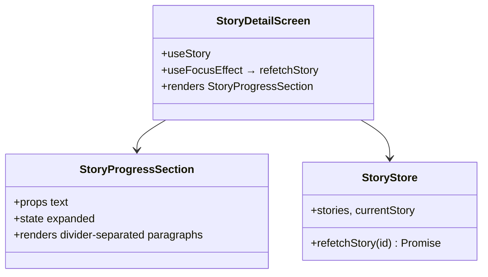
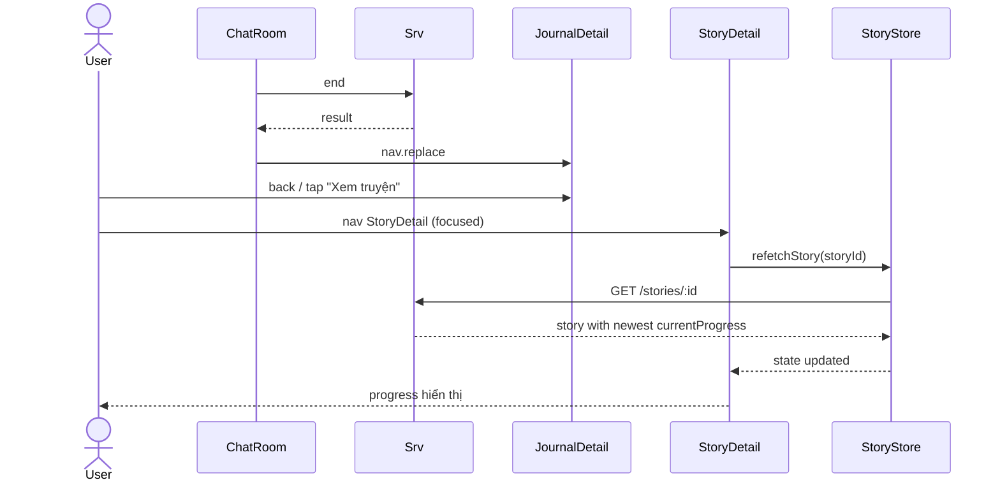

# P07.T5 — Client: Story Progress Display

## 1. METADATA

| Field | Value |
|-------|-------|
| Task ID | P07.T5 |
| Phase | 7 |
| Depends on | P07.T1 |
| Complexity | Low |
| Risk | Low |

---

## 2. MỤC TIÊU & SCOPE

**In-scope**:
- `StoryDetailScreen` thêm section "Tiến độ cốt truyện" hiển thị `currentProgress`.
- Collapsible (collapsed default nếu > 500 chars, hiện "Xem thêm" / "Thu gọn").
- Mỗi đoạn ngăn bởi `---` render thành Divider.
- Sau EndChat → refetch story để lấy progress mới (hoặc dùng event emit local).
- Empty state.

---

## 3. FILES CẦN TẠO / SỬA

| # | Path |
|---|------|
| 1 | `apps/mobile/src/features/story/screens/StoryDetailScreen.tsx` — sửa |
| 2 | `apps/mobile/src/features/story/components/StoryProgressSection.tsx` |
| 3 | `apps/mobile/src/features/story/store/story.store.ts` — sửa: thêm `refetchStory(id)` |
| 4 | `apps/mobile/src/features/journal/screens/JournalDetailScreen.tsx` — sửa: nút "Quay về Story" → on press trigger story refetch |

---

## 4. COMPONENT DIAGRAM



---

## 5. CHI TIẾT

### 5.1. `StoryProgressSection`

```
Props: { progress: string | null | undefined }
State: expanded: boolean (default depends on length)

Logic:
  if !progress → render empty state: "Chưa có tiến độ. Bắt đầu phiên chat để xây dựng cốt truyện."
  
  paragraphs = progress.split(/\n\n---\n+/).map(p => p.trim()).filter(Boolean)
  longTotal = progress.length > 500
  
  if longTotal && !expanded:
    preview = paragraphs[paragraphs.length - 1].slice(0, 300)
    Render: <Text>{preview}…</Text> + button "Xem thêm ({paragraphs.length} đoạn)"
  else:
    paragraphs.map((p, i) => 
      <View key={i}>
        <Text>{p}</Text>
        {i < paragraphs.length - 1 && <Divider />}
      </View>
    )
    if longTotal: button "Thu gọn"
```

### 5.2. `StoryStore.refetchStory`

```
refetchStory(id):
  s = await StoryService.getStory(id)
  set(state => ({
    currentStory: state.currentStory?.id === id ? s : state.currentStory,
    stories: state.stories.map(x => x.id === id ? s : x)
  }))
```

### 5.3. `StoryDetailScreen` updates

```
const route = useRoute<StoryDetailRoute>()
const { storyId } = route.params

useFocusEffect(useCallback(() => {
  storyStore.refetchStory(storyId)  // mỗi lần focus → reload (để bắt update sau EndChat)
}, [storyId]))

Layout (existing) thêm:
  <Section title="Tiến độ cốt truyện">
    <StoryProgressSection progress={story.currentProgress} />
  </Section>
```

Đặt section dưới initialSetting, trên character list.

### 5.4. Journal → Story navigation (optional)

```
JournalDetailScreen header có button "Xem truyện" → nav.navigate('StoryDetail', { storyId })
Khi StoryDetail focus → useFocusEffect refetch → progress mới hiện.
```

---

## 6. SEQUENCE — Update progress after End



---

## 7. ACCEPTANCE & TEST PLAN

### Acceptance
- [ ] StoryDetail empty progress → empty state text.
- [ ] Sau 1 EndChat → progress hiện 1 đoạn.
- [ ] Sau nhiều EndChat → progress hiện nhiều đoạn ngăn bởi divider.
- [ ] Progress > 500 chars → collapsed default, "Xem thêm" mở rộng.
- [ ] Quay từ Journal về Story → progress refetch.

### Manual
- 3 sessions → 3 đoạn progress.
- Pull to refresh trên StoryDetail → refetch.
