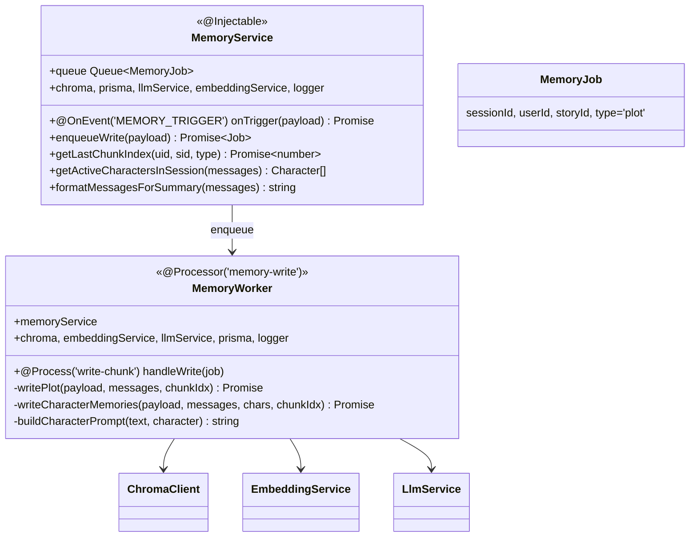
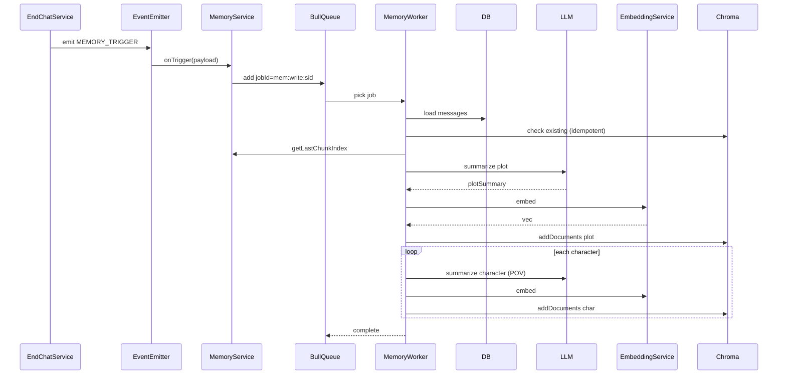

# P08.T3 — Memory Writer (BullMQ Worker)

## 1. METADATA

| Field | Value |
|-------|-------|
| Task ID | P08.T3 |
| Phase | 8 |
| Depends on | P08.T1, P08.T2 |
| Complexity | High |
| Risk | High (async pipeline, idempotency) |

---

## 2. MỤC TIÊU & SCOPE

**In-scope**:
- BullMQ queue `memory-write`.
- `MemoryWriter` processor: consume `MEMORY_TRIGGER` event → enqueue job → worker summarizes plot + per-character → embed → write Chroma.
- `MemoryService`:
  - Subscribe `MEMORY_TRIGGER` event → enqueue job.
  - Helpers: `getLastChunkIndex`, `getActiveCharactersInSession`, `formatMessagesForSummary`.
- Idempotency: jobId = `mem:write:${sessionId}` để tránh duplicate.

**Out-of-scope**:
- Reader (T4).
- Forget/cleanup (out of scope hoàn toàn cho MVP).

---

## 3. FILES CẦN TẠO

| # | Path |
|---|------|
| 1 | `apps/server/src/modules/memory/memory.module.ts` — sửa: thêm BullModule registerQueue('memory-write'), WorkerProvider |
| 2 | `apps/server/src/modules/memory/memory.service.ts` |
| 3 | `apps/server/src/modules/memory/memory.worker.ts` |
| 4 | `apps/server/src/modules/memory/types/memory-job.ts` |
| 5 | `packages/prompts/v1/summary_character.md` |
| 6 | `apps/server/src/modules/memory/memory.worker.spec.ts` |

---

## 4. CLASS DIAGRAM



---

## 5. CHI TIẾT

### 5.1. `MemoryJob`

```
type MemoryJob = {
  sessionId: string
  userId: string
  storyId: string
  type: 'plot'  // future: 'character_only', etc.
}
```

### 5.2. `MemoryService`

#### `@OnEvent(EVENTS.MEMORY_TRIGGER)`

```
onTrigger(payload: { sessionId, userId, storyId, type }): Promise<void>
Logic:
  await enqueueWrite({ sessionId, userId, storyId, type: 'plot' })
```

#### `enqueueWrite(payload)`

```
Logic:
  jobId = `mem:write:${payload.sessionId}`  // idempotent
  await queue.add('write-chunk', payload, {
    jobId,
    attempts: 3,
    backoff: { type: 'exponential', delay: 30_000 },
    removeOnComplete: true,
    removeOnFail: false,
  })
```

#### `getLastChunkIndex(userId, storyId, type)`

```
Logic:
  // Query Chroma: get all metadata for user/story/type → max chunk_index
  chunks = await chroma.query(zeroVector, { user_id: userId, story_id: storyId, memory_type: type }, 200)
    // workaround: getByIndexRange with very large bound
  if chunks.length === 0 → return 0
  return Math.max(...chunks.map(c => c.metadata.chunk_index))

Cache in Redis `mem:lastidx:{uid}:{sid}:{type}` TTL 60s để giảm load.
```

#### `getActiveCharactersInSession(messages)`

```
Logic:
  charIds = new Set(messages.filter(m => m.role === 'assistant' && m.characterId).map(m => m.characterId))
  return await prisma.character.findMany({ where: { id: { in: [...charIds] } } })
```

#### `formatMessagesForSummary(messages)`

```
Logic:
  lines = messages.map(m => {
    switch m.role:
      case 'user': return `User: ${m.text}`
      case 'assistant':
        emo = m.emotion ? ` (${m.emotion})` : ''
        return `${m.characterName}${emo}: ${m.text}`
      case 'persistent_ooc' / 'ephemeral_ooc': return `[OOC: ${m.text}]`
  })
  return lines.join('\n')
```

### 5.3. `MemoryWorker.handleWrite(job)`

```
@Process('write-chunk')
handleWrite(job: Job<MemoryJob>): Promise<void>

Logic:
  payload = job.data
  logger.info({ sid: payload.sessionId }, 'memory write start')
  
  // 1. Load messages
  messages = await prisma.message.findMany({
    where: { sessionId: payload.sessionId },
    orderBy: { turnOrder: 'asc' }
  })
  if messages.length === 0:
    logger.warn({ sid: payload.sessionId }, 'no messages skip')
    return
  
  // 2. Idempotency check
  existingPlot = await chroma.query(zeroVector, { user_id: payload.userId, story_id: payload.storyId, session_id: payload.sessionId, memory_type: 'plot' }, 1)
  if existingPlot.length > 0:
    logger.info({ sid: payload.sessionId }, 'already written, skip')
    return
  
  // 3. Format text
  text = memoryService.formatMessagesForSummary(messages)
  
  // 4. Get chunk index baseline
  lastIdx = await memoryService.getLastChunkIndex(payload.userId, payload.storyId, 'plot')
  nextIdx = lastIdx + 1
  
  // 5. Plot summary + embed + write
  await writePlot(payload, messages, text, nextIdx)
  
  // 6. Character memories
  chars = memoryService.getActiveCharactersInSession(messages)
  if chars.length > 0:
    await writeCharacterMemories(payload, messages, text, chars, nextIdx)
  
  logger.info({ sid: payload.sessionId, chunkIdx: nextIdx, chars: chars.length }, 'memory write done')

On error:
  logger.error(...) and rethrow → BullMQ retries (3 attempts).
```

### 5.4. `writePlot(payload, messages, text, chunkIdx)`

```
Logic:
  summary = await llmService.summarize(text, 'plot')
  if summary.length > 2000: summary = summary.slice(0, 2000) + '...'
  emb = await embeddingService.embed(summary)
  await chroma.addDocuments([{
    id: `${payload.sessionId}_plot`,
    content: summary,
    embedding: emb,
    metadata: {
      user_id: payload.userId,
      story_id: payload.storyId,
      session_id: payload.sessionId,
      chunk_index: chunkIdx,
      memory_type: 'plot',
      character_name: null,
      timestamp: Date.now(),
      turn_start: messages[0].turnOrder,
      turn_end: messages[messages.length - 1].turnOrder,
    }
  }])
```

### 5.5. `writeCharacterMemories(payload, messages, text, chars, chunkIdx)`

```
Logic:
  for each char in chars:
    prompt = buildCharacterPrompt(text, char)  // template summary_character.md với placeholder {{CHAR_NAME}}
    summary = await llmService.summarize(prompt, 'character')
    if summary.length > 1500: summary = summary.slice(0, 1500) + '...'
    emb = await embeddingService.embed(summary)
    await chroma.addDocuments([{
      id: `${payload.sessionId}_char_${char.id}`,
      content: summary,
      embedding: emb,
      metadata: { ...same as plot..., character_name: char.name, memory_type: 'character' }
    }])
```

Process character một-một (không parallel) để tránh overload Ollama.

### 5.6. `summary_character.md`

```markdown
Bạn đang đóng vai trò người ghi chép góc nhìn của nhân vật {{CHAR_NAME}}.

Hãy tóm tắt 100-250 từ tiếng Việt từ GÓC NHÌN của {{CHAR_NAME}}:
- Cảm xúc & suy nghĩ của {{CHAR_NAME}} về các sự kiện
- Cách {{CHAR_NAME}} cảm nhận về người chơi
- Thay đổi quan trọng trong quan hệ

CHỈ TRẢ ĐOẠN VĂN.

=== HỘI THOẠI ===
{{HISTORY_TEXT}}
```

### 5.7. BullMQ module wiring

```
@Module({
  imports: [
    BullModule.forRootAsync({
      useFactory: (cfg) => ({
        connection: { host: cfg.get('REDIS_HOST'), port: +cfg.get('REDIS_PORT') },
      }),
      inject: [ConfigService],
    }),
    BullModule.registerQueue({ name: 'memory-write' }),
  ],
  providers: [MemoryService, MemoryWorker, ChromaClient, EmbeddingService],
  exports: [MemoryService],
})
```

---

## 6. SEQUENCE — End Chat → memory write



---

## 7. ACCEPTANCE & TEST PLAN

### Acceptance
- [ ] End Chat → sau ~10-30s, Chroma có doc `{sessionId}_plot` + per char.
- [ ] Retry job (cùng sid) → idempotent skip.
- [ ] LLM fail → retry 3 lần exponential.
- [ ] Embed fail → retry.
- [ ] 0 active chars → chỉ plot doc, không char docs.
- [ ] chunk_index sequential per (user, story).

### Tests
- Unit: handleWrite logic (mock all deps).
- Integration: full pipeline with real Chroma + Ollama.
