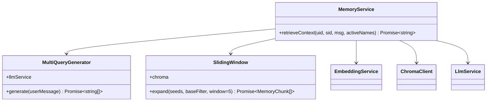
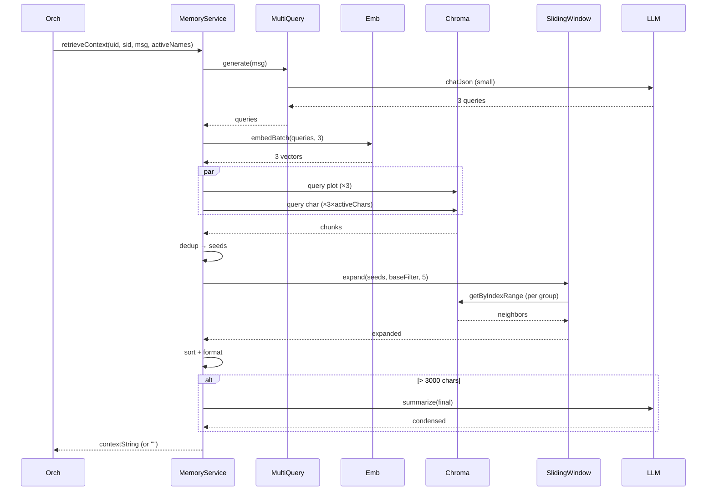

# P08.T4 — Memory Reader (Multi-Query RAG + Sliding Window)

## 1. METADATA

| Field | Value |
|-------|-------|
| Task ID | P08.T4 |
| Phase | 8 |
| Depends on | P08.T3 |
| Complexity | High |
| Risk | High (latency, retrieval quality) |

---

## 2. MỤC TIÊU & SCOPE

**In-scope**:
- `MemoryService.retrieveContext(userId, storyId, userMessage, activeCharNames)`:
  1. Generate 3 query variations qua LLM (JSON array).
  2. Embed all queries (batch).
  3. Parallel search Chroma: plot (k=3 per query) + per active char (k=2 per query).
  4. Merge + dedup by id.
  5. Sliding window expansion ±5 cho mỗi seed chunk.
  6. Sort by chunk_index asc, group by memory_type.
  7. If total > 3000 chars → re-summarize via Small AI.
  8. Return string (or empty if none).
- Telemetry: log retrievalTimeMs, seedCount, expandedCount, finalLength.

---

## 3. FILES CẦN TẠO / SỬA

| # | Path |
|---|------|
| 1 | `apps/server/src/modules/memory/memory.service.ts` — sửa: thêm methods |
| 2 | `apps/server/src/modules/memory/services/multi-query-generator.ts` |
| 3 | `apps/server/src/modules/memory/services/sliding-window.ts` |
| 4 | `packages/prompts/v1/multi_query.md` |
| 5 | `apps/server/src/modules/memory/memory.service.spec.ts` |

---

## 4. CLASS DIAGRAM



---

## 5. CHI TIẾT

### 5.1. `MultiQueryGenerator.generate(userMessage)`

```
generate(userMessage: string): Promise<string[]>

Schema = z.object({ queries: z.array(z.string().min(1)).min(1).max(5) })

Logic:
  template = loadTemplate('multi_query')  // see below
  prompt = template.replace('{{USER_MESSAGE}}', userMessage)
  res = await llmService.chatJson(
    [{ role: 'user', content: prompt }],
    Schema,
    { model: SMALL_MODEL }  // use small model để rẻ
  )
  return res.queries.slice(0, 3)

Fallback: nếu fail → return [userMessage] (degrade gracefully).
```

### 5.2. `multi_query.md`

```markdown
Bạn nhận 1 tin nhắn của người chơi trong chat roleplay. Hãy sinh 3 câu truy vấn (tiếng Việt + tiếng Trung mix tự do) khác nhau để tìm sự kiện liên quan từ trí nhớ dài hạn.

Quy tắc:
- Mỗi truy vấn 5-30 từ
- Bao quát: ngữ cảnh, nhân vật, cảm xúc, đồ vật
- Khác nhau rõ rệt

TRẢ DUY NHẤT JSON: {"queries":["...","...","..."]}

Tin nhắn: "{{USER_MESSAGE}}"
```

### 5.3. `SlidingWindow.expand(seeds, baseFilter, window=5)`

```
expand(seeds: MemoryChunk[], baseFilter: ChromaFilter, window = 5): Promise<MemoryChunk[]>

Logic:
  if seeds.length === 0 → return []
  // Group seeds by memory_type + character_name (for char filter cohesion)
  groups = new Map<string, MemoryChunk[]>()
  for s of seeds:
    key = `${s.metadata.memory_type}|${s.metadata.character_name ?? ''}`
    groups.set(key, [...(groups.get(key) ?? []), s])
  
  expanded = new Map<id, MemoryChunk>()
  
  // For each group, compute union of [idx-window, idx+window] ranges
  for ([key, chunks] of groups):
    indices = chunks.map(c => c.metadata.chunk_index)
    minIdx = Math.max(0, Math.min(...indices) - window)
    maxIdx = Math.max(...indices) + window
    
    typeFilter = {
      ...baseFilter,
      memory_type: chunks[0].metadata.memory_type,
      ...(chunks[0].metadata.character_name ? { character_name: chunks[0].metadata.character_name } : {})
    }
    
    neighbors = await chroma.getByIndexRange(typeFilter, minIdx, maxIdx)
    for n of neighbors:
      expanded.set(n.id, n)
  
  return [...expanded.values()]
```

### 5.4. `retrieveContext(...)`

```
retrieveContext(userId, storyId, userMessage, activeCharNames): Promise<string>

Constants:
  PER_QUERY_K_PLOT = 3
  PER_QUERY_K_CHAR = 2
  MAX_TOTAL_CHARS = 3000

Logic:
  t0 = Date.now()
  try:
    // 1. Multi-query
    queries = await multiQueryGenerator.generate(userMessage)
    
    // 2. Embed
    qEmbs = await embeddingService.embedBatch(queries, 3)
    
    // 3. Parallel searches
    baseFilter = { user_id: userId, story_id: storyId }
    
    plotSearches = qEmbs.map(emb => chroma.query(emb, { ...baseFilter, memory_type: 'plot' }, PER_QUERY_K_PLOT))
    
    charSearches = activeCharNames.flatMap(name =>
      qEmbs.map(emb => chroma.query(emb, { ...baseFilter, memory_type: 'character', character_name: name }, PER_QUERY_K_CHAR))
    )
    
    [plotResults, charResults] = await Promise.all([
      Promise.all(plotSearches).then(arrs => arrs.flat()),
      Promise.all(charSearches).then(arrs => arrs.flat()),
    ])
    
    // 4. Merge + dedup by id
    seedMap = new Map<string, MemoryChunk>()
    for c of [...plotResults, ...charResults]: seedMap.set(c.id, c)
    seeds = [...seedMap.values()]
    
    if seeds.length === 0:
      logger.debug({ retrievalTimeMs: Date.now()-t0 }, 'memory: no seeds')
      return ''
    
    // 5. Sliding window expansion
    expanded = await slidingWindow.expand(seeds, baseFilter, 5)
    
    // 6. Sort by chunk_index then memory_type (plot first then chars)
    expanded.sort((a, b) => {
      if (a.metadata.memory_type !== b.metadata.memory_type) return a.metadata.memory_type === 'plot' ? -1 : 1
      return a.metadata.chunk_index - b.metadata.chunk_index
    })
    
    // 7. Format
    pieces = expanded.map(c => {
      tag = c.metadata.memory_type === 'plot' ? `[#${c.metadata.chunk_index} Plot]` : `[#${c.metadata.chunk_index} ${c.metadata.character_name}]`
      return `${tag} ${c.content}`
    })
    final = pieces.join('\n\n')
    
    if final.length > MAX_TOTAL_CHARS:
      condensed = await llmService.summarize(final, 'session')
      logger.debug({ originalLen: final.length, condensedLen: condensed.length, retrievalTimeMs: Date.now()-t0 }, 'memory: condensed')
      return condensed
    
    logger.debug({ seedCount: seeds.length, expandedCount: expanded.length, finalLength: final.length, retrievalTimeMs: Date.now()-t0 }, 'memory: ok')
    return final
  
  catch (e):
    logger.warn({ err: e, retrievalTimeMs: Date.now()-t0 }, 'memory: failed → empty fallback')
    return ''  // graceful degrade
```

---

## 6. SEQUENCE — Retrieve



---

## 7. ACCEPTANCE & TEST PLAN

### Acceptance
- [ ] Story có ≥3 sessions ended → chat new message liên quan → return chunks chứa info đúng.
- [ ] User A query → KHÔNG có chunk của user B.
- [ ] Active chars = ['Linh'] → char chunks chỉ của Linh.
- [ ] Empty memory (chưa session nào ended) → return ''.
- [ ] Sliding window ±5 → neighbor chunks included.
- [ ] Total > 3000 chars → condensed result < 3000.
- [ ] Chroma down → return '' (warn log), không throw.
- [ ] Multi-query LLM fail → fallback dùng [userMessage].
- [ ] Latency < 3s with caching (warm cache).

### Tests
- Unit: mock deps, verify call counts (3 queries × searches).
- Integration: seed Chroma → retrieveContext → verify content.
