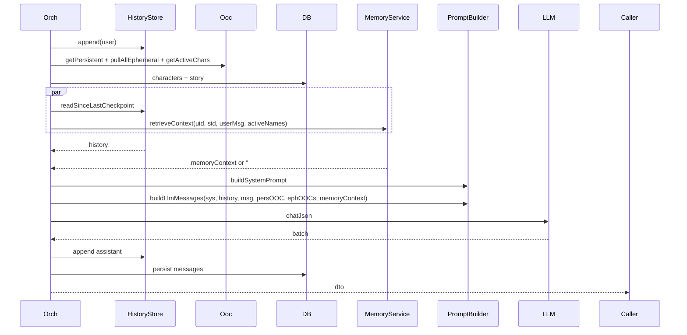

# P08.T5 — Wire Memory vào ChatOrchestrator

## 1. METADATA

| Field | Value |
|-------|-------|
| Task ID | P08.T5 |
| Phase | 8 |
| Depends on | P08.T4 |
| Complexity | Low |
| Risk | Medium |

---

## 2. MỤC TIÊU & SCOPE

**In-scope**:
- Inject `MemoryService` vào `ChatOrchestratorService`.
- Trong `handleUserTurn`: sau khi resolve characters, call `memoryService.retrieveContext` (parallel với history read để tiết kiệm latency).
- Truyền `memoryContext` vào `promptBuilder.buildLlmMessages` (đã hỗ trợ ở P06.T3).
- Telemetry: log retrievalTimeMs, contextLength.
- Graceful: nếu retrieve throw → log + treat as '' (orchestrator KHÔNG fail).

---

## 3. FILES CẦN SỬA

| # | Path |
|---|------|
| 1 | `apps/server/src/modules/chat/services/chat-orchestrator.service.ts` |
| 2 | `apps/server/src/modules/chat/chat.module.ts` — import MemoryModule |
| 3 | E2E test thêm verify memory context inject |

---

## 4. UPDATED SEQUENCE — handleUserTurn with memory



---

## 5. CODE CHANGES (pseudocode)

### 5.1. `chat-orchestrator.service.ts`

```
constructor (existing + memoryService: MemoryService)

handleUserTurn(...):
  ... (existing steps 1-4)
  
  // 5. Parallel: history + memory
  const [historyResult, memoryContext] = await Promise.all([
    historyStore.readSinceLastCheckpoint(ctx.sessionId),
    safeRetrieveMemory(ctx.userId, ctx.storyId, userMessage, characters.map(c => c.name))
  ])
  history = historyResult
  
  // ... (existing build prompts step)
  systemPrompt = promptBuilder.buildSystemPrompt({...})
  historyForLLM = history.slice(0, -1)
  llmMessages = promptBuilder.buildLlmMessages(
    systemPrompt,
    historyForLLM,
    userMessage,
    persistentOOC,
    allEphemerals,
    memoryContext || null  // <-- inject
  )
  
  ... (rest of pipeline unchanged)

private async safeRetrieveMemory(uid, sid, msg, names): Promise<string> {
  const t0 = Date.now()
  try {
    const ctx = await memoryService.retrieveContext(uid, sid, msg, names)
    logger.debug({ ms: Date.now()-t0, len: ctx.length }, 'memory retrieved')
    return ctx
  } catch (e) {
    logger.warn({ err: e, ms: Date.now()-t0 }, 'memory retrieve failed, continuing')
    return ''
  }
}
```

### 5.2. `chat.module.ts`

```
imports: [
  ...existing,
  MemoryModule,
]
```

---

## 6. ACCEPTANCE & TEST PLAN

### Acceptance
- [ ] After 3 ended sessions cho cùng story → tin mới → prompt log chứa `[TRÍ NHỚ DÀI HẠN]` section.
- [ ] User A không thấy memory của user B.
- [ ] Chroma down → chat vẫn hoạt động (response ok, memory section empty).
- [ ] Multi-query LLM fail → fallback (single query) vẫn retrieve.
- [ ] Retrieve time < 3s (warm cache); parallel với history đo total turn time tăng ≤1s.
- [ ] Empty memory (story mới) → no section injected.

### E2E
- Seed 3 ended sessions với plot rõ ràng → assert response từ LLM reference sự kiện cũ.
- Kill chroma container → send message → 200 ok response, log warn.
