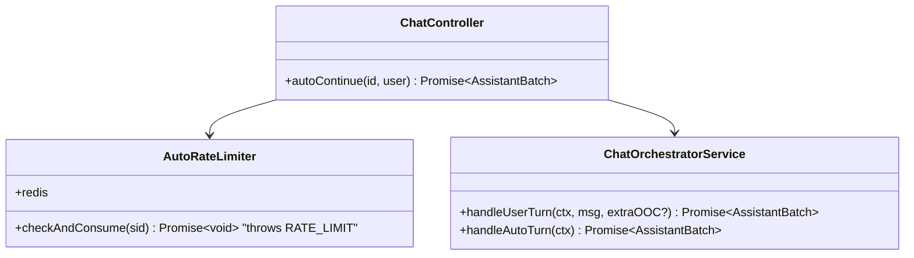
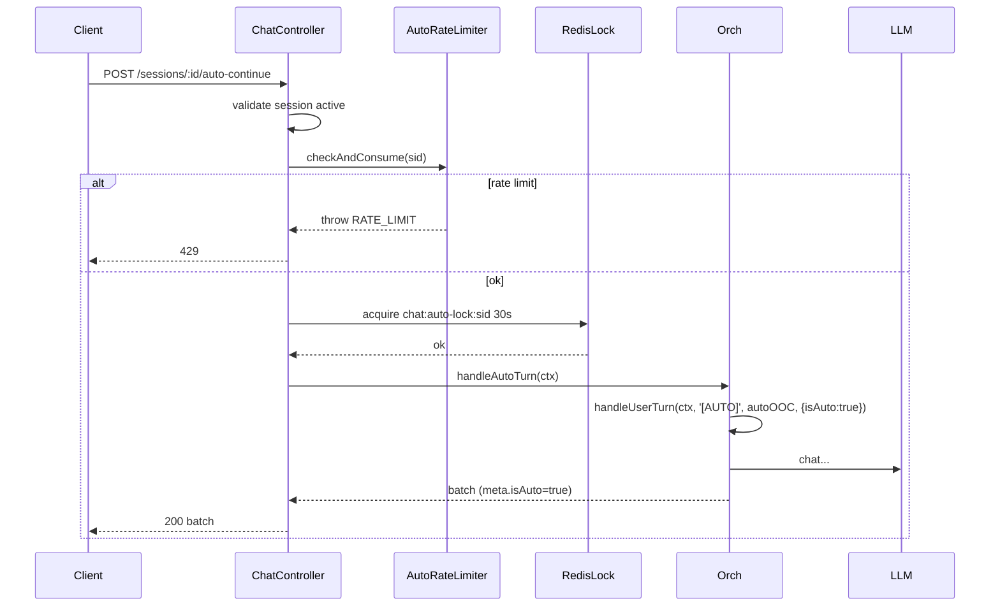

# P09.T1 — Auto Chat Orchestrator + Endpoint

## 1. METADATA

| Field | Value |
|-------|-------|
| Task ID | P09.T1 |
| Phase | 9 — Auto Chat & Shop |
| Depends on | P08 hoàn thành |
| Complexity | Medium |
| Risk | Medium (loops, rate limit) |

---

## 2. MỤC TIÊU & SCOPE

**In-scope**:
- `ChatOrchestratorService.handleAutoTurn(ctx)` — reuse pipeline với userMessage placeholder + auto ephemeral OOC.
- `POST /chat/sessions/:id/auto-continue` endpoint.
- Per-session lock `chat:auto-lock:{sid}` 30s.
- Rate limit dedicated `auto:rl:{sid}` token-bucket 1 req / 3s.
- Marker trong message để client biết "[AUTO]" turn.

---

## 3. FILES CẦN TẠO / SỬA

| # | Path |
|---|------|
| 1 | `apps/server/src/modules/chat/services/chat-orchestrator.service.ts` — thêm `handleAutoTurn` |
| 2 | `apps/server/src/modules/chat/chat.controller.ts` — endpoint |
| 3 | `apps/server/src/modules/chat/services/auto-rate-limiter.service.ts` |
| 4 | `packages/prompts/v1/auto_turn_ooc.md` |
| 5 | `apps/server/test/chat-auto.e2e-spec.ts` |

---

## 4. CLASS DIAGRAM



---

## 5. CHI TIẾT

### 5.1. `handleUserTurn` signature thay đổi

```
handleUserTurn(ctx: ChatContext, userMessage: string, extraEphemeralOOC?: string, opts?: { isAuto?: boolean }): Promise<AssistantBatch>
```

- `extraEphemeralOOC` được merge vào ephemeralOOCs trước khi build prompt.
- `opts.isAuto=true` → set `meta.isAuto = true` trên persisted messages; bỏ qua append user-jsonl (vì user message là placeholder).

### 5.2. `handleAutoTurn(ctx)`

```
handleAutoTurn(ctx: ChatContext): Promise<AssistantBatch>

Constants:
  AUTO_PLACEHOLDER_MSG = '[AUTO]'
  AUTO_OOC_TEMPLATE = loadTemplate('auto_turn_ooc')

Logic:
  return await handleUserTurn(ctx, AUTO_PLACEHOLDER_MSG, AUTO_OOC_TEMPLATE, { isAuto: true })
```

### 5.3. `auto_turn_ooc.md`

```markdown
[Chế độ AUTO]
Người chơi đã bật chế độ tự động. Hãy tự tiếp tục câu chuyện:
- Bạn được phép TỰ ĐÓNG VAI User (max 1 lượt thoại ngắn) để thúc đẩy cốt truyện.
- HOẶC để các nhân vật tương tác với nhau / narrator mô tả bối cảnh.
- Giữ nhịp chậm, không nhảy quá nhiều sự kiện trong 1 lượt.
- Tuyệt đối KHÔNG kết thúc câu chuyện đột ngột.
```

### 5.4. Endpoint

```
@Post('sessions/:id/auto-continue')
@UseGuards(FirebaseAuthGuard)
autoContinue(id, @CurrentUser() user): Promise<AssistantBatch>

Logic:
  // 1. Validate session
  session = await chatSessionService.getActive(id, user.uid)  // throw NOT_FOUND/FORBIDDEN/SESSION_ENDED
  
  // 2. Rate limit
  await autoRateLimiter.checkAndConsume(id)
  
  // 3. Per-session lock (giống manual nhưng key khác)
  return await lockService.withLock(`chat:auto-lock:${id}`, 30, async () => {
    return await orchestrator.handleAutoTurn({
      sessionId: id, userId: user.uid, storyId: session.storyId
    })
  })
```

### 5.5. `AutoRateLimiter.checkAndConsume(sid)`

```
Logic:
  key = `auto:rl:${sid}`
  // Simple cooldown: SETNX with EX 3
  ok = await redis.set(key, '1', 'NX', 'EX', 3)
  if !ok:
    ttl = await redis.ttl(key)
    throw new AppException(ERR.RATE_LIMIT, `Retry after ${ttl}s`, { retryAfter: ttl })
```

### 5.6. Response shape

Same as `handleUserTurn` (AssistantBatchDto), thêm `meta.isAuto: true` để client biết.

---

## 6. SEQUENCE



---

## 7. ACCEPTANCE & TEST PLAN

### Acceptance
- [ ] POST /auto-continue → trả AssistantBatch hợp lệ.
- [ ] meta.isAuto=true trong response.
- [ ] Gọi 2 lần liên tiếp < 3s → 429 RATE_LIMIT.
- [ ] Gọi 10 lần (cách 3s+) → 10 batch liên tục, story tiến triển.
- [ ] Concurrent: 2 calls cùng lúc → 1 success, 1 throws SESSION_LOCKED (do auto-lock).
- [ ] Session ended → 410/400 SESSION_ENDED.
- [ ] Memory context vẫn được inject (parallel với history).

### Tests
- E2E: setup session, gọi auto 5 lần, assert message count tăng.
