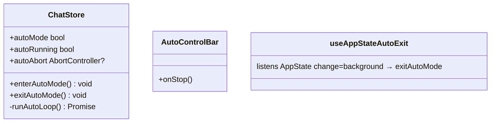
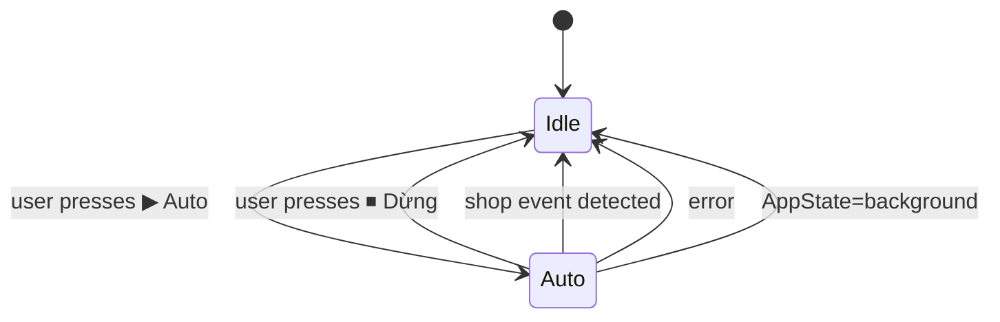
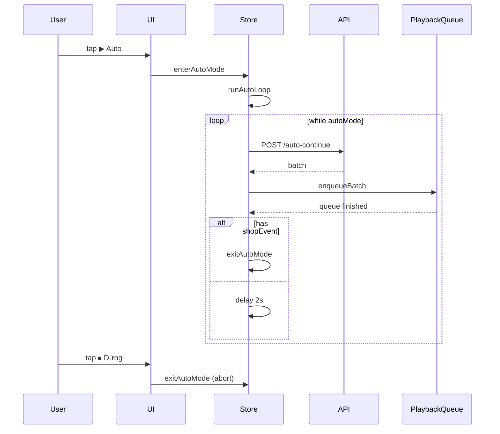

# P09.T2 — Auto Mode UI + Loop Logic (Client)

## 1. METADATA

| Field | Value |
|-------|-------|
| Task ID | P09.T2 |
| Phase | 9 |
| Depends on | P09.T1, P05.T1 (PlaybackQueueManager) |
| Complexity | Medium |
| Risk | Medium (race conditions, cancellation) |

---

## 2. MỤC TIÊU & SCOPE

**In-scope**:
- ChatStore: `autoMode`, `autoLoopId` (number ref), `autoAbort` (AbortController).
- Actions: `enterAutoMode`, `exitAutoMode`.
- Loop: while autoMode → callAuto → enqueueBatch → waitForQueueFinish → delay 2s → loop.
- UI: AutoControlBar component (replaces InputBar khi autoMode).
- Exit conditions: user nhấn Dừng / shop event / error / app background.
- Use `AppState` listener: khi background → exitAutoMode để tránh battery drain.

---

## 3. FILES CẦN TẠO / SỬA

| # | Path |
|---|------|
| 1 | `apps/mobile/src/features/chat/store/chat.store.ts` — thêm autoMode state + actions |
| 2 | `apps/mobile/src/features/chat/services/chat.service.ts` — thêm `postAutoContinue` |
| 3 | `apps/mobile/src/features/chat/components/AutoControlBar.tsx` |
| 4 | `apps/mobile/src/features/chat/components/ChatRoomScreen.tsx` — toggle InputBar/AutoControlBar |
| 5 | `apps/mobile/src/features/chat/hooks/useAppStateAutoExit.ts` |

---

## 4. CLASS / STATE DIAGRAM



State transitions:



---

## 5. CHI TIẾT

### 5.1. Store additions

```
autoMode: boolean = false
autoAbort: AbortController | null = null

enterAutoMode():
  if autoMode → return
  set({ autoMode: true, inputLocked: true, autoAbort: new AbortController() })
  runAutoLoop()  // fire & forget

exitAutoMode():
  if !autoMode → return
  get().autoAbort?.abort()
  set({ autoMode: false, inputLocked: false, autoAbort: null })

async runAutoLoop():
  const signal = get().autoAbort!.signal
  while (get().autoMode && !signal.aborted):
    try:
      batch = await chatService.postAutoContinue(get().sessionId, signal)
      
      // Detect shop event before playback (so we can keep audio for that batch)
      const hasShopEvent = batch.messages.some(m => m.shopEvent)
      
      get().enqueueBatch(batch.messages)  // queue audio
      
      // Wait queue finish (or abort)
      await raceAbort(get().waitForQueueFinish(), signal)
      if signal.aborted → break
      
      if hasShopEvent:
        get().exitAutoMode()
        break
      
      await delay(2000, signal)
      if signal.aborted → break
    catch e:
      if e.name === 'AbortError' → break
      logger.warn('auto loop error', e)
      Toast.show('Auto mode dừng do lỗi: ' + (e.message ?? 'unknown'))
      get().exitAutoMode()
      break
  // ensure cleanup
  if get().autoMode: set({ autoMode: false, inputLocked: false })
```

#### Helpers

```
function delay(ms, signal): Promise<void> {
  return new Promise((resolve, reject) => {
    const t = setTimeout(resolve, ms)
    signal.addEventListener('abort', () => { clearTimeout(t); reject(new DOMException('aborted','AbortError')) })
  })
}
function raceAbort(p, signal): Promise<T> {
  return new Promise((res, rej) => {
    p.then(res, rej)
    signal.addEventListener('abort', () => rej(new DOMException('aborted','AbortError')))
  })
}
```

### 5.2. `chatService.postAutoContinue(sid, signal?)`

```
postAutoContinue(sid, signal?): Promise<AssistantBatch>
  res = await api.post(`/chat/sessions/${sid}/auto-continue`, {}, { signal })
  return res.data
```

### 5.3. `AutoControlBar`

```
Props: { onStop: () => void }
UI:
  <View style={row}>
    <ActivityIndicator />
    <Text>Đang tự động...</Text>
    <Pressable onPress={onStop}><Text>⏹ Dừng</Text></Pressable>
  </View>
```

### 5.4. `ChatRoomScreen` toggle

```
const { autoMode, enterAutoMode, exitAutoMode } = useChatStore()
return (
  <>
    <MessageList ... />
    {autoMode 
      ? <AutoControlBar onStop={exitAutoMode} />
      : <InputBar rightExtra={<AutoButton onPress={enterAutoMode} />} />
    }
  </>
)
```

### 5.5. `useAppStateAutoExit`

```
useEffect(() => {
  const sub = AppState.addEventListener('change', (s) => {
    if (s !== 'active' && useChatStore.getState().autoMode) {
      useChatStore.getState().exitAutoMode()
    }
  })
  return () => sub.remove()
}, [])
```

Call from ChatRoomScreen.

---

## 6. SEQUENCE



---

## 7. ACCEPTANCE & TEST PLAN

### Acceptance
- [ ] Bật Auto → bubbles xuất hiện tuần tự, audio phát.
- [ ] Nhấn Dừng → kết thúc sau lượt hiện tại (queue đang phát có thể chạy nốt), state về Idle.
- [ ] Shop event → auto tự dừng + ShopChoiceCard hiện.
- [ ] Rate limit 429 → Toast + dừng.
- [ ] Background app → tự dừng.
- [ ] Không có 2 loop song song nếu user spam Auto button.

### Tests
- Manual scenarios + Detox (long-running test với mocked API).
