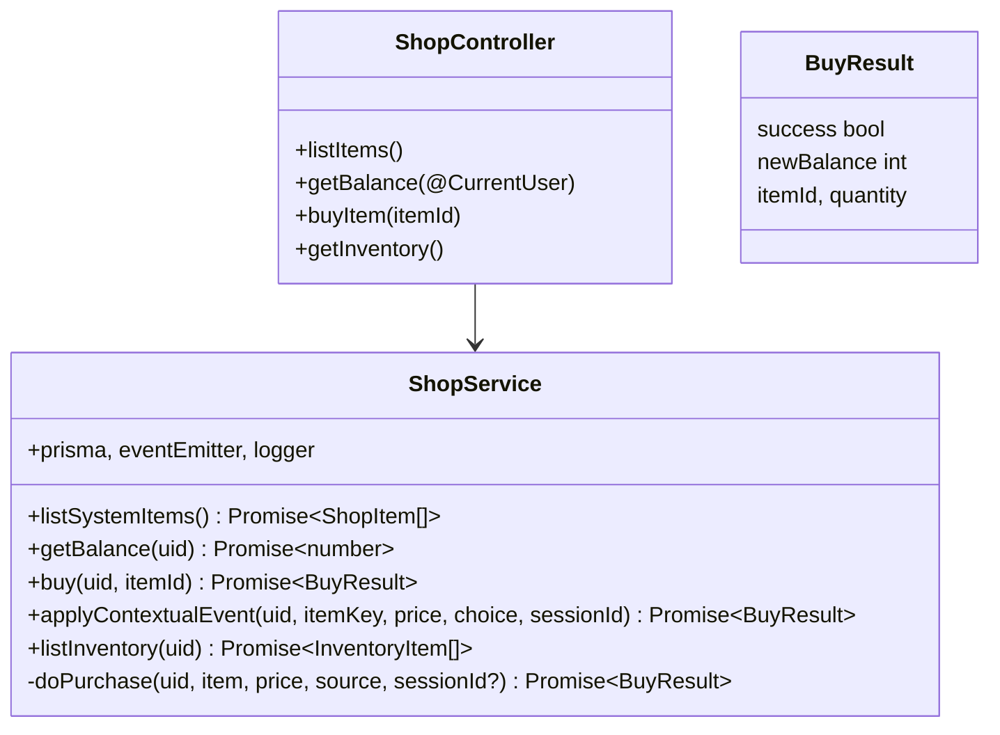
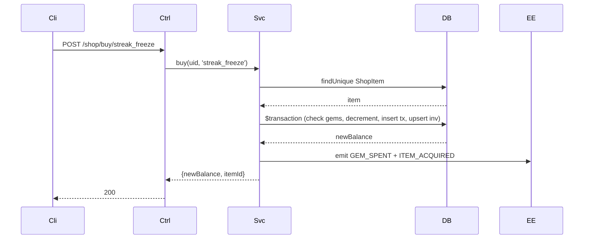

# P09.T3 — ShopModule (Contextual + System Shop)

## 1. METADATA

| Field | Value |
|-------|-------|
| Task ID | P09.T3 |
| Phase | 9 |
| Depends on | P09.T1 |
| Complexity | Medium |
| Risk | Medium (financial integrity → transactions) |

---

## 2. MỤC TIÊU & SCOPE

**In-scope**:
- Prisma models: `ShopItem`, `ShopTransaction`, `Inventory` (+ migration + seed).
- `ShopService`:
  - `listSystemItems()` (filter active=true, category='system').
  - `getBalance(uid)`.
  - `buy(uid, itemId)` — system shop purchase.
  - `applyContextualEvent(uid, itemKey, price, choice, sessionId)` — chat-driven event.
- All purchases atomic: `$transaction([decrement gems, insert ShopTransaction, upsert Inventory])`.
- Emit event `GEM_SPENT` + `ITEM_ACQUIRED`.
- Error codes: `NOT_ENOUGH_GEMS`, `ITEM_NOT_FOUND`, `ITEM_INACTIVE`.

---

## 3. FILES CẦN TẠO

| # | Path |
|---|------|
| 1 | `apps/server/prisma/schema.prisma` — thêm models |
| 2 | `apps/server/prisma/migrations/202x_add_shop_tables/migration.sql` |
| 3 | `apps/server/prisma/seed.ts` — thêm shop items seed |
| 4 | `apps/server/src/modules/shop/shop.module.ts` |
| 5 | `apps/server/src/modules/shop/shop.service.ts` |
| 6 | `apps/server/src/modules/shop/shop.controller.ts` |
| 7 | `apps/server/src/modules/shop/dto/buy.dto.ts` |
| 8 | `apps/server/src/modules/shop/shop.service.spec.ts` |

---

## 4. CLASS DIAGRAM



---

## 5. CHI TIẾT

### 5.1. Prisma models

```prisma
model ShopItem {
  id          String   @id
  name        String
  description String   @db.Text
  priceGems   Int      @map("price_gems")
  category    String   // 'system' | 'cosmetic' | 'contextual'
  active      Boolean  @default(true)
  metadata    Json?
  createdAt   DateTime @default(now()) @map("created_at")
  
  transactions ShopTransaction[]
  inventories  Inventory[]
  @@index([category, active])
  @@map("shop_items")
}

model ShopTransaction {
  id        String   @id @default(uuid())
  userId    String   @map("user_id")
  itemId    String   @map("item_id")
  pricePaid Int      @map("price_paid")
  source    String   // 'system_shop' | 'contextual_event'
  sessionId String?  @map("session_id")
  createdAt DateTime @default(now()) @map("created_at")
  
  user UsersMeta @relation(fields: [userId], references: [uid], onDelete: Cascade)
  item ShopItem  @relation(fields: [itemId], references: [id])
  @@index([userId, createdAt])
  @@map("shop_transactions")
}

model Inventory {
  id         String   @id @default(uuid())
  userId     String   @map("user_id")
  itemId     String   @map("item_id")
  quantity   Int      @default(1)
  acquiredAt DateTime @default(now()) @map("acquired_at")
  
  user UsersMeta @relation(fields: [userId], references: [uid], onDelete: Cascade)
  item ShopItem  @relation(fields: [itemId], references: [id])
  @@unique([userId, itemId])
  @@map("inventory")
}
```

Add `gems Int @default(0)` to `UsersMeta` if not exists (verify P01.T1).

### 5.2. Seed items

```
const seedItems = [
  { id: 'streak_freeze', name: 'Streak Freeze', description: '...', priceGems: 50, category: 'system' },
  { id: 'gem_pack_small', name: 'Gói gem nhỏ', description: '...', priceGems: 0 /* IAP placeholder */, category: 'system', active: false },
  // contextual items đăng ký theo cost suggested
  { id: 'love_ring', name: 'Vòng tình yêu', description: '...', priceGems: 15, category: 'contextual' },
  { id: 'shield_charm', name: 'Bùa hộ mệnh', description: '...', priceGems: 25, category: 'contextual' },
]
prisma.shopItem.upsert(...) for each
```

### 5.3. `doPurchase(uid, item, price, source, sessionId?)`

```
Internal helper (private)

Logic:
  return await prisma.$transaction(async tx => {
    const user = await tx.usersMeta.findUnique({ where: { uid }, select: { gems: true } })
    if !user → throw NOT_FOUND
    if user.gems < price → throw AppException(ERR.NOT_ENOUGH_GEMS, '', { required: price, have: user.gems })
    
    const updated = await tx.usersMeta.update({
      where: { uid }, data: { gems: { decrement: price } }, select: { gems: true }
    })
    await tx.shopTransaction.create({ data: { userId: uid, itemId: item.id, pricePaid: price, source, sessionId: sessionId ?? null } })
    await tx.inventory.upsert({
      where: { userId_itemId: { userId: uid, itemId: item.id } },
      update: { quantity: { increment: 1 } },
      create: { userId: uid, itemId: item.id, quantity: 1 }
    })
    return { newBalance: updated.gems, itemId: item.id }
  })
  
  // After tx commit:
  eventEmitter.emit(EVENTS.GEM_SPENT, { userId: uid, amount: price, source })
  eventEmitter.emit(EVENTS.ITEM_ACQUIRED, { userId: uid, itemId: item.id, source })
```

### 5.4. `buy(uid, itemId)` (system shop)

```
Logic:
  item = await prisma.shopItem.findUnique({ where: { id: itemId } })
  if !item → throw ITEM_NOT_FOUND
  if !item.active → throw ITEM_INACTIVE
  if item.category !== 'system' → throw FORBIDDEN
  
  return await doPurchase(uid, item, item.priceGems, 'system_shop')
```

### 5.5. `applyContextualEvent(uid, itemKey, price, choice, sessionId)`

```
Logic:
  if choice === 'decline' → return { success: true, newBalance: await getBalance(uid), itemId: null }
  
  // itemKey is canonical id from prompt; ensure exists (auto-register if not yet)
  item = await prisma.shopItem.findUnique({ where: { id: itemKey } })
  if !item:
    // Auto-create as contextual to track unique items
    item = await prisma.shopItem.create({
      data: { id: itemKey, name: itemKey, description: 'Contextual item', priceGems: price, category: 'contextual', active: true }
    })
  
  // Use price from event (LLM-suggested), not item.priceGems (which might differ)
  const result = await doPurchase(uid, item, price, 'contextual_event', sessionId)
  return { success: true, ...result }
```

### 5.6. Controller

```
@Controller('shop')
@UseGuards(FirebaseAuthGuard)
class ShopController:
  GET /items → listSystemItems
  GET /balance → getBalance(user.uid)
  POST /buy/:itemId → buy(user.uid, itemId)
  GET /inventory → listInventory(user.uid)
```

---

## 6. SEQUENCE — System purchase



---

## 7. ACCEPTANCE & TEST PLAN

### Acceptance
- [ ] Mua thành công → gems giảm đúng, inventory tăng, transaction logged.
- [ ] Mua khi không đủ → 402 NOT_ENOUGH_GEMS, không state change.
- [ ] Mua item inactive → ITEM_INACTIVE.
- [ ] Concurrent: 2 buys cùng item → cả 2 atomic, inventory quantity = 2 (hoặc 1 fails if gem race).
- [ ] applyContextualEvent decline → no state change.
- [ ] applyContextualEvent với itemKey mới → auto-create ShopItem.
- [ ] Event GEM_SPENT emitted sau commit.

### Tests
- Unit: mock prisma transaction.
- Integration: real DB with seed.
