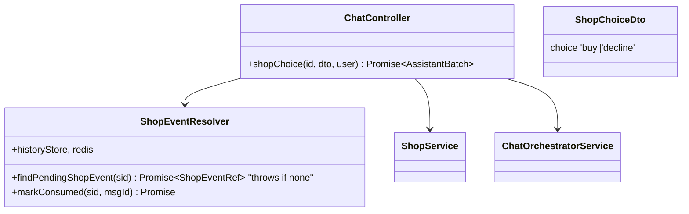
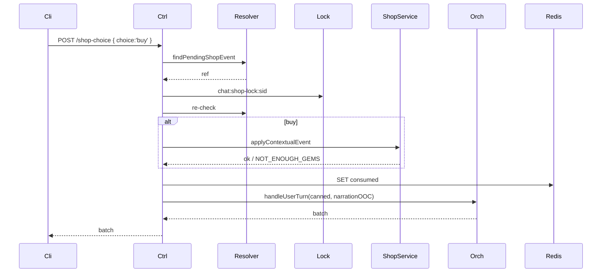

# P09.T4 — Chat Shop-Choice Endpoint + Narration Branch

## 1. METADATA

| Field | Value |
|-------|-------|
| Task ID | P09.T4 |
| Phase | 9 |
| Depends on | P09.T3 |
| Complexity | Medium |
| Risk | Medium |

---

## 2. MỤC TIÊU & SCOPE

**In-scope**:
- `POST /chat/sessions/:id/shop-choice` body `{ choice: 'buy'|'decline' }`.
- Read last assistant batch (jsonl) → tìm message có `shopEvent` field.
- If `buy` → `shopService.applyContextualEvent`. If `decline` → skip.
- Trigger orchestrator `handleUserTurn` với:
  - userMessage = canned response (好，我买了 / 不用了，谢谢)
  - extraEphemeralOOC = narration instruction theo branch.
- Idempotent per shopEvent (mark consumed in Redis: `chat:shop-consumed:{sid}:{msgId}` TTL 24h).

---

## 3. FILES CẦN TẠO / SỬA

| # | Path |
|---|------|
| 1 | `apps/server/src/modules/chat/chat.controller.ts` — endpoint |
| 2 | `apps/server/src/modules/chat/dto/shop-choice.dto.ts` |
| 3 | `apps/server/src/modules/chat/services/shop-event-resolver.service.ts` |
| 4 | `apps/server/src/modules/chat/services/history-store.service.ts` — thêm `getLastAssistantBatch(sid)` |
| 5 | `packages/prompts/v1/shop_choice_branches.md` (templates buy/decline) |

---

## 4. CLASS DIAGRAM



---

## 5. CHI TIẾT

### 5.1. Types

```
type ShopEvent = {
  msgId: string                // assistant message id
  itemName: string             // canonical id (e.g. 'love_ring')
  itemDisplayName: string      // tên hiển thị Tiếng Việt
  price: number                // gems
  description?: string
}

type ShopEventRef = {
  sessionId: string
  msgId: string
  event: ShopEvent
}
```

### 5.2. `HistoryStore.getLastAssistantBatch(sid)`

```
Logic:
  entries = await readAll(sid)
  for i = entries.length-1 ; i >= 0 ; i--:
    if entries[i].type === 'assistant_batch' → return entries[i].messages
  return []
```

### 5.3. `ShopEventResolver.findPendingShopEvent(sid)`

```
Logic:
  batch = await historyStore.getLastAssistantBatch(sid)
  for each msg in batch:
    if msg.shopEvent:
      consumed = await redis.get(`chat:shop-consumed:${sid}:${msg.id}`)
      if consumed → throw AppException(ERR.SHOP_EVENT_ALREADY_RESOLVED, 'already')
      return { sessionId: sid, msgId: msg.id, event: msg.shopEvent }
  throw AppException(ERR.NO_PENDING_SHOP_EVENT, 'no pending shop event')
```

### 5.4. `markConsumed(sid, msgId)`

```
await redis.set(`chat:shop-consumed:${sid}:${msgId}`, '1', 'EX', 86400)
```

### 5.5. Endpoint

```
@Post('sessions/:id/shop-choice')
@UseGuards(FirebaseAuthGuard)
async shopChoice(@Param('id') id, @Body() dto: ShopChoiceDto, @CurrentUser() user)

Logic:
  // 1. Validate session
  session = await chatSessionService.getActive(id, user.uid)
  
  // 2. Find shop event
  ref = await shopEventResolver.findPendingShopEvent(id)
  
  // 3. Apply choice (with lock to prevent concurrent)
  return await lockService.withLock(`chat:shop-lock:${id}`, 30, async () => {
    // Re-check after lock
    ref = await shopEventResolver.findPendingShopEvent(id)  // may throw if already consumed
    
    if dto.choice === 'buy':
      try:
        await shopService.applyContextualEvent(user.uid, ref.event.itemName, ref.event.price, 'buy', id)
      catch e:
        if e.code === ERR.NOT_ENOUGH_GEMS:
          // Return special response so client can show toast and let user retry decline
          throw e  // 402
        throw e
    
    // 4. Mark consumed BEFORE orchestrator to prevent re-entry
    await shopEventResolver.markConsumed(id, ref.msgId)
    
    // 5. Build narration OOC
    template = loadTemplate('shop_choice_branches')
    ooc = template[dto.choice]
      .replace('{{ITEM}}', ref.event.itemDisplayName)
      .replace('{{PRICE}}', ref.event.price.toString())
    
    cannedMsg = dto.choice === 'buy' ? '好，我买了' : '不用了，谢谢'
    
    return await orchestrator.handleUserTurn(
      { sessionId: id, userId: user.uid, storyId: session.storyId },
      cannedMsg,
      ooc
    )
  })
```

### 5.6. `shop_choice_branches.md`

```markdown
---BUY---
[Sự kiện cửa hàng] Người chơi đã đồng ý mua "{{ITEM}}" với giá {{PRICE}} gem.
Hãy mô tả ngắn (narrator) cảnh người chơi nhận vật phẩm và phản ứng nhân vật. Không lặp lại giá. Tiếp tục mạch truyện.
---DECLINE---
[Sự kiện cửa hàng] Người chơi đã từ chối mua "{{ITEM}}".
Hãy mô tả ngắn (narrator) cảnh người chơi rời quầy hoặc đặt vật phẩm xuống. Nhân vật có thể có phản ứng nhẹ. Tiếp tục mạch truyện.
```

Parser: split by `---BUY---` / `---DECLINE---`.

### 5.7. Error codes

- `NO_PENDING_SHOP_EVENT` → 400
- `SHOP_EVENT_ALREADY_RESOLVED` → 409

---

## 6. SEQUENCE



---

## 7. ACCEPTANCE & TEST PLAN

### Acceptance
- [ ] Shop event xuất hiện → buy → gems giảm, narration tiếp tục mô tả nhận vật.
- [ ] Decline → no gem change, narration nhánh khác.
- [ ] Buy nhưng không đủ gems → 402, event vẫn pending (chưa markConsumed), user có thể decline.
- [ ] Re-call sau khi consumed → 409 SHOP_EVENT_ALREADY_RESOLVED.
- [ ] No pending shop event → 400 NO_PENDING_SHOP_EVENT.
- [ ] Concurrent 2 calls → 1 success, 1 conflict.

### Tests
- Mock shopService + orchestrator unit.
- E2E full flow.
