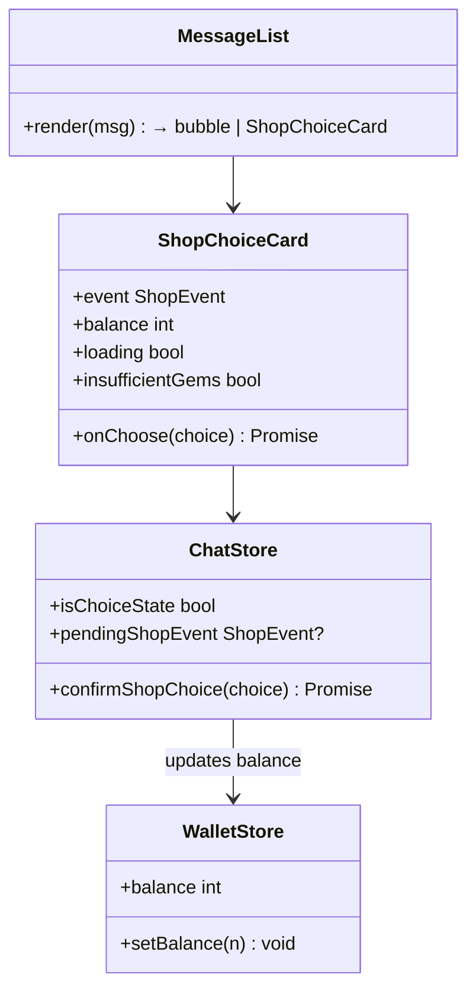
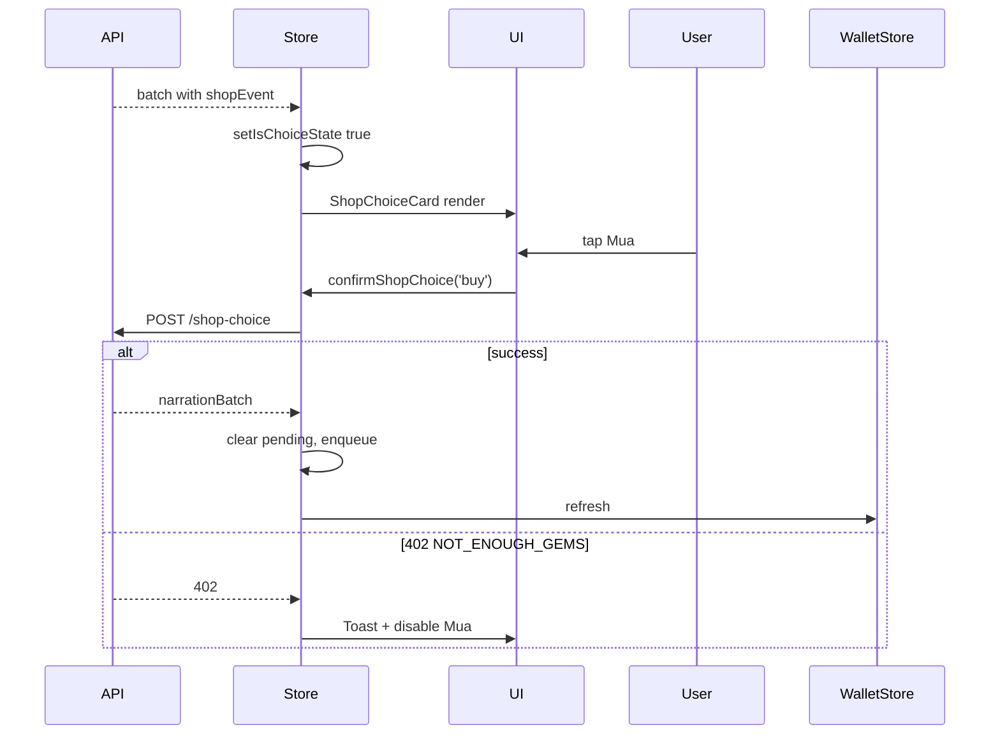

# P09.T5 — ShopChoiceCard UI + Chat Integration

## 1. METADATA

| Field | Value |
|-------|-------|
| Task ID | P09.T5 |
| Phase | 9 |
| Depends on | P09.T4, P09.T2 |
| Complexity | Medium |
| Risk | Low |

---

## 2. MỤC TIÊU & SCOPE

**In-scope**:
- `ShopChoiceCard` component: hiển thị tên, giá, balance, 2 buttons.
- ChatStore: `isChoiceState`, `pendingShopEvent`, `confirmShopChoice(choice)`.
- MessageList: detect `message.shopEvent` → render ShopChoiceCard thay vì bubble (vẫn audio nếu có).
- Insufficient gems (402): Toast + disable Mua, chỉ còn Không, cảm ơn.
- Auto-mode integration: khi card render → auto đã exit (do T2).
- Show balance updates trong real-time sau buy.

---

## 3. FILES CẦN TẠO / SỬA

| # | Path |
|---|------|
| 1 | `apps/mobile/src/features/chat/components/ShopChoiceCard.tsx` |
| 2 | `apps/mobile/src/features/chat/store/chat.store.ts` — thêm shop state + action |
| 3 | `apps/mobile/src/features/chat/components/MessageList.tsx` — render dispatcher |
| 4 | `apps/mobile/src/features/wallet/store/wallet.store.ts` — balance state (nếu chưa có) |
| 5 | `apps/mobile/src/features/chat/services/chat.service.ts` — `postShopChoice` |

---

## 4. CLASS DIAGRAM



---

## 5. CHI TIẾT

### 5.1. Store additions

```
isChoiceState: boolean = false
pendingShopEvent: { msgId, itemName, itemDisplayName, price, description? } | null = null

// When enqueueing batch, detect shopEvent and set state
enqueueBatch(messages):
  // existing logic to enqueue audio + append
  const shopMsg = messages.find(m => m.shopEvent)
  if shopMsg:
    set({ isChoiceState: true, pendingShopEvent: { msgId: shopMsg.id, ...shopMsg.shopEvent }, inputLocked: true })

confirmShopChoice(choice: 'buy'|'decline'):
  if !get().pendingShopEvent → return
  try:
    set({ choiceLoading: true })
    const batch = await chatService.postShopChoice(get().sessionId, { choice })
    set({ isChoiceState: false, pendingShopEvent: null, choiceLoading: false, inputLocked: false })
    get().enqueueBatch(batch.messages)
    // Refresh balance
    walletStore.getState().refresh()
  catch e:
    set({ choiceLoading: false })
    if e.code === 'NOT_ENOUGH_GEMS':
      Toast.show(`Bạn cần thêm ${e.details.required - e.details.have} gem`)
      // keep pending state so user can decline
      set({ insufficientGems: true })
    else if e.code === 'SHOP_EVENT_ALREADY_RESOLVED':
      set({ isChoiceState: false, pendingShopEvent: null, inputLocked: false })  // recover
    else:
      Toast.show('Lỗi: ' + e.message)
```

### 5.2. `chatService.postShopChoice(sid, body)`

```
postShopChoice(sid, { choice }): Promise<AssistantBatch>
  return (await api.post(`/chat/sessions/${sid}/shop-choice`, { choice })).data
```

### 5.3. `ShopChoiceCard`

```
Props:
  event: ShopEvent
  balance: number
  loading: boolean
  insufficientGems: boolean
  onChoose: (choice) => void

Render:
  <Card>
    <Header>🛍️ Cửa hàng trong game</Header>
    <Row>Vật phẩm: {event.itemDisplayName}</Row>
    <Row>Giá: {event.price} 💎</Row>
    {event.description && <Description>{event.description}</Description>}
    <ButtonRow>
      <PrimaryButton 
        disabled={loading || insufficientGems}
        onPress={() => onChoose('buy')}>
        💎 Mua
      </PrimaryButton>
      <SecondaryButton 
        disabled={loading}
        onPress={() => onChoose('decline')}>
        ❌ Không, cảm ơn
      </SecondaryButton>
    </ButtonRow>
    <Footer>Số dư: {balance} 💎</Footer>
    {loading && <ActivityIndicator overlay />}
  </Card>
```

### 5.4. `MessageList` dispatcher

```
renderItem({ item }):
  if item.shopEvent && item.id === pendingShopEvent?.msgId:
    return (
      <>
        <CharacterBubble msg={item} />   // narration kèm theo (nếu có text)
        <ShopChoiceCard event={item.shopEvent} balance={balance} loading={choiceLoading} insufficientGems={insufficientGems} onChoose={confirmShopChoice} />
      </>
    )
  // normal dispatch
```

Note: shop event message vẫn có audio narrator → bubble renders ABOVE the card. Card chỉ render khi event là pending (matches `pendingShopEvent.msgId`).

### 5.5. Wallet store integration

```
WalletStore:
  balance: number
  refresh():
    res = await api.get('/shop/balance')
    set({ balance: res.data.balance })
```

Refresh sau khi: login, shop buy, mission claim, daily login bonus.

### 5.6. Auto mode coupling

- T2 `runAutoLoop` đã exit khi shopEvent detected → input unlocked nhưng `isChoiceState=true` keeps `inputLocked=true`. State consistent.
- After user choice → loop KHÔNG tự re-enter (user phải bật Auto lại). Đây là thiết kế cố ý — tránh runaway purchasing.

---

## 6. SEQUENCE



---

## 7. ACCEPTANCE & TEST PLAN

### Acceptance
- [ ] Shop event arrives → card hiện, input locked, audio narration vẫn phát.
- [ ] Mua thành công → card biến mất, narration nhánh "buy" phát, balance giảm trong UI.
- [ ] Decline → card biến mất, narration nhánh "decline" phát.
- [ ] Insufficient gems → Toast, button Mua disabled, Decline vẫn dùng được.
- [ ] Auto mode running → shop event → auto exit + card hiện đúng.
- [ ] App reload → khi mở chat lại, card hiện lại (state recovered từ jsonl last batch).

### Tests
- Storybook ShopChoiceCard 3 states (default, loading, insufficient).
- Detox E2E buy flow.
