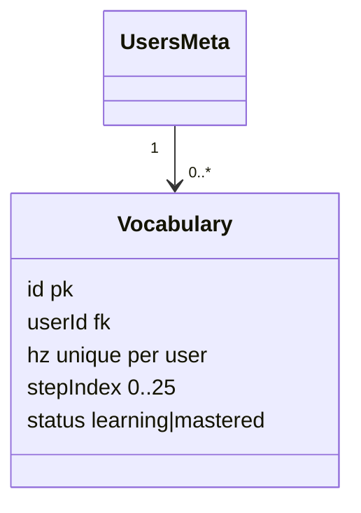

# P10.T1 — Vocabulary Table + SRS Schedule

## 1. METADATA

| Field | Value |
|-------|-------|
| Task ID | P10.T1 |
| Phase | 10 — Vocabulary SRS |
| Depends on | P09 hoàn thành |
| Complexity | Low |
| Risk | Low |

---

## 2. MỤC TIÊU & SCOPE

**In-scope**:
- Prisma `Vocabulary` model + migration + indexes.
- Shared `SRS_SCHEDULE` const (26 steps, seconds).
- Helper `srsIntervalMs(stepIndex)`.

---

## 3. FILES CẦN TẠO / SỬA

| # | Path |
|---|------|
| 1 | `apps/server/prisma/schema.prisma` — model Vocabulary + relation UsersMeta |
| 2 | `apps/server/prisma/migrations/202x_add_vocabulary/migration.sql` |
| 3 | `packages/shared-types/src/srs.ts` |

---

## 4. SCHEMA

```prisma
model Vocabulary {
  id              String   @id @default(uuid())
  userId          String   @map("user_id")
  sourceSessionId String?  @map("source_session_id")
  hz              String
  py              String
  vn              String
  sourceSentence  String?  @map("source_sentence") @db.Text
  status          String   @default("learning")   // 'learning' | 'mastered'
  stepIndex       Int      @default(0) @map("step_index")
  nextReviewDate  BigInt   @map("next_review_date")
  createdAt       DateTime @default(now()) @map("created_at")
  updatedAt       DateTime @updatedAt @map("updated_at")

  user UsersMeta @relation(fields: [userId], references: [uid], onDelete: Cascade)

  @@unique([userId, hz], name: "unique_user_hz")
  @@index([userId, status, nextReviewDate])
  @@index([userId, status])
  @@map("vocabulary")
}
```

`UsersMeta` (existing) add `vocabularies Vocabulary[]` reverse relation.

## 5. SRS_SCHEDULE

```ts
// packages/shared-types/src/srs.ts
export const SRS_SCHEDULE_SECONDS = [
  0,            // 0: ngay
  4 * 3600,     // 1: 4h
  8 * 3600,     // 2: 8h
  86400,        // 3: 1d
  2 * 86400,    // 4
  4 * 86400,    // 5
  7 * 86400,    // 6
  10 * 86400,   // 7
  14 * 86400,   // 8
  21 * 86400,   // 9
  30 * 86400,   // 10
  45 * 86400,   // 11
  60 * 86400,   // 12
  90 * 86400,   // 13
  120 * 86400,  // 14
  150 * 86400,  // 15
  180 * 86400,  // 16
  210 * 86400,  // 17
  240 * 86400,  // 18
  270 * 86400,  // 19
  300 * 86400,  // 20
  330 * 86400,  // 21
  365 * 86400,  // 22
  500 * 86400,  // 23
  600 * 86400,  // 24
  730 * 86400,  // 25 mastered
] as const

export const SRS_MASTERED_STEP = SRS_SCHEDULE_SECONDS.length - 1   // 25

export function srsIntervalMs(stepIndex: number): number {
  const safe = Math.max(0, Math.min(stepIndex, SRS_MASTERED_STEP))
  return SRS_SCHEDULE_SECONDS[safe] * 1000
}
```

(Schedule consolidated from `Document/Vocabulary/srs_schedule.md` — verify against doc before merge.)

---

## 6. SEQUENCE — N/A (schema)



---

## 7. ACCEPTANCE & TEST PLAN

- [ ] Migration apply success.
- [ ] Insert 2 rows same (userId, hz) → unique violation.
- [ ] Index used trong query getDue (EXPLAIN ANALYZE).
- [ ] `srsIntervalMs(0)` = 0; `srsIntervalMs(3)` = 86_400_000; `srsIntervalMs(100)` clamped to step 25.
- [ ] User deleted → vocabularies cascade deleted.
