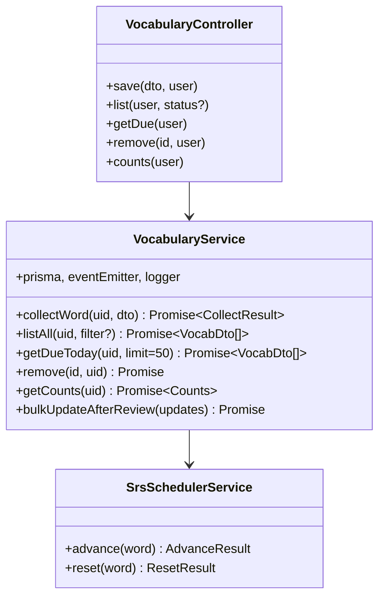
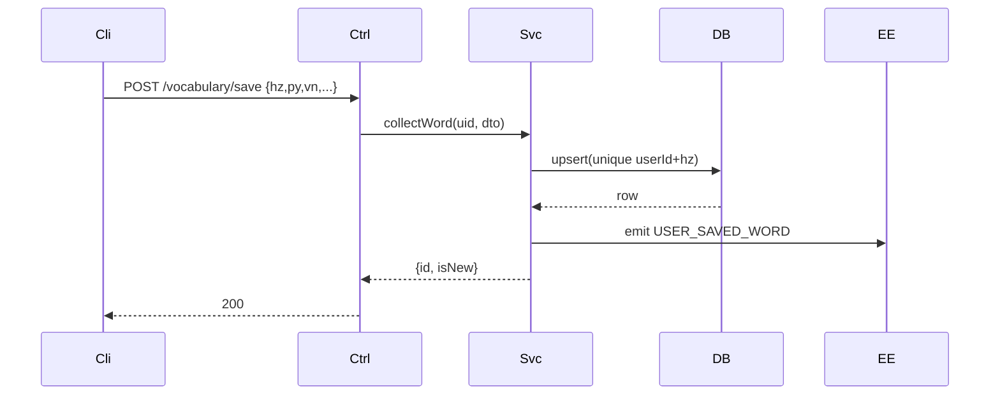

# P10.T2 — VocabularyModule (CRUD + SRS Scheduler)

## 1. METADATA

| Field | Value |
|-------|-------|
| Task ID | P10.T2 |
| Phase | 10 |
| Depends on | P10.T1 |
| Complexity | Medium |
| Risk | Low |

---

## 2. MỤC TIÊU & SCOPE

**In-scope**:
- `VocabularyService`: `collectWord` (UPSERT idempotent — preserves stepIndex), `listAll`, `getDueToday` (limit 50 newest-first), `remove` (ownership check), `getCounts` (returning total/learning/mastered/dueToday).
- `SrsSchedulerService`: `advance(word)` (step+1, clamp, compute nextReviewDate, detect mastered), `reset(word)` (step 0, immediate review).
- Endpoints: `POST /vocabulary/save`, `GET /vocabulary`, `GET /vocabulary/due`, `DELETE /vocabulary/:id`, `GET /vocabulary/counts`.
- Emit `USER_SAVED_WORD` event.

---

## 3. FILES CẦN TẠO

| # | Path |
|---|------|
| 1 | `apps/server/src/modules/vocabulary/vocabulary.module.ts` |
| 2 | `apps/server/src/modules/vocabulary/vocabulary.service.ts` |
| 3 | `apps/server/src/modules/vocabulary/vocabulary.controller.ts` |
| 4 | `apps/server/src/modules/vocabulary/srs-scheduler.service.ts` |
| 5 | `apps/server/src/modules/vocabulary/dto/save-word.dto.ts` |
| 6 | `apps/server/src/modules/vocabulary/dto/vocab.dto.ts` |
| 7 | `apps/server/src/modules/vocabulary/vocabulary.service.spec.ts` |
| 8 | `apps/server/src/modules/vocabulary/srs-scheduler.service.spec.ts` |

---

## 4. CLASS DIAGRAM



---

## 5. CHI TIẾT

### 5.1. DTOs

```
SaveWordDto:
  @IsString @Length(1,8) hz
  @IsString @Length(1,30) py
  @IsString @Length(1,200) vn
  @IsOptional @IsString @MaxLength(500) sourceSentence?
  @IsOptional @IsUUID sourceSessionId?

VocabDto:
  id, hz, py, vn, status, stepIndex, nextReviewDate(number), createdAt
```

### 5.2. `collectWord(uid, dto)`

```
Logic:
  // UPSERT
  result = await prisma.vocabulary.upsert({
    where: { unique_user_hz: { userId: uid, hz: dto.hz } },
    update: {
      sourceSentence: dto.sourceSentence ?? undefined,
      sourceSessionId: dto.sourceSessionId ?? undefined,
      // KHÔNG reset stepIndex/nextReviewDate/status
    },
    create: {
      userId: uid,
      hz: dto.hz, py: dto.py, vn: dto.vn,
      sourceSentence: dto.sourceSentence,
      sourceSessionId: dto.sourceSessionId,
      stepIndex: 0,
      status: 'learning',
      nextReviewDate: BigInt(Date.now()),  // ngay
    }
  })
  isNew = result.createdAt.getTime() === result.updatedAt.getTime()
  eventEmitter.emit(EVENTS.USER_SAVED_WORD, { userId: uid, wordId: result.id, hz: dto.hz, isNew })
  return { id: result.id, isNew }
```

### 5.3. `listAll(uid, filter?)`

```
filter: 'all' | 'learning' | 'mastered'
Logic:
  where = { userId: uid }
  if filter !== 'all' && filter: where.status = filter
  rows = await prisma.vocabulary.findMany({ where, orderBy: { createdAt: 'desc' }, take: 500 })
  return rows.map(toDto)
```

### 5.4. `getDueToday(uid, limit=50)`

```
Logic:
  rows = await prisma.vocabulary.findMany({
    where: {
      userId: uid,
      status: 'learning',
      nextReviewDate: { lte: BigInt(Date.now()) }
    },
    orderBy: { nextReviewDate: 'asc' },
    take: limit
  })
  return rows.map(toDto)
```

### 5.5. `remove(id, uid)`

```
Logic:
  row = await prisma.vocabulary.findUnique({ where: { id } })
  if !row → throw NOT_FOUND
  if row.userId !== uid → throw FORBIDDEN
  await prisma.vocabulary.delete({ where: { id } })
```

### 5.6. `getCounts(uid)`

```
Logic:
  [total, learning, mastered, due] = await Promise.all([
    prisma.vocabulary.count({ where: { userId: uid } }),
    prisma.vocabulary.count({ where: { userId: uid, status: 'learning' } }),
    prisma.vocabulary.count({ where: { userId: uid, status: 'mastered' } }),
    prisma.vocabulary.count({ where: { userId: uid, status: 'learning', nextReviewDate: { lte: BigInt(Date.now()) } } }),
  ])
  return { total, learning, mastered, dueToday: due }
```

### 5.7. `bulkUpdateAfterReview(updates)`

```
updates: Array<{ wordId, newStep, nextReviewDate, status }>

Logic:
  await prisma.$transaction(updates.map(u => prisma.vocabulary.update({
    where: { id: u.wordId },
    data: { stepIndex: u.newStep, nextReviewDate: BigInt(u.nextReviewDate), status: u.status }
  })))
```

### 5.8. `SrsSchedulerService`

```
advance(word):
  newStep = Math.min(word.stepIndex + 1, SRS_MASTERED_STEP)
  intervalMs = srsIntervalMs(newStep)
  nextReviewDate = Date.now() + intervalMs
  mastered = newStep >= SRS_MASTERED_STEP
  return { newStep, nextReviewDate, mastered, status: mastered ? 'mastered' : 'learning' }

reset(word):
  return { newStep: 0, nextReviewDate: Date.now(), mastered: false, status: 'learning' }
```

### 5.9. Controller (Firebase guard)

Routes as in scope. All take user.uid from `@CurrentUser`.

---

## 6. SEQUENCE — Save word



---

## 7. ACCEPTANCE & TEST PLAN

- [ ] Save mới → row tạo, isNew=true, nextReviewDate ≈ now.
- [ ] Save lại cùng hz → isNew=false, stepIndex giữ nguyên.
- [ ] getDue trả từ có nextReviewDate ≤ now, status='learning'.
- [ ] advance(step 0) → newStep=1, +4h.
- [ ] advance(step 25) → newStep=25 (clamp), mastered=true.
- [ ] reset → step 0, review ngay.
- [ ] remove other user's word → FORBIDDEN.
- [ ] counts: số khớp.

### Tests
- Unit: Scheduler edge cases (0, mid, max).
- Integration: real DB cho UPSERT.
