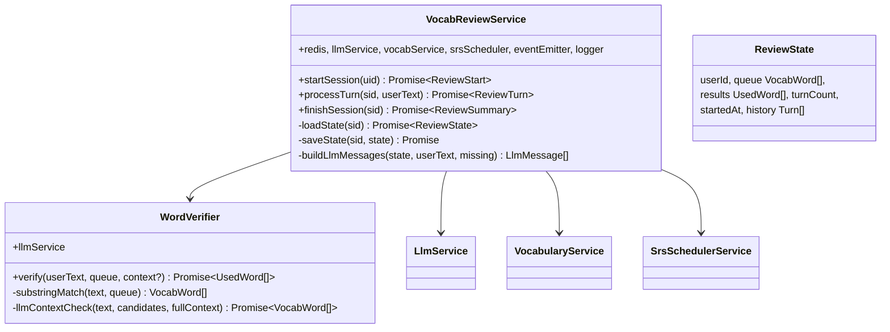
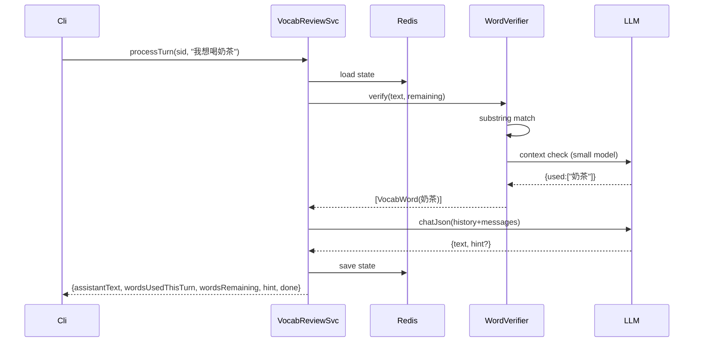

# P10.T3 — VocabReviewService (AI-driven Review Session)

## 1. METADATA

| Field | Value |
|-------|-------|
| Task ID | P10.T3 |
| Phase | 10 |
| Depends on | P10.T2 |
| Complexity | High |
| Risk | High (state machine, LLM verification quality) |

---

## 2. MỤC TIÊU & SCOPE

**In-scope**:
- `VocabReviewService`:
  - `startSession(uid)` → load due (max 20), persist state in Redis TTL 1h, build system prompt từ template.
  - `processTurn(sessionId, userText)` → verify words used (substring check + LLM context check), append turn history, generate AI reply (continue dialogue + hint nếu thiếu).
  - `finishSession(sessionId)` → advance/reset words, bulkUpdateAfterReview, emit `USER_COMPLETED_REVIEW`, cleanup Redis.
- `WordVerifier`: hybrid `substringMatch` + `llmContextCheck` (LLM judges xem từ có được dùng đúng nghĩa không).
- Schema responses Zod-strict.

---

## 3. FILES CẦN TẠO

| # | Path |
|---|------|
| 1 | `apps/server/src/modules/vocabulary/services/vocab-review.service.ts` |
| 2 | `apps/server/src/modules/vocabulary/services/word-verifier.service.ts` |
| 3 | `apps/server/src/modules/vocabulary/types/review-state.ts` |
| 4 | `packages/prompts/v1/review_session_system.md` |
| 5 | `packages/prompts/v1/review_verify_context.md` |
| 6 | `apps/server/src/modules/vocabulary/services/vocab-review.service.spec.ts` |

---

## 4. CLASS DIAGRAM



---

## 5. CHI TIẾT

### 5.1. Types

```
type ReviewState = {
  sessionId: string
  userId: string
  queue: VocabWord[]            // initial due words (immutable order)
  used: Set<string>             // wordIds đã pass
  failed: Set<string>           // wordIds đã fail (sai context lần đầu)
  history: { role: 'user'|'assistant', text: string }[]
  startedAt: number
  turnCount: number
}

type ReviewTurn = {
  assistantText: string
  wordsUsedThisTurn: string[]   // hz array
  wordsRemaining: string[]      // hz array
  hint: string | null
  done: boolean                 // true nếu tất cả used
}

type ReviewSummary = {
  totalWords: number
  wordsAdvanced: number
  wordsMastered: number
  wordsFailed: number
  duration: number  // ms
}
```

### 5.2. `startSession(uid)`

```
Logic:
  due = await vocabService.getDueToday(uid, 20)
  if due.length === 0:
    throw new AppException(ERR.NO_WORDS_DUE, 'No words due')
  
  sessionId = uuid()
  state: ReviewState = {
    sessionId, userId: uid,
    queue: due,
    used: new Set(), failed: new Set(),
    history: [],
    startedAt: Date.now(),
    turnCount: 0
  }
  await saveState(sessionId, state)
  
  systemPrompt = buildSystemPrompt(due)
  return {
    sessionId,
    queue: due.map(w => ({ id: w.id, hz: w.hz, py: w.py, vn: w.vn })),
    systemPrompt   // returned to client for transparency; server still owns
  }
```

### 5.3. State persistence (Redis)

```
saveState(sid, state):
  // Set không serialize được trực tiếp → convert to array
  serialized = { ...state, used: [...state.used], failed: [...state.failed] }
  await redis.set(`review:${sid}`, JSON.stringify(serialized), 'EX', 3600)

loadState(sid):
  raw = await redis.get(`review:${sid}`)
  if !raw → throw new AppException(ERR.NOT_FOUND, 'Review session not found or expired')
  obj = JSON.parse(raw)
  return { ...obj, used: new Set(obj.used), failed: new Set(obj.failed) }
```

### 5.4. `processTurn(sid, userText)`

```
Validation:
  - userText length 1..500

Logic:
  state = await loadState(sid)
  if state.userId !== currentUser.uid → FORBIDDEN  (controller layer)
  state.turnCount++
  if state.turnCount > 30 → throw REVIEW_TURN_LIMIT
  
  remainingWords = state.queue.filter(w => !state.used.has(w.id))
  if remainingWords.length === 0:
    return { assistantText: '', wordsUsedThisTurn: [], wordsRemaining: [], hint: null, done: true }
  
  // 1. Verify words
  used = await wordVerifier.verify(userText, remainingWords, state.history)
  for w of used: state.used.add(w.id)
  
  // 2. Append to history
  state.history.push({ role: 'user', text: userText })
  
  // 3. Build LLM messages
  messages = buildLlmMessages(state, userText, remainingWords)
  
  // 4. LLM response (Zod schema)
  ResponseSchema = z.object({
    text: z.string().min(1).max(500),
    hint: z.string().optional().nullable(),
  })
  reply = await llmService.chatJson(messages, ResponseSchema)
  
  state.history.push({ role: 'assistant', text: reply.text })
  await saveState(sid, state)
  
  wordsRemainingAfter = state.queue.filter(w => !state.used.has(w.id))
  done = wordsRemainingAfter.length === 0
  
  return {
    assistantText: reply.text,
    wordsUsedThisTurn: used.map(w => w.hz),
    wordsRemaining: wordsRemainingAfter.map(w => w.hz),
    hint: reply.hint ?? null,
    done
  }
```

### 5.5. `WordVerifier.verify`

```
verify(userText, queue, history): Promise<VocabWord[]>

Step 1: substring match
  candidates = queue.filter(w => userText.includes(w.hz))
  if candidates.length === 0 → return []

Step 2: LLM context check (skip if only 1 char + obvious)
  // For simple words: trust substring. For multi-char or risky → LLM verify.
  if candidates.length === queue.length && candidates.every(w => w.hz.length === 1):
    return candidates  // basic match enough
  
  prompt = template('review_verify_context')
    .replace('{{USER_TEXT}}', userText)
    .replace('{{CANDIDATES}}', JSON.stringify(candidates.map(c => ({hz:c.hz, vn:c.vn}))))
  
  Schema = z.object({ used: z.array(z.string()) })  // array of hz
  res = await llmService.chatJson([{role:'user', content: prompt}], Schema, { model: SMALL_MODEL })
  acceptedHz = new Set(res.used)
  return candidates.filter(c => acceptedHz.has(c.hz))
```

### 5.6. `review_session_system.md` template

```markdown
Bạn là gia sư tiếng Trung kiểu trò chuyện. Học viên cần ÔN các từ:
{{WORD_LIST_JSON}}

Quy tắc:
- Tạo hội thoại tự nhiên, mỗi câu trả lời 1-3 câu.
- Sau lượt user, nếu user CHƯA dùng hết các từ → đặt câu hỏi/tình huống GỢI Ý họ dùng các từ còn thiếu (không nói pinyin/nghĩa Việt thẳng).
- Khi tất cả từ đã được dùng → tổng kết ngắn và khích lệ.

LUÔN trả JSON: {"text":"...phản hồi tiếng Trung + Việt mix...","hint":"... gợi ý ngắn TIẾNG VIỆT về từ còn thiếu hoặc null nếu user đã dùng hết"}
```

### 5.7. `review_verify_context.md`

```markdown
Học viên viết: "{{USER_TEXT}}"

Các từ ứng viên (xuất hiện về mặt chữ): {{CANDIDATES}}

Hãy phán đoán từ nào được học viên dùng ĐÚNG NGHĨA trong ngữ cảnh (không phải tình cờ xuất hiện trong tên riêng hoặc câu không liên quan).

TRẢ JSON: {"used":["hz1","hz2"]}
```

### 5.8. `finishSession(sid)`

```
Logic:
  state = await loadState(sid)
  
  updates = []
  let advanced = 0, mastered = 0, failed = 0
  for word of state.queue:
    if state.used.has(word.id):
      r = srsScheduler.advance(word)
      updates.push({ wordId: word.id, newStep: r.newStep, nextReviewDate: r.nextReviewDate, status: r.status })
      advanced++
      if r.mastered: mastered++
    else:
      r = srsScheduler.reset(word)
      updates.push({ wordId: word.id, newStep: r.newStep, nextReviewDate: r.nextReviewDate, status: r.status })
      failed++
  
  await vocabService.bulkUpdateAfterReview(updates)
  
  duration = Date.now() - state.startedAt
  
  eventEmitter.emit(EVENTS.USER_COMPLETED_REVIEW, {
    userId: state.userId,
    totalWords: state.queue.length,
    advanced, mastered, failed,
    duration
  })
  
  await redis.del(`review:${sid}`)
  
  return { totalWords: state.queue.length, wordsAdvanced: advanced, wordsMastered: mastered, wordsFailed: failed, duration }
```

### 5.9. Error codes

- `NO_WORDS_DUE`
- `REVIEW_TURN_LIMIT`

---

## 6. SEQUENCE — Process Turn



---

## 7. ACCEPTANCE & TEST PLAN

- [ ] Start → due > 0 → success; due=0 → NO_WORDS_DUE.
- [ ] Turn dùng 2/5 từ → wordsUsedThisTurn=2, wordsRemaining=3.
- [ ] Cùng từ dùng 2 lần → chỉ count 1.
- [ ] Hint trả khi còn missing words.
- [ ] All words used → done=true.
- [ ] Finish → advance used, reset failed, DB updated, event emitted, Redis cleaned.
- [ ] Session expired (>1h) → NOT_FOUND.
- [ ] >30 turns → REVIEW_TURN_LIMIT.
- [ ] Other user's session → FORBIDDEN.

### Tests
- Unit: WordVerifier substring+context.
- Integration: full flow with mocked LLM.
