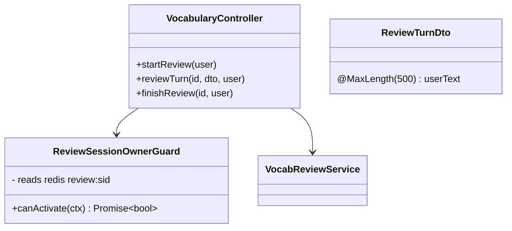
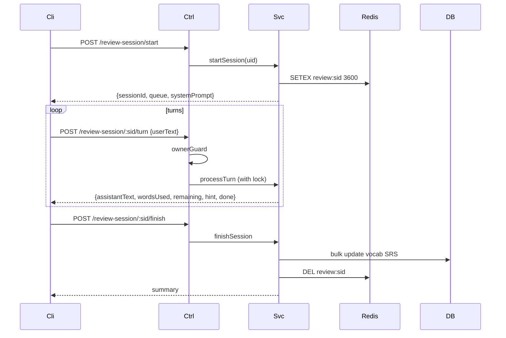

# P10.T4 — Vocabulary Review Endpoints

## 1. METADATA

| Field | Value |
|-------|-------|
| Task ID | P10.T4 |
| Phase | 10 |
| Depends on | P10.T3 |
| Complexity | Low |
| Risk | Low |

---

## 2. MỤC TIÊU & SCOPE

**In-scope**:
- Endpoints (Firebase guard, rate-limited 60/min/uid):
  - `POST /vocabulary/review-session/start`
  - `POST /vocabulary/review-session/:id/turn`
  - `POST /vocabulary/review-session/:id/finish`
- DTOs + Zod/class-validator.
- Ownership guard middleware đọc state Redis → so `userId`.
- Lock per session `review:lock:{sid}` 15s để tránh race khi processTurn.

---

## 3. FILES CẦN TẠO / SỬA

| # | Path |
|---|------|
| 1 | `apps/server/src/modules/vocabulary/vocabulary.controller.ts` — thêm 3 endpoints |
| 2 | `apps/server/src/modules/vocabulary/dto/review-turn.dto.ts` |
| 3 | `apps/server/src/modules/vocabulary/guards/review-session-owner.guard.ts` |
| 4 | `apps/server/test/vocabulary-review.e2e-spec.ts` |

---

## 4. CLASS DIAGRAM



---

## 5. CHI TIẾT

### 5.1. DTOs

```
ReviewTurnDto:
  @IsString @Length(1, 500) userText
```

### 5.2. Endpoints

```
@Controller('vocabulary')
@UseGuards(FirebaseAuthGuard)
class VocabularyController:

  @Post('review-session/start')
  startReview(@CurrentUser() user) → ReviewStart
    return reviewService.startSession(user.uid)

  @Post('review-session/:id/turn')
  @UseGuards(ReviewSessionOwnerGuard)
  async reviewTurn(@Param('id') id, @Body() dto: ReviewTurnDto)
    return await lockService.withLock(`review:lock:${id}`, 15, async () => {
      return await reviewService.processTurn(id, dto.userText)
    })

  @Post('review-session/:id/finish')
  @UseGuards(ReviewSessionOwnerGuard)
  async finishReview(@Param('id') id)
    return await reviewService.finishSession(id)
```

### 5.3. `ReviewSessionOwnerGuard`

```
canActivate(ctx):
  req = ctx.switchToHttp().getRequest()
  sid = req.params.id
  uid = req.user.uid
  raw = await redis.get(`review:${sid}`)
  if !raw → throw NotFoundException(ERR.NOT_FOUND)
  state = JSON.parse(raw)
  if state.userId !== uid → throw ForbiddenException(ERR.FORBIDDEN)
  return true
```

### 5.4. Rate limit

Apply `@RateLimit({ window: 60, limit: 60 })` per uid trên các route review.

---

## 6. SEQUENCE — Full flow



---

## 7. ACCEPTANCE & TEST PLAN

- [ ] Full flow E2E: start → 3 turns → finish → DB updated.
- [ ] Ownership: user B gọi user A's session → 403.
- [ ] Expired session → 404.
- [ ] userText > 500 → 400 validation.
- [ ] Concurrent 2 turns same session → second waits or rejected via lock.
- [ ] No words due → start returns 400 NO_WORDS_DUE.
