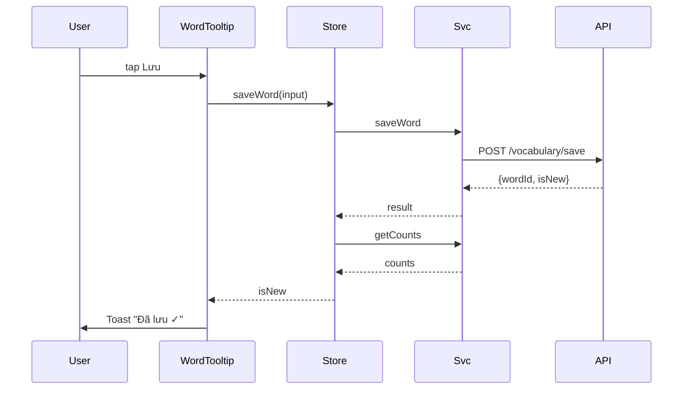

# P10.T5 — Wire "Lưu" Button + Vocabulary Notebook Screen

## 1. METADATA

| Field | Value |
|-------|-------|
| Task ID | P10.T5 |
| Phase | 10 |
| Depends on | P10.T2 |
| Complexity | Medium |
| Risk | Low |

---

## 2. MỤC TIÊU & SCOPE

**In-scope**:
- `WordTooltip` "Lưu" wiring → `vocabService.saveWord` + Toast feedback.
- `VocabularyStore` (Zustand).
- `VocabularyService` client.
- `VocabNotebookScreen`:
  - FlatList of words with filter tabs (All / Learning / Mastered).
  - Item: hz | py | vn | status badge | next review date.
  - Swipe-to-delete.
  - Header due count badge + "Ôn tập" button.
- Navigation: add tab/screen under Profile section.

---

## 3. FILES CẦN TẠO / SỬA

| # | Path |
|---|------|
| 1 | `apps/mobile/src/features/vocabulary/services/vocabulary.service.ts` |
| 2 | `apps/mobile/src/features/vocabulary/store/vocabulary.store.ts` |
| 3 | `apps/mobile/src/features/vocabulary/screens/VocabNotebookScreen.tsx` |
| 4 | `apps/mobile/src/features/vocabulary/components/VocabRow.tsx` |
| 5 | `apps/mobile/src/features/vocabulary/components/FilterTabs.tsx` |
| 6 | `apps/mobile/src/features/chat/components/WordTooltip.tsx` — wire button |
| 7 | `apps/mobile/src/navigation/RootNavigator.tsx` — route add |

---

## 4. CLASS / STATE DIAGRAM

```mermaid
classDiagram
    class VocabularyService {
        +saveWord(input) Promise~{wordId,isNew}~
        +listAll(filter?) Promise~Vocab[]~
        +getDue() Promise~Vocab[]~
        +deleteWord(id) Promise
        +getCounts() Promise~Counts~
    }
    class VocabularyStore {
        +words Vocab[]
        +counts Counts
        +filter 'all'|'learning'|'mastered'
        +loading bool
        +fetchAll() Promise
        +fetchCounts() Promise
        +saveWord(input) Promise~bool isNew~
        +deleteWord(id) Promise
        +setFilter(f) void
    }
    class VocabNotebookScreen
    class WordTooltip {
        +onSavePress() Promise
    }
    
    VocabNotebookScreen --> VocabularyStore
    WordTooltip --> VocabularyStore
    VocabularyStore --> VocabularyService
```

---

## 5. CHI TIẾT

### 5.1. `VocabularyService` (client)

```
saveWord({hz, py, vn, sourceSentence?, sourceSessionId?}): Promise<{wordId, isNew}>
  return (await api.post('/vocabulary/save', body)).data

listAll(filter?): Promise<Vocab[]>
  return (await api.get('/vocabulary', { params: filter ? { status: filter } : {} })).data

getDue(): Promise<Vocab[]>
  return (await api.get('/vocabulary/due')).data

deleteWord(id): Promise<void>
  await api.delete(`/vocabulary/${id}`)

getCounts(): Promise<Counts>
  return (await api.get('/vocabulary/counts')).data
```

### 5.2. Store

```
state: { words: [], counts: {total:0,learning:0,mastered:0,dueToday:0}, filter:'all', loading:false }

fetchAll():
  set({loading:true})
  try:
    f = get().filter
    words = await service.listAll(f === 'all' ? undefined : f)
    set({words})
  finally set({loading:false})

fetchCounts():
  counts = await service.getCounts()
  set({counts})

saveWord(input):
  res = await service.saveWord(input)
  fetchCounts()  // refresh badge
  return res.isNew

deleteWord(id):
  await service.deleteWord(id)
  set(state => ({ words: state.words.filter(w => w.id !== id) }))
  fetchCounts()

setFilter(f):
  set({filter: f})
  fetchAll()
```

### 5.3. `WordTooltip` wiring

```
onSavePress = async () => {
  const sessionId = chatStore.getState().sessionId
  setSaving(true)
  try:
    const isNew = await vocabStore.getState().saveWord({
      hz, py, vn,
      sourceSentence: sentence,
      sourceSessionId: sessionId
    })
    Toast.show(isNew ? 'Đã lưu ✓' : 'Đã có trong sổ')
    setSaved(true)  // icon ✓
  catch e:
    Toast.show('Lỗi: ' + e.message)
  finally:
    setSaving(false)
}
```

### 5.4. `VocabRow`

```
Props: { word, onDelete }
Render swipeable:
  <Row>
    <Col flex:2>
      <BigText>{hz}</BigText>
      <PyText>{py}</PyText>
    </Col>
    <Col flex:3>
      <Text>{vn}</Text>
      <SmallText muted>
        {status === 'mastered' ? '★ Đã thuộc' : `Ôn: ${formatDate(nextReviewDate)}`}
      </SmallText>
    </Col>
    <StatusBadge status={status} step={stepIndex} />
  </Row>
  
SwipeAction: trash → onDelete confirm Alert
```

### 5.5. `VocabNotebookScreen`

```
useEffect on mount: fetchAll + fetchCounts
useFocusEffect: fetchCounts (refresh sau review)

Header:
  Title: "Sổ tay từ vựng"
  Badge: dueToday > 0 → "{n} từ cần ôn"
  Button: "Ôn tập" disabled if dueToday===0 → nav.navigate('VocabReview')

Body:
  <FilterTabs value={filter} onChange={setFilter} counts={counts} />
  <FlatList data={words} renderItem={VocabRow} ... pullToRefresh={fetchAll} />
  Empty: "Chưa có từ nào. Tap từ trong chat để lưu."
```

### 5.6. `FilterTabs`

```
Tabs: All ({total}) | Đang học ({learning}) | Đã thuộc ({mastered})
```

### 5.7. Navigation

Add screen `VocabNotebook` to ProfileStack or new MainTab `Vocab`.

---

## 6. SEQUENCE — Save flow



---

## 7. ACCEPTANCE & TEST PLAN

- [ ] Tap word in chat → Lưu → từ xuất hiện trong VocabNotebook.
- [ ] Duplicate → Toast "Đã có".
- [ ] Filter tabs đếm đúng.
- [ ] Swipe delete → confirm → removed.
- [ ] Pull-to-refresh works.
- [ ] Due badge updates sau khi save/review.
- [ ] Network fail → Toast error, no UI corruption.
