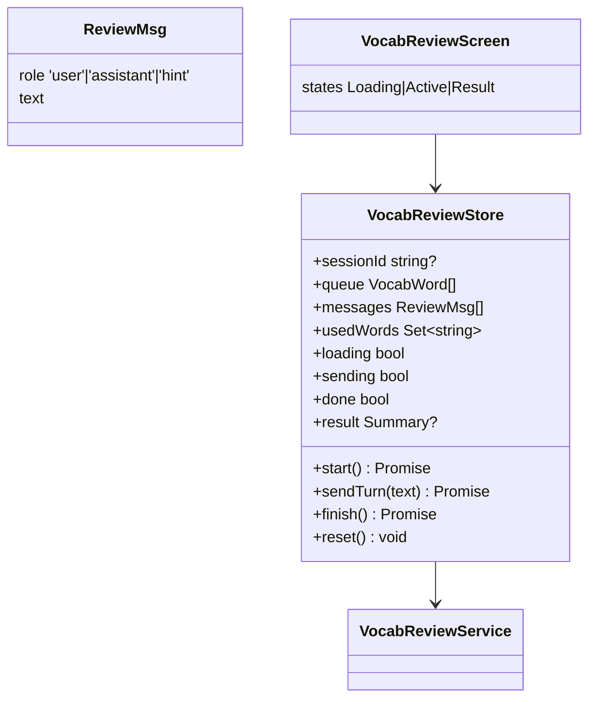
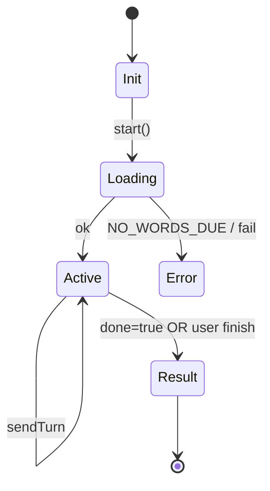
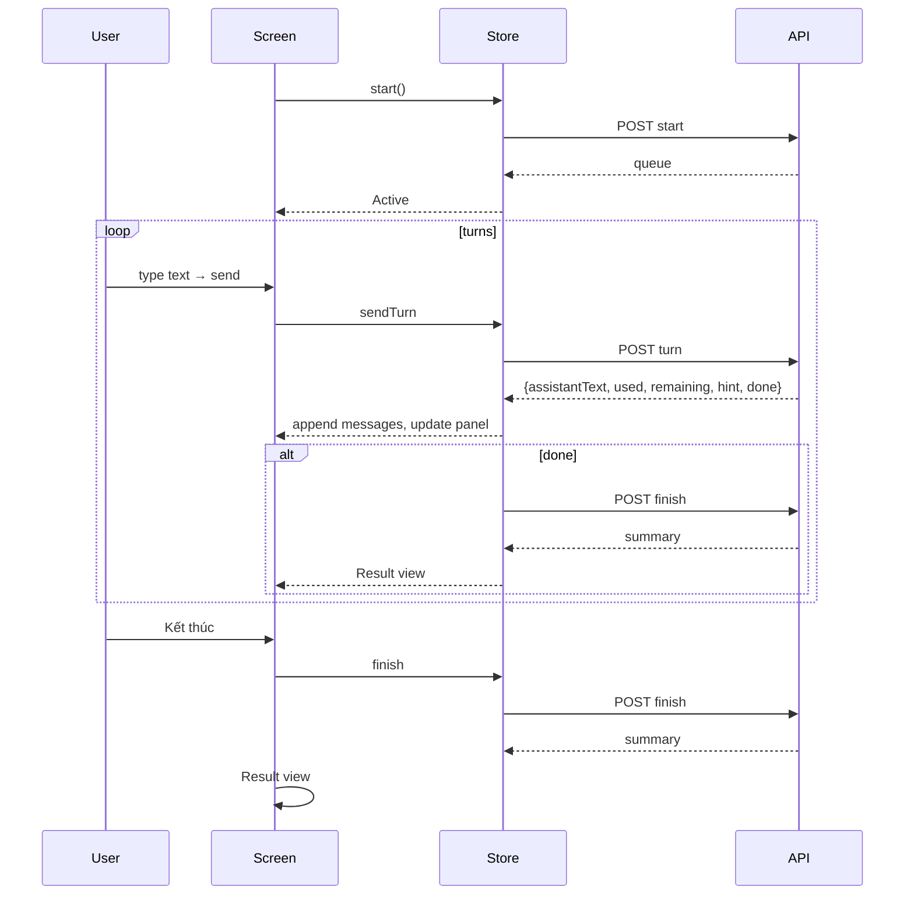

# P10.T6 — VocabReviewScreen (AI Review Flow UI)

## 1. METADATA

| Field | Value |
|-------|-------|
| Task ID | P10.T6 |
| Phase | 10 |
| Depends on | P10.T4, P10.T5 |
| Complexity | Medium |
| Risk | Medium |

---

## 2. MỤC TIÊU & SCOPE

**In-scope**:
- `VocabReviewScreen` (3 sub-views: Loading→Active→Result).
- Word status panel (collapsible).
- Chat UI simplified (no audio, no characters).
- Hint bubble distinguished by tint.
- Auto-finish khi done=true; manual finish button always available.
- Confirm "Bỏ phiên giữa chừng?" Alert nếu quit (status: still call finish → fail untouched words).

---

## 3. FILES CẦN TẠO

| # | Path |
|---|------|
| 1 | `apps/mobile/src/features/vocabulary/screens/VocabReviewScreen.tsx` |
| 2 | `apps/mobile/src/features/vocabulary/screens/VocabReviewResultScreen.tsx` |
| 3 | `apps/mobile/src/features/vocabulary/components/WordStatusPanel.tsx` |
| 4 | `apps/mobile/src/features/vocabulary/components/ReviewBubble.tsx` |
| 5 | `apps/mobile/src/features/vocabulary/components/ReviewInputBar.tsx` |
| 6 | `apps/mobile/src/features/vocabulary/store/vocab-review.store.ts` |
| 7 | `apps/mobile/src/features/vocabulary/services/vocab-review.service.ts` |

---

## 4. CLASS / STATE DIAGRAM



State machine:



---

## 5. CHI TIẾT

### 5.1. Service (client)

```
startSession(): Promise<ReviewStart>
  return (await api.post('/vocabulary/review-session/start')).data

sendTurn(sid, userText): Promise<ReviewTurn>
  return (await api.post(`/vocabulary/review-session/${sid}/turn`, { userText })).data

finishSession(sid): Promise<ReviewSummary>
  return (await api.post(`/vocabulary/review-session/${sid}/finish`)).data
```

### 5.2. Store

```
start():
  set({loading:true, sessionId:null, messages:[], usedWords:new Set(), done:false, result:null})
  try:
    r = await service.startSession()
    set({sessionId: r.sessionId, queue: r.queue, loading: false})
    // Optionally prepend system intro bubble
  catch e:
    set({loading:false})
    if e.code === 'NO_WORDS_DUE' → Toast 'Chưa đến lúc ôn' + nav.goBack()
    else Toast(e.message)

sendTurn(text):
  if !get().sessionId → return
  set({sending: true})
  // optimistic user bubble
  set(s => ({ messages: [...s.messages, { role:'user', text }] }))
  try:
    r = await service.sendTurn(get().sessionId!, text)
    appendMessages = [{ role:'assistant', text: r.assistantText }]
    if r.hint:
      appendMessages.push({ role:'hint', text: r.hint })
    set(s => ({
      messages: [...s.messages, ...appendMessages],
      usedWords: new Set([...s.usedWords, ...r.wordsUsedThisTurn]),
      done: r.done
    }))
    if r.done:
      await get().finish()
  catch e:
    Toast('Lỗi: ' + e.message)
    // revert? keep user bubble for retry
  finally:
    set({sending:false})

finish():
  if !get().sessionId → return
  try:
    summary = await service.finishSession(get().sessionId!)
    set({result: summary})
    // refresh vocab notebook
    vocabStore.getState().fetchAll()
    vocabStore.getState().fetchCounts()
  catch e:
    Toast('Lỗi kết thúc: ' + e.message)

reset(): set({sessionId:null, queue:[], messages:[], usedWords:new Set(), done:false, result:null})
```

### 5.3. `WordStatusPanel`

```
Props: { queue, usedWords }
Render horizontal scroll chips:
  for each word in queue:
    color = usedWords.has(word.hz) ? green : muted
    icon = usedWords.has(word.hz) ? ✅ : ⬜
    <Chip>{icon} {word.hz}</Chip>
Counter: "{used}/{total}"
```

### 5.4. `ReviewBubble`

```
Props: { msg }
switch msg.role:
  user → right-aligned blue
  assistant → left-aligned gray
  hint → left-aligned amber background + 💡 prefix label "Gợi ý"
```

### 5.5. `ReviewInputBar`

```
Local state: text
disabled: sending || done
onSend: vocabReviewStore.sendTurn(text); setText('')
Validation: 1..500 chars
```

### 5.6. `VocabReviewScreen`

```
useEffect on mount: start()
useBackHandler: if active && !done → Alert "Bỏ phiên?" → confirm calls finish then goBack

Render:
  if loading → Spinner
  if result → <VocabReviewResultScreen result={result} onReturn={goBack} />
  else:
    <Header back={confirmBack} title="Ôn từ vựng" right={<Button onPress={finish}>Kết thúc</Button>} />
    <WordStatusPanel queue={queue} usedWords={usedWords} />
    <MessageList data={messages} renderItem={ReviewBubble} />
    <ReviewInputBar />
```

### 5.7. `VocabReviewResultScreen`

```
Card:
  🎉 Kết quả ôn tập
  Tổng: {totalWords}
  Thăng cấp: {wordsAdvanced}
  Đã thuộc: {wordsMastered}
  Cần ôn lại: {wordsFailed}
  Thời gian: {formatDuration(duration)}
  [Quay về] → onReturn
```

---

## 6. SEQUENCE



---

## 7. ACCEPTANCE & TEST PLAN

- [ ] No due words → Toast + goBack.
- [ ] Send text với 1 từ đúng → chip ✅, AI reply hiển thị.
- [ ] Hint hiển thị màu amber khi có.
- [ ] Tất cả từ used → auto finish → Result screen.
- [ ] Manual "Kết thúc" → Result screen.
- [ ] Back giữa chừng → Alert confirm.
- [ ] Network fail → Toast, không lock UI.
- [ ] Sau Result → VocabNotebook refresh dueCount.
