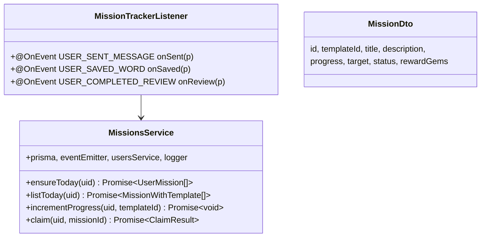
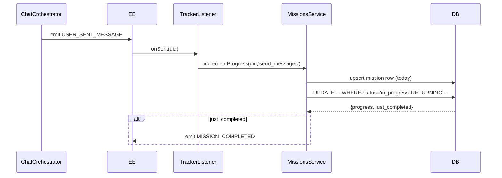

# P11.T2 — MissionsService + Tracker Listener

## 1. METADATA

| Field | Value |
|-------|-------|
| Task ID | P11.T2 |
| Phase | 11 |
| Depends on | P11.T1 |
| Complexity | Medium |
| Risk | High (race conditions on increment) |

---

## 2. MỤC TIÊU & SCOPE

**In-scope**:
- `MissionsService`: `ensureToday`, `listToday`, `incrementProgress` (atomic via Postgres conditional update), `claim` (atomic decrement & gem credit).
- `MissionTrackerListener`: handle `USER_SENT_MESSAGE`, `USER_SAVED_WORD`, `USER_COMPLETED_REVIEW` → increment.
- Event emit: `MISSION_COMPLETED`, `GEM_EARNED`.
- Idempotency: `claim` once-only (status check inside transaction).

**Out-of-scope**: SSE push (P11.T5), endpoints (P11.T4).

---

## 3. FILES CẦN TẠO

| # | Path |
|---|------|
| 1 | `apps/server/src/modules/missions/missions.module.ts` |
| 2 | `apps/server/src/modules/missions/missions.service.ts` |
| 3 | `apps/server/src/modules/missions/mission-tracker.listener.ts` |
| 4 | `apps/server/src/modules/missions/dto/mission.dto.ts` |
| 5 | `apps/server/src/modules/missions/missions.service.spec.ts` |

---

## 4. CLASS DIAGRAM



---

## 5. CHI TIẾT

### 5.1. `ensureToday(uid)` — lazy creation

```
Logic:
  today = startOfDay(new Date())
  templates = await prisma.missionTemplate.findMany({ where: { active: true } })
  
  // Use upsert/createMany skipDuplicates
  await prisma.userMission.createMany({
    data: templates.map(t => ({ userId: uid, templateId: t.id, forDate: today })),
    skipDuplicates: true
  })
  
  return await listToday(uid)
```

### 5.2. `listToday(uid)`

```
return await prisma.userMission.findMany({
  where: { userId: uid, forDate: startOfDay() },
  include: { template: true },
  orderBy: { template: { id: 'asc' } }
})
```

### 5.3. `incrementProgress(uid, templateId)`

**Strategy**: Avoid Redis lock → use Postgres conditional update để atomic:

```
Logic:
  today = startOfDay()
  
  // Step 1: ensure row exists (cheap noop if exists)
  await prisma.userMission.upsert({
    where: { unique_user_template_date: { userId: uid, templateId, forDate: today } },
    update: {},
    create: { userId: uid, templateId, forDate: today }
  })
  
  template = await prisma.missionTemplate.findUnique({ where: { id: templateId } })
  if !template || !template.active → return
  
  // Step 2: atomic increment with status guard via raw SQL
  // Increment only if status='in_progress'; if progress reaches target, mark completed.
  result = await prisma.$queryRaw`
    UPDATE user_missions
    SET 
      progress = LEAST(progress + 1, ${template.target}),
      status = CASE WHEN progress + 1 >= ${template.target} THEN 'completed' ELSE 'in_progress' END,
      completed_at = CASE WHEN progress + 1 >= ${template.target} AND completed_at IS NULL THEN NOW() ELSE completed_at END
    WHERE user_id = ${uid} AND template_id = ${templateId} AND for_date = ${today} AND status = 'in_progress'
    RETURNING id, progress, status, (status = 'completed' AND completed_at = NOW()) as just_completed
  `
  
  if result.length === 0 → return  // already completed or claimed
  
  row = result[0]
  if row.just_completed:
    eventEmitter.emit(EVENTS.MISSION_COMPLETED, {
      userId: uid, missionId: row.id, templateId, rewardGems: template.rewardGems
    })
    logger.info({ uid, templateId }, 'mission completed')
```

(Race-safe: PostgreSQL row lock during UPDATE → 2 rapid increments → 2 separate atomic updates → correct progress.)

### 5.4. `claim(uid, missionId)`

```
Logic:
  return await prisma.$transaction(async tx => {
    // 1. Atomic claim: only if status='completed' AND owned
    updated = await tx.userMission.updateMany({
      where: { id: missionId, userId: uid, status: 'completed' },
      data: { status: 'claimed', claimedAt: new Date() }
    })
    if updated.count === 0:
      throw new AppException(ERR.MISSION_NOT_CLAIMABLE, 'Already claimed or not completed')
    
    // 2. Reload to get template
    mission = await tx.userMission.findUnique({ where: { id: missionId }, include: { template: true } })
    rewardGems = mission.template.rewardGems
    
    // 3. Credit gems
    user = await tx.usersMeta.update({
      where: { uid }, data: { gems: { increment: rewardGems } }, select: { gems: true }
    })
    
    return { rewardGems, newBalance: user.gems, missionId }
  })
  
  // After commit:
  await usersService.syncToFirestore(uid, { gems: result.newBalance })
  eventEmitter.emit(EVENTS.GEM_EARNED, { userId: uid, amount: result.rewardGems, source: 'mission', newBalance: result.newBalance })
  return result
```

### 5.5. `MissionTrackerListener`

```
@OnEvent(EVENTS.USER_SENT_MESSAGE)
async onSent({ userId }) {
  try { await missionsService.incrementProgress(userId, 'send_messages') }
  catch e { logger.warn({err:e}, 'mission inc fail send_messages') }
}

@OnEvent(EVENTS.USER_SAVED_WORD)
async onSaved({ userId }) { ... 'collect_words' }

@OnEvent(EVENTS.USER_COMPLETED_REVIEW)
async onReview({ userId }) { ... 'complete_review' }
```

Errors swallowed (log only) → mission tracking không cản main flow.

### 5.6. Error codes

- `MISSION_NOT_CLAIMABLE` → 409

---

## 6. SEQUENCE — Send message → mission inc → completed



---

## 7. ACCEPTANCE & TEST PLAN

- [ ] Send 10 messages → mission send_messages reaches 10 → status completed → MISSION_COMPLETED emitted ONCE.
- [ ] Send 11th message → no change (status no longer in_progress).
- [ ] Concurrent 10 inc → final progress=10 (atomic).
- [ ] Claim completed → gems+=5, status='claimed', GEM_EARNED emitted.
- [ ] Claim again → MISSION_NOT_CLAIMABLE 409.
- [ ] Claim not-completed → MISSION_NOT_CLAIMABLE.
- [ ] Other user claim → 0 rows updated → MISSION_NOT_CLAIMABLE.
- [ ] Cross-day: missions for today distinct from yesterday's.

### Tests
- Unit: mock prisma raw query results.
- Integration: real DB concurrent inc (k=10 parallel).
