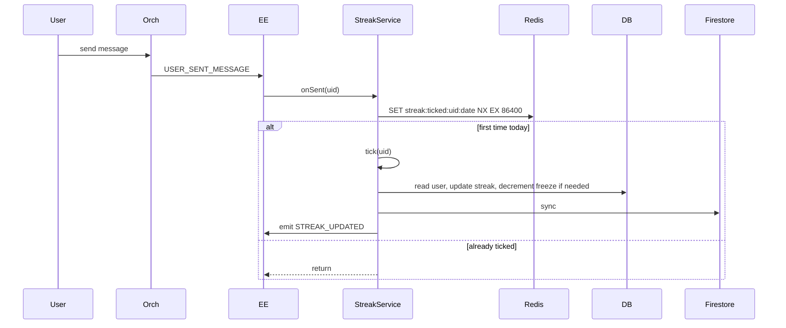

# P11.T3 — StreakService + Daily Cron

## 1. METADATA

| Field | Value |
|-------|-------|
| Task ID | P11.T3 |
| Phase | 11 |
| Depends on | P11.T2 |
| Complexity | Medium |
| Risk | Medium (timezone-sensitive) |

---

## 2. MỤC TIÊU & SCOPE

**In-scope**:
- `StreakService.tick(uid)` idempotent per day; consumes freeze if missed exactly 1 day.
- Event subscriber: `USER_SENT_MESSAGE`, `USER_COMPLETED_REVIEW` → `tick`.
- Concurrency safety: Redis lock `streak:lock:{uid}` 10s.
- Optional cron job 00:05 ICT: reset streaks cho users miss > 1 day mà chưa tick.
- Emit `STREAK_UPDATED` with `{userId, current, highest, isNewHighest, freezeConsumed}`.

---

## 3. FILES CẦN TẠO

| # | Path |
|---|------|
| 1 | `apps/server/src/modules/missions/streak.service.ts` |
| 2 | `apps/server/src/modules/missions/streak-cron.service.ts` |
| 3 | `apps/server/src/modules/missions/streak.service.spec.ts` |

---

## 4. CLASS DIAGRAM

```mermaid
classDiagram
    class StreakService {
        +prisma, redis, lockService, eventEmitter, usersService, logger
        +@OnEvent USER_SENT_MESSAGE onSent(p) Promise
        +@OnEvent USER_COMPLETED_REVIEW onReview(p) Promise
        +tick(uid) Promise~TickResult~
        +getStreak(uid) Promise~StreakState~
    }
    class StreakCron {
        +@Cron daily('5 0 * * *', { tz:'Asia/Ho_Chi_Minh' }) sweep() Promise
    }

    StreakService ..> StreakCron : independent
```

---

## 5. CHI TIẾT

### 5.1. `tick(uid)`

```
tick(uid): Promise<TickResult>

Logic:
  return await lockService.withLock(`streak:lock:${uid}`, 10, async () => {
    user = await prisma.usersMeta.findUnique({ where: { uid }, select: { currentStreak, highestStreak, lastStreakDate, streakFreezeCount } })
    if !user → return null
    
    today = startOfDay(new Date())
    lastDate = user.lastStreakDate ? startOfDay(user.lastStreakDate) : null
    
    if lastDate && lastDate.getTime() === today.getTime():
      return { changed: false, current: user.currentStreak, ... }
    
    yesterday = subDays(today, 1)
    let newStreak = user.currentStreak
    let freezeConsumed = false
    let consumeFreezeCount = 0
    
    if !lastDate:
      newStreak = 1
    else if lastDate.getTime() === yesterday.getTime():
      newStreak = user.currentStreak + 1
    else:
      // Missed N days
      missedDays = Math.floor((today.getTime() - lastDate.getTime()) / 86400_000) - 1
      // Allow consume up to missedDays of freezes; but conservatively allow 1
      if missedDays === 1 && user.streakFreezeCount > 0:
        newStreak = user.currentStreak + 1  // counts today
        consumeFreezeCount = 1
        freezeConsumed = true
      else:
        newStreak = 1
    
    newHighest = Math.max(newStreak, user.highestStreak)
    isNewHighest = newStreak > user.highestStreak
    
    updated = await prisma.usersMeta.update({
      where: { uid },
      data: {
        currentStreak: newStreak,
        highestStreak: newHighest,
        lastStreakDate: today,
        ...(consumeFreezeCount > 0 ? { streakFreezeCount: { decrement: consumeFreezeCount } } : {})
      },
      select: { currentStreak, highestStreak, streakFreezeCount }
    })
    
    await usersService.syncToFirestore(uid, {
      currentStreak: updated.currentStreak,
      highestStreak: updated.highestStreak,
      streakFreezeCount: updated.streakFreezeCount
    })
    
    eventEmitter.emit(EVENTS.STREAK_UPDATED, {
      userId: uid,
      current: updated.currentStreak,
      highest: updated.highestStreak,
      isNewHighest,
      freezeConsumed
    })
    
    return { changed: true, current: updated.currentStreak, highest: updated.highestStreak, isNewHighest, freezeConsumed }
  })
```

### 5.2. Event handlers (debounced)

```
@OnEvent(EVENTS.USER_SENT_MESSAGE)
async onSent({ userId }) {
  // Tick is idempotent per day → safe to call every event but wasteful.
  // Optimization: Redis SET `streak:ticked:{uid}:${dateKey}` NX EX 86400; skip if exists.
  const dateKey = startOfDay().toISOString().slice(0,10)
  const isFirst = await redis.set(`streak:ticked:${userId}:${dateKey}`, '1', 'NX', 'EX', 86400)
  if !isFirst → return
  try { await tick(userId) } catch e { logger.warn({err:e}, 'streak tick fail') }
}

@OnEvent(EVENTS.USER_COMPLETED_REVIEW) — same pattern
```

### 5.3. `StreakCron.sweep()`

```
@Cron('5 0 * * *', { timeZone: 'Asia/Ho_Chi_Minh' })
async sweep() {
  // Reset users miss > 1 day no freeze
  yesterday = subDays(startOfDay(), 1)
  
  // Bulk: streakFreezeCount=0 AND lastStreakDate < yesterday AND currentStreak > 0
  await prisma.usersMeta.updateMany({
    where: {
      currentStreak: { gt: 0 },
      streakFreezeCount: 0,
      lastStreakDate: { lt: yesterday }
    },
    data: { currentStreak: 0 }
  })
  
  // Bulk: have freeze, missed exactly 1 day → consume 1 freeze, keep streak
  // (More complex; can skip for MVP and rely on next tick to consume.)
  
  logger.info('streak sweep done')
}
```

(MVP: chỉ reset; freeze consumption sẽ xảy ra trong tick() khi user mở app sau missed day. Cron giảm số user "ghost" giữ streak.)

### 5.4. `getStreak(uid)`

```
return await prisma.usersMeta.findUnique({
  where: { uid },
  select: { currentStreak, highestStreak, streakFreezeCount, lastStreakDate }
})
```

---

## 6. SEQUENCE — Daily tick



---

## 7. ACCEPTANCE & TEST PLAN

- [ ] First action → streak=1, lastStreakDate=today.
- [ ] Second action same day → no change.
- [ ] Action next day → streak=2.
- [ ] Skip 1 day, freeze>0 → streak+1, freeze-1.
- [ ] Skip 1 day, freeze=0 → streak=1 (reset, today counts).
- [ ] Skip 3 days → streak=1 (cannot recover even with freeze in MVP).
- [ ] Concurrent ticks → only 1 update (Redis NX guard).
- [ ] Cron sweep reset users miss > 1 day with no freeze.
- [ ] Firestore synced.
- [ ] Timezone ICT 00:00 boundary respected.

### Tests
- Unit: mock prisma/redis, cover all branches.
- Integration: time travel via jest fake timers.
